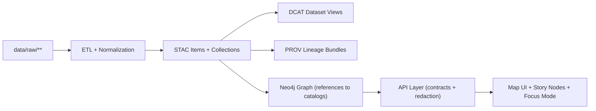

# 🛰️ STAC Schemas (KFM Contract Artifacts)


> [!IMPORTANT]
> **This folder is part of KFM’s “contract-first” boundary.**  
> If you change a schema here, you are changing what the API, pipelines, and UI are allowed to produce/consume. Treat this like changing code interfaces. 🧩

**Quick links:**  
[Why STAC in KFM](#why-stac-in-kfm) • [What lives here](#what-lives-here) • [Folder layout](#folder-layout) • [Schema strategy](#schema-strategy) • [Validation](#validation--ci-gates) • [KFM STAC profile](#kfm-stac-profile) • [Governance](#governance--safety) • [Contributing](#contributing--change-workflow)

---

## Why STAC in KFM

KFM is built as a **Kansas “living atlas”** where datasets, maps, and model outputs are:

- discoverable 🧭  
- mappable 🗺️  
- auditable 🔎  
- reproducible ♻️  

To make that real (and interoperable with the broader geospatial ecosystem), **each published dataset is described by a STAC JSON record** and paired with provenance metadata and discovery metadata (PROV + DCAT). This is an explicit architectural requirement in the KFM documentation and repo audit (STAC for spatial/temporal + assets, PROV for lineage, DCAT for discovery).  

> [!NOTE]
> In KFM’s canonical pipeline ordering, **STAC/DCAT/PROV are “boundary artifacts” required before data is considered published** (before graph ingestion, API exposure, UI layers, or Story Nodes). ✅

---

## What lives here

This directory defines **JSON Schema contracts** for STAC objects **as KFM uses and serves them**.

Typical responsibilities:

- ✅ Validate **STAC Items / Collections / Catalogs** produced by pipelines
- ✅ Validate STAC objects **served by the API** (REST and/or GraphQL wrappers)
- ✅ Enforce **KFM-specific profile rules** (namespaced fields, governance tags, provenance hooks)
- ✅ Provide **examples** used in CI to prevent regressions

Non-goals:

- ❌ This is **not** the runtime metadata store (that lives under `data/stac/**`)
- ❌ This is **not** where real datasets or assets belong
- ❌ This is **not** a place to “just add a field” without updating the profile + validators

---

## Folder layout

> [!TIP]
> Keep schemas **boring and predictable**: stable names, stable `$id`s, and versioned changes only.

Recommended structure (add files as needed):

```text
📁 api/contracts/schemas/stac/
├─ 📄 README.md                         👈 you are here
├─ 📁 upstream/                         🔒 vendored STAC core schemas (pinned snapshot)
│  ├─ 📄 catalog.schema.json
│  ├─ 📄 collection.schema.json
│  └─ 📄 item.schema.json
├─ 📁 kfm/                              🌾 KFM overlays (KFM profile “must-haves”)
│  ├─ 📄 kfm.stac.catalog.schema.json
│  ├─ 📄 kfm.stac.collection.schema.json
│  ├─ 📄 kfm.stac.item.schema.json
│  └─ 📄 kfm.shared.schema.json         (shared defs: classification, provenance refs, etc.)
├─ 📁 extensions/                       🧩 optional: vendored/pinned extensions used by KFM
│  ├─ 📄 projection.schema.json
│  ├─ 📄 eo.schema.json
│  └─ 📄 raster.schema.json
└─ 📁 examples/                         ✅ “golden” STAC objects used by CI + docs
   ├─ 📄 example.item.public.json
   ├─ 📄 example.item.restricted.redacted.json
   └─ 📄 example.collection.json
```

---

## Schema strategy

KFM’s schema approach follows **open-standards-first + project overlays**:

### 1) Vendor upstream STAC schemas (don’t fork)

- Keep upstream STAC schemas **verbatim** under `upstream/`
- Pin them to a specific version/commit in your tooling (so CI is deterministic)
- Never “patch” upstream files in-place — layer KFM constraints in `kfm/`

### 2) Apply KFM rules via overlays (`allOf` + `$ref`)

Your KFM schema should generally look like:

- `allOf: [ { $ref: "../upstream/item.schema.json" }, { ...kfm constraints... } ]`

This preserves interoperability while enforcing KFM invariants.

### 3) Namespaced custom fields only

To avoid collisions with STAC core and community extensions:

- ✅ Use `kfm:*` for project-specific fields  
- ❌ Do not introduce bare top-level properties like `"classification"` or `"run_id"` without namespacing

---

## Validation + CI gates

> [!IMPORTANT]
> KFM’s docs require that **no dataset is accepted without valid metadata** and that CI rejects missing/invalid catalog artifacts.

### Local validation (examples)

Use whatever validator is standard in the repo tooling; typical options:

#### ✅ Python (jsonschema)
```bash
python -m jsonschema \
  -i data/stac/items/<domain>/<item>.json \
  api/contracts/schemas/stac/kfm/kfm.stac.item.schema.json
```

#### ✅ Node (ajv)
```bash
npx ajv-cli validate \
  -s api/contracts/schemas/stac/kfm/kfm.stac.item.schema.json \
  -d data/stac/items/<domain>/<item>.json \
  --strict=false
```

### CI expectations (recommended)

A PR that adds or updates a dataset should:

- validate all new/changed `data/stac/**` records against these schemas
- fail if:
  - required fields are missing (license, provenance pointers, classification, etc.)
  - links are broken / assets are missing
  - “restricted” inputs appear as “public” outputs (classification propagation violation)

---

## KFM STAC profile

KFM treats STAC as the **asset-level truth** for geospatial (and even “mostly non-spatial”) datasets.

### Required alignment across catalogs (KFM policy)

Every new dataset/evidence artifact must have:

- **STAC Collection + Item(s)** (asset indexing; spatial/temporal extent; license)  
- **DCAT Dataset entry** (high-level discovery + distributions that point to STAC or downloads)  
- **PROV activity bundle** (raw → work → processed lineage; run/config identifiers)

And the cross-links must remain consistent:

- STAC Items → link to actual assets in `data/processed/**` or stable API endpoints  
- DCAT → distributions should reference STAC and/or the underlying resources  
- PROV → must link the full chain and identify pipeline run/config (run id / commit hash)  
- Graph → should store **references** to catalog IDs (not bulky payloads)

### KFM-specific fields (typical)

KFM extends STAC with project metadata that supports governance, provenance, and uncertainty.

> [!NOTE]
> The authoritative definition belongs in:  
> `docs/standards/KFM_STAC_PROFILE.md` (and sibling DCAT/PROV profiles).

Commonly expected KFM fields live in `properties` and are namespaced:

- `kfm:dataset_id` — stable dataset identifier (human-readable slug)
- `kfm:domain` — domain module (e.g., `air-quality`, `soils`, `historical`)
- `kfm:topic` — short topic tag (optional but useful for search)
- `kfm:classification` — sensitivity tag (see [Governance](#governance--safety))
- `kfm:redaction` — if coordinates/attributes were generalized, how + why
- `kfm:provenance` — pointers to PROV bundles + run identifiers
- `kfm:uncertainty` — uncertainty indicators (if applicable for modeled/estimated layers)

### Minimal example (STAC Item + KFM additions)

```json
{
  "type": "Feature",
  "stac_version": "1.0.0",
  "stac_extensions": [],
  "id": "kfm.ks.soils.sda.2024.v1__tile_001",
  "collection": "kfm.ks.soils.sda.2024.v1",
  "geometry": { "type": "Polygon", "coordinates": [[[0,0],[1,0],[1,1],[0,1],[0,0]]] },
  "bbox": [0, 0, 1, 1],
  "properties": {
    "datetime": "2024-01-15T00:00:00Z",

    "kfm:dataset_id": "kfm.ks.soils.sda.2024.v1",
    "kfm:domain": "soils",
    "kfm:classification": "public",

    "kfm:provenance": {
      "prov_bundle": "data/prov/soils/sda/kfm.ks.soils.sda.2024.v1.prov.jsonld",
      "run_id": "pipeline_run_2024-01-15T00:00:00Z"
    }
  },
  "assets": {
    "cog": {
      "href": "data/processed/soils/sda/kfm.ks.soils.sda.2024.v1.tile_001.cog.tif",
      "type": "image/tiff; application=geotiff; profile=cloud-optimized",
      "roles": ["data"]
    }
  },
  "links": [
    { "rel": "describedby", "href": "data/catalog/dcat/kfm.ks.soils.sda.2024.v1.jsonld", "type": "application/ld+json" },
    { "rel": "provenance", "href": "data/prov/soils/sda/kfm.ks.soils.sda.2024.v1.prov.jsonld", "type": "application/ld+json" }
  ]
}
```

---

## Versioning rules

> [!IMPORTANT]
> KFM is versioned at **dataset level** and **system level**, and breaking contract changes require coordination.

### Dataset versioning

When a dataset is updated or reprocessed:

- publish a new dataset version
- link revisions in DCAT and PROV (e.g., `prov:wasRevisionOf`)
- keep prior versions discoverable (or explicitly sunset with notice)
- prefer persistent identifiers when available (e.g., DOI/ARK) for citation stability

### Contract versioning (schemas in this folder)

When changing schema behavior:

- ✅ add/adjust `examples/` to lock behavior in CI  
- ✅ bump contract version (per repo conventions)  
- ✅ ensure compatibility (or introduce a versioned parallel schema)  

---

## Governance + safety

KFM governance is not a side policy — it is encoded into the pipeline and contracts.

### Classification propagation (non-negotiable)

> [!WARNING]
> **No output artifact can be less restricted than its inputs.**  
> If raw data is confidential, the STAC record must reflect that classification, and downstream UI/API must not “leak” it.

### Redaction is multi-layered

When sensitive data requires redaction/generalization:

- ✅ apply redaction in `data/processed/**`
- ✅ flag it in STAC/DCAT metadata (so it’s transparent what changed)
- ✅ enforce access controls/redaction in the API
- ✅ maintain UI safeguards (no client-side bypass)

### Recommended schema-level enforcement

In your `kfm.*.schema.json` overlays, enforce:

- `kfm:classification` enum (e.g., `public | restricted | confidential | sacred | ...` per governance)
- required presence of `kfm:redaction` object when classification implies generalization
- provenance pointers required (`kfm:provenance.prov_bundle`, run id / commit hash)

---

## How this fits the larger KFM pipeline



---

## Contributing + change workflow

### If you’re adding a dataset ✅

1. Put raw inputs under `data/raw/<domain>/`
2. Produce processed outputs under `data/processed/<domain>/`
3. Generate boundary artifacts:
   - `data/stac/collections/**`
   - `data/stac/items/**`
   - `data/catalog/dcat/**`
   - `data/prov/**`
4. Validate STAC against these schemas (local + CI)
5. Ensure Story Nodes (if any) only cite cataloged assets (no uncited narrative)

### If you need a new metadata field 🧩

1. Update the profile doc first: `docs/standards/KFM_STAC_PROFILE.md`
2. Update `api/contracts/schemas/stac/kfm/**` to match
3. Add/modify `examples/**` so CI locks the behavior
4. If breaking, follow versioning rules (parallel schema or bump)

---

## Related docs (repo internal)

- 📘 `docs/MASTER_GUIDE_v13.md` — canonical pipeline ordering + invariants  
- 📐 `docs/standards/KFM_STAC_PROFILE.md` — KFM STAC profile definition  
- 🧾 `docs/standards/KFM_DCAT_PROFILE.md` / `docs/standards/KFM_PROV_PROFILE.md` — sibling metadata profiles  
- 🧭 `docs/templates/TEMPLATE__API_CONTRACT_EXTENSION.md` — how to change contracts safely  
- 🗂️ Domain examples:
  - `docs/data/historical/land-treaties/README.md`
  - `docs/data/air-quality/README.md`
  - `docs/data/soils/sda/README.md`

---

## FAQ

### “Where do the real STAC JSON files live?”
In the data catalogs, typically:

- `data/stac/collections/**`
- `data/stac/items/**`

This folder is **only the schema contract** the rest of the system depends on.

### “Do we implement STAC API endpoints?”
That’s an API-layer decision. If/when we do, **those endpoints should reference these schema contracts**, and the OpenAPI spec should remain the source of truth for request/response shapes.

### “Can non-spatial datasets use STAC?”
Yes. KFM’s policy is that even “non-spatial” datasets often carry a STAC Collection for consistency, and many have some spatial/temporal footprint (even if coarse). If not, record the rationale in metadata.

🧩🌾
