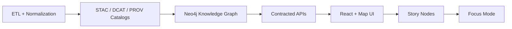

# 🎬 Story Nodes — Schemas (Contracts) 🧩


> **Why this exists:** Story Nodes are *governed narrative artifacts* that drive KFM’s map-and-story experiences. These schemas make Story Nodes **machine-valid**, **provenance-linked**, and **safe-by-design** (sensitivity + sovereignty rules) before anything ships to the UI.

---

## 📚 Overview

### 🎯 Purpose
This folder defines the **JSON Schemas** that validate Story Node structures exchanged across the system boundary:
- Authoring → publishing (Markdown/YAML metadata + optional JSON config)
- API responses (Story Node listings, single story payloads, “Focus Mode” bundles)
- UI rendering (step-by-step narrative + map state choreography)

### 🔭 Scope

| ✅ In Scope | 🚫 Out of Scope |
|---|---|
| Story Node **metadata** (IDs, status, version, governance labels) | Full prose style rules (that belongs in templates) |
| Story Node **step/config** objects (map camera, layers, timeline) | UI component implementation details |
| Evidence/provenance references (STAC/DCAT/PROV IDs, citations) | ETL + catalog generation code |
| Sensitivity & redaction signals needed to prevent leaks | Governance policy text (see `docs/governance/`) |

### 👥 Audience
- **API / backend engineers** (contract definitions + validation)
- **Frontend engineers** (safe, predictable rendering payloads)
- **Story authors & reviewers** (what metadata is required and why)
- **Governance reviewers** (sensitivity + sovereignty enforcement points)

### 🧾 Definitions (Quick)
- **Story Node**: A governed narrative unit (often Markdown) that can be rendered as a step in a story experience.
- **Step / Stage**: One “screen” or “beat” in the story (text + map state).
- **Map State**: A deterministic description of what the map should show (2D/3D mode, camera, layers, filters).
- **Evidence Ref**: A pointer to verifiable sources (datasets, items, docs) used to justify claims.
- **Entity Ref**: A pointer to graph entities (Neo4j nodes/relationships) used to connect narrative to structured knowledge.

---

## 🧭 Pipeline Context (Non‑Negotiable Ordering)

Story Nodes are downstream of the evidence pipeline. They should never “skip ahead” of catalogs/graph/contracts.



---

## 📍 Where Story Nodes Live (Content vs Contracts)

### ✅ Canonical content (authoring + governance)
Story Node narratives are expected to live under a governed structure (draft vs published), with a story folder containing `story.md` and `assets/`.

### 🧳 Runtime bundles (optional / legacy)
Some implementations may also package Story Nodes for the UI as folders that include:
- narrative Markdown
- a **configuration JSON** describing map/layer/camera steps
- optional media assets

> 🧠 **Rule of thumb:** content lives in governed docs; schemas live here; API and build pipelines move *validated* content into UI-ready bundles.

---

## 🗂️ Directory Layout

> This README documents **schema contracts**, not story content.

```text
📁 api/contracts/schemas/storynodes/
├── 📄 README.md
├── 📄 storynode.schema.json                  # (recommended) top-level StoryNode payload
├── 📄 storynode.frontmatter.schema.json      # (recommended) extracted YAML metadata → JSON
├── 📄 storynode.steps.schema.json            # (recommended) sequence of story steps/stages
└── 📁 defs/                                  # shared sub-schemas
    ├── 📄 map_state.schema.json              # map camera + layers + time config
    ├── 📄 evidence_ref.schema.json           # citations + dataset references
    ├── 📄 entity_ref.schema.json             # graph entity pointers
    ├── 📄 sensitivity.schema.json            # care_label/sensitivity + redaction hints
    └── 📄 ai_assistance.schema.json          # optional (AI metadata, opt-in display)
```

> 🧩 If your repo uses a root-level `schemas/storynodes/` as canonical, treat this folder as an **API-facing mirror** (avoid divergence).

---

## ✅ Non‑Negotiable Contract Invariants (Hard Requirements)

> These are “schema-level guardrails” that enable Focus Mode and prevent trust regressions.

### 🧾 Evidence-first, provenance-linked
- Story Node metadata **must** include references to evidence artifacts (datasets/items/docs) used for claims.
- Any derived artifacts referenced by a story must be identifiable (IDs + provenance pointers).

### 🔗 Graph-linked narrative
- Story Nodes should be able to reference graph entities (stable IDs) so the UI can provide “click-through” context.

### 🧠 Fact vs interpretation (don’t blur)
- If the payload includes structured blocks (or annotations), the schema should support tagging content as:
  - `fact`
  - `interpretation`
  - `hypothesis`
  - `note`
  - `ai_generated` (opt-in display only)

### 🛡️ Sovereignty + sensitivity (no location leaks)
- The schema must support **care/sensitivity labels** and **redaction/generalization** hints.
- UI should be able to render “blurred region” instead of precise coordinates when required.

### 🤖 AI transparency (opt-in)
- If any AI-generated suggestions are included, they must be:
  - **off by default**
  - explicitly labeled
  - accompanied by an uncertainty/confidence value
  - constrained by the same sensitivity rules as everything else

---

## 🧱 Schema Inventory (What We Validate)

> Your exact filenames may differ, but these *concepts* are expected.

### 1) `StoryNode` (top-level payload)
Used for API transport and/or publish artifacts.

**Recommended fields**
- `id` (string, required): stable identifier (`urn:` or canonical slug-based id)
- `slug` (string, required)
- `title` (string, required)
- `status` (enum, required): `draft | review | published | deprecated`
- `version` (string, required): semver (`1.2.0`)
- `summary` (string, optional)
- `authors` (array, optional)
- `governance` (object, required): `care_label`, `sensitivity`, `license`, optional reviewer gates
- `evidence` (array, required): `EvidenceRef[]`
- `entities` (array, optional): `EntityRef[]`
- `steps` (array, required): `StoryStep[]`

### 2) `StoryStep` (the narrative “beat”)
Defines one step in the story experience.

**Recommended fields**
- `step_id` (string, required)
- `title` (string, required)
- `content_ref` (string, optional): pointer to a Markdown anchor/section (if narrative is external)
- `content_blocks` (array, optional): structured narrative blocks (if serialized)
- `map_state` (object, required): `MapState`
- `focus` (object, optional): UI hints (highlighted entities, suggested panels)
- `evidence` (array, optional): step-level evidence overrides/additions

### 3) `MapState` (deterministic rendering config)
Supports 2D/3D transitions, camera positioning, and layer choreography.

**Recommended fields**
- `mode` (enum): `2d | 3d`
- `camera` (object):
  - `center` (lon/lat) OR `bbox`
  - `zoom` (number, optional)
  - `bearing` / `pitch` (number, optional)
  - `altitude` (number, optional, for 3D)
- `layers` (array):
  - `layer_id` (string, required)
  - `visibility` (enum): `on | off`
  - `opacity` (0..1, optional)
  - `filter` (object, optional)
- `time` (object, optional):
  - `range` (`start`, `end`)
  - `cursor` (timestamp)
- `redaction` (object, optional):
  - `policy` (enum): `none | generalize | blur | hide`
  - `reason` (string, optional)

### 4) `EvidenceRef` (citations + dataset pointers)
Used to enforce “no narrative without sources.”

**Recommended fields**
- `citation_id` (string, required): e.g., `"1"` for `[1]`
- `label` (string, required): short human-readable reference
- `url` (string, optional) *(only if allowed by governance)*
- `dataset_ref` (object, optional):
  - `dcat_id` (string, optional)
  - `stac_id` (string, optional)
  - `prov_id` (string, optional)
- `quote` (string, optional)
- `notes` (string, optional)

### 5) `EntityRef` (graph linkage)
**Recommended fields**
- `entity_id` (string, required) (Neo4j stable ID / URI)
- `entity_type` (string, required) (ontology label/type)
- `display_name` (string, optional)
- `relationship_hint` (string, optional)

---

## 🧪 Validation & CI Expectations

### ✅ What should be validated
- Story Node metadata (YAML → JSON) against these schemas
- Story Node publish bundles (JSON) against these schemas
- Any UI config JSON used by the story runner
- Link/reference integrity for citations and internal refs

### 🧰 Local validation (suggested)
Use any JSON Schema validator (Node `ajv`, Python `jsonschema`, etc.):

```bash
# Example (Node + ajv)
ajv validate -s api/contracts/schemas/storynodes/storynode.schema.json -d path/to/storynode.json
```

```bash
# Example (Python)
python -m jsonschema -i path/to/storynode.json api/contracts/schemas/storynodes/storynode.schema.json
```

> 💡 If story metadata lives in Markdown front-matter, add a small extraction step (`frontmatter → JSON`) and validate the extracted JSON with `storynode.frontmatter.schema.json`.

---

## 🧬 Versioning Strategy (Do Not Break Consumers)

### 📌 Schema versioning
- Encode schema versions via:
  - `$id` (recommended) and/or
  - a top-level `schema_version` field in payloads

### 💥 Breaking changes
A breaking change includes:
- removing or renaming a required field
- changing semantics of existing fields
- tightening validation so prior valid docs become invalid

**When you break:** create a **new schema version** and keep the old one around until consumers migrate.

---

## 🧰 How to Extend These Schemas (Checklist ✅)

> Treat schema edits like API edits: contract-first, evidence-first.

- [ ] Add/extend schema file(s) in this folder (or canonical schema folder)
- [ ] Add/update shared defs under `defs/`
- [ ] Update Story Node authoring template (so humans produce valid metadata)
- [ ] Add CI validation fixture(s) in `tests/` (at least one “valid” and one “invalid” sample)
- [ ] If sensitivity rules are impacted, update governance gates + redaction behavior
- [ ] If API payload shape changes, update OpenAPI/GraphQL contracts accordingly
- [ ] Document the change in `CHANGELOG.md` (or the contract changelog used by the repo)

---

## 🧪 Examples (Copy/Paste Friendly)

<details>
<summary>📝 Example: Minimal StoryNode JSON (transport/publish payload)</summary>

```json
{
  "id": "urn:kfm:storynode:kansas-from-above:v1.0.0",
  "slug": "kansas-from-above",
  "title": "Kansas From Above",
  "status": "draft",
  "version": "1.0.0",
  "summary": "A guided map narrative transitioning between statewide context and local detail.",
  "governance": {
    "license": "CC-BY-4.0",
    "fair_category": "FAIR+CARE",
    "care_label": "Public",
    "sensitivity": "public"
  },
  "evidence": [
    {
      "citation_id": "1",
      "label": "STAC Collection: statewide basemap (example)",
      "dataset_ref": { "stac_id": "stac:collection:basemap-ks" }
    }
  ],
  "entities": [
    {
      "entity_id": "urn:kfm:entity:place:kansas",
      "entity_type": "Place",
      "display_name": "Kansas"
    }
  ],
  "steps": [
    {
      "step_id": "s1",
      "title": "Zoom out: statewide context",
      "content_ref": "#step-1",
      "map_state": {
        "mode": "2d",
        "camera": { "bbox": [-102.051744, 36.993016, -94.588413, 40.003166], "zoom": 5 },
        "layers": [
          { "layer_id": "basemap", "visibility": "on", "opacity": 1.0 }
        ]
      }
    }
  ]
}
```

</details>

<details>
<summary>🧾 Example: YAML front-matter (authoring metadata)</summary>

```yaml
---
title: "Kansas From Above"
version: "v1.0.0"
status: "draft"
doc_kind: "Story Node"
last_updated: "2026-01-12"
license: "CC-BY-4.0"
fair_category: "FAIR+CARE"
care_label: "Public"
sensitivity: "public"
classification: "open"
doc_uuid: "urn:kfm:storynode:kansas-from-above:v1.0.0"
evidence:
  - citation_id: "1"
    label: "STAC Collection: statewide basemap (example)"
    dataset_ref:
      stac_id: "stac:collection:basemap-ks"
---
```

</details>

---

## 🔗 Related Docs & Neighbor Contracts

- 🧾 PROV schemas: `api/contracts/schemas/prov/README.md`
- 🗺️ Canonical pipeline + repo structure: `docs/MASTER_GUIDE_v13.md`
- 🧰 Templates:
  - `docs/templates/TEMPLATE__STORY_NODE_V3.md`
  - `docs/templates/TEMPLATE__API_CONTRACT_EXTENSION.md`

---

## 🧷 Notes

> If you’re unsure whether a field belongs in Story Nodes vs catalogs/graph:
- **Catalogs (STAC/DCAT/PROV)**: evidence artifacts and lineage
- **Graph**: entities + relationships
- **Story Nodes**: narrative + “how to view” (map choreography) + evidence pointers
- **API contracts**: safe transport + stable structure

✅ Keep Story Nodes expressive… but never untraceable.
