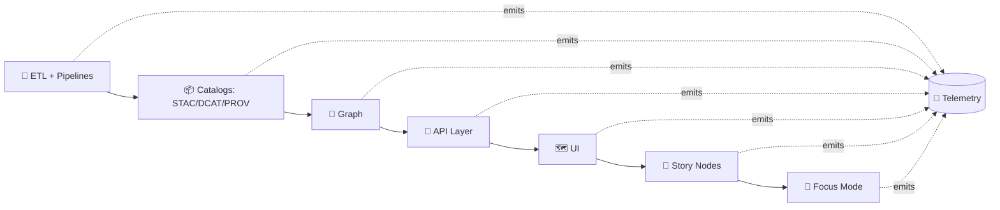

# 📡 Telemetry Schemas (KFM API Contracts)


> **KFM philosophy:** telemetry isn’t “nice to have.” It’s a **contract artifact** that protects reproducibility, governance, and operational integrity across the pipeline.

---

## 🧭 Where this fits

KFM’s pipeline is ordered and gated (ETL → Catalogs → Graph → API → UI → Story Nodes → Focus Mode). Telemetry spans **every stage**, but it must never violate the boundary rules or governance constraints.



### 🔗 Related schema docs
- 📚 DCAT: `../dcat/README.md`
- 🧾 PROV (lineage): `../prov/README.md` *(if/when present)*
- 🛰️ STAC (assets): `../stac/README.md` *(if/when present)*

---

## 🎯 What lives in `api/contracts/schemas/telemetry/`

This folder documents (and will typically contain) **versioned JSON Schemas** for structured telemetry payloads that are:

- ✅ **Emitted** by KFM components (API, pipelines, UI, CI jobs)
- ✅ **Validated** in CI as contract artifacts
- ✅ **Safe** by default (no PII, classification-aware)
- ✅ **Correlatable** (request/run/trace/story linkage)
- ✅ **Useful for governance** (audit trails + policy enforcement observability)
- ✅ **Sustainability-aware** (energy + carbon reporting, especially for CI)

> **Note:** KFM may export traces/metrics via OTLP/OpenTelemetry in production, but **this repo contract** focuses on a stable, machine-validatable **JSON event layer** that can be linted, tested, diffed, and reviewed.

---

## 📁 Suggested directory layout

> Filenames are conventions. The key requirement is **versioning + validation + examples**.

```text
📁 api/contracts/schemas/telemetry/
├── 📘 README.md
├── 📁 v1/
│   ├── 📄 telemetry.event.schema.json
│   ├── 📄 telemetry.energy_report.schema.json
│   ├── 📄 telemetry.governance_signal.schema.json
│   ├── 📄 telemetry.ui_interaction.schema.json
│   └── 📄 telemetry.pipeline_run.schema.json
└── 📁 examples/
    ├── 🧪 api.request.completed.json
    ├── 🧪 governance.publication_blocked.json
    └── 🧪 ci.energy_report.step.json
```

---

## 🧱 Core contract: the Telemetry Event Envelope

All telemetry payloads **MUST** be wrapped in a common envelope so tooling can:
- route events consistently,
- attach correlation IDs,
- enforce governance/classification,
- and keep schema evolution sane.

### ✅ Required top-level fields (v1)

| Field | Type | Why it exists |
|------|------|----------------|
| `spec_version` | string | Schema family version (e.g., `"1.0"`) |
| `event_id` | string | Unique ID for de-dupe + audit (UUID/ULID) |
| `occurred_at` | string (date-time) | ISO-8601 UTC timestamp |
| `event_name` | string | Dot-namespaced, stable identifier |
| `emitter` | object | Where it came from (service/subsystem/version/env) |
| `context` | object | Correlation IDs (trace/request/run/story) |
| `classification` | object | Data sensitivity + policy tags |
| `payload` | object | Event-specific body (validated by sub-schema) |

---

## 🧩 Event naming convention

Use dot-separated names with a stable namespace:

- `kfm.api.*` — API request lifecycle, auth, rate limiting, etc.
- `kfm.pipeline.*` — ETL steps, validation reports, artifact generation
- `kfm.catalog.*` — STAC/DCAT/PROV publish actions + failures
- `kfm.graph.*` — graph sync/migration/integrity signals
- `kfm.ui.*` — UI interaction telemetry (analytics hooks), **governed**
- `kfm.governance.*` — sensitive access, redaction, policy blocks
- `kfm.ci.*` — CI traces + energy/carbon reports

✅ Good examples:
- `kfm.api.request.completed`
- `kfm.governance.publication.blocked`
- `kfm.ci.energy.step_reported`

🚫 Avoid:
- random ad-hoc names (`"api_done"`, `"log_thing"`)
- embedding IDs in the name (`kfm.api.request.1234`)

---

## 🧬 Correlation & traceability

KFM telemetry should make it easy to answer questions like:
- “Which **commit + pipeline run** produced this output?”
- “Why was publication blocked?”
- “Which UI interactions accessed restricted content?”
- “Did this PR change runtime/energy usage?”

### `context` fields (recommended)

| Field | Type | Notes |
|------|------|-------|
| `trace_id` | string | OpenTelemetry trace ID when available |
| `span_id` | string | OpenTelemetry span ID when available |
| `request_id` | string | API gateway/app request correlation |
| `run_id` | string | Pipeline/CI run identifier |
| `job_id` | string | CI job identifier |
| `story_node_id` | string | If event occurs during Story/Focus render/review |
| `idempotency_key` | string | For replay-safe operations & agent tooling |

> **Rule of thumb:** if you can’t connect an event back to a run/request/artifact, it’s not very useful in a governed system.

---

## 🧾 Example: API request completion event

```json
{
  "spec_version": "1.0",
  "event_id": "01J9Z8R7ZB7B8Z4S8MZJH2A4FQ",
  "occurred_at": "2026-01-12T15:04:05Z",
  "event_name": "kfm.api.request.completed",
  "emitter": {
    "subsystem": "api",
    "service": "kfm-api",
    "version": "git:abc1234",
    "environment": "dev"
  },
  "context": {
    "trace_id": "4bf92f3577b34da6a3ce929d0e0e4736",
    "span_id": "00f067aa0ba902b7",
    "request_id": "req_9f8c1b2a",
    "run_id": null
  },
  "classification": {
    "data_classification": "internal",
    "policy_tags": ["no_pii", "audit_ok"]
  },
  "payload": {
    "http": {
      "method": "GET",
      "route": "/v1/datasets/{dataset_id}",
      "status_code": 200
    },
    "timing_ms": 84,
    "result": "success"
  }
}
```

---

## ⛽ Sustainability contract: Energy & carbon telemetry

KFM explicitly treats **energy/carbon reporting** as QA telemetry—especially for CI and pipelines.

### 🎛️ Energy report payload (recommended)

Minimum fields to make reports comparable:
- `unit`: `"kWh"` or `"J"` (pick one per schema and standardize)
- `energy_used`: number
- `carbon_gco2e`: number *(grams CO₂e)*
- `scope`: `"ci" | "pipeline" | "api"`
- `step_name`: string
- `commit_sha`: string
- `pipeline_name`: string
- `run_id`: string
- `measurement_tool`: string (e.g., “scaphandre”, “codecarbon”, etc.)

#### Example: CI step energy event
```json
{
  "spec_version": "1.0",
  "event_id": "01J9Z8T9QJ2G6KQ1G9V8G0Z2R4",
  "occurred_at": "2026-01-12T15:12:44Z",
  "event_name": "kfm.ci.energy.step_reported",
  "emitter": { "subsystem": "ci", "service": "github-actions", "version": "run:123456", "environment": "ci" },
  "context": { "run_id": "gha_run_123456", "job_id": "test-linux", "trace_id": null, "span_id": null, "request_id": null },
  "classification": { "data_classification": "public", "policy_tags": ["sustainability"] },
  "payload": {
    "pipeline_name": "ci-baseline",
    "commit_sha": "abc1234",
    "step_name": "unit-tests",
    "energy": { "unit": "kWh", "energy_used": 0.0421, "carbon_gco2e": 18.7 },
    "measurement_tool": "codecarbon",
    "duration_ms": 312000
  }
}
```

### ✅ Suggested SLOs (repo policy-friendly)
- **Trace coverage:** ≥ 95% of CI runs emit expected trace spans.
- **Energy coverage:** ≥ 90% of CI steps report energy usage.

> These SLOs enable “telemetry health check” runbooks and prevent silent breakage of observability.

---

## 🛡️ Telemetry-driven governance signals

Telemetry is also a **governance surface**. KFM expects signals such as:

- 🔐 Sensitive data access events
- 🧼 Redaction applied events
- ⛔ Publication blocked by policy events

### Governance event example: publication blocked

```json
{
  "spec_version": "1.0",
  "event_id": "01J9Z8W6G6M4Y7X0C1QGQJ9H1A",
  "occurred_at": "2026-01-12T16:01:02Z",
  "event_name": "kfm.governance.publication.blocked",
  "emitter": { "subsystem": "api", "service": "kfm-api", "version": "git:abc1234", "environment": "staging" },
  "context": { "request_id": "req_1a2b3c", "trace_id": "9c2d0a8f1e234d4c9c8e2a9d0f3b1c22", "span_id": "4c1f2a3b4d5e6f70", "run_id": "pipeline_run_77" },
  "classification": { "data_classification": "restricted", "policy_tags": ["care", "sovereignty"] },
  "payload": {
    "policy": {
      "engine": "opa",
      "policy_id": "kfm.governance.publication.rules",
      "decision": "deny",
      "reason": "Derived output would be less restricted than inputs",
      "decision_id": "dec_98f7d6"
    },
    "artifact": {
      "kind": "dcat_dataset",
      "id": "dcat:dataset:water-quality:v3"
    }
  }
}
```

---

## ✅ Validation & CI expectations

Because telemetry schemas are **contract artifacts**, changes should be validated automatically.

### Local validation (suggested approaches)

Pick one toolchain and standardize it repo-wide:

- **Node/AJV**
  ```bash
  npx ajv-cli validate -s api/contracts/schemas/telemetry/v1/telemetry.event.schema.json -d api/contracts/schemas/telemetry/examples/*.json
  ```

- **Python**
  ```bash
  python -m jsonschema -i api/contracts/schemas/telemetry/examples/api.request.completed.json api/contracts/schemas/telemetry/v1/telemetry.event.schema.json
  ```

### CI gates (recommended)
- 🧱 Validate schemas compile (no invalid refs)
- 🧪 Validate examples against schemas
- 🔒 Policy checks: telemetry does **not** include prohibited fields (PII, secrets)
- 📈 Coverage checks for CI telemetry (trace + energy) if enabled

---

## 🔁 Versioning rules

Telemetry is an interface. Treat it like one.

### ✅ Backwards-compatible changes
- adding optional fields
- adding new event names with new `payload` subschemas
- loosening constraints carefully *(rare; document why)*

### 🚨 Breaking changes (require new major)
- renaming required fields
- changing meanings/units (e.g., kWh → J) without dual support
- making optional fields required
- changing enum values in ways that break dashboards/policies

> Use `v1/`, `v2/`, … directories for **major** schema lines.

---

## 🔐 Privacy & safety rules (non-negotiable)

Telemetry must remain safe to store and share with governance reviewers.

- 🚫 No secrets (tokens, keys, raw auth headers)
- 🚫 No direct PII (emails, phone numbers, names) unless explicitly approved and documented
- ✅ Use stable pseudonymous IDs (hashed) if you must correlate user sessions
- ✅ Propagate classification tags end-to-end (`classification.data_classification`)
- ✅ If an event references restricted assets, the event must not “leak” content

---

## 🧰 Contribution checklist

When adding/modifying telemetry schemas:

- [ ] 🧾 Update/introduce JSON Schema under the correct `v*/` directory
- [ ] 🧪 Add at least one example payload in `examples/`
- [ ] 🔗 Ensure event supports correlation (`context.*`)
- [ ] 🏷️ Set `classification` properly (and keep it no-less-restrictive than inputs)
- [ ] ✅ Add/adjust CI validation so contract remains enforced
- [ ] 📝 Note any dashboard/policy implications in PR description

---

## 📚 Reference map

Telemetry in KFM is intentionally connected to:
- **Contracts:** OpenAPI/GraphQL contracts for API boundaries
- **Catalogs:** STAC/DCAT metadata outputs
- **Lineage:** PROV records (and optionally OpenLineage in CI/tooling)
- **Governance:** FAIR/CARE enforcement, redaction visibility, policy gates
- **Sustainability:** energy + carbon tracking as QA output

If you’re unsure whether something is telemetry or provenance:

> **Telemetry answers:** “what happened operationally, and is it healthy/compliant?”  
> **PROV answers:** “how was this artifact produced, from what inputs, by which process?”

---
