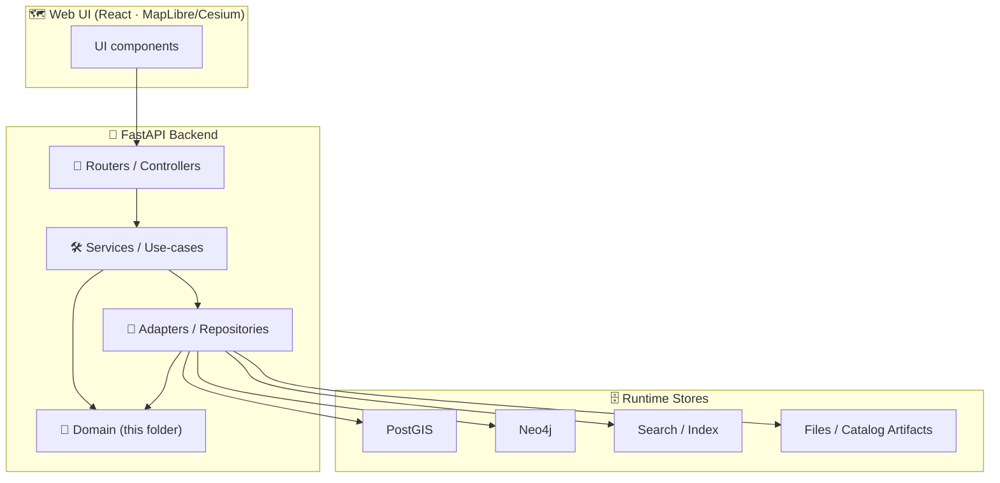

# 🧠 `api/domain` — Domain Layer (KFM Core Models)


> [!IMPORTANT]
> This folder is the **source of truth for KFM’s core entities** (e.g., `LandParcel`, `HistoricalEvent`, `StoryNode`) and must remain **framework-agnostic** and **database-agnostic**. Domain models are plain Python classes or Pydantic models with *attributes + invariants*, not infrastructure code. [oai_citation:0‡Kansas Frontier Matrix (KFM) – Comprehensive Technical Blueprint.pdf](sediment://file_000000006dbc71f89a5094ce310a452d) [oai_citation:1‡Kansas Frontier Matrix (KFM) – Comprehensive Technical Blueprint.pdf](sediment://file_000000006dbc71f89a5094ce310a452d)

---

## 🎯 Purpose

KFM’s backend is designed around Clean Architecture: **domain → services/use-cases → adapters → delivery (FastAPI routers)**. The **Domain Layer** defines the fundamental data models and business entities **independent of external frameworks**, so they can be reused across services, tests, and adapters without pulling in infrastructure dependencies. [oai_citation:2‡Kansas Frontier Matrix (KFM) – Comprehensive Technical Blueprint.pdf](sediment://file_000000006dbc71f89a5094ce310a452d)

This matters because KFM’s UI is not allowed to “reach around” the backend: **the UI never directly touches the databases; all access is mediated by the backend API implementing validation + governance rules**. [oai_citation:3‡Kansas Frontier Matrix (KFM) – Comprehensive Technical Blueprint.pdf](sediment://file_000000006dbc71f89a5094ce310a452d)

---

## 🧭 Where `api/domain` sits in the stack



- **Dependency rule (recommended):** everything may depend on `api/domain`, but `api/domain` depends on nothing “below it.”
- **API boundary invariant:** UI must never query graph/db directly; access goes through the governed API layer. [oai_citation:4‡MARKDOWN_GUIDE_v13.md.gdoc](file-service://file-UYVruFXfueR8veHMUKeugU)

---

## ✅ What belongs in `api/domain`

### 🧩 Core Entities (nouns)
Examples: `LandParcel`, `HistoricalEvent`, `SurveyRecord`, `StoryNode`… modeled as **plain Python** or **Pydantic** for validation convenience. [oai_citation:5‡Kansas Frontier Matrix (KFM) – Comprehensive Technical Blueprint.pdf](sediment://file_000000006dbc71f89a5094ce310a452d) [oai_citation:6‡Kansas Frontier Matrix (KFM) – Comprehensive Technical Blueprint.pdf](sediment://file_000000006dbc71f89a5094ce310a452d)

**Allowed:**
- Fields and invariants (validation, required metadata)
- Small “shape” helpers (e.g., `to_geojson()`), as long as they don’t reach out to DB/network/frameworks [oai_citation:7‡Kansas Frontier Matrix (KFM) – Comprehensive Technical Blueprint.pdf](sediment://file_000000006dbc71f89a5094ce310a452d)

### 🧱 Value Objects (immutable-ish building blocks)
Examples:
- `BBox`, `TimeRange`, `CRSRef`
- `ProvenanceRef` (link to PROV bundle / catalog IDs)
- `Classification` / `Sensitivity` (governance labels)

### 🧾 Domain Enums + Types
- `DataClassification` (public/internal/confidential/restricted)
- `GeometryType`, `DatasetKind`, etc.

> [!NOTE]
> A common baseline classification ladder is `Public`, `Internal`, `Confidential`, `Restricted` (seen in access-control literature). Use this as a starting point **only if it matches KFM governance rules** and keep the mapping centralized in one place. [oai_citation:8‡Data Spaces.pdf](sediment://file_0000000053c071f5a9733b1b09cc9f76)

### 🧠 Domain Policies (interfaces, not implementations)
- `AccessPolicy` interface / protocol (decision requests)
- `RedactionPolicy` interface (masking decisions)

KFM’s design calls for server-side governance checks (e.g., a route can call `policy.check_access(user, dataset_id)`), and for AI endpoints to validate/allow and log requests for provenance workflows. [oai_citation:9‡Kansas Frontier Matrix (KFM) – Comprehensive Technical Blueprint.pdf](sediment://file_000000006dbc71f89a5094ce310a452d)

### 📣 Domain Events (optional)
If you model “something happened” events (e.g., `DatasetPublished`, `RedactionApplied`), keep them here.

### 🧨 Domain Errors
- `DomainInvariantError`
- `InvalidProvenanceRef`
- `ClassificationViolation`

---

## 🚫 What does **NOT** belong in `api/domain`

| ❌ Not here | ✅ Put it here instead |
|---|---|
| FastAPI routers, request handlers | `api/routes/*` (delivery layer) |
| SQL, Cypher, HTTP clients, filesystem I/O | `api/adapters/*`, `api/repositories/*`, `api/db/*` (integration layer) |
| OPA calls / Rego evaluation | `policy/*` + adapter glue (policy enforcement layer) |
| “Just fetch it from Neo4j” helpers | adapters/repositories (domain must stay pure) |
| UI or map rendering concerns | `web/*` |

The domain layer should avoid direct dependencies on databases or web frameworks; it is meant to be reused across layers and stay “pure.” [oai_citation:10‡Kansas Frontier Matrix (KFM) – Comprehensive Technical Blueprint.pdf](sediment://file_000000006dbc71f89a5094ce310a452d)

---

## ⚖️ Governance-first modeling rules

KFM’s architecture is explicitly governance-first:

- **Fail closed:** if a policy/check fails or required governance metadata is missing, the system blocks the action rather than guessing. [oai_citation:11‡Kansas Frontier Matrix (KFM) – Comprehensive Technical Blueprint.pdf](sediment://file_000000006dbc71f89a5094ce310a452d)
- **Classification propagation:** no output artifact can be less restricted than its inputs (derivatives inherit ≥ sensitivity). [oai_citation:12‡MARKDOWN_GUIDE_v13.md.gdoc](file-service://file-UYVruFXfueR8veHMUKeugU)
- **All user access is mediated by the backend API** so it can enforce validation, redaction, and policy checks consistently. [oai_citation:13‡Kansas Frontier Matrix (KFM) – Comprehensive Technical Blueprint.pdf](sediment://file_000000006dbc71f89a5094ce310a452d)

### 🔐 Practical implication for domain objects
Most “public-facing” domain entities should have **at least**:

- `id` (stable identifier)
- `provenance` (links to catalog + lineage)
- `classification` (visibility/sensitivity)
- `license` / `rights` metadata where applicable (so CI/runtime checks can “fail closed” when missing)

---

## 📜 Contract-first expectations

KFM treats **schemas and API contracts as first-class artifacts**: you start from the contract, and changes trigger versioning + compatibility checks. [oai_citation:14‡MARKDOWN_GUIDE_v13.md.gdoc](file-service://file-UYVruFXfueR8veHMUKeugU)

**In practice for `api/domain`:**
- Domain models are the “lingua franca” between services and adapters [oai_citation:15‡Kansas Frontier Matrix (KFM) – Comprehensive Technical Blueprint.pdf](sediment://file_000000006dbc71f89a5094ce310a452d)
- Public API representations should have a clear mapping to domain entities (ideally 1:1 or explicitly documented transforms)
- Any breaking change should be coordinated with the API contract update process (see templates referenced by the Master Guide). [oai_citation:16‡MARKDOWN_GUIDE_v13.md.gdoc](file-service://file-UYVruFXfueR8veHMUKeugU)

---

## 🗂️ Suggested folder layout

> Adjust to fit the repo, but keep the **conceptual boundaries** intact.

```text
📁 api/
  📁 domain/
    📄 README.md
    📁 entities/
      📄 land_parcel.py
      📄 historical_event.py
      📄 story_node.py
    📁 value_objects/
      📄 bbox.py
      📄 time_range.py
      📄 provenance_ref.py
    📁 enums/
      📄 classification.py
    📁 policies/
      📄 access_policy.py      # interface/protocol only
      📄 redaction_policy.py   # interface/protocol only
    📁 events/
      📄 dataset_published.py
    📄 errors.py
    📄 types.py
```

---

## 🧩 Example patterns

### 1) Entity as a Pydantic model (domain-safe)
```python
# api/domain/entities/land_parcel.py
from pydantic import BaseModel, Field
from api.domain.enums.classification import DataClassification
from api.domain.value_objects.provenance_ref import ProvenanceRef

class LandParcel(BaseModel):
    id: str = Field(..., description="Stable parcel identifier")
    name: str | None = None

    classification: DataClassification = DataClassification.PUBLIC
    provenance: ProvenanceRef

    # ✅ allowed: small pure helper
    def to_geojson_properties(self) -> dict:
        return {"id": self.id, "name": self.name}
```

### 2) Policy interface (domain owns the “question,” not the enforcement)
```python
# api/domain/policies/access_policy.py
from typing import Protocol
from api.domain.enums.classification import DataClassification

class AccessDecision(Protocol):
    allowed: bool
    reason: str | None
    sanitize: bool

class AccessPolicy(Protocol):
    def can_read_dataset(self, *, user_id: str, dataset_id: str) -> AccessDecision: ...
```

Why: at runtime, KFM can consult an OPA engine (sidecar or embedded) to allow/deny/sanitize. The policies are the source of truth, and the API applies the decision (e.g., return `403` or mask coordinates). [oai_citation:17‡Kansas Frontier Matrix (KFM) – Comprehensive Technical Blueprint.pdf](sediment://file_000000006dbc71f89a5094ce310a452d) [oai_citation:18‡Kansas Frontier Matrix (KFM) – Comprehensive Technical Blueprint.pdf](sediment://file_000000006dbc71f89a5094ce310a452d)

---

## 🧪 Testing guidance

- ✅ Unit test domain invariants without DB/network
- ✅ Test serialization stability (domain objects → dict/json)
- ✅ Property tests for value objects (`BBox`, `TimeRange`) if helpful
- ✅ Explicitly test classification propagation helpers (fail closed)

---

## ➕ Adding a new domain entity (happy path)

1. **Create the entity** in `api/domain/entities/` (or the appropriate bounded context)
2. Add/extend any needed **value objects** (`ProvenanceRef`, geometry wrappers)
3. Ensure the entity carries **governance metadata** (classification + provenance)
4. Implement storage mapping in adapters/repositories (outside domain)
5. Expose via service + router with governance checks (e.g., `policy.check_access(...)`) [oai_citation:19‡Kansas Frontier Matrix (KFM) – Comprehensive Technical Blueprint.pdf](sediment://file_000000006dbc71f89a5094ce310a452d)

---

## 🧠 v13 note: canonical API home

The v13 Master Guide indicates `src/server/` as the sole canonical home for API code (and mentions legacy `src/api/` being merged there). If/when the repo is aligned to that layout, **mirror this domain package under the canonical server path** (e.g., `src/server/domain/`). [oai_citation:20‡MARKDOWN_GUIDE_v13.md.gdoc](file-service://file-UYVruFXfueR8veHMUKeugU)

---

## 🔗 Related docs (repo-relative)

- 📘 `docs/MASTER_GUIDE_v13.md` — contract-first + pipeline invariants (if present) [oai_citation:21‡MARKDOWN_GUIDE_v13.md.gdoc](file-service://file-UYVruFXfueR8veHMUKeugU)
- 🧭 `docs/architecture/*` — system overview + clean architecture layering [oai_citation:22‡Kansas Frontier Matrix (KFM) – Comprehensive Technical Blueprint.pdf](sediment://file_000000006dbc71f89a5094ce310a452d)
- 🛡️ `policy/` — OPA Rego policies + governance rules (runtime enforcement) [oai_citation:23‡Kansas Frontier Matrix (KFM) – Comprehensive Technical Blueprint.pdf](sediment://file_000000006dbc71f89a5094ce310a452d)

---

## 📚 Source grounding (why this README says what it says)

- Clean Architecture domain layer + “pure models” guidance [oai_citation:24‡Kansas Frontier Matrix (KFM) – Comprehensive Technical Blueprint.pdf](sediment://file_000000006dbc71f89a5094ce310a452d)
- `api/domain` as a suggested backend location for core entities; Pydantic OK; avoid DB/framework deps [oai_citation:25‡Kansas Frontier Matrix (KFM) – Comprehensive Technical Blueprint.pdf](sediment://file_000000006dbc71f89a5094ce310a452d)
- Backend mediates all access; governance + validation live server-side [oai_citation:26‡Kansas Frontier Matrix (KFM) – Comprehensive Technical Blueprint.pdf](sediment://file_000000006dbc71f89a5094ce310a452d)
- Contract-first requirement in the repo philosophy [oai_citation:27‡MARKDOWN_GUIDE_v13.md.gdoc](file-service://file-UYVruFXfueR8veHMUKeugU)
- Fail-closed + OPA-driven policy enforcement patterns [oai_citation:28‡Kansas Frontier Matrix (KFM) – Comprehensive Technical Blueprint.pdf](sediment://file_000000006dbc71f89a5094ce310a452d) [oai_citation:29‡Kansas Frontier Matrix (KFM) – Comprehensive Technical Blueprint.pdf](sediment://file_000000006dbc71f89a5094ce310a452d)
