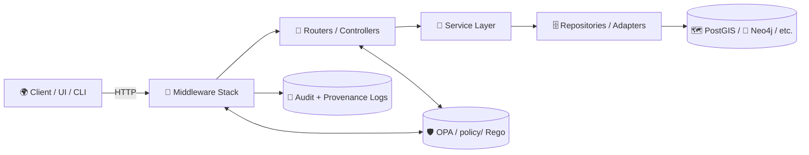

# 🧩 `api/middleware` — KFM API Middleware


> [!IMPORTANT]
> KFM is **provenance-first**: every dataset, story, and even AI-generated answer must be traceable back to original sources (“the map behind the map”). [oai_citation:0‡Kansas Frontier Matrix (KFM) – Comprehensive Technical Blueprint.pdf](sediment://file_000000006dbc71f89a5094ce310a452d)  
> The **UI never touches the databases** directly—**all access is mediated by the backend API**, which implements validation and governance rules. [oai_citation:1‡Kansas Frontier Matrix (KFM) – Comprehensive Technical Blueprint.pdf](sediment://file_000000006dbc71f89a5094ce310a452d)

---

## 🎯 Purpose

This folder holds **HTTP middleware** for the KFM backend (`api/`), implemented on top of **FastAPI/Starlette**.

Middleware is where we enforce **cross-cutting concerns** that must apply consistently across endpoints:

- 🧾 **Provenance & auditability** (request lineage, policy decision trace, AI query logging)
- 🛡️ **Governance & access control** (policy gates; fail-closed defaults)
- 🔐 **Authentication/authorization context plumbing**
- 🧭 **Request context** (request IDs, correlation, timing)
- 📡 **Observability** (structured logs, metrics hooks)
- 🌐 **Transport concerns** (CORS, security headers)

KFM’s `api/` is explicitly described as a **FastAPI backend** exposing services via REST and optionally GraphQL. [oai_citation:2‡Kansas Frontier Matrix (KFM) – Comprehensive Technical Blueprint.pdf](sediment://file_000000006dbc71f89a5094ce310a452d)  
Middleware lives in the **Infrastructure layer** where “system-level concerns like authentication or policy checks” are integrated into request handling. [oai_citation:3‡Kansas Frontier Matrix (KFM) – Comprehensive Technical Blueprint.pdf](sediment://file_000000006dbc71f89a5094ce310a452d)

---

## 🧱 Where middleware fits in KFM’s API architecture

KFM’s API structure reflects a layered architecture (models/domain → services → adapters/repositories → API wiring). [oai_citation:4‡Kansas Frontier Matrix (KFM) – Comprehensive Technical Blueprint.pdf](sediment://file_000000006dbc71f89a5094ce310a452d)  
`main.py` ties it all together (instantiate app, include routers, configure CORS, startup/shutdown hooks). [oai_citation:5‡Kansas Frontier Matrix (KFM) – Comprehensive Technical Blueprint.pdf](sediment://file_000000006dbc71f89a5094ce310a452d)



> [!NOTE]
> The “truth path” in KFM explicitly flows through **API Backend → UI**, preserving lineage at every stage. [oai_citation:6‡Kansas Frontier Matrix (KFM) – Comprehensive Technical Blueprint.pdf](sediment://file_000000006dbc71f89a5094ce310a452d)

---

## 📁 Expected folder layout

> This is the *intended* structure—adjust names to match the actual codebase as it evolves.

```text
api/
  main.py
  routes/
    ...
  middleware/
    README.md         👈 you are here
    __init__.py
    request_id.py
    access_log.py
    auth_context.py
    opa_gate.py
    provenance.py
    rate_limit.py
    security_headers.py
    errors.py
    timing.py
```

---

## 🧷 Design anchors (from the KFM blueprint)

These are the non-negotiables the middleware layer is built to protect:

- ✅ **All data access must go through the backend API**, not UI-to-DB shortcuts. [oai_citation:7‡Kansas Frontier Matrix (KFM) – Comprehensive Technical Blueprint.pdf](sediment://file_000000006dbc71f89a5094ce310a452d)
- ✅ `api/` is the **FastAPI application** exposing KFM services (REST + optional GraphQL). [oai_citation:8‡Kansas Frontier Matrix (KFM) – Comprehensive Technical Blueprint.pdf](sediment://file_000000006dbc71f89a5094ce310a452d)
- ✅ Routers may apply governance checks such as `policy.check_access(user, dataset_id)`; AI endpoints must ensure questions are allowed and **log queries for provenance**. [oai_citation:9‡Kansas Frontier Matrix (KFM) – Comprehensive Technical Blueprint.pdf](sediment://file_000000006dbc71f89a5094ce310a452d)
- ✅ Runtime policy enforcement can be handled by an **OPA engine**, including denial, sanitization, and “policy version” logging for accountability. [oai_citation:10‡Kansas Frontier Matrix (KFM) – Comprehensive Technical Blueprint.pdf](sediment://file_000000006dbc71f89a5094ce310a452d)
- ✅ Governance policies are stored in `policy/` (OPA Rego rules + AI/data guidelines). [oai_citation:11‡Kansas Frontier Matrix (KFM) – Comprehensive Technical Blueprint.pdf](sediment://file_000000006dbc71f89a5094ce310a452d)

---

## 🧩 Middleware catalog (recommended)

### 1) 🧭 `request_id.py` — Correlation IDs everywhere

**Goal:** Every request gets a stable ID (e.g., `X-Request-ID`) that propagates into logs, provenance records, and policy queries.

**Responsibilities**
- Generate request ID if missing
- Set `request.state.request_id`
- Emit `X-Request-ID` response header

---

### 2) 📣 `access_log.py` — Structured access logs

**Goal:** Minimal, structured logs that make it possible to reconstruct what happened (without leaking sensitive data).

**Responsibilities**
- Log: request_id, path, method, status_code, duration_ms
- Optionally include: authenticated principal ID, policy decision ID/hash (when available)

> [!TIP]
> Keep logs *privacy-aware*; never log raw tokens, sensitive payload fields, or restricted coordinates.

---

### 3) 🔐 `auth_context.py` — Authentication → request context

**Goal:** Decode/validate auth (e.g., JWT + roles), attach *only the safe normalized claims* to `request.state.user`.

**Responsibilities**
- Parse auth header/cookie
- Validate token
- Normalize to a minimal “UserContext” (id, roles, org, etc.)
- Fail with `401` if required and missing/invalid

---

### 4) 🛡️ `opa_gate.py` — Policy gate (OPA)

KFM is designed for runtime policy enforcement using OPA (sidecar or embedded). [oai_citation:12‡Kansas Frontier Matrix (KFM) – Comprehensive Technical Blueprint.pdf](sediment://file_000000006dbc71f89a5094ce310a452d)

**What OPA can decide**
- allow/deny access (403)
- return sanitization obligations (e.g., mask/round coordinates) [oai_citation:13‡Kansas Frontier Matrix (KFM) – Comprehensive Technical Blueprint.pdf](sediment://file_000000006dbc71f89a5094ce310a452d)
- attach the policy bundle hash / version for audit trails [oai_citation:14‡Kansas Frontier Matrix (KFM) – Comprehensive Technical Blueprint.pdf](sediment://file_000000006dbc71f89a5094ce310a452d)

**Integration modes**
- Sidecar container: API calls OPA via REST
- Embedded evaluation: evaluate rego via WASM/SDK/client  
Either way, `policy/` is the “source of truth”. [oai_citation:15‡Kansas Frontier Matrix (KFM) – Comprehensive Technical Blueprint.pdf](sediment://file_000000006dbc71f89a5094ce310a452d)

> [!WARNING]
> **Fail closed** on policy engine errors for protected routes (deny by default). If we can’t verify access, we can’t serve the data.

---

### 5) 🧾 `provenance.py` — Provenance hooks

KFM requires provenance to cover not only datasets, but also AI interactions. [oai_citation:16‡Kansas Frontier Matrix (KFM) – Comprehensive Technical Blueprint.pdf](sediment://file_000000006dbc71f89a5094ce310a452d)

**Responsibilities**
- Write minimal request provenance facts (who/what/when)
- For AI endpoints: log the query event for provenance [oai_citation:17‡Kansas Frontier Matrix (KFM) – Comprehensive Technical Blueprint.pdf](sediment://file_000000006dbc71f89a5094ce310a452d)
- Record policy decision metadata (policy hash/version, deny reasons) [oai_citation:18‡Kansas Frontier Matrix (KFM) – Comprehensive Technical Blueprint.pdf](sediment://file_000000006dbc71f89a5094ce310a452d)

---

### 6) 🚦 `rate_limit.py` — Guardrails for abuse

**Goal:** Prevent accidental overload and simple abuse patterns.

**Responsibilities**
- Rate limit by user ID (preferred) or IP (fallback)
- Emit `429` with useful headers (retry-after)

---

### 7) 🧱 `security_headers.py` — Default secure headers

**Goal:** Reduce browser/client attack surface.

**Responsibilities**
- Set sensible defaults: `X-Content-Type-Options`, `Referrer-Policy`, etc.
- (Optional) CSP for browser clients

---

### 8) ⏱️ `timing.py` — Duration measurement

**Goal:** Track and expose duration consistently (for logs + metrics).

**Responsibilities**
- Start/stop timer
- Attach `request.state.duration_ms`
- Optionally add `Server-Timing` header

---

### 9) 🧯 `errors.py` — Consistent error shapes

**Goal:** Ensure errors are uniform + safe.

**Responsibilities**
- Convert uncaught exceptions into a safe JSON error envelope
- Avoid leaking internals (stack traces, SQL, credentials)

---

## 🧠 Middleware vs Dependencies: when to use which?

FastAPI encourages dependency injection for per-route concerns (like DB sessions). [oai_citation:19‡Kansas Frontier Matrix (KFM) – Comprehensive Technical Blueprint.pdf](sediment://file_000000006dbc71f89a5094ce310a452d)

**Use middleware when**
- It must apply globally (request ID, logging, CORS, base auth context)
- It must run before routing for hard gates (rate limits, broad policy checks)

**Use dependencies when**
- It’s endpoint/resource-specific (e.g., `policy.check_access(user, dataset_id)` for a specific dataset) [oai_citation:20‡Kansas Frontier Matrix (KFM) – Comprehensive Technical Blueprint.pdf](sediment://file_000000006dbc71f89a5094ce310a452d)
- You need strongly typed injection (repositories/services/session objects)

---

## 🔌 Registering middleware in `api/main.py`

`main.py` is responsible for wiring the app, routers, and CORS. [oai_citation:21‡Kansas Frontier Matrix (KFM) – Comprehensive Technical Blueprint.pdf](sediment://file_000000006dbc71f89a5094ce310a452d)

> Example wiring (adjust imports to match the real modules):

```python
# api/main.py (example)
from fastapi import FastAPI
from starlette.middleware.cors import CORSMiddleware

from api.middleware.request_id import RequestIDMiddleware
from api.middleware.access_log import AccessLogMiddleware
from api.middleware.auth_context import AuthContextMiddleware
from api.middleware.opa_gate import OPAGateMiddleware
from api.middleware.provenance import ProvenanceMiddleware
from api.middleware.rate_limit import RateLimitMiddleware

app = FastAPI()

# CORS configured at app startup (typical FastAPI setup). [oai_citation:22‡Kansas Frontier Matrix (KFM) – Comprehensive Technical Blueprint.pdf](sediment://file_000000006dbc71f89a5094ce310a452d)
app.add_middleware(
    CORSMiddleware,
    allow_origins=["http://localhost:3000"],
    allow_credentials=True,
    allow_methods=["*"],
    allow_headers=["*"],
)

# KFM middleware stack (recommended order)
app.add_middleware(RequestIDMiddleware)
app.add_middleware(AccessLogMiddleware)
app.add_middleware(AuthContextMiddleware)
app.add_middleware(RateLimitMiddleware)
app.add_middleware(OPAGateMiddleware)        # policy gate (fail-closed for protected routes)
app.add_middleware(ProvenanceMiddleware)     # provenance + policy decision trace
```

---

## 🧪 Testing expectations

The KFM blueprint anticipates `api/tests/` with unit + integration tests, including endpoint tests using FastAPI’s test client. [oai_citation:23‡Kansas Frontier Matrix (KFM) – Comprehensive Technical Blueprint.pdf](sediment://file_000000006dbc71f89a5094ce310a452d)

**Minimum tests to include when adding middleware**
- ✅ Request ID is always present
- ✅ Auth failures return 401 (and don’t leak details)
- ✅ Policy denies return 403
- ✅ Sanitization obligations are applied when required [oai_citation:24‡Kansas Frontier Matrix (KFM) – Comprehensive Technical Blueprint.pdf](sediment://file_000000006dbc71f89a5094ce310a452d)
- ✅ Provenance logging runs for AI endpoints [oai_citation:25‡Kansas Frontier Matrix (KFM) – Comprehensive Technical Blueprint.pdf](sediment://file_000000006dbc71f89a5094ce310a452d)

---

## 🧭 Dev ergonomics

When running locally, FastAPI provides interactive docs:
- Swagger UI typically at `http://localhost:8000/docs` [oai_citation:26‡Kansas Frontier Matrix (KFM) – Comprehensive Technical Blueprint.pdf](sediment://file_000000006dbc71f89a5094ce310a452d)
- GraphQL UI at `/graphql` (if enabled) [oai_citation:27‡Kansas Frontier Matrix (KFM) – Comprehensive Technical Blueprint.pdf](sediment://file_000000006dbc71f89a5094ce310a452d)

> [!TIP]
> Middleware should not break docs routes (unless intentionally protected). Consider allowing unauthenticated access to `/docs`, `/openapi.json`, and `/health` in the policy gate.

---

## 🔗 Related (recommended reading)

- 📜 `../../policy/` — OPA Rego rules + governance guidance [oai_citation:28‡Kansas Frontier Matrix (KFM) – Comprehensive Technical Blueprint.pdf](sediment://file_000000006dbc71f89a5094ce310a452d)
- 🧭 `../routes/` — endpoint definitions + per-route governance checks [oai_citation:29‡Kansas Frontier Matrix (KFM) – Comprehensive Technical Blueprint.pdf](sediment://file_000000006dbc71f89a5094ce310a452d)
- 🧱 `../../docs/architecture/system_overview.md` — system flow + truth path (repo doc referenced by blueprint) [oai_citation:30‡Kansas Frontier Matrix (KFM) – Comprehensive Technical Blueprint.pdf](sediment://file_000000006dbc71f89a5094ce310a452d)

---

## ✅ Middleware “definition of done” checklist

- [ ] Adds **no business logic** (belongs in services) [oai_citation:31‡Kansas Frontier Matrix (KFM) – Comprehensive Technical Blueprint.pdf](sediment://file_000000006dbc71f89a5094ce310a452d)
- [ ] Preserves the **truth path** (no bypasses, no side-channels) [oai_citation:32‡Kansas Frontier Matrix (KFM) – Comprehensive Technical Blueprint.pdf](sediment://file_000000006dbc71f89a5094ce310a452d)
- [ ] Produces structured logs with request ID
- [ ] Enforces policy consistently (fail-closed for restricted data) [oai_citation:33‡Kansas Frontier Matrix (KFM) – Comprehensive Technical Blueprint.pdf](sediment://file_000000006dbc71f89a5094ce310a452d)
- [ ] Records policy version/hash in audit context when possible [oai_citation:34‡Kansas Frontier Matrix (KFM) – Comprehensive Technical Blueprint.pdf](sediment://file_000000006dbc71f89a5094ce310a452d)
- [ ] Includes tests + minimal docs update

---

<details>
  <summary>✨ Stretch ideas (optional)</summary>

- 📈 OpenTelemetry traces (propagate `traceparent`)
- 🧊 Response caching middleware for public endpoints (with policy-aware keys)
- 🧼 Output redaction middleware to apply OPA “obligations” centrally (mask sensitive fields/geometry)
- 🧰 A single `request.state.kfm` context object consolidating request_id + user + policy + provenance

</details>