# 🧩 API Middleware (KFM) — `api/middleware/`


> This folder is the **Policy Enforcement Point (PEP)** for KFM’s API: **security, governance, provenance, and auditability** happen here—**for every request**.  
> KFM’s posture is **fail closed**: if metadata is missing or a policy is not satisfied, the request is blocked by default.  [oai_citation:0‡Kansas Frontier Matrix Comprehensive System Documentation.pdf](sediment://file_00000000ef40722faf17987b69730695)

---

## 📚 What “middleware” means in KFM

In KFM, middleware is not just “request logging.” It’s the layer that makes these platform-level guarantees real:

- **Authenticated + authorized access** (roles + sensitivity-aware) via runtime policy checks (OPA)  [oai_citation:1‡Kansas Frontier Matrix Comprehensive System Documentation.pdf](sediment://file_00000000ef40722faf17987b69730695)
- **Least privilege**: nobody bypasses the API to query databases directly  [oai_citation:2‡Kansas Frontier Matrix Comprehensive System Documentation.pdf](sediment://file_00000000ef40722faf17987b69730695)
- **Provenance-first**: datasets must have PROV lineage, and major actions are auditable  [oai_citation:3‡Kansas Frontier Matrix Comprehensive System Documentation.pdf](sediment://file_00000000ef40722faf17987b69730695)
- **Policy gates** at key checkpoints (ingest, catalog publish, AI output delivery) with fail-safe defaults  [oai_citation:4‡Kansas Frontier Matrix Comprehensive System Documentation.pdf](sediment://file_00000000ef40722faf17987b69730695)
- **CARE-aware governance** (esp. sensitive/community-controlled/Indigenous data)  [oai_citation:5‡Kansas Frontier Matrix Comprehensive System Documentation.pdf](sediment://file_00000000ef40722faf17987b69730695) [oai_citation:6‡Indigenous Statistics.pdf](sediment://file_0000000033ec72308e1f791a79f61bfe)

---

## 🧭 Where it sits in the system

KFM exposes REST + GraphQL + tiles + AI endpoints (all guarded by the same governance posture):

- Data catalog + datasets: `/api/v1/datasets/{id}`, `/api/v1/catalog/search`, `/api/v1/datasets/{id}/data?...`  [oai_citation:7‡Kansas Frontier Matrix Comprehensive System Documentation.pdf](sediment://file_00000000ef40722faf17987b69730695)
- Ad-hoc safe query interface: `/api/v1/query` (validated + constrained + logged)  [oai_citation:8‡Kansas Frontier Matrix Comprehensive System Documentation.pdf](sediment://file_00000000ef40722faf17987b69730695)
- Tiles: `/tiles/{layer}/{z}/{x}/{y}.pbf|.png|.webp`  [oai_citation:9‡Kansas Frontier Matrix Comprehensive System Documentation.pdf](sediment://file_00000000ef40722faf17987b69730695)
- GraphQL: `POST /graphql` for relationship-heavy queries  [oai_citation:10‡Kansas Frontier Matrix Comprehensive System Documentation.pdf](sediment://file_00000000ef40722faf17987b69730695)
- Focus Mode AI: `/api/v1/ai/query` (+ streaming) with citations and governance checks  [oai_citation:11‡Kansas Frontier Matrix Comprehensive System Documentation.pdf](sediment://file_00000000ef40722faf17987b69730695)
- Ingest/pipeline control (role-locked): `/api/v1/ingest/runPipeline` and run status/provenance endpoints  [oai_citation:12‡Kansas Frontier Matrix Comprehensive System Documentation.pdf](sediment://file_00000000ef40722faf17987b69730695)

> **Implication:** Middleware must be safe for **JSON**, **binary tiles**, and **streaming responses**.

---

## 🧠 Core design principles

### 1) Fail closed ✅
If policy input is incomplete, the policy engine is unavailable, or metadata is missing, **deny by default**. This is explicitly part of KFM’s security philosophy.  [oai_citation:13‡Kansas Frontier Matrix Comprehensive System Documentation.pdf](sediment://file_00000000ef40722faf17987b69730695)

### 2) Least privilege 🔒
Every request is checked against **role + data sensitivity classification**, and OPA decides allow/deny and possibly filter/mask output.  [oai_citation:14‡Kansas Frontier Matrix Comprehensive System Documentation.pdf](sediment://file_00000000ef40722faf17987b69730695)

### 3) Provenance is not optional 🧾
- Datasets must have a PROV record; missing provenance => not publishable  [oai_citation:15‡Kansas Frontier Matrix Comprehensive System Documentation.pdf](sediment://file_00000000ef40722faf17987b69730695)
- Pipeline runs produce manifests with checksums/timestamps and are stored immutably  [oai_citation:16‡Kansas Frontier Matrix Comprehensive System Documentation.pdf](sediment://file_00000000ef40722faf17987b69730695)
- Focus Mode AI outputs are stored with question, sources, model version, policy decision (append-only; future signing/timestamping planned)  [oai_citation:17‡Kansas Frontier Matrix Comprehensive System Documentation.pdf](sediment://file_00000000ef40722faf17987b69730695)

### 4) CARE-aware governance 🤝
The CARE Principles were designed to set minimum expectations for data sharing that protect Indigenous rights and interests, complementing FAIR.  [oai_citation:18‡Indigenous Statistics.pdf](sediment://file_0000000033ec72308e1f791a79f61bfe)  
KFM encodes “authority to control” in policy (e.g., owner-group gating + withdraw/takedown behavior).  [oai_citation:19‡Kansas Frontier Matrix (KFM) – Comprehensive Technical Blueprint.pdf](sediment://file_000000006dbc71f89a5094ce310a452d)

### 5) AI risk & trust are treated seriously 🧠⚖️
Health/medical AI governance emphasizes risk management plus Ethical/Legal/Social implications and bias/health equity concerns.  [oai_citation:20‡Artificial Intelligence & Machine Learning in Health Care & Medical Sciences.pdf](sediment://file_0000000036fc71fda445161776f735db)  
KFM similarly places **policy gates** around AI outputs (citations required; disallowed content blocked).  [oai_citation:21‡Kansas Frontier Matrix Comprehensive System Documentation.pdf](sediment://file_00000000ef40722faf17987b69730695)

---

## 🧱 Expected folder layout (recommended)

> This is the **intended** structure for KFM’s FastAPI middleware package. Adjust names to match your implementation.

```text
📦 api/
  📦 middleware/
    🧾 README.md
    🐍 __init__.py
    🧠 registry.py                # one place to wire ordering
    🆔 request_id.py              # correlation ID + contextvars
    🪵 logging.py                 # structured logs + audit hooks
    🔐 authn.py                   # token/session → Principal
    🛡️ opa.py                     # policy client + decision caching
    🏷️ sensitivity.py             # classification-aware response filtering
    🧾 provenance.py              # audit/prov emitters (datasets + AI ledger)
    🤖 ai_guardrails.py           # citations gate + AI policy obligations
    🚦 rate_limit.py              # abuse prevention / quotas
    🌐 cors.py                    # CORS, allowed origins
    🧱 security_headers.py        # security headers (HSTS, etc.)
    🧯 errors.py                  # standard error envelope
```

---

## 🔁 Request flow (high level)

```mermaid
sequenceDiagram
  autonumber
  participant C as Client
  participant MW as Middleware Chain
  participant OPA as OPA (Policy)
  participant API as Routers/Services
  participant DS as Data Stores

  C->>MW: HTTP Request
  MW->>MW: Request ID + context
  MW->>MW: AuthN (token/session) → Principal
  MW->>OPA: Evaluate policy(input)
  OPA-->>MW: allow/deny + obligations + masks
  alt allow
    MW->>API: Forward (principal + decision)
    API->>DS: Query via repos/adapters
    DS-->>API: Data / tiles / graph results
    API-->>MW: Response
    MW->>MW: Apply masks + emit audit/prov
    MW-->>C: Response (with headers)
  else deny
    MW-->>C: 403 (decision_id)
  end
```



---

## 🧩 Middleware catalog

| Middleware | What it does | Why it exists in KFM |
|---|---|---|
| 🆔 Request Context | Adds `X-Request-Id`, propagates context | Enables auditability and debugging across services |
| 🔐 Authentication (AuthN) | Token/session → **Principal** | Every request must be authenticated before policy evaluation  [oai_citation:22‡Kansas Frontier Matrix Comprehensive System Documentation.pdf](sediment://file_00000000ef40722faf17987b69730695) |
| 🛡️ Authorization (OPA) | Policy evaluation per request | OPA “policy pack” enforces runtime rules + CI gates  [oai_citation:23‡Kansas Frontier Matrix Comprehensive System Documentation.pdf](sediment://file_00000000ef40722faf17987b69730695) |
| 🏷️ Sensitivity Filter | Mask/filter confidential fields | Public users requesting confidential-tagged data may be filtered/masked by policy  [oai_citation:24‡Kansas Frontier Matrix Comprehensive System Documentation.pdf](sediment://file_00000000ef40722faf17987b69730695) |
| 🧾 Provenance + Audit | Emit prov/audit records | Mandatory provenance + immutable AI ledger  [oai_citation:25‡Kansas Frontier Matrix Comprehensive System Documentation.pdf](sediment://file_00000000ef40722faf17987b69730695) |
| 🤖 AI Guardrails | Enforce citations + block disallowed output | AI output gate refuses uncited/sensitive content  [oai_citation:26‡Kansas Frontier Matrix Comprehensive System Documentation.pdf](sediment://file_00000000ef40722faf17987b69730695) |
| 🚦 Rate limiting | Request throttling / quotas | Protects public endpoints and prevents abuse |
| 🧱 Security headers | Browser hardening | Reduces web attack surface |
| 🧯 Error normalizer | Standard error envelope | Makes clients consistent; improves observability |
| 🌐 CORS | Cross-origin policy | Required for web dashboards + public tools |

---

## 🛡️ OPA integration details (Policy Enforcement Point)

### Policy responsibilities
OPA decisions should cover at least:

- **Endpoint permissions** by role (e.g., Contributor cannot access Admin endpoints)  [oai_citation:27‡Kansas Frontier Matrix Comprehensive System Documentation.pdf](sediment://file_00000000ef40722faf17987b69730695)
- **Resource sensitivity controls** (public/internal/confidential/restricted + tags)  [oai_citation:28‡Kansas Frontier Matrix Comprehensive System Documentation.pdf](sediment://file_00000000ef40722faf17987b69730695)
- **Owner-group controls** (CARE “authority to control”: group-gated datasets, takedowns)  [oai_citation:29‡Kansas Frontier Matrix (KFM) – Comprehensive Technical Blueprint.pdf](sediment://file_000000006dbc71f89a5094ce310a452d)
- **Obligations**: audit required, warnings required, response masking required, etc.

### Suggested policy input shape

```json
{
  "request": {
    "id": "req_01J...",
    "method": "GET",
    "path": "/api/v1/datasets/ks_hydrology_1880",
    "query": {"bbox": "..."},
    "ip": "203.0.113.10",
    "user_agent": "..."
  },
  "principal": {
    "sub": "user_123",
    "roles": ["PublicViewer"],
    "groups": ["public"],
    "scopes": ["read:datasets"]
  },
  "resource": {
    "type": "dataset",
    "id": "ks_hydrology_1880",
    "classification": "public",
    "tags": ["dcat", "stac"],
    "owner_group": null
  },
  "context": {
    "time": "2026-02-06T00:00:00Z",
    "environment": "dev"
  }
}
```

### Suggested OPA output contract

```json
{
  "allow": true,
  "decision_id": "opa_01J...",
  "mask_fields": ["pii.email", "locations.precise"],
  "obligations": ["audit", "log_provenance"]
}
```

> **Policy gates run in CI as well:** missing license/sensitivity labeling can fail tests and prevent deployment.  [oai_citation:30‡Kansas Frontier Matrix Comprehensive System Documentation.pdf](sediment://file_00000000ef40722faf17987b69730695)

---

## 🏷️ Data classification & sensitivity (masking)

KFM uses data classification as a first-class governance control.  
A compatible pattern is: `Public | Internal | Confidential | Restricted` with different access roles.  [oai_citation:31‡Data Spaces.pdf](sediment://file_0000000053c071f5a9733b1b09cc9f76)

> If a public user requests data with a “confidential” tag, output can be filtered/masked according to policy.  [oai_citation:32‡Kansas Frontier Matrix Comprehensive System Documentation.pdf](sediment://file_00000000ef40722faf17987b69730695)

### Practical implementation notes
- Prefer **positive allowlists** for which fields are safe at each classification.
- Apply masking **after** the service returns data but **before** it leaves the API boundary.
- Keep masking deterministic for audit reproducibility (same policy + same input => same output).

---

## 🧾 Provenance & audit logging

### Datasets
- Every dataset must have a PROV record capturing lineage (inputs, processes, outputs). Missing provenance => not publishable.  [oai_citation:33‡Kansas Frontier Matrix Comprehensive System Documentation.pdf](sediment://file_00000000ef40722faf17987b69730695)
- Pipeline runs log manifests (checksums, timestamps, executor), stored in `data/provenance/` as immutable records.  [oai_citation:34‡Kansas Frontier Matrix Comprehensive System Documentation.pdf](sediment://file_00000000ef40722faf17987b69730695)

### AI (Focus Mode) ledger
KFM stores an immutable ledger entry for AI Q/A with:
- question
- sources used
- model version
- policy decision
- append-only integrity, future signing/timestamping (Sigstore mentioned)  [oai_citation:35‡Kansas Frontier Matrix Comprehensive System Documentation.pdf](sediment://file_00000000ef40722faf17987b69730695)

> This is the backbone of “show your work” and post-incident analysis.  [oai_citation:36‡Kansas Frontier Matrix Comprehensive System Documentation.pdf](sediment://file_00000000ef40722faf17987b69730695)

### Privacy-preserving logs
If you log user actions, consider pseudonymization approaches for user identifiers (e.g., hashed/pseudonymous logs).  [oai_citation:37‡Data Spaces.pdf](sediment://file_0000000053c071f5a9733b1b09cc9f76)

---

## 🤖 AI guardrails middleware (Focus Mode)

### Minimum gates
KFM policy gates include:
- **Citations required** (answers must include sources)
- **Disallowed/sensitive output blocked** (AI gateway refuses delivery if unsafe)  [oai_citation:38‡Kansas Frontier Matrix Comprehensive System Documentation.pdf](sediment://file_00000000ef40722faf17987b69730695)

### Why this matters (trust & harm)
Biomedical/health AI governance emphasizes ELSI considerations and risks like racial bias/health equity impacts.  [oai_citation:39‡Artificial Intelligence & Machine Learning in Health Care & Medical Sciences.pdf](sediment://file_0000000036fc71fda445161776f735db)

> Even when KFM is not “clinical AI,” the **trust posture** is aligned: log decisions, enforce guardrails, and make outputs auditable.

---

## 🧭 REST + GraphQL: why middleware must be shared

KFM supports both REST and GraphQL; GraphQL is useful for relationship-heavy queries.  [oai_citation:40‡Kansas Frontier Matrix Comprehensive System Documentation.pdf](sediment://file_00000000ef40722faf17987b69730695)  
GraphQL can also reduce “endpoint creep” compared to REST by letting clients request only what they need.  [oai_citation:41‡Node.js-React-CSS-HTML.pdf](sediment://file_00000000b09c71f8b277cb19b9f597b2)

✅ **Rule:** All auth/policy/provenance must apply uniformly to both.

---

## 🔧 Wiring middleware (FastAPI pattern)

> The KFM blueprint describes a FastAPI app with routers and centralized governance checks.  [oai_citation:42‡Kansas Frontier Matrix (KFM) – Comprehensive Technical Blueprint.pdf](sediment://file_000000006dbc71f89a5094ce310a452d)

### Example: `api/main.py`

```python
from fastapi import FastAPI
from api.middleware import register_middlewares

app = FastAPI(title="Kansas Frontier Matrix API")

register_middlewares(app)
```

### Example: `api/middleware/registry.py`

```python
def register_middlewares(app):
    # Order matters — fail-closed + least privilege
    app.add_middleware(RequestIdMiddleware)
    app.add_middleware(StructuredLoggingMiddleware)
    app.add_middleware(AuthenticationMiddleware)
    app.add_middleware(OPAPolicyMiddleware)
    app.add_middleware(SensitivityMaskingMiddleware)
    app.add_middleware(ProvenanceAuditMiddleware)
    app.add_middleware(AIGuardrailsMiddleware)
    app.add_middleware(RateLimitMiddleware)
    app.add_middleware(SecurityHeadersMiddleware)
    app.add_middleware(CORSMiddleware)
    app.add_middleware(ErrorEnvelopeMiddleware)
```

> [!IMPORTANT]
> Middleware ordering is **not cosmetic**. OPA must never run “after” the service has already touched restricted data.

---

## ✅ Adding a new middleware (KFM checklist)

### Engineering checklist
- [ ] **Fail closed**: define behavior when dependencies (OPA/log sink) are down  [oai_citation:43‡Kansas Frontier Matrix Comprehensive System Documentation.pdf](sediment://file_00000000ef40722faf17987b69730695)
- [ ] Doesn’t break **streaming** responses (`/ai/stream`)  [oai_citation:44‡Kansas Frontier Matrix Comprehensive System Documentation.pdf](sediment://file_00000000ef40722faf17987b69730695)
- [ ] Does not buffer/clone large payloads (tiles, exports)
- [ ] Adds structured logs with `request_id` and `policy_decision_id`
- [ ] Emits provenance/audit if it changes security-relevant behavior  [oai_citation:45‡Kansas Frontier Matrix Comprehensive System Documentation.pdf](sediment://file_00000000ef40722faf17987b69730695)

### Governance checklist (data + CARE)
- [ ] Handles owner-group restrictions and withdrawals (takedown)  [oai_citation:46‡Kansas Frontier Matrix (KFM) – Comprehensive Technical Blueprint.pdf](sediment://file_000000006dbc71f89a5094ce310a452d)
- [ ] Respects CARE framing where applicable  [oai_citation:47‡Indigenous Statistics.pdf](sediment://file_0000000033ec72308e1f791a79f61bfe)
- [ ] Ensures sensitive content is handled with responsibility/ethics  [oai_citation:48‡Kansas Frontier Matrix (KFM) – Comprehensive Technical Blueprint.pdf](sediment://file_000000006dbc71f89a5094ce310a452d)

---

## 🧯 Troubleshooting

### “Everything returns 403”
- Confirm AuthN is producing a Principal (role/scopes)
- Confirm OPA is reachable
- Confirm policy input includes required fields (missing metadata should deny by design)  [oai_citation:49‡Kansas Frontier Matrix Comprehensive System Documentation.pdf](sediment://file_00000000ef40722faf17987b69730695)

### “Dataset endpoint works but data is empty/masked”
- Policy may be applying response masking for classification/tags  [oai_citation:50‡Kansas Frontier Matrix Comprehensive System Documentation.pdf](sediment://file_00000000ef40722faf17987b69730695)
- Confirm dataset has correct classification + license metadata (CI gates may also catch this)  [oai_citation:51‡Kansas Frontier Matrix Comprehensive System Documentation.pdf](sediment://file_00000000ef40722faf17987b69730695)

### “AI endpoint refuses to answer”
- Check citations gate / disallowed-content gate (expected behavior)  [oai_citation:52‡Kansas Frontier Matrix Comprehensive System Documentation.pdf](sediment://file_00000000ef40722faf17987b69730695)

---

## 🔗 Source PDFs (project grounding)

These are the primary project references used to shape this middleware layer:

- Kansas Frontier Matrix — Comprehensive System Documentation  [oai_citation:53‡Kansas Frontier Matrix Comprehensive System Documentation.pdf](sediment://file_00000000ef40722faf17987b69730695)
- Kansas Frontier Matrix — Comprehensive Technical Blueprint  [oai_citation:54‡Kansas Frontier Matrix (KFM) – Comprehensive Technical Blueprint.pdf](sediment://file_000000006dbc71f89a5094ce310a452d)
- Indigenous Statistics (CARE, sovereignty, metadata/provenance labels)  [oai_citation:55‡Indigenous Statistics.pdf](sediment://file_0000000033ec72308e1f791a79f61bfe)
- Data Spaces (classification + policy enforcement patterns)  [oai_citation:56‡Data Spaces.pdf](sediment://file_0000000053c071f5a9733b1b09cc9f76)
- Node.js/React/HTML/CSS (GraphQL vs REST design notes)  [oai_citation:57‡Node.js-React-CSS-HTML.pdf](sediment://file_00000000b09c71f8b277cb19b9f597b2)
- AI/ML in Health Care & Medical Sciences (trust, ELSI, bias/health equity)  [oai_citation:58‡Artificial Intelligence & Machine Learning in Health Care & Medical Sciences.pdf](sediment://file_0000000036fc71fda445161776f735db)

---

## 🧷 Appendix: “Why we do it this way” (traceability)

- **Fail closed + policy enforcement** is explicitly called out as KFM’s security philosophy, with OPA runtime checks and CI gates.  [oai_citation:59‡Kansas Frontier Matrix Comprehensive System Documentation.pdf](sediment://file_00000000ef40722faf17987b69730695)
- **Provenance and audit** are mandatory, including an immutable AI ledger with model version + policy decision.  [oai_citation:60‡Kansas Frontier Matrix Comprehensive System Documentation.pdf](sediment://file_00000000ef40722faf17987b69730695)
- **AI outputs are gated**: citations required; disallowed content blocked.  [oai_citation:61‡Kansas Frontier Matrix Comprehensive System Documentation.pdf](sediment://file_00000000ef40722faf17987b69730695)
- **CARE principles** are a key complement to FAIR for Indigenous data governance, and KFM encodes “authority to control” patterns in policy.  [oai_citation:62‡Indigenous Statistics.pdf](sediment://file_0000000033ec72308e1f791a79f61bfe) [oai_citation:63‡Kansas Frontier Matrix (KFM) – Comprehensive Technical Blueprint.pdf](sediment://file_000000006dbc71f89a5094ce310a452d)
- **Classification-based access control** is a proven model for fine-grained authorization.  [oai_citation:64‡Data Spaces.pdf](sediment://file_0000000053c071f5a9733b1b09cc9f76)
- **GraphQL reduces endpoint creep** while improving client-driven data selection; governance must still apply uniformly.  [oai_citation:65‡Node.js-React-CSS-HTML.pdf](sediment://file_00000000b09c71f8b277cb19b9f597b2)