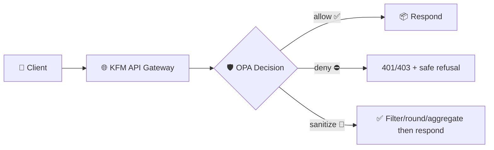

<!--
🛡️ Kansas Frontier Matrix — Policy Pack README
Location: api/policies/README.md
-->

<div align="center">


# 🛡️ KFM API Policy Pack (OPA) — `api/policies/`

**Policy-as-Code** 🧩 • **Fail Closed** 🔒 • **Least Privilege** 🧠 • **Evidence-First (“No Source, No Answer”)** 📎 • **FAIR + CARE** 🌾

**The policy “brain” for the KFM API layer** — consistent allow/deny/sanitize for **REST**, **GraphQL**, **tiles**, and **AI/Focus Mode** endpoints.

</div>

---

## 🧭 Navigation

- [🎯 Purpose & non‑negotiables](#-purpose--non-negotiables)
- [🧠 Policy philosophy](#-policy-philosophy)
- [🧱 Where policies run](#-where-policies-run)
- [📦 Runtime + CI policy gates](#-runtime--ci-policy-gates)
- [🧾 Contracts](#-contracts)
  - [📥 Input contract](#-input-contract)
  - [📤 Decision contract](#-decision-contract)
- [🗂️ Policy domains](#️-policy-domains)
- [🏷️ Governance taxonomy](#️-governance-taxonomy)
- [🧪 Testing](#-testing)
- [🧩 Adding or changing a policy](#-adding-or-changing-a-policy)
- [🧾 Auditing, provenance & replay](#-auditing-provenance--replay)
- [🧯 Troubleshooting](#-troubleshooting)
- [❓ FAQ](#-faq)
- [📚 Project library references](#-project-library-references)

---

## 🎯 Purpose & non‑negotiables

KFM is an **evidence-first geospatial knowledge system** built around a governed “truth path”:

> **Raw ➜ Processed ➜ Catalog ➜ Databases ➜ API ➜ UI/AI**  
> ✅ Nothing bypasses the governed API layer. No “UI → DB shortcuts.” 🧱  
> ✅ No public exposure without **license + sensitivity + provenance**.  
> ✅ AI outputs are treated as first-class artifacts with **traceability**. 🧾

This policy pack enforces those invariants at **CI time** and **runtime**, so the system behaves predictably as the platform grows.

### ✅ Non‑negotiables (quality bar)
- **Default deny** everywhere 🔒 (missing metadata = deny)
- **Stable contracts**: one predictable decision object per entrypoint
- **Machine‑readable reasons** (not just strings)
- **Sanitization is explicit and testable** (no “silent” filtering)
- **Auditability**: every decision is replayable by version hash
- **CARE + FAIR**: open exploration *without* violating cultural protections 🌾

---

## 🧠 Policy philosophy

### 1) 🔒 Fail closed by default
If anything is missing or ambiguous (license absent, sensitivity unset, provenance missing, unknown role/group), **deny**.

### 2) 🧠 Least privilege (RBAC + ABAC)
Authorization is derived from:
- **RBAC**: user roles/capabilities
- **ABAC**: resource tags (sensitivity, license, owner group, dataset status)
- **Context**: endpoint type, query shape, environment, org membership, request risk

### 3) 🌾 FAIR + CARE governance is “real”
We support open discovery (FAIR) while honoring Indigenous and community governance (CARE):
- **Collective benefit** ✅
- **Authority to control** 🧭
- **Responsibility** 🤝
- **Ethics** 🧠

### 4) 📎 Evidence-first AI (“No Source, No Answer”)
AI must be grounded and verifiable:
- If the system can’t cite sources it is permitted to use → **refuse or de‑escalate**
- Policies must be able to enforce **citations**, **topic limits**, **sensitive-data protections**, and **prompt‑injection resistance**

---

## 🧱 Where policies run

### 🗺️ The KFM “truth path” with policy gates

```mermaid
flowchart LR
  R[📥 Raw Sources] --> P[🏭 Processing / ETL]
  P --> C[🗂️ Catalog (STAC/DCAT + PROV)]
  C --> D[(🗃️ Runtime Stores<br/>PostGIS • Graph • Search • Object)]
  D --> A[🌐 API Layer<br/>REST • GraphQL • Tiles • AI]
  A --> U[🗺️ UI + 🤖 Focus Mode]

  %% Gates
  P -.-> G1{🛡️ Gate: Ingest Rules}
  C -.-> G2{🛡️ Gate: Metadata Completeness}
  A -.-> G3{🛡️ Gate: Runtime Authorization}
  U -.-> G4{🛡️ Gate: Evidence/Citation Rules}

  G1 --> P
  G2 --> C
  G3 --> A
  G4 --> U
```

### 🌐 Runtime request flow (allow / deny / sanitize)



---

## 📦 Runtime + CI policy gates

### 🤖 CI: prevent non-compliant changes from shipping
Policies in CI should block:
- publishing datasets without **license** ✅
- missing **sensitivity classification** ✅
- missing **provenance/lineage** (PROV) ✅
- schema regressions (breaking input/decision contract) ✅
- new endpoints without policy coverage ✅

### 🧯 Runtime: “every request gets a decision”
At runtime, OPA evaluates **every call** into:
- REST endpoints
- GraphQL operations (query + mutation + subscription if used)
- tile services (vector/raster tiles, feature services)
- AI endpoints (prompt + sources + draft answer)

---

## 🧾 Contracts

### 📥 Input contract

A stable input shape makes policy predictable, testable, and portable across services.

✅ Recommended high-level input schema:

```json
{
  "request": {
    "id": "req_123",
    "method": "GET",
    "path": "/api/v1/datasets/ks-water-rights",
    "query": {"bbox": "-99,37,-94,40"},
    "headers": {"user-agent": "..."},
    "ip": "203.0.113.10"
  },
  "user": {
    "id": "user_456",
    "roles": ["viewer"],
    "groups": ["public"],
    "org": "kfm",
    "scopes": ["read:catalog"],
    "auth": {"assurance": "mfa"}
  },
  "resource": {
    "type": "dataset",
    "id": "ks-water-rights",
    "status": "published",
    "license": "CC-BY-4.0",
    "sensitivity": "restricted",
    "tags": ["hydrology"],
    "owner_group": "kansas-agency-x",
    "provenance": {"prov": true, "stac": true, "dcat": true}
  },
  "context": {
    "service": "rest",
    "env": "prod",
    "time_utc": "2026-02-06T12:00:00Z",
    "risk": {"automated": false, "rate": "normal"}
  },
  "ai": {
    "mode": "focus",
    "prompt": "…",
    "sources": [{"dataset_id": "…", "record_ids": ["…"]}],
    "draft_answer": "…",
    "citations": ["[12]", "[13]"]
  }
}
```

#### 🧩 Service-specific extensions (recommended)
- **GraphQL**: include operation name, type (query/mutation), and parsed shape summary
- **Tiles**: include `z/x/y`, `bbox`, `layer_id`, `feature_count_estimate`
- **AI**: include `tool_calls`, `retrieval_ids`, and citation structure (not just text)

---

### 📤 Decision contract

**Every entrypoint returns a single decision object** with a stable shape.

✅ Recommended decision object:

```json
{
  "allow": false,
  "reasons": [
    {"code": "default_deny", "message": "Missing required governance conditions"}
  ],
  "sanitize": {
    "mode": "none",
    "mask_coordinates": false,
    "rounding_meters": 0,
    "suppress_fields": [],
    "aggregate": null
  },
  "obligations": {
    "audit": true,
    "log_level": "info",
    "policy_version_required": true,
    "provenance_stamp_required": true,
    "decision_cache_ttl_seconds": 0
  },
  "meta": {
    "policy_pack": "kfm-policy-pack",
    "policy_version": "git:SHA_OR_BUNDLE_HASH",
    "decision_id": "dec_789"
  }
}
```

#### Key semantics 🧠
- `allow=false` may still include `sanitize` instructions **if** you implement “safe partial disclosure”
- `reasons[]` must be **machine-readable** (codes you can aggregate in logs)
- `obligations` are the “must‑dos” the API layer enforces (audit logging, provenance stamping, etc.)

---

## 🗂️ Suggested folder layout

> Keep policy packs boring and predictable. Predictability = safety ✅

```text
📦 api/
  └── 🛡️ policies/
      ├── README.md
      ├── policy-pack.yaml                 # ✅ pack metadata (version, schemas, entrypoints)
      ├── 📜 rego/
      │   ├── security.rego                # RBAC/ABAC, endpoint rules
      │   ├── data_policies.rego           # license/sensitivity/provenance gating
      │   ├── compliance.rego              # CARE/FAIR, publish/withdraw rules
      │   ├── ai_policies.rego             # evidence-first AI safety & disclosure rules
      │   └── lib/
      │       ├── schema.rego              # input/decision helpers + type checks
      │       ├── reasons.rego             # canonical reason codes + builders
      │       ├── sanitize.rego            # sanitize builders (geo/PII/field suppression)
      │       ├── graphql.rego             # operation shape helpers (optional)
      │       ├── tiles.rego               # z/x/y helpers (optional)
      │       └── time.rego                # time/window helpers
      ├── 🧪 tests/
      │   ├── security_test.rego
      │   ├── data_policies_test.rego
      │   ├── compliance_test.rego
      │   ├── ai_policies_test.rego
      │   └── fixtures/
      │       ├── inputs/                  # golden inputs (json)
      │       └── expected/                # golden decisions (json)
      ├── 🗂️ data/
      │   ├── roles.json                   # role→capabilities map
      │   ├── sensitivities.json           # sensitivity taxonomy
      │   ├── licenses.json                # allowed licenses + constraints
      │   ├── protected_tags.json          # culturally protected / sensitive tags
      │   └── denylist.json                # disallowed prompts/patterns (AI)
      ├── 🧰 schemas/
      │   ├── input.schema.json            # (optional) JSON Schema mirror
      │   └── decision.schema.json
      └── 📦 bundle/
          └── (OPA bundle output artifacts)
```

---

## 🗂️ Policy domains

### 🔐 1) `security.rego` — RBAC + endpoint protection
Examples:
- only Admin can trigger ingestion/pipelines
- contributors can draft/submit but not publish
- public viewers can read **only** public-approved outputs

### 🧾 2) `data_policies.rego` — dataset governance
Examples:
- dataset must have **license** before publish/read in public flows
- dataset must declare **sensitivity**
- dataset must have **provenance** (PROV) before public catalog exposure

### 🌾 3) `compliance.rego` — governance rules (FAIR + CARE)
Examples:
- **withdrawn** datasets are inaccessible
- culturally protected datasets require owner-group authorization
- release processes require approvals (modeled as metadata assertions)

### 🤖 4) `ai_policies.rego` — evidence + safety for Focus Mode
Examples:
- require citations and source manifests
- deny disallowed intents (exploitation, targeted harm, bypass attempts)
- prevent disclosure of private info about living people
- block restricted dataset references for unauthorized users
- sanitize outputs (rounding, aggregation, field suppression)

---

## 🏷️ Governance taxonomy

### 📌 Dataset lifecycle states
- `draft` 📝 (internal only)
- `review` 👀 (restricted; approvals required)
- `published` ✅ (servable with policy checks)
- `withdrawn` 🧯 (deny everywhere unless explicitly authorized for audit)

### 🔎 Sensitivity levels (example)
- `public` 🌐
- `restricted` 🔐 (authorized users; may sanitize for others)
- `sensitive_location` 🗺️ (precision controls required)
- `culturally_protected` 🌾 (CARE rules + owner authority required)
- `pii` 🧍 (default deny unless explicit legal/ethical basis)

> ✅ Recommendation: keep taxonomy small, stable, and well‑tested.

---

## 📎 Examples (upgraded)

### 1) 📎 Evidence-first AI: require citations + source manifest

**Rule goal:** “No Source, No Answer” — missing citations → safe refusal.

```rego
package kfm.ai

import data.kfm.lib.reasons as reasons

default decision := reasons.deny("missing_citations")

decision := reasons.allow_with_obligations({
  "audit": true,
  "provenance_stamp_required": true
}) {
  # Example: require at least one citation marker and at least one structured source
  re_match("\\[\\d+\\]", input.ai.draft_answer)
  count(input.ai.sources) > 0
}
```

### 2) 🗺️ Sensitive location handling: sanitize precision

```rego
package kfm.data

import data.kfm.lib.reasons as reasons
import data.kfm.lib.sanitize as san

default decision := reasons.deny("default_deny")

# Public datasets: allow cleanly
decision := reasons.allow() {
  input.resource.sensitivity == "public"
}

# Sensitive locations: allow only with precision reduction
decision := reasons.allow_with_sanitize(
  san.geo_rounding(5000)  # meters
) {
  input.resource.sensitivity == "sensitive_location"
  "researcher" in input.user.roles
}
```

### 3) 🔐 Endpoint protection: pipeline triggers (fail closed)

```rego
package kfm.security

import data.kfm.lib.reasons as reasons

default decision := reasons.deny("default_deny")

decision := reasons.allow() {
  input.request.path == "/api/v1/ingest/runPipeline"
  input.request.method == "POST"
  "admin" in input.user.roles
}
```

---

## 🧪 Testing

### ✅ OPA unit tests
```bash
opa test api/policies -v
```

### ✅ Conftest checks (CI parity)
```bash
conftest test . -p api/policies/rego
```

### ✅ Golden decision fixtures (recommended)
- Put representative inputs in: `tests/fixtures/inputs/*.json`
- Put expected outputs in: `tests/fixtures/expected/*.json`
- Write tests that compare full decision objects (including sanitize/obligations)

### ✅ Style & safety checks (recommended)
```bash
opa fmt -w api/policies/rego
opa check api/policies/rego
```

---

## 🧩 Adding or changing a policy

### ✅ Checklist
- [ ] Choose the domain: **security / data / compliance / AI**
- [ ] Add rules with **default deny**
- [ ] Add/extend tests (unit + fixtures)
- [ ] Update taxonomy data if needed (`data/*.json`)
- [ ] Confirm decision contract compatibility (no breaking changes)
- [ ] Document:
  - risk mitigated 🛡️
  - allow/deny examples ✅⛔
  - sanitize behavior 🧽
  - logging obligations 🧾

### ✍️ Style conventions (keep it boring ✅)
- Stable packages: avoid renaming `package kfm.*`
- Prefer **single entrypoint** per domain:
  - `kfm.security.decision`
  - `kfm.data.decision`
  - `kfm.compliance.decision`
  - `kfm.ai.decision`
- Keep logic shallow → extract helpers to `rego/lib/*`
- Use canonical reason codes via `lib/reasons.rego`
- Avoid “stringly‑typed” decisions; return structured objects

---

## 🧾 Auditing, provenance & replay

Policies must be **auditable** and **replayable**.

### ✅ Required audit fields (API responsibility; policy can demand via obligations)
- `request_id`
- `user_id` (or pseudonymous id if required)
- `resource_id` (dataset/story/layer)
- `decision.allow`
- `decision.reasons[]`
- `decision.sanitize`
- `decision.obligations`
- `policy_version` (commit SHA or bundle hash)
- `timestamp`

### 🔁 Replay guarantee
> If a decision is challenged later, we must be able to reproduce it by re-running:
- the same `input` JSON
- the same policy bundle version
- the same policy data (`data/*.json`)

---

## 🧯 Troubleshooting

### “Everything is denied!”
- Confirm the API is passing the expected `input.user.roles/groups`
- Confirm resource metadata includes `license`, `sensitivity`, `status`, and `provenance`
- Check `reasons[]` codes and ensure they’re logged

### “Sanitization didn’t happen”
- Verify the API actually *applies* `decision.sanitize`
- Add golden fixture tests that assert sanitize behavior

### “GraphQL feels hard to govern”
- Start with coarse-grained rules:
  - block mutations except for specific roles
  - require dataset sensitivity checks for any resolver touching protected data
- Add operation-shape summaries to `input` rather than passing full AST everywhere

---

## ❓ FAQ

### “Deny or sanitize?”
Both are valid:
- **deny** when risk is unacceptable or required governance metadata is missing 🔒
- **sanitize** when the use-case is legitimate but precision/detail is harmful 🧽

### “Do we enforce only at runtime?”
No. CI gates prevent non-compliant assets from shipping.

### “Where does token validation happen?”
Typically outside OPA (API middleware validates token), then passes claims to OPA:
- roles, groups, org affiliation, scopes, assurance level

OPA makes the authorization + obligations decision; the API enforces obligations.

---

## 📚 Project library references

These internal references inform the KFM governance posture, API “truth path,” and CARE/FAIR alignment:

- **Kansas Frontier Matrix (KFM) — Comprehensive System Documentation**  [oai_citation:0‡Kansas Frontier Matrix Comprehensive System Documentation.pdf](sediment://file_00000000ef40722faf17987b69730695)  
- **Indigenous Statistics (2nd ed., 2025): Data sovereignty, CARE principles, culturally embedded statistics**  [oai_citation:1‡Indigenous Statistics.pdf](sediment://file_0000000033ec72308e1f791a79f61bfe)  
- **Node.js / Web stack background (optional for API services & tooling)**  [oai_citation:2‡Node.js-React-CSS-HTML.pdf](sediment://file_00000000b09c71f8b277cb19b9f597b2)  
- **Web documentation + structure patterns (UX for READMEs & developer docs)**  [oai_citation:3‡learn-to-code-html-and-css-develop-and-style-websites.pdf](sediment://file_00000000ed6471fdb0ecead71e051444)  
- **Media/format literacy for web assets (helpful for map tiles, imagery, and docs assets)**  [oai_citation:4‡Various Programming Concepts.pdf](sediment://file_00000000e86c71fd9eceb7eec4bba22e)  

---

### ✅ Keep this README aligned with reality 🌱

If you rename entrypoints, add new endpoints, or adjust metadata requirements:
- update this README
- update fixtures/tests
- update `policy-pack.yaml`

**Policy docs that drift from implementation are a security bug.** 🐛🛡️