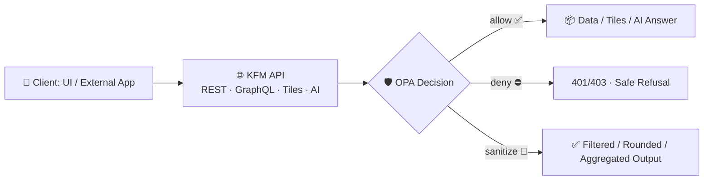
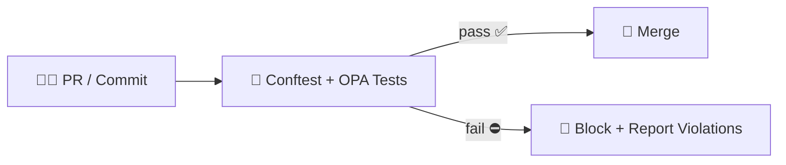

# 🛡️ KFM API Policy Pack — `api/policies/`


> **Policy-as-Code** 🧩 • **Fail Closed** 🔒 • **Least Privilege** 🧠 • **Evidence-First** 📎 • **FAIR + CARE** 🌾  
> This folder is the **governance brain** for the Kansas Frontier Matrix (KFM) API layer: it decides **allow / deny / sanitize / obligate** for every request and AI output.

---

## 🚦 What this policy pack guarantees

KFM’s architecture enforces a strict “truth path” where **nothing bypasses governance**:  
**Raw ➜ Processed ➜ Catalog ➜ Databases ➜ API ➜ UI/AI** 🧭 [oai_citation:0‡Kansas Frontier Matrix Comprehensive System Documentation.pdf](sediment://file_00000000ef40722faf17987b69730695)

This policy pack exists to ensure:

- **No UI → DB shortcuts** 🧱 (everything goes through the governed API) [oai_citation:1‡Kansas Frontier Matrix Comprehensive System Documentation.pdf](sediment://file_00000000ef40722faf17987b69730695)
- **Fail closed** 🔒 (missing metadata, unknown role, unclear sensitivity ⇒ *deny*) [oai_citation:2‡Kansas Frontier Matrix Comprehensive System Documentation.pdf](sediment://file_00000000ef40722faf17987b69730695)
- **Least privilege RBAC + ABAC** 🧠 (role + classification + context) [oai_citation:3‡Kansas Frontier Matrix Comprehensive System Documentation.pdf](sediment://file_00000000ef40722faf17987b69730695)
- **Governed publication** 🗂️ (datasets require license + sensitivity + provenance; otherwise blocked) [oai_citation:4‡Kansas Frontier Matrix Comprehensive System Documentation.pdf](sediment://file_00000000ef40722faf17987b69730695)
- **Evidence-first AI** 📎 (“No Source, No Answer” enforced through gates and policy checks) [oai_citation:5‡Kansas Frontier Matrix Comprehensive System Documentation.pdf](sediment://file_00000000ef40722faf17987b69730695)
- **Auditability** 🧾 (decisions and AI outputs are logged and replayable, tied to policy versions) [oai_citation:6‡Kansas Frontier Matrix Comprehensive System Documentation.pdf](sediment://file_00000000ef40722faf17987b69730695) [oai_citation:7‡Kansas Frontier Matrix (KFM) – Comprehensive Technical Blueprint.pdf](sediment://file_000000006dbc71f89a5094ce310a452d)

---

## 🧭 Contents

- [🧠 Policy principles](#-policy-principles)
- [🧱 Where policies run](#-where-policies-run)
- [🗃️ Policy inputs and outputs](#️-policy-inputs-and-outputs)
- [🧬 Taxonomies](#-taxonomies)
- [📁 Recommended folder layout](#-recommended-folder-layout)
- [🗂️ Policy domains](#️-policy-domains)
- [🧪 Testing and debugging](#-testing-and-debugging)
- [🧩 Adding or changing a policy](#-adding-or-changing-a-policy)
- [📎 Examples](#-examples)
- [🧾 Auditing and provenance](#-auditing-and-provenance)
- [❓ FAQ](#-faq)
- [📚 Project library](#-project-library)
- [🧾 Grounding notes](#-grounding-notes)

---

## 🧠 Policy principles

### 🔒 Fail closed by default

If anything is missing or ambiguous (license absent, sensitivity unset, provenance missing, unknown role), **deny**.  
KFM explicitly treats “missing governance metadata” as “not publishable / not accessible.” [oai_citation:8‡Kansas Frontier Matrix Comprehensive System Documentation.pdf](sediment://file_00000000ef40722faf17987b69730695) [oai_citation:9‡Kansas Frontier Matrix Comprehensive System Documentation.pdf](sediment://file_00000000ef40722faf17987b69730695)

---

### 🧠 Least privilege by design

We make authorization a **two-key system**:

- **RBAC**: user roles (Public Viewer / Contributor / Maintainer / Admin) [oai_citation:10‡Kansas Frontier Matrix Comprehensive System Documentation.pdf](sediment://file_00000000ef40722faf17987b69730695)
- **ABAC**: sensitivity + tags + context (endpoint type, query shape, org/group, environment) [oai_citation:11‡Kansas Frontier Matrix Comprehensive System Documentation.pdf](sediment://file_00000000ef40722faf17987b69730695)

> 🎯 Goal: A powerful system where users can explore confidently — without ever “accidentally” crossing a governance boundary.

---

### 🧭 Preserve the truth path

KFM’s architecture guarantees UI and AI **never** query databases directly; the API is the controlled “choke point.” [oai_citation:12‡Kansas Frontier Matrix Comprehensive System Documentation.pdf](sediment://file_00000000ef40722faf17987b69730695) [oai_citation:13‡Kansas Frontier Matrix (KFM) – Comprehensive Technical Blueprint.pdf](sediment://file_000000006dbc71f89a5094ce310a452d)

---

### 🌾 FAIR + CARE governance stays real

KFM aims to support open exploration **without** leaking sensitive locations, private records, or culturally protected data.

- **FAIR** supports scientific stewardship (Findable, Accessible, Interoperable, Reusable).
- **CARE** complements FAIR for Indigenous governance: **Collective Benefit, Authority to Control, Responsibility, Ethics** [oai_citation:14‡Indigenous Statistics.pdf](sediment://file_0000000033ec72308e1f791a79f61bfe)

> 🌿 In practice: policies can enforce “open where appropriate” while preserving community authority and safety.

---

### 📎 Evidence-first AI

KFM’s AI is designed as an auditable artifact pipeline:

- Inputs are sanitized through a **Prompt Gate** before reaching the model [oai_citation:15‡Kansas Frontier Matrix Comprehensive System Documentation.pdf](sediment://file_00000000ef40722faf17987b69730695)
- The AI runs in a **sandbox** (no unapproved tools; allow-list defaults empty) [oai_citation:16‡Kansas Frontier Matrix Comprehensive System Documentation.pdf](sediment://file_00000000ef40722faf17987b69730695)
- Outputs are checked by **OPA governance rules** *before* release [oai_citation:17‡Kansas Frontier Matrix Comprehensive System Documentation.pdf](sediment://file_00000000ef40722faf17987b69730695)

---

## 🧱 Where policies run

This pack supports **two enforcement planes**:

### ✅ Runtime enforcement



### ✅ CI enforcement



KFM’s design explicitly uses OPA in runtime and CI so that missing license/sensitivity can block deployment and prevent bypass.  [oai_citation:18‡Kansas Frontier Matrix Comprehensive System Documentation.pdf](sediment://file_00000000ef40722faf17987b69730695) [oai_citation:19‡Kansas Frontier Matrix (KFM) – Comprehensive Technical Blueprint.pdf](sediment://file_000000006dbc71f89a5094ce310a452d)

---

## 🗃️ Policy inputs and outputs

### 🧾 The input contract

The API should pass OPA a consistent **context envelope** (shape stays stable even as endpoints evolve):

```json
{
  "request": {
    "id": "req_123",
    "method": "POST",
    "path": "/api/v1/ai/query",
    "query": {"bbox": "-101,37,-94,40"},
    "headers": {"x-kfm-client": "web"},
    "ip": "203.0.113.9"
  },
  "user": {
    "id": "usr_456",
    "roles": ["contributor"],
    "groups": ["kfm:researchers"],
    "org": "kfm",
    "scopes": ["read:catalog"]
  },
  "resource": {
    "type": "dataset",
    "id": "ks_hydrology_1880",
    "sensitivity": "restricted",
    "tags": ["archaeology", "location_sensitive"],
    "license": "CC-BY-4.0",
    "prov": {"has_prov": true}
  },
  "ai": {
    "question": "Where are the sites located?",
    "answer": "…",
    "citations": ["prov:sha256:..."],
    "model": {"name": "ollama", "version": "x.y.z"}
  },
  "env": {
    "stage": "prod",
    "policy_bundle": {"sha": "bundle_sha_here"}
  }
}
```

> 🔑 Rule of thumb: if the API didn’t send the fact to OPA, **OPA cannot safely authorize it**.

---

### 🎛️ The decision contract

Every policy entrypoint should return a **single** decision object with a stable schema:

```json
{
  "allow": false,
  "effect": "deny",
  "reasons": [
    {"code": "default_deny", "message": "No allow rule matched."}
  ],
  "sanitize": {
    "mask_coordinates": false,
    "rounding_meters": null,
    "suppress_fields": []
  },
  "obligations": {
    "audit": true,
    "audit_level": "info",
    "provenance_stamp": true,
    "policy_version_required": true
  },
  "meta": {
    "decision_id": "dec_9e3b...",
    "policy_bundle_sha": "bundle_sha_here",
    "policy_package": "kfm.security",
    "evaluated_at": "2026-02-06T12:00:00Z"
  }
}
```

**Why add `effect` if we already have `allow`?**  
Because governance is often **three-state** in practice:

- ✅ `allow` — full access
- 🧽 `allow_with_sanitization` — legitimate access, but precision is harmful
- ⛔ `deny` — unacceptable risk or missing governance requirements

> 🧠 Keep `allow` for simplicity, add `effect` for clarity and analytics.

---

### 🧩 Reason codes

Use **machine-readable** reason codes that can power:

- user-facing explanations (safe and non-leaky)
- dashboards and compliance reporting
- regression checks in tests

Example codes:

- `default_deny`
- `missing_license`
- `missing_sensitivity`
- `missing_provenance`
- `unauthorized_role`
- `cultural_protection_required`
- `ai_missing_citations`
- `ai_disallowed_intent`
- `query_shape_not_allowed`

---

### 🧷 Obligations

Obligations are things the API **must** do if it proceeds:

- `audit: true`
- `provenance_stamp: true`
- `rate_limit_bucket: "ai_public"`
- `require_citations: true`
- `log_fields: ["request_id","resource_id","policy_bundle_sha"]`

> ⚠️ If the API cannot fulfill obligations, it must **fail closed** and deny.

---

## 🧬 Taxonomies

### 🧑‍🤝‍🧑 Roles

KFM roles include Public Viewer, Contributor, Maintainer, Admin [oai_citation:20‡Kansas Frontier Matrix Comprehensive System Documentation.pdf](sediment://file_00000000ef40722faf17987b69730695).

For interoperability, you may also model roles like **Owner / Collaborator / Read-only**, which pair well with structured data classifications [oai_citation:21‡Data Spaces.pdf](sediment://file_0000000053c071f5a9733b1b09cc9f76).

---

### 🏷️ Sensitivity levels

A practical baseline taxonomy:

| Level | Meaning | Typical treatment |
|------:|---------|-------------------|
| `public` | safe for open access | allow |
| `internal` | org-only | allow if org member |
| `confidential` | high risk | allow for approved roles; sanitize by default |
| `restricted` | tightly controlled | allow only for authorized roles; sanitize or deny |
| `cultural_protected` | rights-holder governed | require owner group or explicit approvals |

> 🌾 CARE-aware datasets may need “rights-holder gates” beyond classic RBAC.

---

### ✅ Minimum metadata bar

Policies should enforce that **publishable** datasets include:

- license (reuse clarity) [oai_citation:22‡Kansas Frontier Matrix Comprehensive System Documentation.pdf](sediment://file_00000000ef40722faf17987b69730695)
- sensitivity classification [oai_citation:23‡Kansas Frontier Matrix Comprehensive System Documentation.pdf](sediment://file_00000000ef40722faf17987b69730695)
- provenance (PROV) record; otherwise not publishable [oai_citation:24‡Kansas Frontier Matrix Comprehensive System Documentation.pdf](sediment://file_00000000ef40722faf17987b69730695)
- catalog metadata (STAC/DCAT) as part of the truth path [oai_citation:25‡Kansas Frontier Matrix Comprehensive System Documentation.pdf](sediment://file_00000000ef40722faf17987b69730695) [oai_citation:26‡Kansas Frontier Matrix (KFM) – Comprehensive Technical Blueprint.pdf](sediment://file_000000006dbc71f89a5094ce310a452d)

---

## 📁 Recommended folder layout

> Your repo may vary — this layout keeps policy logic predictable, testable, and versionable.

```text
📦 api/
  └── 🛡️ policies/
      ├── README.md
      ├── 📜 rego/
      │   ├── security.rego              # RBAC/ABAC allow/deny + endpoint rules
      │   ├── data_policies.rego         # license/sensitivity/provenance gating
      │   ├── ai_policies.rego           # citations + AI safety + sensitive output checks
      │   ├── compliance.rego            # governance council rules + approvals
      │   ├── contracts/
      │   │   └── decision_schema.json   # optional: JSON schema for decision object
      │   └── lib/
      │       ├── reasons.rego           # reason helpers + code registry
      │       ├── sanitize.rego          # redaction helpers (coords, fields, aggregation)
      │       ├── labels.rego            # CARE/rights-holder labels (TK/BC patterns)
      │       └── strings.rego           # regex and normalization helpers
      ├── 🧪 tests/
      │   ├── security_test.rego
      │   ├── data_policies_test.rego
      │   ├── ai_policies_test.rego
      │   └── contract_test.rego         # ensures decision contract shape is stable
      ├── 🗂️ data/
      │   ├── roles.json                 # optional: role → capabilities map
      │   ├── sensitivities.json         # optional: sensitivity taxonomy
      │   ├── denylist.json              # optional: banned prompt patterns / terms
      │   └── tables_allowlist.json      # optional: safe query interface allowlist
      ├── 🧪 conftest/
      │   └── policies/                  # optional: conftest-specific wrappers
      └── 📦 bundle/
          └── (optional OPA bundle outputs)
```

---

## 🗂️ Policy domains

### 🔐 `security.rego`

Protects endpoints and operations:

- admin-only ingestion / pipeline trigger routes
- maintainer-only publish operations
- per-endpoint scopes (read/write/admin)

KFM’s governance model uses OPA so unauthorized roles hitting protected endpoints are denied at runtime.  [oai_citation:27‡Kansas Frontier Matrix Comprehensive System Documentation.pdf](sediment://file_00000000ef40722faf17987b69730695)

---

### 🧾 `data_policies.rego`

Dataset governance gates:

- must have license before publishable
- must declare sensitivity
- must have PROV (chain of custody) before entering catalog/public flows [oai_citation:28‡Kansas Frontier Matrix Comprehensive System Documentation.pdf](sediment://file_00000000ef40722faf17987b69730695)

---

### 🌾 `compliance.rego`

Human governance made enforceable:

- withdrawn datasets are not accessible
- culturally protected datasets require rights-holder group membership
- approvals and release processes modeled as metadata assertions

> 🧑‍⚖️ This is where “council rules” become consistent enforcement.

---

### 🤖 `ai_policies.rego`

Evidence + safety for Focus Mode:

- require citations for claims before release [oai_citation:29‡Kansas Frontier Matrix Comprehensive System Documentation.pdf](sediment://file_00000000ef40722faf17987b69730695)
- block disallowed intents
- prevent leaking sensitive locations or private personal data
- enforce output sanitization when required

KFM also uses **input sanitization** before the model (Prompt Gate) and an AI sandbox (no unapproved tools). [oai_citation:30‡Kansas Frontier Matrix Comprehensive System Documentation.pdf](sediment://file_00000000ef40722faf17987b69730695) [oai_citation:31‡Kansas Frontier Matrix Comprehensive System Documentation.pdf](sediment://file_00000000ef40722faf17987b69730695)

---

## 🧪 Testing and debugging

### ✅ Run unit tests

```bash
opa test api/policies -v
```

### ✅ Run CI-parity checks locally

```bash
conftest test . -p api/policies/rego
```

KFM’s blueprint explicitly describes CI policy checks where missing PROV or banned phrases fail the PR gate.  [oai_citation:32‡Kansas Frontier Matrix (KFM) – Comprehensive Technical Blueprint.pdf](sediment://file_000000006dbc71f89a5094ce310a452d)

---

### 🔎 Debug a decision

```bash
opa eval \
  -i examples/input.json \
  -d api/policies/rego \
  "data.kfm.security.decision"
```

---

### 🧼 Keep policies formatted

```bash
opa fmt -w api/policies/rego
```

---

<details>
<summary>🧰 Optional: add a GitHub Actions policy gate step</summary>

```yaml
- name: Policy gate
  run: |
    opa test api/policies -v
    conftest test . -p api/policies/rego
```

</details>

---

## 🧩 Adding or changing a policy

### ✅ Checklist

- [ ] Pick the right domain: `security` / `data` / `ai` / `compliance`
- [ ] Add rules with **default deny**
- [ ] Add tests (unit + contract) that show pass/fail cases
- [ ] Use structured `reasons[]` codes (avoid ad-hoc strings)
- [ ] If new metadata is required, add it to **CI checks** too
- [ ] Ensure the API can fulfill any **obligations**
- [ ] Update this README’s relevant section and examples

### 🔍 Review rubric

Every policy PR should answer:

- **What risk does this mitigate?**
- **What’s the expected “safe failure mode”?** (deny vs sanitize)
- **What evidence/logging makes this auditable later?**
- **Is the change backwards compatible?**
- **Do tests prevent regressions?**

---

## 📎 Examples

### 1) 📎 AI citations requirement

> Enforce: answers must contain at least one citation marker.

**Simple pattern enforcement**

```rego
package kfm.ai

default decision = {
  "allow": false,
  "effect": "deny",
  "reasons": [{"code": "ai_missing_citations", "message": "Answer must include citations."}],
  "sanitize": {},
  "obligations": {"audit": true}
}

decision := out {
  re_match("\\[\\d+\\]", input.ai.answer)
  out := {
    "allow": true,
    "effect": "allow",
    "reasons": [],
    "sanitize": {},
    "obligations": {"audit": true}
  }
}
```

---

### 2) 🗺️ Sensitive location handling

Common patterns:

- round coordinates to reduce precision
- suppress deanonymizing fields
- return aggregates instead of points

```rego
package kfm.data

default decision = {
  "allow": false,
  "effect": "deny",
  "reasons": [{"code": "default_deny", "message": "No allow rule matched."}],
  "sanitize": {},
  "obligations": {"audit": true}
}

decision := out {
  input.resource.sensitivity == "public"
  out := {"allow": true, "effect": "allow", "reasons": [], "sanitize": {}, "obligations": {"audit": true}}
}

decision := out {
  input.resource.sensitivity == "restricted"
  "admin" in input.user.roles
  out := {"allow": true, "effect": "allow", "reasons": [], "sanitize": {}, "obligations": {"audit": true}}
}

decision := out {
  input.resource.sensitivity == "restricted"
  not ("admin" in input.user.roles)

  out := {
    "allow": true,
    "effect": "allow_with_sanitization",
    "reasons": [{"code": "sanitized_restricted_dataset", "message": "Restricted dataset returned with reduced precision."}],
    "sanitize": {
      "mask_coordinates": true,
      "rounding_meters": 5000,
      "suppress_fields": ["owner_name", "exact_geometry"]
    },
    "obligations": {"audit": true}
  }
}
```

---

### 3) 🔐 Endpoint protection

```rego
package kfm.security

default decision = {
  "allow": false,
  "effect": "deny",
  "reasons": [{"code": "unauthorized_role", "message": "Insufficient privileges."}],
  "sanitize": {},
  "obligations": {"audit": true}
}

decision := out {
  input.request.path == "/api/v1/ingest/runPipeline"
  input.request.method == "POST"
  "admin" in input.user.roles

  out := {"allow": true, "effect": "allow", "reasons": [], "sanitize": {}, "obligations": {"audit": true}}
}
```

---

## 🧾 Auditing and provenance

Policies must be **auditable** and **replayable**.

KFM’s system documentation calls for:

- mandatory provenance records for datasets (PROV)
- immutable logs for pipeline runs
- an append-only ledger of AI queries + outputs, stored with sources, model version, and policy decision [oai_citation:33‡Kansas Frontier Matrix Comprehensive System Documentation.pdf](sediment://file_00000000ef40722faf17987b69730695)

### ✅ Recommended audit fields

- `request_id`
- `user_id` (or pseudonymous id)
- `decision.allow` + `decision.effect`
- `decision.reasons[]`
- `decision.sanitize`
- `policy_bundle_sha` (or commit SHA)
- `resource_id`
- `timestamp`

### 🔐 Optional privacy-preserving logging

If you need logs that are useful without leaking identity, consider pseudonymizing user identifiers. One approach described in the literature is SHA-3-based pseudonymization combining identity attributes. [oai_citation:34‡Data Spaces.pdf](sediment://file_0000000053c071f5a9733b1b09cc9f76)

---

## ❓ FAQ

### “Should policies deny or sanitize?”
Both are valid — choose the safer outcome:

- **deny** ⛔ when requirements are missing, risk is unacceptable, or the user intent is disallowed
- **sanitize** 🧽 when the use-case is legitimate but precision is harmful (sensitive sites, small-n counts, exact geometries)

### “Are policies runtime-only?”
No. CI gates stop non-compliant assets/metadata from ever shipping. KFM explicitly runs policy checks in CI and runtime. [oai_citation:35‡Kansas Frontier Matrix Comprehensive System Documentation.pdf](sediment://file_00000000ef40722faf17987b69730695)

### “Where does token verification happen?”
Typically outside OPA (API middleware validates the token), then passes claims to OPA:

- roles
- groups
- org affiliation
- scopes

OPA returns authorization + obligations; the API executes them.

---

## 📚 Project library

These project sources shaped the governance framing used in this README:

- 📘 KFM System Documentation  [oai_citation:36‡Kansas Frontier Matrix Comprehensive System Documentation.pdf](sediment://file_00000000ef40722faf17987b69730695)
- 🧱 KFM Technical Blueprint  [oai_citation:37‡Kansas Frontier Matrix (KFM) – Comprehensive Technical Blueprint.pdf](sediment://file_000000006dbc71f89a5094ce310a452d)
- 🌾 Indigenous Statistics and CARE principles context  [oai_citation:38‡Indigenous Statistics.pdf](sediment://file_0000000033ec72308e1f791a79f61bfe)
- 🧭 Data classification patterns and privacy logs  [oai_citation:39‡Data Spaces.pdf](sediment://file_0000000053c071f5a9733b1b09cc9f76)
- ✨ Advanced Markdown patterns for Mermaid + collapsible sections  [oai_citation:40‡Comprehensive Markdown Guide_ Syntax, Extensions, and Best Practices.docx](file-service://file-J6rFRcp4ExCCeCdTevQjxz)

---

## 🧾 Grounding notes

<details>
<summary>📎 Evidence anchors used while upgrading this README</summary>

- KFM “fail closed”, RBAC roles, OPA used in runtime + CI, and “no bypass of API” [oai_citation:41‡Kansas Frontier Matrix Comprehensive System Documentation.pdf](sediment://file_00000000ef40722faf17987b69730695)
- KFM provenance requirements and append-only AI ledger with policy decision included [oai_citation:42‡Kansas Frontier Matrix Comprehensive System Documentation.pdf](sediment://file_00000000ef40722faf17987b69730695)
- KFM truth path sequence (Raw ➜ Processed ➜ Catalog ➜ Databases ➜ API ➜ UI/AI) [oai_citation:43‡Kansas Frontier Matrix Comprehensive System Documentation.pdf](sediment://file_00000000ef40722faf17987b69730695)
- OPA checks for AI output + Prompt Gate + sandboxing patterns [oai_citation:44‡Kansas Frontier Matrix Comprehensive System Documentation.pdf](sediment://file_00000000ef40722faf17987b69730695)
- Versioned policy decisions (bundle hash / commit recorded) [oai_citation:45‡Kansas Frontier Matrix (KFM) – Comprehensive Technical Blueprint.pdf](sediment://file_000000006dbc71f89a5094ce310a452d)
- CI gate examples (missing PROV / banned phrase triggers fail) [oai_citation:46‡Kansas Frontier Matrix (KFM) – Comprehensive Technical Blueprint.pdf](sediment://file_000000006dbc71f89a5094ce310a452d)
- CARE complements FAIR: Collective Benefit, Authority to Control, Responsibility, Ethics [oai_citation:47‡Indigenous Statistics.pdf](sediment://file_0000000033ec72308e1f791a79f61bfe)
- Data classification + roles matrix; plus privacy-protecting pseudonymized logs [oai_citation:48‡Data Spaces.pdf](sediment://file_0000000053c071f5a9733b1b09cc9f76) [oai_citation:49‡Data Spaces.pdf](sediment://file_0000000053c071f5a9733b1b09cc9f76)
- Mermaid + `<details>` blocks as supported advanced Markdown patterns [oai_citation:50‡Comprehensive Markdown Guide_ Syntax, Extensions, and Best Practices.docx](file-service://file-J6rFRcp4ExCCeCdTevQjxz)

</details>

---

> 🌱 Keep this README aligned with the **real policy entrypoints**, **decision contract**, and **actual API integration** as the implementation evolves.