# 🔎 Provenance API (`api/provenance/`)  
  -3f51b5) 

> **“Provenance first.”** Nothing should be published, graphed, or shown in the UI unless it has lineage and metadata.  [oai_citation:0‡MARKDOWN_GUIDE_v13.md.gdoc](file-service://file-UYVruFXfueR8veHMUKeugU)

This module is the **governed provenance gateway** for Kansas Frontier Matrix (KFM):  
it exposes **dataset + pipeline + evidence + AI interaction lineage** as **PROV-style bundles** so every output can be traced back to inputs, processing steps, and responsible agents.  [oai_citation:1‡Kansas Frontier Matrix (KFM) – Comprehensive Technical Blueprint.pdf](sediment://file_000000006dbc71f89a5094ce310a452d)

---

## ✨ Why this exists

KFM’s pipeline has a hard ordering (non‑negotiable):  
**ETL → Catalogs (STAC/DCAT/PROV) → Graph → API → UI → Story Nodes → Focus Mode**.  [oai_citation:2‡MARKDOWN_GUIDE_v13.md.gdoc](file-service://file-UYVruFXfueR8veHMUKeugU)

This provenance service supports the “contracts at the boundary” concept by ensuring:

- **PROV lineage records exist before “downstream” consumption** (graph/UI/story).  [oai_citation:3‡MARKDOWN_GUIDE_v13.md.gdoc](file-service://file-UYVruFXfueR8veHMUKeugU)
- **All access goes through the governed API layer** (no direct graph reads from the UI).  [oai_citation:4‡MARKDOWN_GUIDE_v13.md.gdoc](file-service://file-UYVruFXfueR8veHMUKeugU)
- **Evidence artifacts** (analysis outputs + AI-generated datasets) are treated as first-class datasets with full provenance.  [oai_citation:5‡MARKDOWN_GUIDE_v13.md.gdoc](file-service://file-UYVruFXfueR8veHMUKeugU)

---

## 🧭 What counts as provenance in KFM

KFM provenance bundles typically capture:

- **Entities**: inputs (raw files, URLs, checksums/hashes), outputs (processed assets), and intermediates  
- **Activities**: pipeline runs / transforms with timestamps + runtime/environment context  
- **Agents**: software agent (script + version) and optionally a human operator  
- **Parameters + notes + citations** for methods/algorithms used  [oai_citation:6‡Kansas Frontier Matrix (KFM) – Comprehensive Technical Blueprint.pdf](sediment://file_000000006dbc71f89a5094ce310a452d)

If something doesn’t have provenance, that’s a **red flag** for reliability in KFM.  [oai_citation:7‡Kansas Frontier Matrix (KFM) – Comprehensive Technical Blueprint.pdf](sediment://file_000000006dbc71f89a5094ce310a452d)

---

## 📦 Where provenance lives (repo storage)

You’ll see provenance in the **data layer** as the required “boundary artifact”:

- `data/provenance/` (blueprint naming) — provenance logs per dataset / pipeline run  [oai_citation:8‡Kansas Frontier Matrix (KFM) – Comprehensive Technical Blueprint.pdf](sediment://file_000000006dbc71f89a5094ce310a452d)
- `data/prov/` (v13 guide naming) — canonical location for PROV lineage files (boundary artifact)  [oai_citation:9‡MARKDOWN_GUIDE_v13.md.gdoc](file-service://file-UYVruFXfueR8veHMUKeugU)

> ✅ **Rule of thumb:** treat the provenance root as **configurable** (repo evolves), but the requirement does not.  
> “Boundary artifacts” (STAC/DCAT/PROV) are required before data is considered fully published.  [oai_citation:10‡MARKDOWN_GUIDE_v13.md.gdoc](file-service://file-UYVruFXfueR8veHMUKeugU)

---

## 🗺️ How provenance fits the whole KFM flow

```mermaid
flowchart LR
  subgraph Data
    A["Raw Sources 📥"] --> B["ETL + Normalization 🧼"]
    B --> C["STAC Items + Collections 🗂️"]
    C --> D["DCAT Dataset Views 🔎"]
    C --> E["PROV Lineage Bundles 🧾"]
  end

  C --> G["Neo4j Graph 🕸️ (references catalogs)"]
  G --> H["API Layer 🧱 (contracts + redaction)"]
  H --> I["Map UI 🗺️"]
  I --> J["Story Nodes 📜"]
  J --> K["Focus Mode 🎯"]
```



(Conceptual pipeline alignment is an explicit v13 contract: each stage consumes the previous stage’s formal outputs.)  [oai_citation:11‡MARKDOWN_GUIDE_v13.md.gdoc](file-service://file-UYVruFXfueR8veHMUKeugU)

---

## 🧩 What this module should provide

### ✅ Core responsibilities
- **Read provenance bundles** by dataset, run, or artifact ID (filesystem-backed by default).
- **Validate** provenance bundles against KFM’s PROV profile (where available).
- **Enforce governance**: fail-closed, classification propagation, redaction gates.
- **Support audits**: provenance should be easy to export, diff, and inspect.

### ⭐ Important KFM behaviors this module supports
- **CI enforcement**: contributions that add processed data must also add catalog + provenance records. CI checks are expected to validate this linkage.  [oai_citation:12‡Kansas Frontier Matrix (KFM) – Comprehensive Technical Blueprint.pdf](sediment://file_000000006dbc71f89a5094ce310a452d)
- **AI accountability**: Focus Mode AI can produce step-by-step reasoning traces *when requested*; these traces are recorded as part of PROV logs for auditability.  [oai_citation:13‡Kansas Frontier Matrix (KFM) – Comprehensive Technical Blueprint.pdf](sediment://file_000000006dbc71f89a5094ce310a452d)

---

## 🔌 API surface (recommended)

> 📌 The canonical truth for live endpoints is the **OpenAPI/Swagger UI** exposed by the running backend.  [oai_citation:14‡Kansas Frontier Matrix (KFM) – Comprehensive Technical Blueprint.pdf](sediment://file_000000006dbc71f89a5094ce310a452d)

Below is the **recommended** REST shape for a provenance router mounted at `/provenance`:

| Method | Route | Purpose |
|---:|---|---|
| GET | `/provenance` | List/search provenance bundles (filters: `dataset_id`, `run_id`, `agent_id`, `type`, `after`, `before`) |
| GET | `/provenance/{bundle_id}` | Fetch a single PROV bundle |
| GET | `/provenance/datasets/{dataset_id}` | Fetch latest (or all) provenance for a dataset |
| GET | `/provenance/runs/{run_id}` | Fetch provenance for a pipeline run (may include multi-step lineage) |
| GET | `/provenance/artifacts/{artifact_id}` | Fetch provenance for evidence artifacts (analysis + AI outputs) |
| GET | `/provenance/ai/{interaction_id}` | Fetch provenance for Focus Mode AI interactions (tool calls, sources, traces) |
| POST | `/provenance/validate` | Validate a submitted PROV bundle (or validate by ID) |
| GET | `/provenance/export/{bundle_id}` | Export bundle as `prov-json` (default) or another supported representation |

> 🧱 Contract-first note: In v13, schemas and API specs are first-class artifacts; keep this router consistent with documented profiles/contracts.  [oai_citation:15‡MARKDOWN_GUIDE_v13.md.gdoc](file-service://file-UYVruFXfueR8veHMUKeugU)

---

## 🧾 PROV bundle shape (KFM-friendly)

KFM may use a simplified W3C PROV JSON representation, but it must preserve the key concepts:  
**Entities, Activities, Agents, and their relations**.  [oai_citation:16‡Kansas Frontier Matrix (KFM) – Comprehensive Technical Blueprint.pdf](sediment://file_000000006dbc71f89a5094ce310a452d)

### Minimal example (illustrative)
```json
{
  "bundle_id": "prov:rainfall_1850_2020@run-2025-01-02T10:00:00Z",
  "type": "dataset_run",
  "entities": [
    {
      "id": "ent:noaa_rainfall_csv",
      "role": "input",
      "uri": "data/raw/noaa/rainfall.csv",
      "hash": "sha256:…"
    },
    {
      "id": "ent:rainfall_geojson",
      "role": "output",
      "uri": "data/processed/climate/rainfall_1850_2020.geojson",
      "hash": "sha256:…"
    }
  ],
  "activities": [
    {
      "id": "act:import_rainfall",
      "label": "pipelines/import_rainfall.py run",
      "startedAt": "2025-01-02T10:00:00Z",
      "endedAt": "2025-01-02T10:04:12Z",
      "params": { "outliers_removed_above": "X" },
      "environment": { "git_commit": "abc123", "python": "3.12" }
    }
  ],
  "agents": [
    { "id": "ag:script", "type": "software", "name": "import_rainfall.py", "version": "git:abc123" },
    { "id": "ag:user", "type": "human", "name": "Jane Doe" }
  ],
  "relations": [
    { "type": "used", "activity": "act:import_rainfall", "entity": "ent:noaa_rainfall_csv" },
    { "type": "wasGeneratedBy", "entity": "ent:rainfall_geojson", "activity": "act:import_rainfall" },
    { "type": "wasAssociatedWith", "activity": "act:import_rainfall", "agent": "ag:script" }
  ]
}
```

> 🔎 KFM provenance commonly includes parameters used, notes (e.g., “outliers above X removed”), and method citations.  [oai_citation:17‡Kansas Frontier Matrix (KFM) – Comprehensive Technical Blueprint.pdf](sediment://file_000000006dbc71f89a5094ce310a452d)

---

## 🧷 Provenance ↔ STAC/DCAT alignment

KFM requires **STAC + DCAT + PROV** to move together as publish-time outputs (“boundary artifacts”).  
A PROV lineage file is explicitly part of that required set.  [oai_citation:18‡MARKDOWN_GUIDE_v13.md.gdoc](file-service://file-UYVruFXfueR8veHMUKeugU)

Evidence artifacts (AI/analysis outputs) must be:
- Stored as processed data,
- Cataloged (STAC/DCAT),
- Traced in PROV (activity, inputs, method, parameters, confidence),
- Exposed through governed APIs (no hard-coded UI access).  [oai_citation:19‡MARKDOWN_GUIDE_v13.md.gdoc](file-service://file-UYVruFXfueR8veHMUKeugU)

---

## 🛡️ Governance & security expectations

### Fail-closed by default 🔒
If provenance is missing, invalid, or implies a restricted lineage, the system should **block** publication or access (rather than “best effort”). This matches KFM’s broader governance posture.  [oai_citation:20‡MARKDOWN_GUIDE_v13.md.gdoc](file-service://file-UYVruFXfueR8veHMUKeugU)

### Classification propagation 🧯
No output artifact can be **less restricted than its inputs**; provenance must preserve classification/sensitivity and enforce it end‑to‑end.  [oai_citation:21‡MARKDOWN_GUIDE_v13.md.gdoc](file-service://file-UYVruFXfueR8veHMUKeugU)

### API boundary enforcement 🧱
The UI should not bypass governance by querying Neo4j directly; the API layer is where redaction + access controls are enforced.  [oai_citation:22‡MARKDOWN_GUIDE_v13.md.gdoc](file-service://file-UYVruFXfueR8veHMUKeugU)

---

## 🧪 Local dev & debugging

### Swagger / OpenAPI
When the stack is running, use Swagger UI to explore endpoints:  
`http://localhost:8000/docs`  [oai_citation:23‡Kansas Frontier Matrix (KFM) – Comprehensive Technical Blueprint.pdf](sediment://file_000000006dbc71f89a5094ce310a452d)

### What to test
- ✅ Can list provenance bundles
- ✅ Can fetch bundle by ID
- ✅ Can fetch dataset provenance
- ✅ Can validate bundle schema/profile
- ✅ Access controls: restricted lineage is not exposed to unauthorized users
- ✅ AI provenance: tool calls + source list + (optional) reasoning trace are retrievable for audit  [oai_citation:24‡Kansas Frontier Matrix (KFM) – Comprehensive Technical Blueprint.pdf](sediment://file_000000006dbc71f89a5094ce310a452d)

---

## 🤝 Contributing rules of thumb

### When you add a dataset or update a pipeline
You’re not done until you have:

- `data/processed/**` output(s)
- `data/catalog/**` entries (STAC/DCAT)
- `data/prov/**` or `data/provenance/**` lineage bundle(s)

CI is expected to enforce the presence of catalog + provenance entries for processed outputs.  [oai_citation:25‡Kansas Frontier Matrix (KFM) – Comprehensive Technical Blueprint.pdf](sediment://file_000000006dbc71f89a5094ce310a452d)

---

## 🧠 Out-of-scope (for this module)

- Doing ETL itself (that belongs in `pipelines/`)
- Storing bulk datasets (belongs in `data/processed/`)
- UI provenance rendering (belongs in `web/`, fed by this API)
- Graph mutation rules (belongs in graph ingest services)

---

<details>
<summary>📚 Design sources (project docs)</summary>

- Provenance log folder purpose + Entities/Activities/Agents + notes/citations pattern  [oai_citation:26‡Kansas Frontier Matrix (KFM) – Comprehensive Technical Blueprint.pdf](sediment://file_000000006dbc71f89a5094ce310a452d)  
- “Red flag if missing provenance” principle  [oai_citation:27‡Kansas Frontier Matrix (KFM) – Comprehensive Technical Blueprint.pdf](sediment://file_000000006dbc71f89a5094ce310a452d)  
- Canonical pipeline order + provenance-first + API boundary invariants  [oai_citation:28‡MARKDOWN_GUIDE_v13.md.gdoc](file-service://file-UYVruFXfueR8veHMUKeugU)  
- Boundary artifacts: STAC/DCAT/PROV required before “published”  [oai_citation:29‡MARKDOWN_GUIDE_v13.md.gdoc](file-service://file-UYVruFXfueR8veHMUKeugU)  
- Evidence artifact rules: must be traced in PROV and exposed via governed APIs  [oai_citation:30‡MARKDOWN_GUIDE_v13.md.gdoc](file-service://file-UYVruFXfueR8veHMUKeugU)  
- Swagger UI location for exploring endpoints  [oai_citation:31‡Kansas Frontier Matrix (KFM) – Comprehensive Technical Blueprint.pdf](sediment://file_000000006dbc71f89a5094ce310a452d)  
- CI expectations for catalog + provenance presence  [oai_citation:32‡Kansas Frontier Matrix (KFM) – Comprehensive Technical Blueprint.pdf](sediment://file_000000006dbc71f89a5094ce310a452d)  
- Focus Mode AI reasoning traces captured in PROV logs for auditing  [oai_citation:33‡Kansas Frontier Matrix (KFM) – Comprehensive Technical Blueprint.pdf](sediment://file_000000006dbc71f89a5094ce310a452d)

</details>