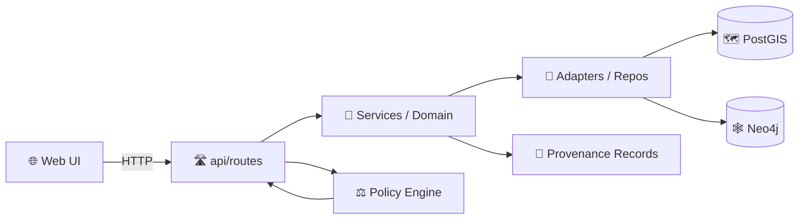

# 🛣️ `api/routes/` — FastAPI Routers (HTTP Surface Area)


> [!NOTE]
> This folder is the **public HTTP face** of the backend: route modules define **endpoints**, validate inputs, enforce **policy**, delegate to **service/domain layers**, and return responses. Keep routes thin and boring ✨.

---

## 📌 What lives here

This directory contains **router modules** (typically `APIRouter` per domain) that:
- define HTTP paths + verbs (`GET/POST/...`)
- apply **request/response schemas** (Pydantic)
- enforce **governance & access rules** (fail-closed)
- call the **service layer** (where “real work” lives)
- return **serialized**, policy-safe responses (often including provenance references)

> [!IMPORTANT]
> **No direct DB access from UI.** The “truth path” goes through the backend API: UI → API Routes → Services → Repositories/Adapters → Datastores.  
> Routes are one of the **guard rails** that keep KFM provenance-first and policy-governed 🧭

---

## 🗂️ Typical folder layout

> [!TIP]
> Names vary by domain, but the pattern is consistent: **one router per domain**.

```text
api/
└── routes/
    ├── README.md                👈 you are here
    ├── datasets.py              📦 dataset listing, metadata, access rules
    ├── features.py              🧩 feature/entity endpoints (geo + graph)
    ├── stories.py               📚 Story Nodes + narrative retrieval
    ├── search.py                🔎 text / embedding / hybrid search
    ├── ai.py                    🧠 Focus Mode / AI-assisted endpoints
    ├── health.py                ✅ liveness/readiness, version info
    └── __init__.py              (optional) export routers
```

---

## 🧠 Non‑negotiables (route authoring rules)

### 1) Routes are **thin controllers**
✅ Routes SHOULD:
- parse and validate inputs
- call services
- enforce policy checks / masking / redaction
- return stable response shapes (OpenAPI-friendly)

🚫 Routes SHOULD NOT:
- contain heavy business logic
- embed raw SQL / Cypher (put that in repositories/adapters)
- bypass policy checks “just for now”
- return sensitive fields unless policy explicitly allows

---

### 2) Governance is **fail‑closed**
If a policy check fails or is unavailable, the route should **deny** (or return a **sanitized** response) rather than “best-effort allow”.

Recommended behavior:
- unauthorized access → `403 Forbidden`
- unknown resource → `404 Not Found` (avoid leaking existence if sensitive)
- policy engine unavailable → `503 Service Unavailable` (or deny-by-default)

> [!WARNING]
> If you’re unsure whether a field is safe to return, **don’t return it**. Add provenance pointers and let authorized workflows resolve details.

---

### 3) Always attach provenance hooks (when returning data)
KFM is provenance-first. Routes should make it easy to trace “the map behind the map”.

Common ways to do this:
- include dataset identifiers and their metadata pointers (STAC/DCAT)
- include PROV lineage document references for derived outputs
- include policy decision context (non-sensitive) for auditability

Example response envelope (illustrative):
```json
{
  "data": [{ "id": "dataset_123", "name": "Historic Trails" }],
  "provenance": {
    "stac": "data/catalog/trails_historic.stac.json",
    "dcat": "data/catalog/trails_historic.dcat.json",
    "prov": "data/provenance/trails_historic.prov.json"
  },
  "policy": {
    "visibility": "public",
    "redactionsApplied": []
  }
}
```

---

## 🔌 How routers get wired into the app

There is usually a single “app composition” file (often `api/main.py`) that:
- creates the `FastAPI()` instance
- configures middleware (CORS, auth, etc.)
- wires routers with `include_router(...)`

Example (illustrative):
```python
from fastapi import FastAPI

from .routes import datasets, features, stories, search  # etc.

app = FastAPI(title="Kansas Frontier Matrix API")

# Option A: routers define their own prefixes
app.include_router(datasets.router)
app.include_router(features.router)

# Option B: app sets a global prefix (e.g., /api/v1) and routers use relative paths
# app.include_router(datasets.router, prefix="/api/v1")
```

> [!TIP]
> If hot reload is enabled (Uvicorn `--reload`), editing a file like `api/routes/datasets.py` should trigger an auto-restart during dev 🧯

---

## 🧭 API exploration (local dev)

Once the stack is running:
- Swagger / OpenAPI UI: **`http://localhost:8000/docs`**
- GraphQL (if enabled): **`http://localhost:8000/graphql`**

Common exploratory calls (examples — confirm in Swagger):
- `GET /datasets` (if present)
- `GET /features/{id}` (if present)
- `GET /search?q=...` (if present)

---

## 🧱 Route module template (recommended)

Use one router per domain file:

```python
from fastapi import APIRouter, Depends, HTTPException

router = APIRouter(
    prefix="/api/v1/datasets",   # or "/datasets" if version prefix is global
    tags=["datasets"],
)

@router.get("")
def list_datasets(limit: int = 50, offset: int = 0):
    """
    Return dataset metadata. Keep this handler thin:
    - validate inputs
    - check policy
    - delegate to service
    - return response
    """
    # policy.check_access(user, resource="dataset", action="read")
    # return services.datasets.list_datasets(limit=limit, offset=offset)
    raise HTTPException(status_code=501, detail="Not implemented")
```

### ✅ Checklist inside each handler
- [ ] validate params (bounds, types, geometry correctness)
- [ ] enforce policy (OPA/regos or equivalent)
- [ ] call service (domain logic + adapters)
- [ ] return stable schema (Pydantic response model when possible)
- [ ] include provenance pointers where appropriate
- [ ] add pagination (`limit/offset` or cursor), especially for lists
- [ ] avoid leaking sensitive existence via error messages

---

## 🧪 Testing expectations

At minimum:
- unit tests for parameter validation + policy gating
- contract tests ensuring response shape stability
- integration tests for “happy path” + “denied path” + “sanitized path”

Recommended “route done” definition:
- [ ] endpoint appears in `/docs`
- [ ] OpenAPI schema stable
- [ ] governance enforced + deny-by-default behavior verified
- [ ] provenance pointers included (when returning derived/curated data)
- [ ] tests + docs updated

---

## 📜 Contract-first changes (when you add/modify endpoints)

When changing the API surface:
- version endpoints predictably (`/api/v1`, `/api/v2`, or equivalent)
- document the change using the project’s API contract template (see `docs/templates/…API_CONTRACT…`)
- ensure the UI contract remains explicit and traceable

> [!IMPORTANT]
> Treat route changes as **public product changes**, not internal refactors.

---

## 🗺️ Architecture at a glance



---

## 🔗 See also

- `api/` (backend root) 📦
- `policy/` (governance rules) ⚖️
- `data/catalog/` (STAC/DCAT metadata) 🗃️
- `data/provenance/` (W3C PROV lineage) 📜
- `docs/architecture/` (system diagrams + contracts) 🧭