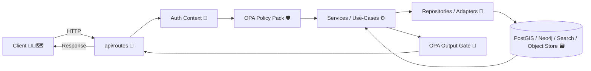

# 🧭 `api/routes/` — API Route Handlers (REST + GraphQL)


-85EA2D?logo=swagger&logoColor=black)


> [!NOTE]
> This folder is the **public HTTP entrypoint** into KFM: it defines the request/response surface area that *every* client consumes (web UI, scripts, external apps).
>
> ✅ Keep it **thin, typed, governed, observable, and testable**.  
> ❌ If it feels like “business logic,” it probably belongs in services/use-cases.

---

## 🧭 Quick Nav

- [🎯 What lives here](#-what-lives-here)
- [🔒 Core principle: the “Truth Path”](#-core-principle-the-truth-path)
- [🗂️ Suggested folder layout](#️-suggested-folder-layout)
- [🛣️ Routes by domain](#️-routes-by-domain)
- [🧱 Contracts: requests, responses, errors](#-contracts-requests-responses-errors)
- [🛡️ Governance & policy enforcement](#️-governance--policy-enforcement)
- [🤖 AI routes: evidence-first](#-ai-routes-evidence-first)
- [🧬 GraphQL rules of the road](#-graphql-rules-of-the-road)
- [🧪 Testing & Definition of Done](#-testing--definition-of-done)
- [🔍 Local developer sanity checks](#-local-developer-sanity-checks)
- [🧾 Appendix: endpoint examples](#-appendix-endpoint-examples)
- [📚 References](#-references)

---

## 🎯 What lives here

### ✅ In this folder
- Route modules grouped by **resource domain** (datasets, tiles, AI, ingest, catalog, query, etc.)
- **`APIRouter`** definitions + endpoint docstrings / summaries
- Request parsing + validation (**Pydantic models** / typed params)
- Dependency injection (auth context, DB session, policy decision hooks)
- HTTP concerns:
  - pagination / cursors
  - caching headers
  - streaming responses
  - status codes
  - content negotiation (`Accept`, `Content-Type`)

### 🚫 Not in this folder
- Heavy business logic (put it in **services/use-cases**)
- Direct raw DB access without a repository/service abstraction
- Hidden “backdoors” that bypass governance checks (**never**)

> [!TIP]
> Treat every route file like a **controller**: it should read like a contract + orchestration, not like an algorithm.

---

## 🔒 Core principle: the “Truth Path” 🗺️🧾

KFM is designed as a **layered pipeline** where clients **never** talk to databases directly.  
The API is the **single gate** where authentication, authorization, auditing, provenance, and policy checks are enforced.  
This preserves “the map behind the map”: every output stays traceable and reviewable.  [oai_citation:0‡Kansas Frontier Matrix (KFM) – Comprehensive Technical Blueprint.pdf](sediment://file_000000006dbc71f89a5094ce310a452d)

### 🧬 Request flow (high level)



**Why this matters**
- Routes are where we consistently apply: **RBAC**, sensitivity classification, and **fail-closed** enforcement.  [oai_citation:1‡Kansas Frontier Matrix Comprehensive System Documentation.pdf](sediment://file_00000000ef40722faf17987b69730695)
- Provenance and audit trails are first-class: routes must emit and/or attach identifiers that let us reproduce and investigate outputs later.  [oai_citation:2‡Kansas Frontier Matrix Comprehensive System Documentation.pdf](sediment://file_00000000ef40722faf17987b69730695)

---

## 🗂️ Suggested folder layout

> [!TIP]
> Keep filenames **noun-based** (domain), and expose a single `router` per module (plus optional internal helpers).

```text
api/
  routes/
    README.md                 🧭 you are here
    __init__.py               📦 router registry / exports
    health.py                 🩺 /healthz, /readyz, /version
    datasets.py               🗃️ /api/v1/datasets/...
    catalog.py                🧾 /api/v1/catalog/...
    query.py                  🔎 /api/v1/query (safe/allowlisted)
    tiles.py                  🧱 /tiles/{layer}/{z}/{x}/{y}.(pbf|png|webp)
    ai.py                     🤖 /api/v1/ai/...
    ingest.py                 🏭 /api/v1/ingest/...
    graphql.py                🧬 /graphql (schema-backed)
```

> [!NOTE]
> In KFM’s architecture, routers orchestrate validation + service calls + policy checks, keeping logic centralized and consistent.  [oai_citation:3‡Kansas Frontier Matrix (KFM) – Comprehensive Technical Blueprint.pdf](sediment://file_000000006dbc71f89a5094ce310a452d)

---

## 🛣️ Routes by domain

> [!IMPORTANT]
> Paths are versioned for REST (`/api/v1/...`). Some infrastructural routes may be unversioned (e.g., `/tiles/...`, `/graphql`).  [oai_citation:4‡Kansas Frontier Matrix Comprehensive System Documentation.pdf](sediment://file_00000000ef40722faf17987b69730695)

| Module | Base path(s) | Purpose | Notes |
|---|---|---|---|
| `health.py` 🩺 | `/healthz`, `/readyz`, `/version` | Liveness/readiness/version checks | No auth; minimal logic |
| `datasets.py` 🗃️ | `/api/v1/datasets` | Dataset metadata + data access | Metadata includes DCAT summaries + links (STAC assets). [oai_citation:5‡Kansas Frontier Matrix Comprehensive System Documentation.pdf](sediment://file_00000000ef40722faf17987b69730695) |
| `catalog.py` 🧾 | `/api/v1/catalog` | Discovery/search | Keyword + bbox + time queries. [oai_citation:6‡Kansas Frontier Matrix Comprehensive System Documentation.pdf](sediment://file_00000000ef40722faf17987b69730695) |
| `query.py` 🔎 | `/api/v1/query` | **Constrained** ad-hoc querying | Allowlisted, validated, logged. No raw DB access for clients. [oai_citation:7‡Kansas Frontier Matrix Comprehensive System Documentation.pdf](sediment://file_00000000ef40722faf17987b69730695) |
| `tiles.py` 🧱 | `/tiles` | Vector/raster tiles for map clients | `.pbf` + `.png/.webp` endpoints. [oai_citation:8‡Kansas Frontier Matrix Comprehensive System Documentation.pdf](sediment://file_00000000ef40722faf17987b69730695) |
| `ai.py` 🤖 | `/api/v1/ai` | Focus Mode query, streaming, suggestions | Answers are citation-backed; also supports streaming.  [oai_citation:9‡Kansas Frontier Matrix Comprehensive System Documentation.pdf](sediment://file_00000000ef40722faf17987b69730695) |
| `ingest.py` 🏭 | `/api/v1/ingest` | Admin-only pipeline triggers + status | Locked down to authorized roles. [oai_citation:10‡Kansas Frontier Matrix Comprehensive System Documentation.pdf](sediment://file_00000000ef40722faf17987b69730695) |
| `graphql.py` 🧬 | `/graphql` | GraphQL endpoint | Secured like REST; apply query depth/cost limits.  [oai_citation:11‡Kansas Frontier Matrix Comprehensive System Documentation.pdf](sediment://file_00000000ef40722faf17987b69730695) |

---

## 🧱 Contracts: requests, responses, errors

### ✅ Contract mindset (non-negotiable)
Routes are not “just endpoints.” They are **public contracts**:
- **Stable**: breaking changes require versioning or a deprecation plan
- **Typed**: both request and response shapes are explicit
- **Governed**: every response is policy-compliant
- **Auditable**: every request can be traced (request-id) and reproduced (provenance ids)

> [!TIP]
> If `/docs` is confusing, the API is confusing.

---

### 📌 Standard headers (recommended)
- `X-Request-Id`: required in logs + returned in errors
- `Traceparent` / tracing headers: if you use OpenTelemetry
- `Cache-Control` + `ETag`: for cacheable resources
- `Content-Security-Policy`: (UI-side) not set here, but don’t break it

---

### ✅ JSON responses (default)
- Prefer consistent pagination fields across list endpoints:
  - `limit`, `offset` **or** `cursor`
  - `total` (when feasible)
  - `next` (cursor URL/token)

**Example (cursor-based)**
```json
{
  "items": [],
  "cursor": "eyJvZmZzZXQiOjEwMDB9",
  "next": "/api/v1/catalog/search?cursor=eyJvZmZzZXQiOjEwMDB9"
}
```

---

### 🧱 Binary responses (tiles)
- Vector tiles: `.pbf` (MVT)
- Raster tiles: `.png` / `.webp`
- Caching is intentional:
  - public base layers → `public, max-age=...`
  - sensitive layers → `private, no-store` (or short-lived + auth-bound)

KFM’s tile route pattern is standardized for external map clients (MapLibre, OpenLayers, etc.).  [oai_citation:12‡Kansas Frontier Matrix Comprehensive System Documentation.pdf](sediment://file_00000000ef40722faf17987b69730695)

---

### ❌ Error responses (standardize globally)

Pick one **system-wide** error shape and do it everywhere.

✅ Recommended: **RFC 7807** (`application/problem+json`) + stable `code`

```json
{
  "type": "https://kfm.dev/problems/policy-denied",
  "title": "Forbidden",
  "status": 403,
  "detail": "You do not have access to this dataset.",
  "code": "POLICY_DENY",
  "request_id": "01HP…",
  "instance": "/api/v1/datasets/ks_hydrology_1880"
}
```

**Rules**
- HTTP status matches semantics (400/401/403/404/409/422/429/500)
- `code` is stable for clients and analytics
- `request_id` is always present
- Never leak secrets (SQL, internal URLs, stack traces)

---

## 🛡️ Governance & policy enforcement (OPA) 🔐

KFM follows a **fail-closed** philosophy:
- If metadata is missing, policy fails, or access is unclear → **block** by default.  [oai_citation:13‡Kansas Frontier Matrix Comprehensive System Documentation.pdf](sediment://file_00000000ef40722faf17987b69730695)
- Every request is authenticated and checked against:
  - user role / scope
  - dataset sensitivity classification
  - endpoint permissions
  - auditing rules
  - data governance flags (FAIR + CARE when applicable)  [oai_citation:14‡Kansas Frontier Matrix Comprehensive System Documentation.pdf](sediment://file_00000000ef40722faf17987b69730695)

### Practical implications for route authors
- Never “return it anyway” because it’s convenient.
- Prefer **policy-driven shaping**:
  - deny (403)
  - sanitize/mask (200 with redactions)
  - aggregate (coarser resolution)

> [!IMPORTANT]
> Policies are enforced at runtime **and** are also executed in CI gates to prevent unsafe merges and deployments.  [oai_citation:15‡Kansas Frontier Matrix Comprehensive System Documentation.pdf](sediment://file_00000000ef40722faf17987b69730695)

---

## 🧾 Provenance & audit are part of the API contract

Routes must support:
- **Provenance IDs** for datasets/exports
- **Audit-friendly logs** (append-only where required)
- **Reproducibility**: record enough context to replay/verify results later

KFM treats provenance as mandatory: if a dataset lacks provenance metadata, it’s effectively “not publishable.”  [oai_citation:16‡Kansas Frontier Matrix Comprehensive System Documentation.pdf](sediment://file_00000000ef40722faf17987b69730695)

---

## 🔎 `query.py` — safe ad-hoc querying (allowlisted)

KFM supports a constrained SQL-like interface at `GET /api/v1/query` for power users, while still preventing direct DB access. It validates allowlisted tables/views, applies row/column permissions, and logs requests.  [oai_citation:17‡Kansas Frontier Matrix Comprehensive System Documentation.pdf](sediment://file_00000000ef40722faf17987b69730695)

### Guardrails checklist ✅
- [ ] allowlisted table/view names only
- [ ] allowlisted column projection (`select=`) only
- [ ] bounded bbox + limit defaults
- [ ] deny dangerous operators / functions
- [ ] policy decision recorded (permit/deny/sanitize)
- [ ] query auditing + rate limiting

> [!TIP]
> Make “advanced mode” safe by design: assume adversarial inputs.

---

## 🧾 `datasets.py` + `catalog.py` — metadata-first access

- `GET /api/v1/datasets/{id}` returns dataset metadata (DCAT summary) + links to assets (STAC items, etc.).  [oai_citation:18‡Kansas Frontier Matrix Comprehensive System Documentation.pdf](sediment://file_00000000ef40722faf17987b69730695)
- `GET /api/v1/catalog/search` supports keyword + bbox + time-range discovery.  [oai_citation:19‡Kansas Frontier Matrix Comprehensive System Documentation.pdf](sediment://file_00000000ef40722faf17987b69730695)
- `GET /api/v1/datasets/{id}/data?format=...&bbox=...` can stream features (and must enforce policy + performance ceilings).  [oai_citation:20‡Kansas Frontier Matrix Comprehensive System Documentation.pdf](sediment://file_00000000ef40722faf17987b69730695)

### Metadata rules ✅
- Don’t return “mystery data”
- Always include:
  - license
  - sensitivity classification
  - provenance reference(s)
  - citations/links when the data is derived

---

## 🧱 `tiles.py` — map delivery (fast + predictable)

### Tile endpoints
```text
GET /tiles/{layer}/{z}/{x}/{y}.pbf
GET /tiles/{layer}/{z}/{x}/{y}.png
GET /tiles/{layer}/{z}/{x}/{y}.webp
```
These routes enable external clients to “drink from the same well” (web, 3D, mobile).  [oai_citation:21‡Kansas Frontier Matrix Comprehensive System Documentation.pdf](sediment://file_00000000ef40722faf17987b69730695)

### Tile author rules ✅
- [ ] Validate `z/x/y` and `layer`
- [ ] Enforce policy per layer (public vs restricted)
- [ ] Choose caching explicitly (ETag + Cache-Control)
- [ ] Use consistent content-type (`application/x-protobuf`, `image/png`, `image/webp`)
- [ ] Never leak sensitive geometry (apply aggregation/generalization when required)

---

## 🤖 AI routes: evidence-first 📚

KFM’s AI endpoints are designed around: **No Source → No Answer**.  
AI answers must be grounded in approved sources and include citations; otherwise respond with “insufficient evidence.”  [oai_citation:22‡Kansas Frontier Matrix Comprehensive System Documentation.pdf](sediment://file_00000000ef40722faf17987b69730695)

### Required AI safety gates (KFM pattern)
- **Prompt Gate (input filtering & sanitization)** before any prompt reaches the model:
  - neutralize injection attempts
  - filter disallowed requests
  - ensure safe, policy-compliant input payloads  [oai_citation:23‡Kansas Frontier Matrix Comprehensive System Documentation.pdf](sediment://file_00000000ef40722faf17987b69730695)
- **AI sandbox / least privilege**
  - no internet, no filesystem, no tools by default
  - explicit allowlist if tools are ever introduced  [oai_citation:24‡Kansas Frontier Matrix Comprehensive System Documentation.pdf](sediment://file_00000000ef40722faf17987b69730695)
- **OPA output filtering**
  - model output is evaluated before release to user (compliance + sensitive data protections)  [oai_citation:25‡Kansas Frontier Matrix Comprehensive System Documentation.pdf](sediment://file_00000000ef40722faf17987b69730695)

### Suggested AI endpoints
- `POST /api/v1/ai/query` → answer + citations  
- `GET /api/v1/ai/stream` → streaming tokens for chat UX  
- `GET /api/v1/ai/suggestions` → contextual prompts / next steps  
All are subject to the same governance rules as the rest of the API.  [oai_citation:26‡Kansas Frontier Matrix Comprehensive System Documentation.pdf](sediment://file_00000000ef40722faf17987b69730695)

> [!IMPORTANT]
> AI routes must be **more** strict than normal routes: they can synthesize, so the burden of evidence and redaction is higher.

---

## 🧬 GraphQL rules of the road

GraphQL exists to support **relationship-rich** queries (places ↔ datasets ↔ events ↔ stories) in a single request, while REST remains the best fit for simple, common operations.  [oai_citation:27‡Kansas Frontier Matrix Comprehensive System Documentation.pdf](sediment://file_00000000ef40722faf17987b69730695)

### Minimum GraphQL protections ✅
- [ ] Auth + OPA policy checks identical to REST
- [ ] Depth / cost limits to prevent abuse  [oai_citation:28‡Kansas Frontier Matrix Comprehensive System Documentation.pdf](sediment://file_00000000ef40722faf17987b69730695)
- [ ] Disable or restrict introspection in production if needed (or gate by role)
- [ ] Persisted queries for public clients (optional but recommended)
- [ ] Strong schema discipline: resolvers call the **same service layer** as REST (no duplicated logic)  [oai_citation:29‡Kansas Frontier Matrix (KFM) – Comprehensive Technical Blueprint.pdf](sediment://file_000000006dbc71f89a5094ce310a452d)

---

## 🏭 Ingest routes are privileged operations

Endpoints that trigger pipelines or ingestion (e.g., `POST /api/v1/ingest/runPipeline`) are:
- admin/maintainer only
- audited
- strongly validated (no arbitrary command execution)
- idempotent or safely retryable where possible

KFM explicitly describes these as locked down, role-protected operations.  [oai_citation:30‡Kansas Frontier Matrix Comprehensive System Documentation.pdf](sediment://file_00000000ef40722faf17987b69730695)

---

## 🧠 Data sovereignty, privacy, and sensitive geographies (FAIR + CARE)

KFM applies **FAIR + CARE** principles in the governance model, especially for Indigenous and sensitive contexts.  [oai_citation:31‡Kansas Frontier Matrix Comprehensive System Documentation.pdf](sediment://file_00000000ef40722faf17987b69730695)

**Route-level implications**
- Use redaction patterns like:
  - coordinate rounding/generalization
  - county-level aggregation instead of exact locations
  - suppression thresholds for small populations or re-identification risks  [oai_citation:32‡Kansas Frontier Matrix Comprehensive System Documentation.pdf](sediment://file_00000000ef40722faf17987b69730695)
- Support governance tags in metadata:
  - `public`, `internal`, `sensitive`, `restricted`
- Expect culturally sensitive constraints (e.g., don’t emit precise site coordinates if policy forbids it)

CARE principles emphasize **collective benefit, authority to control, responsibility, and ethics** as a necessary complement to “open data” defaults.  [oai_citation:33‡Indigenous Statistics.pdf](sediment://file_0000000033ec72308e1f791a79f61bfe)

---

## 🧩 Route module template (production-ready pattern)

```python
# api/routes/datasets.py
from __future__ import annotations

from fastapi import APIRouter, Depends, Path
from pydantic import BaseModel, Field

router = APIRouter(
    prefix="/api/v1/datasets",
    tags=["datasets"],
)

class DatasetSummary(BaseModel):
    id: str = Field(..., examples=["ks_hydrology_1880"])
    title: str
    description: str | None = None
    license: str | None = None
    sensitivity: str = "public"  # e.g., public|internal|sensitive|restricted
    provenance_id: str | None = None

@router.get(
    "/{dataset_id}",
    response_model=DatasetSummary,
    summary="Get dataset metadata",
)
async def get_dataset(
    dataset_id: str = Path(..., min_length=3),
    # ctx = Depends(get_request_context),
    # policy = Depends(enforce_policy),  # OPA decision
    # svc = Depends(get_dataset_service),
):
    # ✅ validate inputs (typed)
    # ✅ call service layer (no heavy logic here)
    # ✅ enforce policy (deny/sanitize)
    # ✅ include provenance/citations when relevant
    return DatasetSummary(
        id=dataset_id,
        title="Example",
        description=None,
        license="CC-BY-4.0",
        sensitivity="public",
        provenance_id="prov:abc123",
    )
```

> [!TIP]
> Routes should read as: **validate → policy → service → shape → return**.

---

## ✅ Adding a new route (checklist)

### 🧱 Build the module
- [ ] Create `api/routes/<domain>.py`
- [ ] Define `router = APIRouter(prefix="...", tags=[...])`
- [ ] Add endpoints with:
  - [ ] typed inputs + constraints (min/max, regex, enums)
  - [ ] typed outputs (`response_model=...`)
  - [ ] policy enforcement hook(s) (OPA)
  - [ ] provenance/citation fields where applicable

### 📦 Register the router
- [ ] Register in `api/routes/__init__.py` (router registry) or `api/main.py`

### 🛡️ Security + governance
- [ ] Verify **fail-closed** behavior for missing metadata / unclear access  [oai_citation:34‡Kansas Frontier Matrix Comprehensive System Documentation.pdf](sediment://file_00000000ef40722faf17987b69730695)
- [ ] Ensure sensitive outputs are aggregated/redacted when required  [oai_citation:35‡Kansas Frontier Matrix Comprehensive System Documentation.pdf](sediment://file_00000000ef40722faf17987b69730695)

### 🧪 Tests (must-have)
- [ ] happy path
- [ ] unauthorized / forbidden path
- [ ] policy deny + policy sanitize behaviors
- [ ] pagination edge cases (limit/offset/cursor)
- [ ] rate limit behavior (if applicable)

### 📖 Docs (contract clarity)
- [ ] OpenAPI tags, summaries, parameter descriptions, examples
- [ ] GraphQL schema updated (if used) and resolvers call service layer

---

## 🧪 Testing & Definition of Done

### ✅ Definition of Done (routes)
A route is “done” when:
- [ ] It is typed (inputs + outputs)
- [ ] It is documented (OpenAPI/GraphQL)
- [ ] It is governed (OPA decisions + fail-closed)
- [ ] It is observable (request-id, structured logs)
- [ ] It is test-covered (auth + policy + correctness)
- [ ] It doesn’t bypass the service layer

---

## 🔍 Local developer sanity checks

- Swagger/OpenAPI UI: `/docs`
- OpenAPI JSON: `/openapi.json`
- GraphQL endpoint: `/graphql`

> [!TIP]
> Treat OpenAPI as a **contract**: if it’s confusing in `/docs`, it’s confusing for users.

---

## 🧾 Appendix: endpoint examples (alignment)

```text
GET  /api/v1/datasets/{id}
GET  /api/v1/catalog/search?bbox=...&q=...&time=...
GET  /api/v1/datasets/{id}/data?format=geojson&bbox=...

GET  /api/v1/query?table=...&select=...&where=...&bbox=...

GET  /tiles/{layer}/{z}/{x}/{y}.pbf
GET  /tiles/{layer}/{z}/{x}/{y}.png
GET  /tiles/{layer}/{z}/{x}/{y}.webp

POST /api/v1/ai/query
GET  /api/v1/ai/suggestions
GET  /api/v1/ai/stream

POST /api/v1/ingest/runPipeline
```

---

## 📚 References

### 🧩 KFM architecture + governance (project docs)
- Kansas Frontier Matrix — Comprehensive System Documentation  [oai_citation:36‡Kansas Frontier Matrix Comprehensive System Documentation.pdf](sediment://file_00000000ef40722faf17987b69730695)  [oai_citation:37‡Kansas Frontier Matrix Comprehensive System Documentation.pdf](sediment://file_00000000ef40722faf17987b69730695)  
- Kansas Frontier Matrix — Comprehensive Technical Blueprint  [oai_citation:38‡Kansas Frontier Matrix (KFM) – Comprehensive Technical Blueprint.pdf](sediment://file_000000006dbc71f89a5094ce310a452d)  

### 🪶 Data sovereignty + CARE principles (for sensitive & Indigenous data)
- Indigenous Statistics (2nd ed., 2025)  [oai_citation:39‡Indigenous Statistics.pdf](sediment://file_0000000033ec72308e1f791a79f61bfe)  [oai_citation:40‡Indigenous Statistics.pdf](sediment://file_0000000033ec72308e1f791a79f61bfe)  

### 🎨 Documentation clarity + UX patterns (readability matters)
- Professional Web Design: Techniques and Templates (5th ed.)  [oai_citation:41‡professional-web-design-techniques-and-templates.pdf](sediment://file_000000000acc71f8b2e5128c030179fc)  
- Learn to Code HTML & CSS (for clean structure & semantics)  [oai_citation:42‡learn-to-code-html-and-css-develop-and-style-websites.pdf](sediment://file_00000000ed6471fdb0ecead71e051444)  

### ⚙️ Runtime + streaming mental models (useful for AI/tiles)
- Node.js (foundations & event loop concepts)  [oai_citation:43‡Node.js-React-CSS-HTML.pdf](sediment://file_00000000b09c71f8b277cb19b9f597b2)  

### 🏥 AI risk context (why “evidence-first” is not optional)
- AI & Machine Learning in Health Care & Medical Sciences  [oai_citation:44‡Artificial Intelligence & Machine Learning in Health Care & Medical Sciences.pdf](sediment://file_0000000036fc71fda445161776f735db)  

---