# 🧭 `api/routes/` — FastAPI Router Modules

[](#)
[](#)
[](#)
[](#)

> **According to a document uploaded on 2026-01-28**, KFM is designed as a **pipeline → catalog → database → API → UI** system where the **UI never touches databases directly**; access is mediated through the backend API with validation + governance baked in. ✅📜

---

## 🎯 What lives here?

This folder is the **HTTP contract surface** for the backend:

- Each file in `api/routes/` is a **router module** (domain-scoped endpoints)
- Routers should be **thin**:
  - ✅ parse + validate input
  - ✅ call the **service layer**
  - ✅ shape responses + errors
  - ✅ enforce **policy + provenance hooks**
  - ❌ avoid heavy business logic or data-wrangling

Common router modules mentioned in the blueprint include examples like:

- `api/routes/datasets.py`
- `api/routes/stories.py`

> [!IMPORTANT]
> **API boundary rule:** the frontend must not query Neo4j / PostGIS directly. Treat `api/routes/` as the *single governed gate* into data, with access controls + redaction + schema consistency enforced here. 🛡️

---

## 🧱 Where `api/routes/` sits in the KFM flow

### Request flow (runtime)

```mermaid
flowchart LR
  UI[🖥️ Web UI] -->|HTTP| R[🧭 api/routes/*]
  R -->|calls| S[🧠 Services]
  S -->|uses| A[🔌 Adapters / Repos]
  A --> PG[(🗺️ PostGIS)]
  A --> N4J[(🕸️ Neo4j)]
  R -->|returns| UI
```



### Data lifecycle (build-time → publish-time)

```mermaid
flowchart LR
  RAW[📦 Raw] --> ETL[⚙️ ETL]
  ETL --> CAT[🗂️ Catalogs: STAC/DCAT/PROV]
  CAT --> GRAPH[🕸️ Graph]
  GRAPH --> API[🧭 API]
  API --> UI[🖥️ UI]
  UI --> STORY[📚 Story Nodes]
  STORY --> FOCUS[🧠 Focus Mode]
```



> [!NOTE]
> Some v13 docs refer to the governed API layer as `src/server/`. If/when we migrate folders, the **same router principles** in this README still apply (thin routers, contract-first, policy-first). 🔁

---

## 🧩 Router module conventions

### ✅ Keep routers “thin”
A route function should generally do:

1. **Validate input** (FastAPI annotations + Pydantic models)
2. **Resolve dependencies** (DB session, user context, policy engine)
3. **Call a service** (the only place where “work” happens)
4. **Return a typed response** (Pydantic output models / streaming tiles)

### 🏷️ Tagging + prefixes
Prefer:

- One router per domain (`datasets`, `stories`, `search`, `tiles`, `ai`, etc.)
- A clear `prefix="/datasets"` and `tags=["datasets"]`
- Explicit response models (so Swagger/OpenAPI stays clean)

### 🧭 REST + GraphQL (optional)
- REST endpoints live here
- GraphQL may be mounted at `/graphql` (if enabled), but should reuse the same service logic (no duplicate business logic)

---

## 🌐 Example endpoints (as referenced in project docs)

These are *representative* examples from the KFM docs—your local build may have more/less depending on what’s implemented:

- Swagger UI (OpenAPI): `http://localhost:8000/docs`
- `GET /datasets` — list available datasets
- `GET /features/{id}` — fetch a feature/entity by ID
- `GET /search?q=railroad` — full-text-ish search
- `/graphql` — GraphQL interface (if enabled)

### 🗺️ Tiles example
For map layers, the UI may request a tile endpoint like:

- `/api/tiles/historic_trails/{z}/{x}/{y}.pbf` (vector tiles)

> [!TIP]
> For large geometries, prefer **vector tiles** or **paginated GeoJSON** to avoid multi-megabyte payloads that punish browsers.

---

## 🧬 Governance + provenance hooks (non-negotiable)

KFM is designed to **fail closed**: if a policy check is missing/uncertain, routes should default to denying access rather than “best effort.” 🔒

Common enforcement patterns at the route layer:

- **Policy check before returning sensitive data**
  - e.g., `policy.check_access(user, dataset_id)` before any query/return
- **AI endpoints are governed**
  - ensure the question is allowed
  - log the request/decision for provenance
- **OPA-style runtime decisions (if configured)**
  - routes call policy engine for “allow/deny/redact” decisions
  - route applies the decision (403, masked geometry, generalized coords, etc.)

> [!WARNING]
> **Sovereignty + classification propagation:** output artifacts must not become *less restricted than inputs*. If an upstream dataset is restricted, routes must enforce redaction/withholding unless explicitly authorized.

---

## 🧰 Router template (copy/paste starter)

<details>
<summary>📄 Minimal FastAPI router skeleton</summary>

```python
from fastapi import APIRouter, Depends, HTTPException
from pydantic import BaseModel
from typing import List, Optional

router = APIRouter(
    prefix="/datasets",
    tags=["datasets"],
)

# --- Models (request/response) ---

class DatasetOut(BaseModel):
    id: str
    title: str
    description: Optional[str] = None

# --- Dependencies (examples) ---

def get_db_session():
    """Provide a DB session (SQLAlchemy or equivalent)."""
    raise NotImplementedError

def get_current_user():
    """Resolve current user + roles/claims."""
    raise NotImplementedError

def check_access(user, dataset_id: str) -> None:
    """Centralized policy check; raises if unauthorized."""
    raise NotImplementedError

# --- Endpoints ---

@router.get("", response_model=List[DatasetOut])
def list_datasets(
    db=Depends(get_db_session),
    user=Depends(get_current_user),
):
    # NOTE: keep routers thin — call service layer here
    # e.g., return dataset_service.list_datasets(db=db, user=user)
    return []

@router.get("/{dataset_id}", response_model=DatasetOut)
def get_dataset(
    dataset_id: str,
    db=Depends(get_db_session),
    user=Depends(get_current_user),
):
    check_access(user, dataset_id)

    # dataset = dataset_service.get_dataset(db=db, dataset_id=dataset_id)
    dataset = None

    if dataset is None:
        raise HTTPException(status_code=404, detail="Dataset not found")

    return dataset
```

</details>

---

## ➕ Adding a new route module

1. **Create a module**
   - `api/routes/<domain>.py`
2. **Define**
   - `router = APIRouter(prefix="/<domain>", tags=["<domain>"])`
3. **Add contracts**
   - Pydantic models for request/response
4. **Wire dependencies**
   - DB session / user / policy engine
5. **Call services**
   - do not place business rules in routes
6. **Register the router**
   - in `api/main.py` (or equivalent):
     - `app.include_router(<domain>.router)`
7. **Add tests**
   - route tests + contract checks

---

## ✅ Definition of done for a route

Use this as a PR checklist:

- [ ] **Contract-first:** endpoint shape is explicit (OpenAPI + typed models) and changes are versioned/compatible
- [ ] **Validation is deterministic:** inputs are validated; errors are consistent
- [ ] **Policy enforced:** access checks happen *before* data is returned (fail closed)
- [ ] **Provenance logged:** actions (especially AI/derived results) are auditable
- [ ] **Tests updated:** route + contract tests updated; CI should block regressions
- [ ] **No bypassing the pipeline:** endpoint serves governed outputs, not raw/unvetted artifacts

---

## 🧪 Testing & contract checks

KFM guidance emphasizes **contract tests** and **security/governance scans** as CI gates:

- Ensure each endpoint responds as expected to known inputs
- Lint OpenAPI / GraphQL schemas for completeness
- Scan for secrets / sensitive content / classification consistency
- Block merges on failures (fail closed)

---

## 🔍 Local exploration

When running locally, docs reference exploring the API via Swagger UI:

- `http://localhost:8000/docs`

Use it to try endpoints (e.g., `GET /datasets`, `GET /features/{id}`) and confirm request/response models match expectations.

---

## 📚 Sources (project files grounding)

<details>
<summary>📌 Click to expand citations</summary>

- KFM described as **pipeline–catalog–database–API–UI**, and **UI never directly touches databases**; governance enforced via backend API.  
   [oai_citation:0‡Kansas Frontier Matrix (KFM) – Comprehensive Technical Blueprint.pdf](sediment://file_000000006dbc71f89a5094ce310a452d)

- Canonical pipeline ordering (Raw → Processed → Catalog/Prov → Database → API → UI).  
   [oai_citation:1‡Kansas Frontier Matrix (KFM) – Comprehensive Technical Blueprint.pdf](sediment://file_000000006dbc71f89a5094ce310a452d)

- FastAPI router modules in `api/routes/*` (e.g., `datasets.py`, `stories.py`), responsibilities (parse/validate via Pydantic, call services, DI for DB session, governance checks like `policy.check_access`, AI query endpoint logs provenance).  
   [oai_citation:2‡Kansas Frontier Matrix (KFM) – Comprehensive Technical Blueprint.pdf](sediment://file_000000006dbc71f89a5094ce310a452d)

- Swagger UI at `http://localhost:8000/docs` and example endpoints (`/datasets`, `/features/{id}`, `/search`, `/graphql`) + sample GraphQL query.  
   [oai_citation:3‡Kansas Frontier Matrix (KFM) – Comprehensive Technical Blueprint.pdf](sediment://file_000000006dbc71f89a5094ce310a452d)

- Tile endpoint example `/api/tiles/historic_trails/{z}/{x}/{y}.pbf` and mapping behavior context.  
   [oai_citation:4‡Kansas Frontier Matrix (KFM) – Comprehensive Technical Blueprint.pdf](sediment://file_000000006dbc71f89a5094ce310a452d)

- Contract-first principle + deterministic pipeline principle (schemas/contracts as first-class artifacts).  
   [oai_citation:5‡MARKDOWN_GUIDE_v13.md.gdoc](file-service://file-UYVruFXfueR8veHMUKeugU)

- Key invariants: pipeline ordering is inviolable; API boundary rule; provenance-first; sovereignty/classification propagation.  
   [oai_citation:6‡MARKDOWN_GUIDE_v13.md.gdoc](file-service://file-UYVruFXfueR8veHMUKeugU)

- CI expectations: API contract tests + security/governance scans.  
   [oai_citation:7‡MARKDOWN_GUIDE_v13.md.gdoc](file-service://file-UYVruFXfueR8veHMUKeugU)

- Runtime policy enforcement concept (OPA engine / allow-deny decisions; policy as source of truth).  
   [oai_citation:8‡Kansas Frontier Matrix (KFM) – Comprehensive Technical Blueprint.pdf](sediment://file_000000006dbc71f89a5094ce310a452d)

</details>
