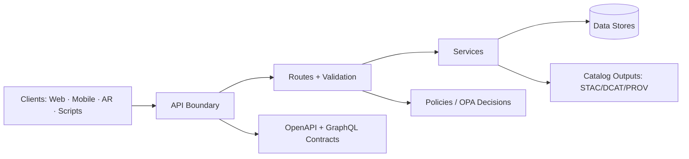

# 🧩 API Schemas (Contracts) — `api/schemas/`

Welcome to the **contract boundary** for the Kansas Frontier Matrix API.  
This folder exists to keep **request/response models** and **cross-cutting envelopes** (errors, pagination, policy decisions, provenance references) consistent across:

- 🌐 **REST** endpoints (FastAPI → OpenAPI/Swagger)
- 🧠 **GraphQL** interface (optional, for relationship-heavy queries)
- 🧰 Tooling (contract tests, schema validation, docs generation, SDK/codegen if added later)

---

## 🎯 Why this matters

KFM routes *all* access through the API boundary so we can enforce:

- ✅ validation (inputs + outputs)
- 🔐 authN/authZ + governance checks
- 🧾 auditing + provenance logging
- 🧼 safe “fail-closed” behavior for sensitive data

In other words: **schemas are not “nice-to-have docs” — they’re guardrails.** 🛡️

---

## 🗂️ What belongs in `api/schemas/`

Think **“API contracts”**, not “data catalogs”.

### ✅ Belongs here
- 📦 **Request/response models** for REST routes (`/api/v1/...`)
- 🧷 **Shared objects** reused across routes:
  - pagination, sorting, filters, bbox/time range inputs
  - error envelopes + validation error formats
  - policy decision surfaces (deny/sanitize metadata)
  - provenance references (IDs/links to PROV bundles)
- 🧠 **GraphQL schema** (if enabled): types, inputs, payloads, errors
- 🧪 **Examples** for tricky payloads (especially geospatial + search)

### 🚫 Does NOT belong here
- 🗺️ **STAC/DCAT/PROV profile schemas** → those are *data catalog standards* and live in the repo’s top-level `schemas/` area (project-wide validation).
- 📁 **Actual catalog outputs**:
  - STAC collections/items under `data/stac/...`
  - DCAT JSON-LD under `data/catalog/dcat/...`
  - PROV bundles under `data/prov/...` (or `data/provenance/...`, depending on layout)
- 🔒 **OPA/Rego policy source** → lives under `policy/` (this folder may define the *shape* of decision objects surfaced by the API)

---

## 🧬 Schema families in KFM

### 1) 🌐 REST (FastAPI / OpenAPI)
- **Source of truth** is typically **Pydantic models** used by route handlers.
- OpenAPI is generated and served at runtime (`/openapi.json`) and interactive docs at (`/docs`).
- REST is **versioned**: `/api/v1/...`

**Contract rule:** if a change isn’t backward-compatible, don’t “wing it” — version it. 🧯

---

### 2) 🧠 GraphQL (optional)
GraphQL is ideal for nested relationship queries (places ↔ datasets ↔ events ↔ stories).  
If enabled, keep GraphQL types aligned with REST resources (don’t duplicate business logic).

**Contract rule:** GraphQL schema changes must ship with updated examples + contract tests.

---

### 3) 🧾 Governance + Provenance surfaces
Even when the underlying data models evolve, these objects should stay stable:

- 🔐 `PolicyDecision` (allow/deny/sanitize + “why”)
- 🧾 `ProvenanceRef` (how to locate lineage for a dataset/asset)
- 🚨 `ErrorEnvelope` (uniform error contract across REST + GraphQL)

---

## 🏗️ Recommended directory layout

> This is the **intended shape** of the folder. Adjust to match the actual codebase, but keep the intent: *shared primitives → domain contracts → examples*. ✅

```text
📁 api/
  ├─ 📁 schemas/
  │  ├─ 📄 README.md
  │  ├─ 📁 common/                 # shared building blocks
  │  │  ├─ 📄 errors.py
  │  │  ├─ 📄 pagination.py
  │  │  ├─ 📄 filters.py
  │  │  ├─ 📄 policy.py
  │  │  └─ 📄 provenance.py
  │  ├─ 📁 rest/                   # REST request/response contracts
  │  │  ├─ 📄 datasets.py
  │  │  ├─ 📄 catalog.py
  │  │  ├─ 📄 query.py
  │  │  └─ 📄 tiles.py
  │  ├─ 📁 graphql/                # GraphQL contracts (if enabled)
  │  │  ├─ 📄 schema.graphql
  │  │  └─ 📄 resolvers.md
  │  └─ 📁 examples/               # canonical payload examples
  │     ├─ 📄 dataset.json
  │     ├─ 📄 catalog_search.json
  │     ├─ 📄 adhoc_query.json
  │     └─ 📄 tilejson.json
```

---

## 🧭 How schemas map to KFM features

Below are **high-value endpoints** that should always have clear contracts + examples:

### 📚 Data Catalog & Datasets
- `GET /api/v1/datasets/{id}` → dataset metadata summary + links to STAC assets
- `GET /api/v1/catalog/search` → keyword + bbox + time range search
- `GET /api/v1/datasets/{id}/data?format=geojson&bbox=...` → streaming/export shape (GeoJSON, etc.)

✅ **Schema focus:**
- `DatasetSummary`
- `DatasetAssetLink` (STAC reference)
- `CatalogSearchRequest` / `CatalogSearchResponse`

---

### 🧮 Ad‑hoc Spatial Query (Safe SQL interface)
- `GET /api/v1/query?table=...&select=...&where=...&bbox=...`

✅ **Schema focus (strict):**
- table must be **whitelisted**
- select must be **column-scoped**
- where must be **constrained** (avoid raw SQL passthrough)
- output format must be explicit

---

### 🧱 Map Tiles (Raster + Vector)
- `GET /tiles/{layer}/{z}/{x}/{y}.pbf` (vector tiles, MVT)
- `GET /tiles/{layer}/{z}/{x}/{y}.png` / `.webp` (raster tiles)

✅ **Schema focus:**
- `LayerId` naming rules
- `TileErrorEnvelope`
- `TileJSON` (optional, recommended for client discovery)

---

### 🕸️ Knowledge Graph (GraphQL)
- `POST /graphql` → nested relationship queries
- enforce query depth/cost limits as part of governance

✅ **Schema focus:**
- consistent IDs + node interfaces
- typed errors
- policy-aware field masking (if applicable)

---

## ✅ Contract standards (rules of the road)

### 🏷️ Naming
- **Models:** `PascalCase` (e.g., `DatasetSummary`)
- **Fields:** `snake_case` (e.g., `year_range`, `created_at`)
- **IDs:** stable + opaque (don’t leak DB internals unless intentionally designed)

### 🧾 Error envelopes (uniform)
Every REST endpoint should return a consistent error shape (even when upstream failures differ):

- `request_id` (traceability)
- `error_code` (stable)
- `message` (human)
- `details` (optional, structured)
- `policy` (optional: allow/deny/sanitized indicators)

### 🧼 Governance-aware responses
When policy requires denial or sanitization, prefer **explicit** signals over silent weirdness:

- return `403` with `PolicyDecision` OR
- return `200` with redacted fields + `policy.sanitized=true` (only when allowed)

### 🧾 Provenance hooks
If an object is derived, it should be traceable:

- include `provenance_ref` (ID/path pointer)
- keep lineage external (don’t embed massive PROV payloads in every response)

---

## 🧪 Validation & CI expectations

These contracts should be continuously verified:

- 🧩 **JSON Schema validation** of structured outputs (including STAC/DCAT/PROV profiles elsewhere)
- 🧪 **API contract tests** ensuring endpoints respond as expected
- 🧹 **OpenAPI / GraphQL linting** for completeness and compatibility

**If schemas and reality drift — CI should fail.** ✅

---

## 🧰 Working locally (common moves)

> Exact commands vary by environment, but these checks should always be possible.

```bash
# 1) Start the API (docker-compose or local run)
# 2) Inspect the generated contracts:
#    - OpenAPI JSON: /openapi.json
#    - Swagger UI:   /docs
#    - GraphQL:      /graphql

# 3) Run tests (unit + contract)
pytest
```

Example GraphQL query (for quick sanity checks):

```graphql
query {
  storyNodes {
    id
    title
    yearRange
  }
}
```

---

## ➕ Adding or changing a schema (checklist)

- [ ] 🧠 Confirm the **source of truth** (Pydantic model vs hand-written JSON schema)
- [ ] 🧩 Update shared primitives first (`common/`)
- [ ] 🧪 Add/refresh an example payload in `examples/`
- [ ] ✅ Add/refresh contract tests (REST + GraphQL if applicable)
- [ ] 🔁 Verify OpenAPI/GraphQL output matches intended contract
- [ ] 🔒 If the change touches sensitive fields, confirm policy behavior (deny vs sanitize)
- [ ] 🧾 Ensure provenance pointers still make sense

---

## 🧠 Quick mental model



---

## 🔮 Future-friendly additions (optional)
If/when we want stronger contract tooling:

- 🧪 OpenAPI diff checks (backward-compatibility gating)
- 🧰 SDK generation for clients
- 🧩 JSON schema export pipeline (single command)
- 🧯 Deprecation registry (sunset dates per field/endpoint)

---

> 🧷 **Bottom line:** If it crosses the API boundary, it deserves a schema.