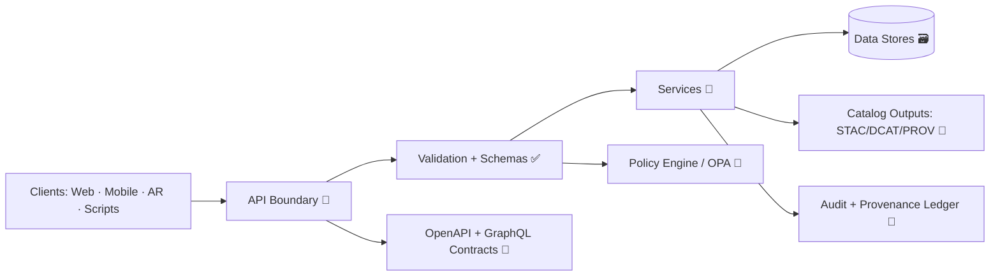

# 🧩 API Schemas (Contracts) — `api/schemas/`

<p align="center">
  <strong>🏛️ The contract boundary for Kansas Frontier Matrix (KFM)</strong><br/>
  <sub>Governed • Evidence‑first • Provenance‑aware • Fail‑closed by default</sub>
</p>

<p align="center">
  
  
  
  
  
</p>

---

## 🧭 Quick Navigation

- [🎯 Purpose](#-purpose)
- [🧱 Non‑Negotiables](#-nonnegotiables)
- [🗂️ What belongs here](#-what-belongs-here)
- [🧬 Schema families](#-schema-families)
- [🏗️ Recommended directory layout](#️-recommended-directory-layout)
- [🧩 Cross‑cutting primitives](#-crosscutting-primitives)
- [🗺️ Geo + time conventions](#️-geo--time-conventions)
- [🔐 Governance surfaces](#-governance-surfaces)
- [🧪 Examples & fixtures](#-examples--fixtures)
- [✅ Contract standards](#-contract-standards)
- [🧪 Validation & CI expectations](#-validation--ci-expectations)
- [➕ Adding or changing a schema](#-adding-or-changing-a-schema-checklist)
- [🧠 Mental model](#-mental-model)
- [📚 Glossary](#-glossary)

---

## 🎯 Purpose

Welcome to the **contract boundary** for the Kansas Frontier Matrix API.

This folder exists to keep **request/response models**, **shared envelopes**, and **governance/provenance surfaces** consistent across:

- 🌐 **REST** endpoints (FastAPI → OpenAPI/Swagger)
- 🧠 **GraphQL** interface (optional, for relationship-heavy queries)
- 🧰 Tooling (contract tests, schema validation, docs generation, future SDK/codegen)

> **Schemas aren’t “nice docs.”** They are *operational guardrails* that make KFM trustworthy, testable, and governable. 🛡️

---

## 🧱 Non‑Negotiables

KFM is built around a “truth path” philosophy: **no client bypasses the governed API**.  
This makes schemas the *front door* of validation, policy, auditing, and provenance.

✅ **Every contract must support:**
- **Validation** (inputs *and* outputs)
- **Fail‑closed safety** (missing policy/metadata = block or redact, never “shrug”)
- **Policy signaling** (explicit allow/deny/sanitize signals)
- **Provenance hooks** (“the map behind the map” — trace everything)

---

## 🗂️ What belongs here

Think **API contracts**, not “data catalogs.”

### ✅ Belongs here
- 📦 REST request/response models for `/api/v1/...`
- 🧷 Shared objects reused across routes:
  - pagination, sorting, filters, bbox/time range inputs
  - error envelopes + validation error formats
  - policy decision surfaces (deny/sanitize metadata)
  - provenance references (IDs/links to PROV bundles)
  - request context (request_id, trace fields, warnings)
- 🧠 GraphQL schema (if enabled): types, inputs, payloads, typed errors
- 🧪 Canonical payload examples (especially geospatial + search + AI answers)

### 🚫 Does NOT belong here
- 🗺️ STAC/DCAT/PROV profile schemas → keep in top-level `schemas/` (project-wide validation)
- 📁 Actual catalog outputs:
  - STAC collections/items under `data/stac/...`
  - DCAT JSON-LD under `data/catalog/dcat/...`
  - PROV bundles under `data/prov/...` (or `data/provenance/...`)
- 🔒 OPA/Rego policy source → lives under `policy/`  
  *(this folder may define the **shape** of decision objects surfaced by the API, not the rules themselves)*

---

## 🧬 Schema families

### 1) 🌐 REST (FastAPI / OpenAPI)
- **Source of truth:** Pydantic models used by route handlers.
- OpenAPI is generated and served at runtime:
  - `/openapi.json`
  - `/docs`

**Contract rule:** if a change isn’t backward-compatible, don’t “wing it” — **version it**. 🧯

---

### 2) 🧠 GraphQL (optional)
GraphQL is ideal for nested relationship queries (places ↔ datasets ↔ events ↔ stories).  
If enabled:

- Keep GraphQL types aligned with REST resources (don’t duplicate business logic)
- Enforce query depth/cost limits as part of governance (policy + server limits)
- Treat GraphQL errors as **first‑class contracts**

**Contract rule:** GraphQL schema changes must ship with updated examples + contract tests.

---

### 3) 🧾 Governance + provenance surfaces (stable forever)
Even when domain models evolve, these objects should remain stable:

- 🔐 `PolicyDecision` (allow/deny/sanitize + why + obligations)
- 🧾 `ProvenanceRef` (how to locate lineage for a dataset/asset/answer)
- 🚨 `ErrorEnvelope` (uniform error contract across REST + GraphQL)
- 🧭 `RequestContext` (request_id / trace / warnings)

---

## 🏗️ Recommended directory layout

> Organize contracts as: **shared primitives → domain contracts → examples** ✅

```text
📁 api/
  ├─ 📁 schemas/
  │  ├─ 📄 README.md
  │  ├─ 📁 common/                 # shared building blocks (stable)
  │  │  ├─ 📄 context.py            # request_id, trace, warnings
  │  │  ├─ 📄 errors.py             # ErrorEnvelope, ValidationError details
  │  │  ├─ 📄 pagination.py         # cursor/page models
  │  │  ├─ 📄 filters.py            # keyword/bbox/time filters
  │  │  ├─ 📄 geo.py                # bbox/geometry/time helpers
  │  │  ├─ 📄 policy.py             # PolicyDecision, data classification
  │  │  └─ 📄 provenance.py         # ProvenanceRef, SourceRef
  │  ├─ 📁 rest/                   # REST request/response contracts
  │  │  ├─ 📄 datasets.py
  │  │  ├─ 📄 catalog.py
  │  │  ├─ 📄 query.py
  │  │  ├─ 📄 tiles.py
  │  │  └─ 📄 focus_mode.py         # AI Q/A contracts + citations map
  │  ├─ 📁 graphql/                # GraphQL contracts (if enabled)
  │  │  ├─ 📄 schema.graphql
  │  │  └─ 📄 resolvers.md
  │  └─ 📁 examples/               # canonical payload examples
  │     ├─ 📄 dataset.json
  │     ├─ 📄 catalog_search.json
  │     ├─ 📄 adhoc_query.json
  │     ├─ 📄 tilejson.json
  │     └─ 📄 focus_answer.json
```

---

## 🧩 Cross‑cutting primitives

These are the **“boring” schemas** that make the whole system feel professional and consistent.  
They are also the **highest ROI** because they touch every endpoint.

### 🧾 `ErrorEnvelope` (uniform, policy‑aware)
All REST endpoints should return a consistent error shape (even when upstream failures differ):

- `request_id` (traceability)
- `error_code` (stable)
- `message` (human)
- `details` (optional, structured)
- `policy` (optional: allow/deny/sanitized indicators)

<details>
<summary><strong>🧪 Example: ErrorEnvelope JSON</strong></summary>

```json
{
  "request_id": "req_01HTZ4PZ9QW3R6GJ8K9Y4V1B2C",
  "error_code": "DATASET_NOT_FOUND",
  "message": "Dataset 'ks_hydrology_1880' was not found.",
  "details": {
    "dataset_id": "ks_hydrology_1880",
    "hint": "Check spelling or search via /api/v1/catalog/search."
  }
}
```
</details>

---

### 🔐 `PolicyDecision` (explicit over implicit)
When policy requires denial or sanitization, prefer **explicit signals** over silent weirdness:

- return `403` with `PolicyDecision` **OR**
- return `200` with redacted fields + `policy.sanitized=true` (only when allowed)

Recommended fields:
- `outcome`: `allow | deny | sanitize`
- `reason_code`: stable string (machine)
- `reason`: short human explanation (optional)
- `data_classification`: `public | internal | confidential | restricted`
- `sanitized_fields`: list of field paths (e.g. `["geometry.coordinates", "owner_name"]`)
- `obligations`: optional “must do” actions (mask precision, add watermark, etc.)

<details>
<summary><strong>🧪 Example: PolicyDecision JSON</strong></summary>

```json
{
  "outcome": "sanitize",
  "reason_code": "SENSITIVE_LOCATION_MASKED",
  "reason": "Precise coordinates are restricted for this dataset.",
  "data_classification": "restricted",
  "sanitized_fields": ["geometry.coordinates"],
  "obligations": [
    {"type": "mask_precision", "params": {"decimal_places": 2}}
  ]
}
```
</details>

---

### 🧾 `ProvenanceRef` (lineage pointer, not the full PROV blob)
If an object is derived, it should be traceable:

- include `provenance_ref` (ID/path pointer)
- keep lineage external (don’t embed massive PROV payloads in every response)

<details>
<summary><strong>🧪 Example: ProvenanceRef JSON</strong></summary>

```json
{
  "kind": "prov_bundle",
  "id": "prov:dataset/ks_hydrology_1880@2026-02-01",
  "uri": "data/prov/datasets/ks_hydrology_1880/2026-02-01.json",
  "sha256": "b5b3e2c0...f1a9",
  "generated_at": "2026-02-01T22:41:10Z"
}
```
</details>

---

### 🧭 `RequestContext` (observability + UX)
A small but powerful pattern: always return trace metadata.

Suggested:
- `request_id` (also in header like `X-Request-ID`)
- `warnings` (soft problems, non-fatal)
- `deprecations` (what will break later)

---

## 🗺️ Geo + time conventions

Geospatial systems fail in boring ways — so we standardize. 🧱

### 🧭 Bounding boxes (`bbox`)
- Format: `[min_lon, min_lat, max_lon, max_lat]`
- Coordinate system: default **WGS84** (EPSG:4326) unless explicitly stated
- Validate:
  - `min <= max`
  - lon ∈ `[-180, 180]`
  - lat ∈ `[-90, 90]`

### ⏳ Time ranges (`time_range`)
- Prefer RFC3339 / ISO8601 timestamps
- Allow date-only strings only if explicitly documented

### 🧩 Geometry payloads
- For small objects: GeoJSON geometry
- For large exports: stream GeoJSON, or use tiles / packaged formats (PMTiles / MVT) depending on endpoint design

---

## 🔐 Governance surfaces

KFM treats policy as a first‑class *runtime and CI* gate. 🧰

### 🧷 Data classification (recommended)
| Classification | Meaning | Typical behavior |
|---|---|---|
| `public` | safe to publish | full access |
| `internal` | for contributors/maintainers | auth required |
| `confidential` | contains sensitive info | restricted + auditing |
| `restricted` | high sensitivity (e.g., sacred sites / precise locations) | deny or sanitize |

> 💡 **Design goal:** the contract makes it impossible to “accidentally” return restricted fields without leaving evidence in `policy` + logs.

### 🪶 Indigenous data & community governance (CARE‑aware)
When a dataset involves Indigenous peoples, lands, waters, or culturally sensitive materials:
- treat governance requirements as **schema-visible** constraints (classification + obligations)
- prefer *masking* over *leaking* (e.g., coordinate precision reduction)
- document consent/authority expectations via `policy.reason_code` + dataset metadata links

---

## 🧭 How schemas map to KFM features

These **high‑value endpoints** should always have clear contracts + examples:

### 📚 Data Catalog & Datasets
- `GET /api/v1/datasets/{id}` → dataset metadata summary + links to STAC assets
- `GET /api/v1/catalog/search` → keyword + bbox + time range search
- `GET /api/v1/datasets/{id}/data?format=geojson&bbox=...` → streaming/export shape

✅ **Schema focus:**
- `DatasetSummary`
- `DatasetAssetLink` (STAC reference)
- `CatalogSearchRequest` / `CatalogSearchResponse`

---

### 🧮 Ad‑hoc Spatial Query (Safe SQL interface)
- `GET /api/v1/query?table=...&select=...&where=...&bbox=...`

✅ **Schema focus (strict):**
- table must be **whitelisted**
- select must be **column-scoped**
- where must be **constrained** (avoid raw SQL passthrough)
- output format must be explicit

> ⚠️ Treat this endpoint as “sharp tooling.” Schemas here should be stricter than anywhere else.

---

### 🧱 Map Tiles (Raster + Vector)
- `GET /tiles/{layer}/{z}/{x}/{y}.pbf` (vector tiles, MVT)
- `GET /tiles/{layer}/{z}/{x}/{y}.png` / `.webp` (raster tiles)

✅ **Schema focus:**
- `LayerId` naming rules
- `TileErrorEnvelope`
- `TileJSON` (recommended for client discovery)

---

### 🤖 Focus Mode AI (evidence‑first answers)
- `POST /focus-mode/query` → answer + citations map + policy decision + provenance pointer

✅ **Schema focus:**
- `FocusQueryRequest` (question + map context + user intent)
- `FocusQueryResponse` (answer + `citations[]` + `policy` + `provenance_ref`)
- enforce “no source, no answer” via policy + tests

---

## 🧪 Examples & fixtures

Examples are not optional “nice docs.” They are *canonical fixtures* for:
- contract tests
- docs generation
- SDK/codegen integration later
- debugging client payload issues

✅ Every schema that is non-trivial should have at least one example in `examples/`.

---

## ✅ Contract standards

### 🏷️ Naming
- **Models:** `PascalCase` (e.g., `DatasetSummary`)
- **Fields:** `snake_case` (e.g., `year_range`, `created_at`)
- **IDs:** stable + opaque (don’t leak DB internals unless intentionally designed)

### 🧩 Compatibility rules (REST)
- ✅ Adding optional fields is usually OK
- ✅ Adding new endpoints under a version is OK
- ⚠️ Renaming/removing fields is **breaking** → version it (`/api/v2/...`)
- ⚠️ Changing meaning of a field is **breaking** (even if shape stays same)

### 🧠 Compatibility rules (GraphQL)
- Prefer additive changes + deprecate old fields with clear timelines
- Keep typed errors stable

---

## 🧪 Validation & CI expectations

Contracts should be continuously verified:

- 🧩 JSON Schema validation of structured outputs
- 🧪 API contract tests ensuring endpoints respond as expected
- 🧹 OpenAPI / GraphQL linting for completeness and compatibility
- 🧯 OpenAPI diff checks (optional but strongly recommended)

**If schemas and reality drift — CI should fail.** ✅

---

## 🧰 Working locally

```bash
# 1) Start the API (docker-compose or local run)
# 2) Inspect generated contracts:
#    - OpenAPI JSON: /openapi.json
#    - Swagger UI:   /docs
#    - GraphQL:      /graphql (if enabled)

# 3) Run tests (unit + contract)
pytest
```

---

## ➕ Adding or changing a schema checklist

- [ ] 🧠 Confirm the **source of truth** (Pydantic model vs hand-written schema)
- [ ] 🧩 Update shared primitives first (`common/`)
- [ ] 🧪 Add/refresh an example payload in `examples/`
- [ ] ✅ Add/refresh contract tests (REST + GraphQL if applicable)
- [ ] 🔁 Verify OpenAPI/GraphQL output matches intended contract
- [ ] 🔒 If sensitive fields are involved, confirm policy behavior (deny vs sanitize)
- [ ] 🧾 Ensure provenance pointers still make sense
- [ ] 🧯 If breaking: version + document deprecation path

---

## 🧠 Mental model



---

## 📚 Glossary

- **Contract**: the agreed request/response shape clients can rely on
- **OPA**: policy engine for allow/deny/sanitize decisions
- **PROV**: provenance/lineage records (“how we got here”)
- **STAC/DCAT**: catalog standards used outside this folder
- **Fail‑closed**: if governance info is missing or policy cannot be evaluated → block or redact

---

> 🧷 **Bottom line:** If it crosses the API boundary, it deserves a schema. ✅