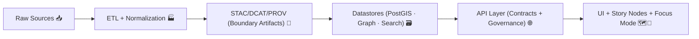

# 🧰 API Ops Scripts (`api/scripts/`)  
<sub>Operational CLIs for keeping the KFM API healthy, governed, and reproducible — without breaking the truth-path.</sub>

<p align="center">
  
  
  
  
  
</p>

---

## 🧭 Quick navigation
- [📌 Purpose & boundaries](#-purpose--boundaries)
- [✅ What belongs here (and what doesn’t)](#-what-belongs-here-and-what-doesnt)
- [🧱 The KFM “truth path” (why this folder has guardrails)](#-the-kfm-truth-path-why-this-folder-has-guardrails)
- [🚀 Running scripts](#-running-scripts)
- [📦 Script inventory](#-script-inventory)
- [🧩 Script contract (non-negotiable)](#-script-contract-non-negotiable)
- [🛡️ Safety gates (prod-safe patterns)](#️-safety-gates-prod-safe-patterns)
- [🧪 Testing & CI usage](#-testing--ci-usage)
- [🧱 Adding a new script](#-adding-a-new-script)
- [🧯 Troubleshooting](#-troubleshooting)
- [🔗 Related docs & nearby folders](#-related-docs--nearby-folders)

---

## 📌 Purpose & boundaries

> [!IMPORTANT]
> This folder is for **operational/maintenance CLIs** that interact with the **running backend API ecosystem**:
> PostGIS · Graph · Search · LLM runtime · caches · policy/audit gates — **without introducing new datasets**.

**Think of `api/scripts/` as:**  
🛠️ *Runbooks you can execute* — predictable, idempotent, auditable, CI-safe.

**Not the place for:**  
🏭 ingestion + ETL + normalization + OCR + geoprocessing + catalog build  
➡️ that belongs in **`src/pipelines/`** (or `pipelines/`), where provenance artifacts (STAC/DCAT/PROV) are generated in a governed way.

---

## ✅ What belongs here (and what doesn’t)

### ✅ Good fits (in-bounds)
- 👤 Bootstrap/manage users, roles, and service principals (admin ops)
- 🔎 Rebuild indexes (search / embeddings / catalog caches) **from existing processed/canonical stores**
- 🧠 Sync/refresh knowledge stores (graph/search refresh) **without raw→processed ETL**
- 🛡️ Run policy/audit checks (redaction/validation) against **already-ingested** artifacts
- 🧪 Smoke-test integrations (DB/graph/search/LLM runtime) for **CI** + local sanity
- 📈 Backfill *derived operational state* (e.g., rebuilding a cache table) where the *source-of-truth* is unchanged

### ❌ Not a fit (out-of-bounds)
- 🧹 New dataset ingestion, cleaning, normalization, OCR, geoprocessing → **pipelines**
- 🧾 Creating STAC/DCAT/PROV boundary artifacts from raw sources → **pipelines + tools**
- 🕹️ Interactive scripts that can’t run headless in CI  
  *(Avoid prompts; prefer flags. If you must prompt, provide `--no-input` / `--yes` equivalents.)*

---

## 🧱 The KFM “truth path” (why this folder has guardrails)

KFM’s trust model depends on a canonical flow where **nothing bypasses governance**.



### Rule of thumb 🧭
- If it **creates/changes datasets or catalogs** → do it in **pipelines**
- If it **operates the running backend** (users, indexes, caches, connectivity, maintenance) → it belongs in **`api/scripts/`**

> [!NOTE]
> If a script produces a *derived evidence artifact* (anything “publishable” or used to justify UI/AI output),
> treat it like a dataset:
> - write to `data/processed/...`
> - generate STAC/DCAT/PROV
> - publish via the governed API layer  
> ✅ No UI shortcuts. ✅ No “temporary” bypasses.

---

## 🚀 Running scripts

### ✅ Option A: Docker Compose (recommended)
From repo root (with containers running):

```bash
docker compose exec api python -m api.scripts.<script> --help
```

Examples (replace `<script>` with real modules present in this folder):
```bash
docker compose exec api python -m api.scripts.create_user --username admin --role maintainer
docker compose exec api python -m api.scripts.reindex --targets search graph
docker compose exec api python -m api.scripts.smoke_test --all
```

### 🐚 Option B: Container shell
```bash
docker compose exec api bash
python -m api.scripts.<script> --help
```

### 🧪 Option C: Local venv (advanced)
Only use if your local env matches container deps + env wiring:

```bash
python -m api.scripts.<script> --help
```

> [!TIP]
> If your script “works locally” but fails in Docker, it’s usually a config parity issue.  
> Prefer Compose commands for anything you expect to run in CI/CD or prod.

---

## 📦 Script inventory

> [!TIP]
> Keep this table updated as scripts are added/removed. Every script must support `--help`.
> Consider adding a `--json` mode for automation + CI logs.

| Script / Module | Category | Risk Tier | Idempotent? | CI-safe? | Notes |
|---|---|---:|:---:|:---:|---|
| `manage.py` *(optional)* | Dispatcher | 🟢 Low | ✅ | ✅ | `python manage.py --help` (thin wrapper) |
| `create_user.py` | Admin bootstrap | 🟡 Medium | ✅ | ✅ | **Never** print secrets; support `--rotate-password` carefully |
| `reindex.py` | Index maintenance | 🟠 High | ⚠️ | ✅ | Expensive; require scoped targets + progress reporting |
| `smoke_test.py` | Connectivity | 🟢 Low | ✅ | ✅ | Great for CI: DB/graph/search/LLM + policy gate checks |
| `init_sample_data.py` | Dev convenience | 🟡 Medium | ✅ | ✅ | Prefer calling **pipelines**; avoid “mystery data” writes |

### Suggested categories (useful at scale)
- **Admin** (users/roles/keys)  
- **Healthcheck** (connectivity/contract checks)  
- **Indexing** (rebuild/refresh)  
- **Governance** (policy/audit/redaction validation)  
- **Maintenance** (cache rebuilds, migrations, one-offs with strict guardrails)

---

## 🧩 Script contract (non-negotiable)

### 1) Contract-first CLI UX 🧩
- `--help` always
- Non-zero exit codes on failure
- Prefer flags over prompts (CI-safe)
- Add `--json` output mode when useful (automation/log pipelines)
- Print **summaries**, not walls of logs (logs go to structured logger)

### 2) Idempotent & deterministic 🔁
- Running twice should **not** duplicate or corrupt state
- Use upserts / “already exists” guards
- For rebuild tasks: scope is explicit (`--targets search,graph`)
- Avoid nondeterministic ordering unless explicitly requested (sort results)

### 3) Observability & auditability 🔎
- Structured logs (include a `run_id`)
- Log **what changed** + **where** for stateful actions
- Never log secrets or full connection strings
- Emit start/end + duration + counts (items scanned/changed/errors)

### 4) Governance & provenance 🛡️
- Nothing user-facing bypasses the governed API layer
- If a script produces evidence artifacts → attach provenance metadata before “publishing”
- Keep separation: **ops scripts ≠ ETL pipelines**

---

## 🛡️ Safety gates (prod-safe patterns)

> [!WARNING]
> If a script can mutate production data or indexes, it must be **safe-by-default** and require explicit intent.

### Required safety features for **mutating** scripts
- `--dry-run` (where possible)  
- `--yes` / `--confirm` gate for irreversible actions  
- `--scope` flags to constrain blast radius (e.g., `--targets`, `--tenant`, `--dataset-id`, `--since`)  
- Clear printed plan before execution:
  - what will happen
  - how much
  - where
  - rollback story (even if “restore from backup”)

### Recommended “production guardrail” pattern
- require both:
  - `--environment production`
  - `--confirm PRODUCTION`
- refuse to run if environment detection says you’re pointing at prod without those flags

---

## 🧪 Testing & CI usage

### CI-friendly expectations
- No prompts (or provide `--no-input`)
- Stable exit codes
- `--json` mode produces machine-readable output
- Smoke tests should run in < 60–120s when possible (targeted checks)

### What to test
- ✅ Parser/argument validation
- ✅ Error handling (network down, auth invalid, service unavailable)
- ✅ Idempotency (run twice)
- ✅ “No secrets in logs” (redaction tests)

---

## 🧱 Adding a new script

### ✅ Checklist
1. Create `api/scripts/<name>.py` (snake_case)
2. Provide a `main()` returning a clean exit code
3. Load settings from the API’s shared config (don’t duplicate env parsing)
4. Add the script to the [Script inventory](#-script-inventory)
5. Add tests if it touches critical paths (auth, policy, production stores)
6. Add `--json`, `--dry-run`, and `--confirm` when applicable

### 🧪 Minimal template (battle-tested shape)
```python
"""api/scripts/example.py"""

from __future__ import annotations

import argparse
import json
import os
import sys
import uuid
from dataclasses import asdict, dataclass


@dataclass
class Result:
    ok: bool
    run_id: str
    changed: int = 0
    warnings: int = 0
    errors: int = 0


def build_parser() -> argparse.ArgumentParser:
    p = argparse.ArgumentParser(description="Example maintenance script (CI-safe, idempotent)")
    p.add_argument("--dry-run", action="store_true", help="Plan changes, do not write")
    p.add_argument("--json", action="store_true", help="Emit machine-readable output")
    p.add_argument("--confirm", default="", help="Required for destructive actions (e.g., PRODUCTION)")
    return p


def main(argv: list[str] | None = None) -> int:
    args = build_parser().parse_args(argv)
    run_id = str(uuid.uuid4())

    # TODO:
    # 1) load shared settings (API config)
    # 2) connect to services (DB/graph/search/LLM)
    # 3) compute plan (deterministic)
    # 4) apply plan if not dry-run
    # 5) log summary + return proper exit code

    result = Result(ok=True, run_id=run_id, changed=0)

    if args.json:
        print(json.dumps(asdict(result), sort_keys=True))
    else:
        print(f"✅ OK | run_id={run_id} | changed={result.changed} | dry_run={args.dry_run}")

    return 0


if __name__ == "__main__":
    raise SystemExit(main())
```

---

## 🧯 Troubleshooting

### 🧯 DB not ready / connection errors
- Follow logs: `docker compose logs -f api`
- Restart stack if needed (service startup ordering can be timing-sensitive)
- Check port conflicts (common: `5432`, `7474`, `8000`, `3000`)

### 🗂️ Permissions writing to `data/`
- Ensure mounted volumes are writable by the container user
- On macOS/Windows, file sharing permissions can cause confusing failures

### 🔐 Auth/policy failures
- Verify you’re using the expected environment variables / secrets injection
- Confirm policy gate configuration is present (don’t “patch around” it in scripts)

---

## 🔗 Related docs & nearby folders
- 📄 `api/README.md` — API service overview (if present)
- 🧪 `tests/` — test suite (prefer running via container)
- 🧬 `src/pipelines/` or `pipelines/` — ETL + catalog generation + provenance
- 🏗️ `docs/architecture/` — system overview & design docs
- 🗺️ `docs/MASTER_GUIDE_v13.md` — canonical pipeline + governance rules *(if present)*

---

## 🗂️ Suggested folder layout (optional, recommended)

```text
api/scripts/
  ├─ README.md                 # this file 📄
  ├─ __init__.py
  ├─ _lib/                      # shared helpers (logging, settings, clients) 🧰
  │   ├─ logging.py
  │   ├─ settings.py
  │   ├─ healthchecks.py
  │   └─ safety.py
  ├─ smoke_test.py              # 🧪 CI sanity
  ├─ create_user.py             # 👤 admin bootstrap
  ├─ reindex.py                 # 🔎 rebuild indexes
  └─ ...
```

> [!TIP]
> The `_lib/` pattern keeps scripts small and consistent — while avoiding copy/paste drift across operational tooling.