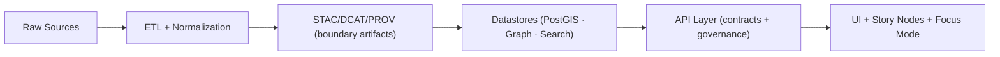

# 🛠️ API Scripts (`api/scripts/`)

<p align="center">
  
  
  
  
</p>

> [!IMPORTANT]
> This folder is for **operational/maintenance CLIs** for the backend API service (e.g., admin bootstrapping, reindexing, smoke tests, one-off maintenance).
>
> If your task **transforms raw data** into processed datasets (ETL), it belongs in `src/pipelines/` (or `pipelines/`) — **not** here.

---

## 🎯 What belongs here?

✅ **Good fits**
- 👤 Create/manage users & roles (admin bootstrap)
- 🔎 Rebuild search indices / embeddings / catalog caches
- 🧠 Sync knowledge stores (e.g., graph/search refresh) **without doing raw→processed ETL**
- 🛡️ Run policy/audit checks (redaction/validation) against **existing** stores
- 🧪 Smoke-test integrations (DB/graph/search/LLM runtime) for CI + local sanity

❌ **Not a fit**
- 🧹 New dataset ingestion, cleaning, normalization, OCR, geoprocessing → **pipelines**
- 🧾 Creating STAC/DCAT/PROV boundary artifacts from raw sources → **pipelines + tools**
- 🕹️ Interactive scripts that can’t run headless in CI (avoid prompts; use flags)

---

## 🔁 Canonical pipeline context (why scripts must stay “in-bounds”)



**Rule of thumb 🧭**
- If it **creates/changes datasets** or metadata catalogs → do it in **pipelines**.
- If it **operates** the running backend (users, indexes, caches, connectivity, maintenance) → it belongs in **`api/scripts/`**.

> [!NOTE]
> If a script produces a *derived evidence artifact*, treat it like any dataset:
> write to `data/processed/…`, generate STAC/DCAT/PROV, then expose via the API layer (no UI shortcuts).

---

## 🚀 Running scripts

### ✅ Option A: Docker Compose (recommended)
From repo root (with containers running):

```bash
docker compose exec api python -m api.scripts.<script> --help
```

Examples (replace `<script>` with real modules present in this folder):
```bash
docker compose exec api python -m api.scripts.create_user --username admin --role maintainer
docker compose exec api python -m api.scripts.reindex --targets search graph
docker compose exec api python -m api.scripts.smoke_test --all
```

### 🐚 Option B: Container shell
```bash
docker compose exec api bash
python -m api.scripts.<script> --help
```

### 🧪 Option C: Local venv (advanced)
Only do this if you’re sure your local machine matches container deps + env:
```bash
python -m api.scripts.<script> --help
```

---

## 🧾 Script inventory

> [!TIP]
> Keep this table updated as scripts are added/removed. Every script should support `--help`.

| Script (example) | Purpose | Idempotent? | Notes |
|---|---:|:---:|---|
| `manage.py` *(optional)* | Dispatcher for common subcommands | ✅ | `python manage.py --help` |
| `create_user.py` | Bootstrap an admin/maintainer user | ✅ | Never print secrets |
| `reindex.py` | Rebuild search/embedding indices | ⚠️ | Potentially expensive |
| `init_sample_data.py` | Load sample data for dev | ✅ | Prefer calling pipelines |
| `smoke_test.py` | Connectivity checks (DB/graph/search/LLM) | ✅ | Great for CI |

> [!WARNING]
> If a script mutates production data, require an explicit `--yes` / `--confirm` flag and support `--dry-run` wherever possible.

---

## ✅ Conventions (non-negotiable)

### 1) Contract-first CLI UX 🧩
- Always provide `--help`
- Return non-zero exit codes on failure
- Prefer flags over prompts (CI-safe)
- Add `--json` output mode when useful for automation

### 2) Idempotent & deterministic 🔁
- Running twice should not duplicate records
- Use upserts / “already exists” guards
- For rebuild tasks: make scope explicit (`--targets search,graph`)

### 3) Observability & auditability 🔎
- Structured logging (include a `run_id`)
- Never log secrets or full connection strings
- Log “what changed” + “where” for stateful actions

### 4) Governance & provenance 🛡️
- Nothing user-facing should bypass the API layer
- If the script produces *evidence artifacts*, attach provenance metadata before “publishing”
- Keep separation: **ops scripts ≠ ETL pipelines**

---

## 🧩 Troubleshooting

### 🧯 DB not ready / connection errors
- Follow logs: `docker compose logs -f api`
- Restart stack if needed (service startup ordering can be timing-sensitive)
- Check port conflicts (common: `5432`, `7474`, `8000`, `3000`)

### 🗂️ Permissions writing to `data/`
- Ensure mounted volumes are writable by the container user
- On macOS/Windows, file sharing permissions can cause confusing failures

---

## 🧱 Adding a new script

✅ Checklist:
1. Create `api/scripts/<name>.py`
2. Provide a `main()` returning a clean exit code
3. Load settings from the API’s shared config (don’t duplicate env parsing)
4. Add the script to the inventory table above
5. Add tests if the script touches critical paths

### 🧪 Minimal template
```python
"""api/scripts/example.py"""

from __future__ import annotations

import argparse


def build_parser() -> argparse.ArgumentParser:
    p = argparse.ArgumentParser(description="Example maintenance script")
    p.add_argument("--dry-run", action="store_true", help="Do not write changes")
    return p


def main(argv: list[str] | None = None) -> int:
    args = build_parser().parse_args(argv)

    # TODO:
    # 1) load settings
    # 2) connect to services
    # 3) do work (idempotent)
    # 4) log summary + return proper exit code

    if args.dry_run:
        print("Dry run ✅ (no changes applied)")

    return 0


if __name__ == "__main__":
    raise SystemExit(main())
```

---

## 🔗 Related docs & nearby folders
- 📄 `api/README.md` — API service overview (if present)
- 🧪 `tests/` — test suite (run via container in dev)
- 🧬 `src/pipelines/` or `pipelines/` — ETL + catalog generation
- 🗺️ `docs/MASTER_GUIDE_v13.md` — canonical pipeline + governance rules
- 🏗️ `docs/architecture/` — system overview & design docs