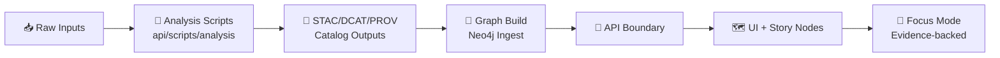

# 🧪 Analysis Scripts

> **What this folder is:** API-adjacent analysis utilities that generate **evidence artifacts** (datasets, metrics, reports, validations) that the rest of KFM can safely consume.  
> **Non‑negotiable:** Anything produced here must be **traceable** (STAC/DCAT/PROV), **deterministic**, and **API-boundary safe**.  
> <!-- :contentReference[oaicite:0]{index=0}:contentReference[oaicite:1]{index=1} -->

---

## 🧭 Table of Contents

- [🗺️ Where analysis fits in KFM](#️-where-analysis-fits-in-kfm)
- [✅ What belongs here](#-what-belongs-here)
- [📦 Output contract](#-output-contract)
- [🧩 Standard script contract](#-standard-script-contract)
- [🔍 Common analysis lanes](#-common-analysis-lanes)
- [🛡️ Governance, policy, and safety](#️-governance-policy-and-safety)
- [📈 Telemetry and lineage](#-telemetry-and-lineage)
- [✅ QA gates](#-qa-gates)
- [🧱 Add a new analysis script](#-add-a-new-analysis-script)
- [📚 Reference shelf](#-reference-shelf)

---

## 🗺️ Where analysis fits in KFM

KFM’s canonical “truth pipeline” is ordered so *derived results* only become user-facing after they’re cataloged, validated, and made queryable behind the API boundary:

**ETL → STAC/DCAT/PROV catalogs → Neo4j graph → APIs → UI → Story Nodes → Focus Mode**  
<!-- :contentReference[oaicite:2]{index=2} -->

**Why it matters:** The UI should not bypass the API boundary (and the API should not be “secretly” doing analysis that isn’t reproducible/citable).  
<!-- :contentReference[oaicite:3]{index=3} -->

### 🧱 Canonical homes vs this folder

In the **v13 canonical layout**, the long-lived homes are:

- **ETL / pipelines:** `src/pipelines/`  
- **Graph build:** `src/graph/`  
- **API boundary:** `src/server/`  
- **Story Nodes:** `docs/reports/story_nodes/`  
- **Tools & validators:** `tools/`  
- **Methods / experiments:** `mcp/`  
<!-- :contentReference[oaicite:4]{index=4}:contentReference[oaicite:5]{index=5} -->

This folder (`api/scripts/analysis/`) is best used for **API-adjacent, automation-friendly analyses** (quick lane validators, cache builders, evidence-pack generators) that still honor the same pipeline rules.

---

## ✅ What belongs here

### ✅ In-scope ✅

- 📊 *Evidence artifact builders* (summary stats, derived indicators, rollups) that end up in `data/<domain>/processed/`.
- 🧾 *Catalog emitters* that write/refresh **STAC Items/Collections**, **DCAT**, and **PROV** alongside outputs.
- 🧪 *Lane validators* that CI (or an agent) can run deterministically.
- 🧰 *One-off migration helpers* **only** if they still produce audit artifacts + provenance.

### 🚫 Out-of-scope 🚫

- Production API services/endpoints (belongs in the API layer).  
  <!-- :contentReference[oaicite:6]{index=6} -->
- Full ETL pipelines for ingestion (belongs in pipelines).  
  <!-- :contentReference[oaicite:7]{index=7} -->
- Exploratory notebooks (belongs in `notebooks/` / `mcp/`).  
  <!-- :contentReference[oaicite:8]{index=8} -->
- Anything that writes directly to the UI without going through catalogs + API boundary.

---

## 📦 Output contract

### 📁 Where outputs go

KFM organizes data by lifecycle stage **and** expects catalog outputs next to the data universe:

- `data/<domain>/raw/` → read-only source snapshots / manifests  
- `data/<domain>/work/` → intermediate artifacts  
- `data/<domain>/processed/` → **final outputs** suitable for publication/consumption  
- `data/stac/collections/` + `data/stac/items/` → STAC catalog  
- `data/catalog/dcat/` → DCAT outputs (JSON‑LD)  
- `data/prov/` → PROV bundles per run/dataset  
- `data/graph/csv/` (+ optional `data/graph/cypher/`) → graph import artifacts  
<!-- :contentReference[oaicite:9]{index=9}:contentReference[oaicite:10]{index=10} -->

> ✅ **Rule of thumb:** If a script generates a “result”, it must generate:
> 1) the artifact, 2) the metadata, and 3) the provenance bundle.  
> <!-- :contentReference[oaicite:11]{index=11} -->

### 🧾 Evidence artifact pattern

Treat analysis outputs as **boundary artifacts**:

- They are **not** “notes” or “temporary outputs”
- They are **reviewable**, **versionable**, and **traceable**
- They can be consumed by other subsystems (graph/API/UI) only because the evidence is attached  
<!-- :contentReference[oaicite:12]{index=12} -->

---

## 🧩 Standard script contract

> Copy/paste these conventions into every new script so tooling + CI can treat scripts consistently.

### 🏷️ Required CLI flags

- `--domain <domain_slug>` (e.g., `air-quality`, `hydrology`, `historical`)
- `--run-id <uuid-or-stable-id>` (required for lineage + reproducibility)
- `--seed <int>` (default fixed; override only deliberately)
- `--input <path|uri>` and `--output-dir <path>`
- `--emit-stac` `--emit-dcat` `--emit-prov` (default: on)
- `--dry-run` (no writes)
- `--fail-on-warn` (CI lane behavior)

> Determinism is a first-class requirement for pipelines and analysis runs.  
<!-- :contentReference[oaicite:13]{index=13}:contentReference[oaicite:14]{index=14} -->

### 🧾 Required run manifest

Every run should write a small machine-readable manifest (JSON/YAML) that captures:

- inputs (hashes, source URIs, licenses if known)
- parameters (including seed)
- environment (python version, key deps, container digest if applicable)
- outputs (paths + hashes)
- run timings (start/end)
- links to STAC/DCAT/PROV artifacts

> The project explicitly treats provenance and catalog metadata as “first-class” outputs.  
<!-- :contentReference[oaicite:15]{index=15} -->

### 🔒 Default safety posture

- **Read-only by default** (require explicit `--write` / `--apply` to mutate).
- Never embed credentials. Use env vars + local secret stores.
- If your script could touch sensitive geographies or PII-like datasets, it must run the policy gate (see governance section).

---

## 🔍 Common analysis lanes

### 🗺️ 1) Geospatial QA and summarization

Typical tasks:

- geometry validity checks, empty geometries, self-intersections
- bounding boxes + temporal extents for STAC
- CRS normalization and explicit CRS metadata where required

⚠️ **CRS gotcha:** GeoJSON may omit CRS information; consumers often assume WGS84 lon/lat (EPSG:4326) if CRS is missing, so scripts must normalize/declare CRS carefully.  
<!-- :contentReference[oaicite:16]{index=16} -->

Bonus: If you’re building validators, borrow patterns from the repository’s “Catalog QA” concept (scan catalog metadata for missing fields, broken links, etc.).  
<!-- :contentReference[oaicite:17]{index=17} -->

---

### 🧭 2) Routing and network analysis

KFM’s stack anticipates PostGIS-style workflows (and can integrate routing queries that produce GeoJSON segments via PostGIS functions like `ST_AsGeoJSON`, and shortest paths via pgRouting).  
<!-- :contentReference[oaicite:18]{index=18} -->

When you generate a route:

- output a **FeatureCollection** with per‑segment metadata (cost, layer, type, etc.)
- write the derived route artifact to `data/<domain>/processed/…`
- emit STAC/DCAT/PROV describing the run + the output route

(If you implement an API-adjacent route generator, model it as a reusable function + a thin endpoint wrapper.)  
<!-- :contentReference[oaicite:19]{index=19} -->

---

### 🛰️ 3) Remote sensing workflows

If your analysis lane touches Earth observation:

- keep scripts reproducible and sharable
- prefer workflows that can be executed consistently (e.g., Earth Engine scripts that are shareable + re-runnable)

Earth Engine’s Code Editor + JavaScript API are explicitly positioned as a reproducible, collaborative entry point (run, save, share).  
<!-- :contentReference[oaicite:20]{index=20} -->

Recommended outputs:

- cloud-optimized rasters (COGs), vector extractions, or timeseries tables
- STAC Items that point to rasters/tables + capture processing parameters

---

### 📈 4) Statistical modeling and simulation lanes

KFM’s roadmap explicitly expects domain modeling pipelines and deterministic runs that still emit catalog metadata and provenance. Example idea: bias correction + deterministic run seed + STAC Item containing parameters and provenance.  
<!-- :contentReference[oaicite:21]{index=21} -->

Suggested patterns:

- keep modeling code **parameterized** (no hard-coded “magic” constants)
- write model cards / assumptions into the run manifest
- separate “fit” from “apply” stages for auditability

---

### 🧠 5) Graph analytics lanes

If your analysis produces graph-related outputs:

- output **CSV import tables** (nodes/edges) to `data/graph/csv/`
- optionally emit Cypher helpers to `data/graph/cypher/`
- never mutate production Neo4j directly from a script in this folder (treat it as a build artifact)

(That matches the lifecycle expectation that graph artifacts are generated and then ingested.)  
<!-- :contentReference[oaicite:22]{index=22} -->

---

## 🛡️ Governance, policy, and safety

### 🧑‍⚖️ FAIR/CARE and sensitive data handling

KFM’s governance direction includes codifying rules for privacy/confidentiality and indigenous data sovereignty, explicitly referencing FAIR/CARE-aligned checks and refusing unsafe actions in automation.  
<!-- :contentReference[oaicite:23]{index=23} -->

**Practical expectation for scripts here:**

- detect sensitive datasets early (tags/labels)
- avoid outputting precise coordinates for protected sites
- apply aggregation/generalization when required
- produce a clear audit trail explaining redactions

### 🔐 Policy gates and CI enforcement

KFM’s “Policy Pack” direction uses policy-as-code (OPA/Rego + Conftest) as CI validation gates for governance rules.  
<!-- :contentReference[oaicite:24]{index=24} -->

### 🤖 Safe automation mode

If these scripts are invoked by agents:

- the **Executor** should open PRs but not auto-merge
- actions should be idempotent and traceable (idempotency keys / deterministic seeds are part of the design intent)  
<!-- :contentReference[oaicite:25]{index=25} -->

---

## 📈 Telemetry and lineage

KFM’s CI direction includes emitting OpenLineage events for run auditing and having scheduled telemetry health checks (OpenTelemetry traces + energy/carbon usage reporting).  
<!-- :contentReference[oaicite:26]{index=26}:contentReference[oaicite:27]{index=27} -->

**What to do in analysis scripts:**

- log a stable `run_id` everywhere (stdout + manifest + PROV)
- emit structured logs (JSON) when possible
- include lightweight metrics (rows processed, features emitted, runtime)

---

## ✅ QA gates

A script isn’t “done” until it has:

- ✅ schema validation for outputs (GeoJSON, STAC, DCAT, PROV)
- ✅ deterministic “golden output” tests where feasible
- ✅ clear failure modes (`--fail-on-warn` for CI lanes)
- ✅ catalog QA checks (missing fields, broken links) when emitting metadata  
<!-- :contentReference[oaicite:28]{index=28} -->

> “Reproducible, testable, versioned science” is an explicit project methodology goal.  
<!-- :contentReference[oaicite:29]{index=29} -->

---

## 🧱 Add a new analysis script

Use this checklist to keep scripts composable and “promotion-ready” 🚀

- [ ] Create `api/scripts/analysis/<domain>/<verb>_<noun>.py`
- [ ] Add CLI flags: `--domain --run-id --seed --input --output-dir --dry-run`
- [ ] Write outputs to `data/<domain>/processed/…`
- [ ] Emit **STAC Item** + **DCAT Dataset** + **PROV bundle**
- [ ] Add schema validation + tests (golden files if possible)
- [ ] Add/extend a CI lane hook (or a manual runbook section)
- [ ] Document assumptions + limitations in the script docstring + run manifest
- [ ] Ensure policy gate compatibility (sensitive data handling)

---

## 📚 Reference shelf

This repo includes a *deep* library of project docs + textbooks that inform analysis standards and implementation choices. Use them intentionally (and cite them in Story Nodes / Focus Mode outputs when relevant).

<strong>📘 Core KFM docs</strong>

- **Kansas Frontier Matrix (KFM) – Comprehensive Technical Documentation.docx** — system overview, structure, and major feature intent.
- **🌟 Kansas Frontier Matrix – Latest Ideas & Future Proposals.docx** — roadmap patterns (policy gates, WPE agents, telemetry, modeling lanes).
- **MARKDOWN_GUIDE_v13.md.gdoc** — canonical directory layout + pipeline ordering.
- **Scientific Method _ Research _ Master Coder Protocol Documentation.pdf** — reproducible research workflow + QA discipline.
- **Kansas-Frontier-Matrix Design Audit – Gaps and Enhancement Opportunities.pdf** — design gap hunting + enhancement backlog.

<strong>🛰️ GIS, cartography, and remote sensing</strong>

- **python-geospatial-analysis-cookbook.pdf** — PostGIS/GeoDjango analysis patterns.
- **KFM- python-geospatial-analysis-cookbook-over-60-recipes-to-work-with-topology-overlays-indoor-routing-and-web-application-analysis-with-python.pdf** — routing + web analysis recipes.
- **making-maps-a-visual-guide-to-map-design-for-gis.pdf** — cartographic design decisions that influence derived layers.
- **Mobile Mapping_ Space, Cartography and the Digital - 9789048535217.pdf** — mobile mapping & “maps as evolving media”.
- **Cloud-Based Remote Sensing with Google Earth Engine-Fundamentals and Applications.pdf** — Earth Engine workflows and reproducibility.
- **compressed-image-file-formats-jpeg-png-gif-xbm-bmp.pdf** — image format constraints for map artifacts.

<strong>📈 Statistics, modeling, and ML</strong>

- **Understanding Statistics & Experimental Design.pdf** — experiment design, interpretability, and rigor.
- **regression-analysis-with-python.pdf** — regression workflows for KFM domain models.
- **Regression analysis using Python - slides-linear-regression.pdf** — quick regression reference.
- **think-bayes-bayesian-statistics-in-python.pdf** — Bayesian modeling for uncertainty-aware outputs.
- **graphical-data-analysis-with-r.pdf** — exploratory visualization ideas for dashboards.
- **Deep Learning for Coders with fastai and PyTorch - Deep.Learning.for.Coders.with.fastai.and.PyTorchpdf** — modern DL workflows (note: may be stored outside indexed docs).

<strong>🧠 Graphs, optimization, simulation, and data systems</strong>

- **Spectral Geometry of Graphs.pdf** — graph analytics intuition (centrality, spectrum-based structure).
- **Generalized Topology Optimization for Structural Design.pdf** — optimization thinking (constraints/objectives tradeoffs).
- **Scientific Modeling and Simulation_ A Comprehensive NASA-Grade Guide.pdf** — high-assurance modeling practices.
- **Scalable Data Management for Future Hardware.pdf** — performance/streaming/query-pipeline concepts.
- **Data Spaces.pdf** — data ecosystem and interoperability perspectives.
- **Principles of Biological Autonomy - book_9780262381833.pdf** — systems thinking metaphors for complex adaptive systems.

<strong>🧱 Databases, backend systems, and web visualization</strong>

- **PostgreSQL Notes for Professionals - PostgreSQLNotesForProfessionals.pdf** — Postgres tuning and SQL patterns.
- **concurrent-real-time-and-distributed-programming-in-java-threads-rtsj-and-rmi.pdf** — concurrency and real-time patterns.
- **responsive-web-design-with-html5-and-css3.pdf** — UI constraints that shape “analysis-to-visualization” outputs.
- **webgl-programming-guide-interactive-3d-graphics-programming-with-webgl.pdf** — 3D visualization constraints (tiles, meshes).

<strong>🧑‍⚖️ Ethics, governance, and security awareness</strong>

- **Introduction to Digital Humanism.pdf** — human-centered, accountable system design.
- **On the path to AI Law’s prophecies and the conceptual foundations of the machine learning age.pdf** — policy framing for AI features.
- **ethical-hacking-and-countermeasures-secure-network-infrastructures.pdf** — defensive posture awareness.
- **Gray Hat Python - Python Programming for Hackers and Reverse Engineers (2009).pdf** — security literacy (use responsibly; do not operationalize).
- **S-T programming Books.pdf** — security & software architecture references.
- **A programming Books.pdf / B-C / D-E / F-H / I-L / M-N / O-R / S-T / U-X programming Books.pdf** — broad language/system references that can inform implementation tradeoffs.

---

### 🧠 Reminder for Focus Mode friendliness

Focus Mode is explicitly intended to **interpret KFM content**, not invent facts, and should always provide citations to underlying data/docs. Analysis scripts that generate “explainers” or context bundles must preserve that evidence trail.  
<!-- :contentReference[oaicite:30]{index=30} -->

