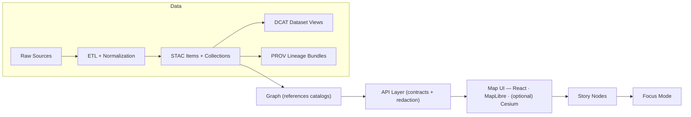

# 🗂️ Catalog Scripts (STAC + DCAT + PROV)

    

> 📍 **Path:** `api/scripts/catalogs/`  
> 🎯 **Mission:** Build + validate **catalog boundary artifacts** so downstream layers can trust what they consume.

---

## 🧭 Why this folder exists

Kansas Frontier Matrix (KFM) treats catalogs as **first‑class, governed interfaces** between data processing and everything user-facing:

- **ETL produces data**
- **Catalogs describe it (STAC/DCAT) and explain how it was made (PROV)**
- The **graph, API, UI, and narratives** consume catalogs instead of inventing metadata ad‑hoc

If a dataset/evidence artifact **isn’t in STAC + DCAT + PROV**, it **isn’t “published.”** ✅

---

## 🧬 Role in the pipeline



---

## ✅ Responsibilities

This folder is responsible for **catalog correctness + governance**:

- 🧾 Generate **STAC Collections + Items** for geospatial (and “treated as geospatial”) assets
- 🗃️ Generate **DCAT JSON‑LD** dataset entries for discovery and distribution links
- 🧬 Generate **PROV bundles** describing:
  - raw inputs → intermediate work → processed outputs  
  - agents (people/software), timestamps, configs, run IDs, commit hashes
- 🔗 Enforce **cross‑layer linking**
  - STAC → actual assets
  - DCAT → STAC/distributions
  - PROV → end‑to‑end lineage
  - Graph stores references to catalogs (not payload duplication)
- 🧪 Validate outputs against **KFM profiles** + CI gates
- ♻️ Be **deterministic** and **idempotent** (same inputs → same outputs)

---

## 🚫 Non‑responsibilities

This folder should **not**:

- ❌ run heavy ETL transforms (that belongs to pipelines)
- ❌ mutate the graph directly (graph build/ingest owns that)
- ❌ ship UI logic
- ❌ “invent” metadata fields outside KFM profiles (extend profiles instead)

---

## 📤 Canonical outputs (what these scripts write)

> These paths are the expected “published catalog surfaces” downstream modules consume.

- `data/stac/collections/` — STAC Collections  
- `data/stac/items/` — STAC Items  
- `data/catalog/dcat/` — DCAT Dataset entries (JSON‑LD)  
- `data/prov/` — PROV lineage files (often JSON‑LD)

---

## 📥 Canonical inputs (what these scripts read)

Typical inputs include:

- `data/processed/<domain>/...` — finished data products (files or stable endpoints)
- `data/work/<domain>/...` — optional intermediate artifacts (if you publish them too)
- ETL run logs / manifests / config snapshots (so PROV is truthful)
- `docs/standards/` profiles & mapping docs (KFM_STAC_PROFILE / KFM_DCAT_PROFILE / KFM_PROV_PROFILE)
- `schemas/` JSON Schemas used by validators (stac/, dcat/, prov/, …)

---

## 🧱 Recommended contract surface (make scripts predictable)

Even if the internal implementation differs (Python/Node/etc.), keep a stable “shape”:

### 1) Core entrypoints
- `build_stac` — generate collections + items
- `build_dcat` — generate dataset JSON‑LD
- `build_prov` — generate lineage bundles
- `validate` — run schema + policy + link integrity checks
- `diff` — produce machine diff (for PR review bots + CI)
- `publish` — optional orchestrator (build → validate → write atomically)

### 2) CLI/Job conventions
- Accept `--domain`, `--dataset-id`, `--outdir`, `--strict`
- Support `--dry-run` and `--json` logs for CI parsing
- Exit codes:
  - `0` success
  - `2` validation failure
  - `3` policy failure
  - `4` IO/link failure
  - `5` unexpected error

### 3) Determinism rules 🧊
- Stable sorting (features, assets, links)
- Stable IDs (don’t regenerate UUIDs unless version bump)
- Content-addressable hashes *when possible* (especially for tiled packages)
- Write outputs **atomically** (temp → move) to avoid half‑written catalogs

---

## 🧪 Validation gates (minimum expectations)

### ✅ Schema validation
- Validate STAC/Collections/Items against KFM profile schemas
- Validate DCAT JSON‑LD shape + required fields
- Validate PROV bundle completeness (agents, activities, entities, timestamps)

### 🔗 Cross‑link integrity
- STAC Item `assets.*.href` exists and is reachable (file path or stable endpoint)
- DCAT `distribution` links resolve to STAC or direct downloads
- PROV references match actual entity IDs and outputs

### 🕰️ Temporal readiness
KFM treats time as first‑class:
- STAC Items should contain temporal fields (e.g., `datetime` or start/end)
- APIs should be able to filter by date range using STAC fields + database queries
- UI timeline expects trustworthy temporal metadata

### 🛡️ Governance / policy checks
- Enforce FAIR/CARE‑style flags and handling
- Prevent publication of sensitive/forbidden disclosures
- Ensure licenses + attribution are present

### 🧾 Catalog QA “lanes”
If you have a separate validator suite (e.g., a `catalog_qa` module), wire it here as part of CI and/or manual review lanes.

---

## 📦 Packaging pattern spotlight: “Dual format + tiny catalogs”

A common KFM pattern for large layers:

- Produce **GeoParquet** (analytics) + **PMTiles** (fast visualization) from the same source  
- Register both artifacts with:
  - a **small STAC Collection**
  - a **DCAT record**
- Track reproducibility via hashes/traceability metadata

This keeps the map fast 🏎️ while maintaining auditability 🔍.

---

## 🔁 Versioning expectations (keep history queryable)

Design catalogs to evolve gracefully:

- **Dataset versioning:** new versions should link back to prior versions in DCAT + PROV  
- **Graph/ontology versioning:** maintain backward compatibility or provide migrations  
- **API versioning:** breaking changes require versioned endpoints/negotiation  
- **Release versioning:** repo tags use semantic versioning

---

## 🧩 Integration points (how other subsystems should use catalogs)

- **Pipelines** write processed assets + manifests  
- **Catalog scripts** generate/validate STAC + DCAT + PROV  
- **Graph build** stores references to catalog IDs (STAC Item IDs / DOIs / stable IDs)  
- **API** serves evidence through contracts + redaction/classification rules  
- **UI** consumes API and should never bypass catalogs  
- **Story Nodes / Focus Mode** must reference cataloged evidence only

---

## 🧾 Minimal examples (shape only — fill with KFM profile requirements)

### STAC Collection (minimal-ish)
```json
{
  "type": "Collection",
  "id": "example-dataset",
  "title": "Example Dataset",
  "description": "Example dataset description",
  "extent": {
    "spatial": { "bbox": [[-102.0, 36.9, -94.6, 40.1]] },
    "temporal": { "interval": [["1900-01-01T00:00:00Z", null]] }
  },
  "links": [],
  "license": "CC-BY-4.0"
}
```

### STAC Item (minimal-ish)
```json
{
  "type": "Feature",
  "stac_version": "1.0.0",
  "id": "example-dataset-item-001",
  "collection": "example-dataset",
  "geometry": null,
  "bbox": [-102.0, 36.9, -94.6, 40.1],
  "properties": {
    "datetime": "2020-01-01T00:00:00Z"
  },
  "assets": {
    "geoparquet": {
      "href": "data/processed/example/example.geoparquet",
      "type": "application/octet-stream",
      "roles": ["data"]
    },
    "pmtiles": {
      "href": "data/processed/example/example.pmtiles",
      "type": "application/octet-stream",
      "roles": ["tiles", "visual"]
    }
  },
  "links": []
}
```

### DCAT Dataset (JSON‑LD shape sketch)
```json
{
  "@context": {
    "dcat": "http://www.w3.org/ns/dcat#",
    "dct": "http://purl.org/dc/terms/"
  },
  "@type": "dcat:Dataset",
  "dct:title": "Example Dataset",
  "dct:description": "Discoverable dataset entry",
  "dct:license": "https://creativecommons.org/licenses/by/4.0/",
  "dcat:distribution": [
    {
      "@type": "dcat:Distribution",
      "dcat:accessURL": "data/stac/collections/example-dataset.json"
    }
  ]
}
```

### PROV bundle (shape sketch)
```json
{
  "@context": {
    "prov": "http://www.w3.org/ns/prov#"
  },
  "@graph": [
    {
      "@id": "urn:kfm:activity:run-123",
      "@type": "prov:Activity",
      "prov:startedAtTime": "2026-01-01T00:00:00Z",
      "prov:endedAtTime": "2026-01-01T00:10:00Z"
    }
  ]
}
```

---

## 🧠 Adding a new dataset (checklist)

- [ ] Processed artifacts exist in `data/processed/<domain>/...`
- [ ] STAC Collection created
- [ ] STAC Items created for each asset/distribution
- [ ] DCAT dataset entry created (license/keywords/distributions present)
- [ ] PROV bundle created (inputs → outputs + agents + run/config references)
- [ ] Cross‑links verified (STAC↔DCAT↔PROV)
- [ ] Validation gates pass (schemas + policies + QA lanes)
- [ ] Only then: graph ingest + API exposure + UI usage + Story Nodes

---

## 📚 Reference Library (Project Files)

These are part of the repo’s “working knowledge base” and inform patterns for metadata quality, uncertainty, governance, geospatial processing, visualization, and scalability.

<details>
<summary><strong>📦 KFM core docs</strong></summary>

- `MARKDOWN_GUIDE_v13.md` (Master Guide v13 draft)
- `Kansas Frontier Matrix (KFM) – Comprehensive Technical Documentation.docx`
- `🌟 Kansas Frontier Matrix – Latest Ideas & Future Proposals.docx`
- `Hub Design and Architecture.pdf`

</details>

<details>
<summary><strong>🛰️ Geospatial, cartography, and remote sensing</strong></summary>

- `Cloud-Based Remote Sensing with Google Earth Engine-Fundamentals and Applications.pdf`
- `python-geospatial-analysis-cookbook.pdf`
- `making-maps-a-visual-guide-to-map-design-for-gis.pdf`
- `Mobile Mapping_ Space, Cartography and the Digital - 9789048535217.pdf`

</details>

<details>
<summary><strong>📊 Statistics, modeling, and uncertainty</strong></summary>

- `Scientific Modeling and Simulation_ A Comprehensive NASA-Grade Guide.pdf`
- `Understanding Statistics & Experimental Design.pdf`
- `think-bayes-bayesian-statistics-in-python.pdf`
- `regression-analysis-with-python.pdf`
- `Regression analysis using Python - slides-linear-regression.pdf`
- `graphical-data-analysis-with-r.pdf`
- `Generalized Topology Optimization for Structural Design.pdf`
- `Spectral Geometry of Graphs.pdf`
- `Principles of Biological Autonomy - book_9780262381833.pdf`
- `Deep Learning for Coders with fastai and PyTorch - Deep.Learning.for.Coders.with.fastai.and.PyTorchpdf`

</details>

<details>
<summary><strong>🗄️ Data systems, databases, and scalability</strong></summary>

- `PostgreSQL Notes for Professionals - PostgreSQLNotesForProfessionals.pdf`
- `Scalable Data Management for Future Hardware.pdf`
- `Data Spaces.pdf`

</details>

<details>
<summary><strong>🧑‍⚖️ Governance, ethics, security</strong></summary>

- `Introduction to Digital Humanism.pdf`
- `On the path to AI Law’s prophecies and the conceptual foundations of the machine learning age.pdf`
- `ethical-hacking-and-countermeasures-secure-network-infrastructures.pdf`
- `Gray Hat Python - Python Programming for Hackers and Reverse Engineers (2009).pdf`

</details>

<details>
<summary><strong>🧰 Engineering + UI/graphics references</strong></summary>

- `responsive-web-design-with-html5-and-css3.pdf`
- `webgl-programming-guide-interactive-3d-graphics-programming-with-webgl.pdf`
- `compressed-image-file-formats-jpeg-png-gif-xbm-bmp.pdf`
- `concurrent-real-time-and-distributed-programming-in-java-threads-rtsj-and-rmi.pdf`
- `A programming Books.pdf`
- `B-C programming Books.pdf`
- `D-E programming Books.pdf`
- `F-H programming Books.pdf`
- `I-L programming Books.pdf`
- `M-N programming Books.pdf`
- `O-R programming Books.pdf`
- `S-T programming Books.pdf`
- `U-X programming Books.pdf`

</details>

---

## 🤝 Contributing

When adding/changing anything under `api/scripts/catalogs/`:

- ✅ Update scripts + tests
- ✅ Update KFM profiles (not ad‑hoc fields)
- ✅ Add/adjust validators so CI catches drift
- ✅ Keep outputs deterministic and review-friendly

🌾 “No catalog, no publish.”
