# 🧪 KFM API · CI Scripts (`api/scripts/ci/`)

<!--
✅ Replace <ORG>/<REPO> with your actual GitHub org/repo for live badges.
✅ Keep workflows thin: CI logic belongs here in versioned scripts.
-->


**Purpose:** This folder contains the **single source of truth** scripts that power KFM’s **CI quality gates** for the API layer (and the API-adjacent boundaries: contracts, catalogs, provenance, and integration checks).

> **Why scripts (not YAML logic)?**  
> GitHub Actions YAML should be a thin orchestrator. The real “how” (repeatable locally + in CI) lives here. 🧩⚙️

---

## 📌 Table of Contents

- [What lives here](#-what-lives-here)
- [Non-negotiable invariants](#-non-negotiable-invariants)
- [Quick start](#-quick-start)
- [Script contract](#-script-contract)
- [Suggested script layout](#-suggested-script-layout)
- [CI pipeline map](#-ci-pipeline-map)
- [Quality gates (what we enforce)](#-quality-gates-what-we-enforce)
- [GitHub Actions wiring](#-github-actions-wiring)
- [Troubleshooting](#-troubleshooting)
- [How to add a new CI script](#-how-to-add-a-new-ci-script)
- [Reference shelf](#-reference-shelf)

---

## 🗂️ What lives here

This folder is for **automation that must be:**

- ✅ **Deterministic** (same inputs → same outputs)
- ✅ **Idempotent** (safe to rerun)
- ✅ **Auditable** (logs + artifacts + exit codes)
- ✅ **Callable locally** (devs can reproduce CI results)
- ✅ **Composable** (workflows call scripts; scripts call tooling)

Typical responsibilities include:

- 🧼 formatting/lint checks
- 🧪 unit + integration tests (API + DB)
- 🧾 schema/contract validation (OpenAPI/JSON Schema/etc.)
- 🗺️ catalog validation (STAC/DCAT/PROV + link checks)
- 🔐 security gates (SAST, dependency scan, container scan, secrets)
- 📦 container build verification
- 🧭 provenance/lineage metadata sanity checks (where applicable)

---

## 🚦 Non-negotiable invariants

These are “repo physics.” If CI can’t enforce them, **it’s incomplete**.

> **🚫 Pipeline ordering is absolute**:  
> `ETL → Catalogs (STAC/DCAT/PROV) → Graph → API → UI → Story Nodes → Focus Mode`

> **🛡️ API boundary rule**:  
> The UI must **never** query the graph directly; all access goes through the governed API layer.

> **🧾 Provenance-first publishing**:  
> Every published dataset (including “evidence artifacts” from models/AI) must be cataloged (STAC/DCAT) and traced (PROV) **before** downstream use.

> **⚖️ Governance propagation**:  
> Outputs may not be less restricted than inputs (classification/sovereignty/constraints flow forward).

---

## ⚡ Quick start

From repo root:

```bash
# 1) Make sure scripts are executable
chmod +x api/scripts/ci/*.sh || true

# 2) Run the “common” gates (edit to match your repo’s actual scripts)
bash api/scripts/ci/lint.sh
bash api/scripts/ci/typecheck.sh
bash api/scripts/ci/test_unit.sh

# 3) Integration (usually requires Docker)
bash api/scripts/ci/test_integration.sh
```

If you’re working on data/catal og/provenance boundaries:

```bash
bash api/scripts/ci/validate_contracts.sh
bash api/scripts/ci/validate_catalogs.sh
bash api/scripts/ci/validate_prov.sh
```

---

## 📜 Script contract

All scripts in this folder should follow the same “CI contract”:

✅ **Inputs**
- Environment variables (preferred) and/or CLI flags
- Read-only access to repo unless the script explicitly writes to `./artifacts/` (or similar)

✅ **Outputs**
- **Exit 0** on success  
- **Exit non-zero** on failure  
- Human-readable logs to stdout/stderr  
- Machine-readable artifacts (when relevant): JUnit XML, coverage XML, JSON reports, SBOMs, etc.

✅ **Behavior**
- Deterministic defaults (set seeds when randomness exists)
- No interactive prompts in CI (`CI=1` or `KFM_CI=1` should force non-interactive mode)
- Fail fast, but keep logs actionable

**Recommended header template (bash):**
```bash
#!/usr/bin/env bash
set -euo pipefail

# Optional: nicer logs
log() { echo "[$(date -u +'%Y-%m-%dT%H:%M:%SZ')] $*"; }
```

---

## 🧱 Suggested script layout

> If your repo already has scripts, **document what exists**.  
> If not, this is the recommended naming scheme so workflows stay stable.

```text
api/scripts/ci/
├── 📄 README.md
├── 🐚 bootstrap.sh                 # install deps, cache warmups, tool versions
├── 🐚 lint.sh                      # ruff/flake8/eslint/etc.
├── 🐚 format_check.sh              # black/prettier/etc. (check only)
├── 🐚 typecheck.sh                 # mypy/pyright/tsc
├── 🐚 test_unit.sh                 # fast tests, no network
├── 🐚 test_integration.sh          # docker compose + DB + API tests
├── 🐚 test_e2e.sh                  # (optional) UI user-journeys
├── 🐚 validate_contracts.sh         # OpenAPI/JSON Schema compatibility checks
├── 🐚 validate_catalogs.sh          # STAC/DCAT correctness + link checks
├── 🐚 validate_prov.sh             # PROV bundle sanity (shape + links)
├── 🐚 policy_gate.sh               # OPA/Conftest policy pack checks
├── 🐚 security.sh                  # SAST + dep scan + secrets + container scan
├── 🐚 build_image.sh               # docker build (multi-stage), smoke run
└── 🐚 telemetry_check.sh           # OpenTelemetry/OpenLineage/energy checks (optional)
```

---

## 🗺️ CI pipeline map

```mermaid
flowchart LR
  PR[🧑‍💻 PR / Push] --> LINT[🧼 Lint + Format Check]
  LINT --> TYPE[🧠 Typecheck]
  TYPE --> UNIT[🧪 Unit Tests]
  UNIT --> INT[🧩 Integration Tests<br/>API + DB via Docker]
  INT --> CATALOG[🗂️ Catalog QA<br/>STAC/DCAT/PROV + links]
  CATALOG --> POLICY[⚖️ Policy Gate<br/>FAIR/CARE + governance rules]
  POLICY --> SEC[🔐 Security Gates<br/>SAST + deps + image scan]
  SEC --> BUILD[📦 Build Verification<br/>container smoke run]
  BUILD --> PASS[✅ Mergeable]
```



---

## ✅ Quality gates (what we enforce)

### 1) 🧼 Code quality (fast gates)
- Linting / formatting checks (no “format drift”)
- Type checks (Python + TS where relevant)
- Unit tests with coverage thresholds

**Rule of thumb:** keep “fast gates” under a few minutes so contributors get feedback quickly.

---

### 2) 🧾 Contract-first validation
KFM treats **schemas + API specs** as first-class artifacts (contracts). CI should:

- Validate OpenAPI / JSON Schema correctness
- Detect breaking contract changes (diff + version bump rules)
- Ensure endpoint docs match implementation (where possible)

> If you change a contract, you should expect CI to demand compatibility rules + versioning.

---

### 3) 🗺️ Data + catalogs validation (STAC/DCAT/PROV)
When a PR adds/updates a dataset or an “evidence artifact” (model output, derived layer):

- Verify **STAC** items/collections are valid and point to real assets
- Verify **DCAT** dataset entries have minimum required metadata (license, distributions, etc.)
- Verify **PROV** lineage exists and links inputs → activity → outputs
- Run link checking (broken URLs should fail CI)
- Enforce cross-layer references so graph + API + UI can rely on stable IDs

---

### 4) 🧩 Integration tests (API + DB + graph)
Integration tests are expected to spin up dependencies (often via `docker compose`):

- Postgres/PostGIS (seeded)
- API service (FastAPI or similar)
- Optional: Neo4j / Elasticsearch / tile server (as used)

**Expectation:** integration tests prove “the glue works” (migrations, queries, auth, serialization).

---

### 5) 🔐 Security gates
CI should include:

- Static analysis (e.g., CodeQL)
- Dependency vulnerability scan (pip/npm)
- Secrets scanning (prevent accidental leaks)
- Container scanning (e.g., Trivy) + “non-root” container checks

> Security is not a one-off audit; it’s a merge gate. 🔒

---

### 6) 🧭 Provenance + governance automation (advanced / roadmap)
KFM’s “provenance-first CI” roadmap includes:

- Emitting lineage events (OpenLineage) per CI run
- Generating PROV-aligned records from PR/commit events (JSON-LD) for graph ingestion
- Enforcing governance policies via Policy Packs (OPA/Conftest)
- Telemetry checks (including energy/carbon reporting for CI runs)

These are optional at first, but the scripts in this folder should be designed so those gates can be added without rewriting workflows.

---

## 🧷 GitHub Actions wiring

Your `.github/workflows/*.yml` should call scripts here. Example skeleton:

```yaml
name: CI

on:
  pull_request:
  push:
    branches: [main]

jobs:
  ci:
    runs-on: ubuntu-latest
    env:
      CI: "1"
      KFM_CI: "1"
    steps:
      - uses: actions/checkout@v4

      - name: Bootstrap
        run: bash api/scripts/ci/bootstrap.sh

      - name: Lint
        run: bash api/scripts/ci/lint.sh

      - name: Typecheck
        run: bash api/scripts/ci/typecheck.sh

      - name: Unit tests
        run: bash api/scripts/ci/test_unit.sh

      - name: Integration tests
        run: bash api/scripts/ci/test_integration.sh

      - name: Validate catalogs (STAC/DCAT/PROV)
        run: bash api/scripts/ci/validate_catalogs.sh

      - name: Security gates
        run: bash api/scripts/ci/security.sh
```

### 🔑 Secrets & environments (do this, not plaintext)
- Put secrets in GitHub Secrets / Environments
- Pass them via env vars in workflows
- Never echo secrets to logs

---

## 🧰 Troubleshooting

### 🐳 Docker/Compose issues
Common commands you’ll reach for:

```bash
# See containers
docker ps -a

# Tail logs
docker logs -f <container_name>

# Exec into a container
docker exec -it <container_name> /bin/bash

# Compose logs
docker compose logs

# Rebuild stack
docker compose up -d --build
```

If image builds fail in CI, reproduce locally with more detail:

```bash
docker build --progress=plain -t kfm-api:dev .
```

---

## 🧩 How to add a new CI script

1) **Name it for the outcome**, not the tool  
   ✅ `validate_catalogs.sh`  
   🚫 `run_node_tool_thing.sh`

2) Keep it:
- deterministic
- idempotent
- non-interactive (CI-safe)
- runnable locally from repo root

3) Ensure it emits useful artifacts when appropriate:
- `artifacts/junit.xml`
- `artifacts/coverage.xml`
- `artifacts/report.json`

4) Update this README:
- Add the script to the layout list
- Add a 1–2 line “why it exists” description

---

## 📚 Reference shelf

These project files inform the CI philosophy and gates (validation rigor, reproducibility, security, geospatial correctness, and governance).

<details>
<summary><strong>📖 Full project library (click to expand)</strong></summary>

### 🧭 KFM vision, structure & governance
- 📄 `Kansas Frontier Matrix (KFM) – Comprehensive Technical Documentation.docx`
- 📄 `🌟 Kansas Frontier Matrix – Latest Ideas & Future Proposals.docx`
- 📄 `MARKDOWN_GUIDE_v13.md.gdoc`
- 📄 `Kansas-Frontier-Matrix_ Open-Source Geospatial Historical Mapping Hub Design.pdf`

### 🧪 Scientific modeling, statistics & reproducibility
- 📘 `Scientific Modeling and Simulation_ A Comprehensive NASA-Grade Guide.pdf`
- 📘 `Understanding Statistics & Experimental Design.pdf`
- 📘 `regression-analysis-with-python.pdf`
- 📘 `Regression analysis using Python - slides-linear-regression.pdf`
- 📘 `think-bayes-bayesian-statistics-in-python.pdf`
- 📘 `graphical-data-analysis-with-r.pdf`

### 🗺️ Geospatial analysis, cartography & remote sensing
- 🗺️ `python-geospatial-analysis-cookbook.pdf`
- 🗺️ `making-maps-a-visual-guide-to-map-design-for-gis.pdf`
- 🗺️ `Mobile Mapping_ Space, Cartography and the Digital - 9789048535217.pdf`
- 🛰️ `Cloud-Based Remote Sensing with Google Earth Engine-Fundamentals and Applications.pdf`

### 🗄️ Data systems & performance
- 🐘 `PostgreSQL Notes for Professionals - PostgreSQLNotesForProfessionals.pdf`
- 🧱 `Scalable Data Management for Future Hardware.pdf`
- 🧩 `Data Spaces.pdf`
- 🧠 `Spectral Geometry of Graphs.pdf`
- 🏗️ `Generalized Topology Optimization for Structural Design.pdf`

### 🌐 Web, UI & rendering
- 🎛️ `responsive-web-design-with-html5-and-css3.pdf`
- 🧊 `webgl-programming-guide-interactive-3d-graphics-programming-with-webgl.pdf`
- 🖼️ `compressed-image-file-formats-jpeg-png-gif-xbm-bmp.pdf`

### 🔐 Security & adversarial thinking
- 🛡️ `ethical-hacking-and-countermeasures-secure-network-infrastructures.pdf`
- 🕵️ `Gray Hat Python - Python Programming for Hackers and Reverse Engineers (2009).pdf`

### ⚖️ Ethics, humanism & law
- 🧑‍⚖️ `On the path to AI Law’s prophecies and the conceptual foundations of the machine learning age.pdf`
- 🌱 `Introduction to Digital Humanism.pdf`
- 🧬 `Principles of Biological Autonomy - book_9780262381833.pdf`

### 📦 Programming reference bundles (KFM bookshelf)
- 📚 `A programming Books.pdf`
- 📚 `B-C programming Books.pdf`
- 📚 `D-E programming Books.pdf`
- 📚 `F-H programming Books.pdf`
- 📚 `I-L programming Books.pdf`
- 📚 `M-N programming Books.pdf`
- 📚 `O-R programming Books.pdf`
- 📚 `S-T programming Books.pdf`
- 📚 `U-X programming Books.pdf`

</details>

---

### ✅ “Done means…”
If you’re touching anything that crosses boundaries (data → catalogs → graph → API), your PR should be able to answer:

- ✅ Did CI validate contracts?
- ✅ Did CI validate STAC/DCAT/PROV?
- ✅ Did CI run integration tests?
- ✅ Did CI run security gates?
- ✅ Are outputs deterministic and provenance-linked?

If “no” to any of the above, add or extend a script in this folder. 🌾🧪

