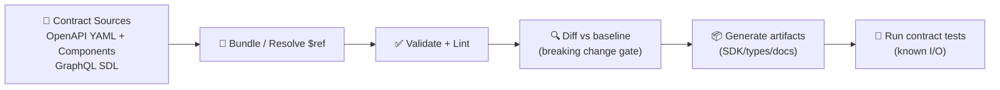

# 🧾 API Contract Scripts (KFM) — `api/scripts/contracts/`


This folder contains the **automation glue** 🧩 that makes KFM’s API contracts *real*: **bundle → validate → diff → generate**.

KFM’s documentation treats contracts as first‑class artifacts (contract‑first) and expects strict versioning + compatibility checks when they change. ✅ [oai_citation:0‡MARKDOWN_GUIDE_v13.md.gdoc](file-service://file-UYVruFXfueR8veHMUKeugU)

---

## 🎯 What this folder is for

**Contracts in KFM include:**
- **OpenAPI (REST) spec** 📜 (our *public* API contract)
- **GraphQL schema (SDL)** 🧬 (flexible graph/query access)
- **Reusable OpenAPI components** 🧱 (shared schemas/params/responses)

These scripts exist so that contract changes are:
- **Machine validated** (not “looks right” validated)
- **Diffed for breaking changes**
- **Packaged/bundled deterministically**
- **Used to generate derived artifacts** (SDKs/types/docs) when desired

KFM’s design explicitly emphasizes **clear API contracts and documentation** (OpenAPI + GraphQL). [oai_citation:1‡Kansas Frontier Matrix (KFM) – Comprehensive Technical Documentation.docx](file-service://file-PaBDqECcJe7NbC8hvXNGDS)

---

## 🔗 Related directories (where contracts live)

- 📁 **OpenAPI root + components:** `api/contracts/openapi/`
  - 🧱 Components home: `api/contracts/openapi/components/`  
    ↳ see: `../../contracts/openapi/components/README.md`
- 🧬 **GraphQL schema:** `api/contracts/graphql/` *(if present in this repo layout)*
- 🧪 **Endpoint contract tests:** usually near the API implementation (or `api/tests/…`)

> ⚠️ Note: In the v13 “canonical homes” guidance, server-side code lives under `src/server/` and contracts may live under `src/server/contracts/` (or similar). In this repo layout we’re working in `api/…`, but the *principle* stays the same: **one source of truth** for contracts. [oai_citation:2‡MARKDOWN_GUIDE_v13.md.gdoc](file-service://file-UYVruFXfueR8veHMUKeugU)

---

## 🗺️ Why contract tooling matters for KFM specifically

KFM’s API is intended to expose **open geospatial standards** (e.g., GeoJSON vector outputs, COG raster/tile endpoints) and publish/serve dataset metadata aligned to standards like **STAC/DCAT/PROV**. 🌍 [oai_citation:3‡Audit of the Kansas Frontier Matrix (KFM) Repository.pdf](file-service://file-1RwSrWXaDb5fnJ5gZX5kS3)

That means “API correctness” is not just HTTP status codes:
- response bodies must match **stable schemas**
- metadata fields must remain **discoverable + machine-parseable**
- clients (UI + external users) must not be broken by surprise changes

---

## 🔁 The contract pipeline (mental model)



KFM’s architecture explicitly calls out **OpenAPI spec / GraphQL schema + contract tests** as required API contract artifacts, and expects backward compatibility unless a version bump is declared. [oai_citation:4‡MARKDOWN_GUIDE_v13.md.gdoc](file-service://file-UYVruFXfueR8veHMUKeugU)

---

## 📦 Inputs → Outputs (recommended convention)

> Exact filenames can vary per repo, but **keep outputs deterministic** and easy to diff.

| Type | Input(s) | Output(s) (generated) |
|---|---|---|
| OpenAPI bundling | `api/contracts/openapi/openapi.yaml` + `api/contracts/openapi/components/**` | `api/contracts/openapi/dist/openapi.bundle.yaml` |
| OpenAPI validation | Bundled spec (preferred) or root spec | A validation report (stdout / JSON) |
| Breaking-change checks | `baseline.bundle.yaml` vs `openapi.bundle.yaml` | CI pass/fail + optional diff artifact |
| GraphQL validation | `api/contracts/graphql/schema.graphql` | CI pass/fail + optional lint report |
| SDK/type generation | OpenAPI bundle (+ GraphQL schema if used) | `web/src/gen/api/…` or `api/clients/…` *(repo choice)* |

---

## 🧰 Script inventory (expected responsibilities)

Even if filenames differ, this folder should cover these jobs:

| Script (typical) | What it does | Should it run in CI? |
|---|---|---|
| `bundle_openapi.py` | Resolves `$ref` across multi-file OpenAPI → emits a single bundle | ✅ yes |
| `validate_openapi.py` | Validates OpenAPI structure, refs, and house rules | ✅ yes |
| `diff_openapi.py` | Compares against a baseline (main/release) → fails on breaking changes | ✅ yes |
| `validate_graphql.py` | Parses + validates GraphQL SDL (and optional lint rules) | ✅ yes (if GraphQL exists) |
| `generate_clients.py` | Generates SDKs/types/docs from bundled specs | 🟡 optional (often CI on release) |
| `sync_contract_snapshots.py` | Updates committed “snapshots” used by tests/docs | 🟡 optional (repo preference) |

---

## 🚀 Common workflows

### 1) Validate everything (local)
Run this before opening a PR that touches endpoints, request/response models, or components.

```bash
python api/scripts/contracts/validate_openapi.py \
  --spec api/contracts/openapi/openapi.yaml

python api/scripts/contracts/validate_graphql.py \
  --schema api/contracts/graphql/schema.graphql
```

### 2) Bundle OpenAPI (local or CI)
Bundling is **strongly recommended** so CI validates the exact thing clients will consume.

```bash
python api/scripts/contracts/bundle_openapi.py \
  --entry api/contracts/openapi/openapi.yaml \
  --out api/contracts/openapi/dist/openapi.bundle.yaml
```

### 3) Check for breaking changes (CI gate)
If you break the contract, you must version the API appropriately (see rules below).

```bash
python api/scripts/contracts/diff_openapi.py \
  --base-ref origin/main \
  --head api/contracts/openapi/dist/openapi.bundle.yaml
```

### 4) Generate types/SDKs (optional, but powerful)
KFM’s docs emphasize OpenAPI documentation enabling client SDK generation and integration. [oai_citation:5‡Audit of the Kansas Frontier Matrix (KFM) Repository.pdf](file-service://file-1RwSrWXaDb5fnJ5gZX5kS3)

```bash
python api/scripts/contracts/generate_clients.py \
  --openapi api/contracts/openapi/dist/openapi.bundle.yaml \
  --target typescript \
  --out web/src/gen/api
```

---

## 🧱 Versioning rules (non-negotiable)

KFM’s documented API versioning expectations:
- If an API change is **breaking**, introduce a **new versioned endpoint** (or a negotiation strategy).
- The **OpenAPI definition is the contract**; breaking it implies a version bump. [oai_citation:6‡MARKDOWN_GUIDE_v13.md.gdoc](file-service://file-UYVruFXfueR8veHMUKeugU)

Practical implications:
- ✅ Additive changes are usually safe (new optional fields, new endpoints)
- ⚠️ Removing/renaming fields, changing types, tightening validation, changing semantics → **likely breaking**
- ✅ Deprecate first; sunset later with notice (don’t surprise-break clients)

---

## 🧪 CI integration (recommended gates)

These scripts should be usable manually **or invoked via CI**, matching KFM’s broader “run manually or via automation” pattern. [oai_citation:7‡Kansas Frontier Matrix (KFM) – Comprehensive Technical Documentation.docx](file-service://file-PaBDqECcJe7NbC8hvXNGDS)

**Suggested CI gates for PRs touching `api/contracts/**` or API code:**
1. ✅ Bundle OpenAPI
2. ✅ Validate OpenAPI
3. 🔍 Breaking-change diff vs `main`
4. ✅ Validate GraphQL (if present)
5. 🧪 Run contract tests for endpoints (known inputs/outputs)

**Optional CI gates (release or nightly):**
- 📦 Generate SDKs/types/docs
- 🔁 Publish bundled spec artifacts

---

## 🔐 Security & governance note

KFM’s architecture flow highlights the **API layer as the enforcement point** (“contracts + redaction”). 🔒 [oai_citation:8‡MARKDOWN_GUIDE_v13.md.gdoc](file-service://file-UYVruFXfueR8veHMUKeugU)

Contract scripts don’t implement redaction, but they can help prevent mistakes by:
- checking auth/security schemes are defined for protected routes
- ensuring “public” schemas don’t accidentally expose sensitive/internal fields
- making sure error responses are consistent and non-leaky

---

## 🧯 Troubleshooting

**“Unresolved $ref” / “file not found”**
- Ensure component files are referenced with correct relative paths
- Bundle first, then validate (bundling surfaces ref issues early)

**“Breaking change detected”**
- Confirm whether the change is truly breaking
- If yes, version the endpoint (`/v2/...`), or add a new operationId/path while keeping v1 intact [oai_citation:9‡MARKDOWN_GUIDE_v13.md.gdoc](file-service://file-UYVruFXfueR8veHMUKeugU)

**“Generated bundle keeps changing even when inputs didn’t”**
- Make bundling deterministic: stable ordering, normalized formatting, consistent YAML emitter options

---

## 📚 Source notes (project grounding)

<details>
<summary>Click to expand 📌</summary>

- Contract-first principle: contracts are first-class repo artifacts; changes trigger strict checks. [oai_citation:10‡MARKDOWN_GUIDE_v13.md.gdoc](file-service://file-UYVruFXfueR8veHMUKeugU)
- APIs require OpenAPI/GraphQL contracts + contract tests; must remain backward compatible unless version bump declared. [oai_citation:11‡MARKDOWN_GUIDE_v13.md.gdoc](file-service://file-UYVruFXfueR8veHMUKeugU)
- API versioning rule: OpenAPI is the contract; breaking it implies a version increment/new versioned endpoint strategy. [oai_citation:12‡MARKDOWN_GUIDE_v13.md.gdoc](file-service://file-UYVruFXfueR8veHMUKeugU)
- Canonical “API layer” guidance and location of contract definitions (server contracts). [oai_citation:13‡MARKDOWN_GUIDE_v13.md.gdoc](file-service://file-UYVruFXfueR8veHMUKeugU)
- Repository structure includes top-level modules (e.g., `api/`, `web/`, `data/`, `pipelines/`, `tools/`). [oai_citation:14‡Audit of the Kansas Frontier Matrix (KFM) Repository.pdf](file-service://file-1RwSrWXaDb5fnJ5gZX5kS3)
- Backend uses Python + FastAPI, with emphasis on clear contracts (OpenAPI) and a GraphQL interface. [oai_citation:15‡Kansas Frontier Matrix (KFM) – Comprehensive Technical Documentation.docx](file-service://file-PaBDqECcJe7NbC8hvXNGDS)
- Open standards + API design goals: GeoJSON/COG, STAC/DCAT/PROV alignment, OpenAPI docs for SDK generation, plus GraphQL endpoint. [oai_citation:16‡Audit of the Kansas Frontier Matrix (KFM) Repository.pdf](file-service://file-1RwSrWXaDb5fnJ5gZX5kS3)
- KFM’s broader automation pattern: scripts can be run manually or invoked via CI/scheduler (we apply the same model here). [oai_citation:17‡Kansas Frontier Matrix (KFM) – Comprehensive Technical Documentation.docx](file-service://file-PaBDqECcJe7NbC8hvXNGDS)

</details>
