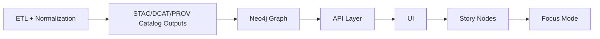

# 🛡️ KFM Policy Pack — `api/scripts/policy`


> **Why this exists:** KFM governance is only real if it’s *enforced*. This folder is the **Policy Pack** (OPA/Rego + Conftest) that turns our non‑negotiable rules into a **hard CI gate**. Policies are versioned, tested, and reviewed like code. :contentReference[oaicite:0]{index=0}:contentReference[oaicite:1]{index=1}

---

## 🧭 What lives here

This folder is the **policy-as-code control plane** for KFM’s governed pipeline:

- ✅ **Blocks merges** that violate KFM invariants (data governance, provenance, sovereignty, API boundary, etc.).:contentReference[oaicite:2]{index=2}
- 🧾 Produces **audit-friendly evidence** (machine-readable decisions you can trace and defend). (Conceptually aligned with data-driven compliance / “sticky policies”.):contentReference[oaicite:3]{index=3}
- 🤖 Works with both **humans** and **automation agents** (Watcher → Planner → Executor) by enforcing the same rules for every PR, regardless of author. :contentReference[oaicite:4]{index=4}

---

## 🚦The v13 rules this Policy Pack MUST enforce

### 1) Canonical pipeline ordering (inviolable)
The pipeline sequence is absolute and must not be bypassed:

**ETL → Catalogs (STAC/DCAT/PROV) → Graph → API → UI → Story Nodes → Focus Mode** :contentReference[oaicite:5]{index=5}



> **Policy consequence:** no stage may consume artifacts that have not passed the previous stage’s formal outputs and checks. :contentReference[oaicite:6]{index=6}

---

### 2) API boundary rule (hard gate)
The UI **must never query the Neo4j graph directly** — all access must go through the governed API layer so we can apply redaction, access control, and schema enforcement. :contentReference[oaicite:7]{index=7}

> **Policy consequence:** policy should fail if UI code introduces direct graph drivers/URLs or bypasses API contracts.

---

### 3) Provenance-first publishing
All published data must be registered with provenance **before** any graph/UI/narrative use — every dataset/model result must produce STAC/DCAT metadata and a PROV lineage record. :contentReference[oaicite:8]{index=8}

> **Policy consequence:** if a PR adds/updates data outputs, it must also update the matching catalog/provenance artifacts.

---

### 4) Deterministic, idempotent ETL
ETL must be config-driven and deterministic; runs must be logged with stable IDs/hashes; pipelines should be safely re-runnable (idempotent). :contentReference[oaicite:9]{index=9}

> **Policy consequence:** reject “manual edits” to processed outputs without the corresponding deterministic pipeline/config evidence.

---

### 5) Evidence-first narrative (Story Nodes + Focus Mode)
No unsourced narrative content is allowed. Every claim must cite evidence, and any AI-generated text must be labeled and accompanied by provenance/confidence metadata. :contentReference[oaicite:10]{index=10}

> **Policy consequence:** Story Nodes/Focus Mode bundles fail CI if citations are missing or if AI text is unmarked.

---

### 6) Sovereignty & classification propagation
No output artifact may be less restricted than its inputs; sensitive data must not “leak” into public contexts without redaction/approval; UI safeguards (generalization/blurring) are part of compliance. :contentReference[oaicite:11]{index=11}

> **Policy consequence:** classification tags must propagate end-to-end across derivatives.

---

### 7) Minimum CI gates (policy gate is one of them)
Every contribution must pass automated checks (schema validation, provenance completeness, security scans). Missing PROV, broken links, or secrets/sensitive leaks must fail the build. :contentReference[oaicite:12]{index=12}

---

## 🧰 Toolchain

This Policy Pack is designed around:

- **OPA (Open Policy Agent)** rules written in **Rego**
- **Conftest** to execute Rego policies as CI tests
- Optional: input “assemblers” that create a single `policy_input.json` (repo snapshot + changed files + derived metadata) to keep policies deterministic.

> KFM explicitly proposes a Policy Pack using **OPA (Rego) + Conftest** as the “Policy Gate” in CI. :contentReference[oaicite:13]{index=13}

---

## 📁 Suggested directory layout (for this folder)

> This README documents the intended structure. If files are missing, treat them as TODOs to implement.

```text
api/scripts/policy/
  README.md                # you are here 📌
  conftest.yaml            # conftest config (namespaces, input, output)
  input/                   # generated JSON inputs (CI or local)
    repo.snapshot.json
    pr.snapshot.json
  rego/                    # the policy pack 🧠
    kfm/                   # package root
      catalogs.rego
      provenance.rego
      sovereignty.rego
      api_boundary.rego
      story_nodes.rego
      etl_determinism.rego
      security.rego
      style.rego
  tests/                   # policy unit tests (OPA tests)
    catalogs_test.rego
    provenance_test.rego
    api_boundary_test.rego
  fixtures/                # minimal sample inputs for tests
    good/
    bad/
  reports/                 # optional: policy decision outputs (JSON/SARIF)
```

---

## 🏃 Running locally (developer workflow)

> Pick the workflow that matches your environment.

### Option A: Evaluate policies with Conftest (CI-like)
```bash
# run policy gate on a prepared input snapshot
conftest test \
  --policy api/scripts/policy/rego \
  --all-namespaces \
  api/scripts/policy/input/repo.snapshot.json
```

### Option B: Run Rego unit tests (fast)
```bash
opa test api/scripts/policy/rego -v
```

### Option C: Tight loop on a single policy namespace
```bash
conftest test \
  --policy api/scripts/policy/rego \
  --namespace kfm.provenance \
  api/scripts/policy/input/pr.snapshot.json
```

---

## 🤖 CI + Agent integration (Watcher → Planner → Executor)

KFM’s automation concept is a **safe, auditable agent architecture**:

- **Watcher** emits immutable alerts
- **Planner** creates deterministic change plans
- **Executor** opens PRs but **never auto-merges**, so changes still go through human review and CI gates. :contentReference[oaicite:14]{index=14}

The framework is designed to be **idempotent & traceable** (idempotency key + commit seed) and includes a **kill-switch** to disable all agent actions. :contentReference[oaicite:15]{index=15}

> **Policy implication:** the policy gate must apply equally to human PRs and agent PRs (same rules, same evidence requirements).

---

## 🧾 What we check (policy domains)

| Domain | What we enforce | Why it matters |
|---|---|---|
| 📦 Catalogs (STAC/DCAT/PROV) | New/changed datasets must produce required “boundary artifacts” before graph/UI/narrative use | Provenance-first publishing is a core invariant:contentReference[oaicite:16]{index=16} |
| 🧬 Provenance & lineage | PROV required; lineage must link inputs → activities → outputs | Enables auditing and “show your work” governance:contentReference[oaicite:17]{index=17} |
| 🧭 Pipeline ordering | Downstream layers can’t reference artifacts not produced by upstream layers | Prevents bypassing governance gates:contentReference[oaicite:18]{index=18} |
| 🔐 Sovereignty & sensitivity | Classification propagation; no less-restricted derivatives; redaction/generalization requirements | Prevents sensitive leakage; honors sovereignty:contentReference[oaicite:19]{index=19} |
| 🧱 API boundary | UI cannot access Neo4j directly; API is the enforcement boundary | Ensures access control + redaction + schema consistency:contentReference[oaicite:20]{index=20} |
| 🧪 Evidence-first narratives | Story Nodes/Focus Mode must cite cataloged evidence; AI text must be labeled | Prevents unsourced narrative and “hallucinations”:contentReference[oaicite:21]{index=21} |
| 🗺️ Geospatial sanity | CRS expectations and reprojection provenance | Avoids misaligned layers; supports web-friendly EPSG:4326:contentReference[oaicite:22]{index=22} |
| 🧵 Repo hygiene | Naming patterns, documentation/tests expectations, PR conventions | Keeps the project coherent and reviewable:contentReference[oaicite:23]{index=23}:contentReference[oaicite:24]{index=24} |
| 🔒 Security guardrails | Secrets/sensitive leaks fail CI; minimal secure defaults | CI must reject leaks and violations:contentReference[oaicite:25]{index=25} |

---

## 🗺️ Geospatial policies we standardize

### CRS normalization expectations
KFM normalizes most data to **WGS84 / EPSG:4326** for integration/web display while retaining original CRS metadata; reprojection steps must be recorded in provenance. :contentReference[oaicite:26]{index=26}

GeoJSON also defaults to **WGS84 EPSG:4326**, so policies may validate CRS bounds and metadata consistency. :contentReference[oaicite:27]{index=27}

---

## 🏷️ Naming & versioning policies

Dataset IDs follow a predictable pattern (used in filenames, STAC IDs, database keys):

`kfm.<state|region>.<theme>.<year_range>.v<version>`  
Example: `kfm.ks.landcover.2000_2020.v1` :contentReference[oaicite:28]{index=28}

> **Policy implication:** reject new dataset artifacts that don’t match naming/versioning rules (or require an explicit waiver).

---

## ⚖️ FAIR + CARE governance rules (Policy Pack core)

KFM is codifying FAIR + CARE governance rules into machine-readable policy checks (e.g., personal/culturally sensitive data restrictions, redaction requirements, review triggers). :contentReference[oaicite:29]{index=29}

Example requirements described in the project docs:
- Datasets flagged as containing personal data must not be publicly accessible.
- Sensitive locations (e.g., sacred sites) must not be exposed precisely without approval/redaction. :contentReference[oaicite:30]{index=30}:contentReference[oaicite:31]{index=31}

---

## 🔗 Supply chain provenance & attestations (optional, but recommended)

KFM’s roadmap includes:
- **SLSA provenance statements**
- **SBOM attachment**
- **Sigstore signing** for CI-produced artifacts/PRs :contentReference[oaicite:32]{index=32}

> **Policy implication:** if CI is configured to produce attestations, the Policy Gate can require them for “Promote” workflows.

---

## 📡 Telemetry-driven governance (optional gate)

The project proposes telemetry checks (including energy/carbon reporting) as a QA output; missing telemetry can raise alerts or block publication thresholds. :contentReference[oaicite:33]{index=33}

> **Policy implication:** treat telemetry artifacts as part of the evidence chain for “Promote” in high-assurance lanes.

---

## 🧱 Writing new policies (Rego style guide)

### ✅ Conventions
- **One policy = one clear reason to deny** (human-readable message)
- Prefer **deterministic input** (no filesystem scanning inside policy; assemble a snapshot input instead)
- Separate:
  - `deny[]` (hard fail)
  - `warn[]` (non-blocking)
  - `info[]` (diagnostic)

### 🧠 Policy IDs
Use stable IDs so waivers and audits don’t break:
- `KFM-CAT-###` (catalog rules)
- `KFM-PROV-###` (provenance rules)
- `KFM-SOV-###` (sovereignty/classification rules)
- `KFM-API-###` (API boundary/contract rules)
- `KFM-STORY-###` (story/focus rules)
- `KFM-SEC-###` (security rules)

### Example (illustrative)
```rego
package kfm.provenance

deny[msg] {
  some f in input.changed_files
  startswith(f, "data/processed/")
  not input.catalog.has_prov_for_processed_change
  msg := "KFM-PROV-001: Processed data changed without matching PROV lineage update."
}
```

---

## ✅ Testing policies

### Unit tests (OPA)
- Add `*_test.rego` files under `tests/`
- Use fixtures in `fixtures/good` and `fixtures/bad`

### Integration tests (Conftest)
- Keep at least one “golden” snapshot input:
  - ✅ should pass
  - ❌ should fail with predictable messages

---

## 🧯 Exceptions & waivers (time-boxed, reviewable)

Policies can be strict; reality can be messy. We allow waivers, but they must be:

- ⏳ **time-bound** (expires)
- 🧾 **reasoned** (why this is safe)
- 👥 **approved** (who owns the risk)
- 🔎 **scoped** (exact files/policy IDs)

Suggested format: `api/scripts/policy/waivers.yml`
```yaml
- policy_id: "KFM-PROV-001"
  scope:
    - "data/processed/legacy/**"
  reason: "Legacy migration in progress; provenance bundle will be generated in next pass."
  expires: "2026-03-31"
  approved_by: "@kfm-maintainer"
  ticket: "KFM-1234"
```

---

## 🧾 Audit artifacts (policy decisions as evidence)

Policy results SHOULD be emitted as artifacts for traceability (e.g., JSON/SARIF), aligning with the idea that **data can serve as evidence of policy compliance**. :contentReference[oaicite:34]{index=34}

Recommended output:
- `reports/policy_decisions.json`
- `reports/policy_summary.md` (human-readable)
- (optional) SARIF for GitHub code scanning UI

---

## 🧩 PR hygiene policies that this pack may enforce

KFM’s repo conventions include:
- Conventional Commits style (feat:, fix:, docs:, etc.) and clear PR descriptions. :contentReference[oaicite:35]{index=35}
- New features/bugfixes should include tests; docs should be updated when not self-evident. :contentReference[oaicite:36]{index=36}

---

## 🔗 Key KFM source docs (project-local)

These files are the primary “policy constitution” this folder implements:

- 📘 **Master Guide v13 (Draft):** :contentReference[oaicite:37]{index=37} :contentReference[oaicite:38]{index=38}
- 🧱 **KFM Comprehensive Technical Documentation:** :contentReference[oaicite:39]{index=39} :contentReference[oaicite:40]{index=40}
- 🌟 **Latest Ideas & Future Proposals (Policy Pack, agents, attestations):** :contentReference[oaicite:41]{index=41} :contentReference[oaicite:42]{index=42}
- 🧠 **Data Spaces (policy compliance as evidence / sticky policies):** :contentReference[oaicite:43]{index=43} :contentReference[oaicite:44]{index=44}

---

## 📚 Project library (all uploaded reference files)

<details>
<summary><strong>🧪 Modeling, simulation, and scientific rigor</strong></summary>

- Scientific Modeling and Simulation_ A Comprehensive NASA-Grade Guide.pdf  
- Understanding Statistics & Experimental Design.pdf  
- regression-analysis-with-python.pdf :contentReference[oaicite:45]{index=45}  
- Regression analysis using Python - slides-linear-regression.pdf  
- think-bayes-bayesian-statistics-in-python.pdf  
- Deep Learning for Coders with fastai and PyTorch (uploaded; may be tool-inaccessible)  
- Principles of Biological Autonomy - book_9780262381833.pdf  
- Generalized Topology Optimization for Structural Design.pdf  
- Spectral Geometry of Graphs.pdf  

</details>

<details>
<summary><strong>🗺️ Geospatial, mapping, and remote sensing</strong></summary>

- python-geospatial-analysis-cookbook.pdf :contentReference[oaicite:46]{index=46}  
- making-maps-a-visual-guide-to-map-design-for-gis.pdf  
- Mobile Mapping_ Space, Cartography and the Digital - 9789048535217.pdf  
- Cloud-Based Remote Sensing with Google Earth Engine-Fundamentals and Applications.pdf  
- webgl-programming-guide-interactive-3d-graphics-programming-with-webgl.pdf  

</details>

<details>
<summary><strong>🗄️ Data systems, databases, and performance engineering</strong></summary>

- Scalable Data Management for Future Hardware.pdf :contentReference[oaicite:47]{index=47}  
- PostgreSQL Notes for Professionals - PostgreSQLNotesForProfessionals.pdf  
- Data Spaces.pdf :contentReference[oaicite:48]{index=48}  
- concurrent-real-time-and-distributed-programming-in-java-threads-rtsj-and-rmi.pdf  

</details>

<details>
<summary><strong>🧑‍⚖️ Governance, ethics, and law</strong></summary>

- Introduction to Digital Humanism.pdf  
- On the path to AI Law’s prophecies and the conceptual foundations of the machine learning age.pdf  

</details>

<details>
<summary><strong>🔐 Security and secure engineering (defensive reference)</strong></summary>

> These are used to inform **defensive** security posture, secure coding checks, and threat awareness — not offensive guidance.

- ethical-hacking-and-countermeasures-secure-network-infrastructures.pdf :contentReference[oaicite:49]{index=49}  
- Gray Hat Python - Python Programming for Hackers and Reverse Engineers (2009).pdf  
- S-T programming Books.pdf :contentReference[oaicite:50]{index=50}  
- compressed-image-file-formats-jpeg-png-gif-xbm-bmp.pdf  

</details>

<details>
<summary><strong>🧰 General programming reference shelves</strong></summary>

- A programming Books.pdf  
- B-C programming Books.pdf :contentReference[oaicite:51]{index=51}  
- D-E programming Books.pdf  
- F-H programming Books.pdf :contentReference[oaicite:52]{index=52}  
- I-L programming Books.pdf :contentReference[oaicite:53]{index=53}  
- M-N programming Books.pdf  
- O-R programming Books.pdf :contentReference[oaicite:54]{index=54}  
- U-X programming Books.pdf  
- responsive-web-design-with-html5-and-css3.pdf  

</details>

---

## ✅ Definition of done (for this folder)

- [ ] Policies exist for the v13 invariants (pipeline ordering, API boundary, provenance-first, evidence-first, sovereignty propagation). :contentReference[oaicite:55]{index=55}
- [ ] Conftest runs in CI as a merge gate and emits decision artifacts. :contentReference[oaicite:56]{index=56}
- [ ] Each policy has unit tests + fixtures.
- [ ] Waiver mechanism exists, time-boxed, approved, and auditable.
- [ ] A single input snapshot format exists (`repo.snapshot.json` / `pr.snapshot.json`) so policies remain deterministic. :contentReference[oaicite:57]{index=57}

