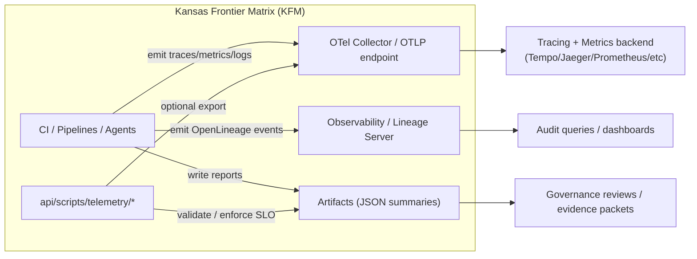

# 📡 Telemetry Scripts (`api/scripts/telemetry`)


Telemetry in KFM is **not an afterthought** — it’s a **first-class QA output** used to keep the pipeline reproducible, governed, and auditable (and to make energy & carbon visible enough to improve). :contentReference[oaicite:0]{index=0} :contentReference[oaicite:1]{index=1}

---

## 🧭 What lives here

This folder contains **operational scripts** that:

- ✅ **Validate** telemetry & observability contracts (schemas, required spans/attributes, run IDs)
- ✅ **Check health** of end-to-end instrumentation (CI runs → traces → reports)
- ✅ **Export/convert** telemetry signals (e.g., CI logs → OpenTelemetry/OpenLineage events)
- ✅ **Generate artifacts** for governance/audit (JSON summaries, evidence of compliance)
- ✅ **Track energy/carbon** per job/step and enforce minimum reporting coverage :contentReference[oaicite:2]{index=2}

> [!IMPORTANT]
> KFM’s pipeline ordering is inviolable (**ETL → Catalogs → Graph → API → UI → Story → Focus**) and KFM is explicitly planning **telemetry-driven governance** (signals for sensitive access, redactions, and policy blocks). Scripts here should strengthen—not bypass—those invariants. :contentReference[oaicite:3]{index=3}

---

## 🗂️ Suggested layout (contract-first 🧱)

> This is a **recommended** layout. If your repo differs, keep the *intent* and update this README.

```text
📁 api/
└── 📁 scripts/
    └── 📁 telemetry/
        ├── 📄 README.md
        ├── 📁 checks/          # health checks + SLO checks
        ├── 📁 exporters/       # CI/log → OTEL/Lineage transforms
        ├── 📁 schemas/         # local helpers; canonical schemas live in /schemas/telemetry/
        ├── 📁 dashboards/      # generated configs (Grafana/etc) as code (optional)
        └── 📁 fixtures/        # sample telemetry payloads for tests
```

Canonical schema home in KFM is `schemas/telemetry/` (repo-level contracts). :contentReference[oaicite:4]{index=4}

---

## ⚙️ Telemetry signals we care about (KFM-flavored)

Telemetry isn’t just “performance metrics.” In KFM it’s also **provenance + governance + sustainability**:

### 1) 🔭 Observability (classic)
- **Traces** (OpenTelemetry): request → pipeline → task → step
- **Metrics**: durations, counts, queue depth, failures, retries
- **Logs**: structured, redacted, and *classifications-aware*

### 2) 🧾 Lineage & audit (KFM-style)
- **OpenLineage events** emitted by CI jobs with a stable run UUID (auditable later) :contentReference[oaicite:5]{index=5}
- **PROV mapping** of development operations (e.g., PR events → PROV-O JSON-LD) :contentReference[oaicite:6]{index=6}
- **Run logs** + stable IDs/hashes to support deterministic replayability :contentReference[oaicite:7]{index=7}

### 3) ⚡ Energy & carbon
- Energy usage per CI step / job
- Carbon estimates (if available)
- Minimum reporting SLOs (coverage) and optional policy gates :contentReference[oaicite:8]{index=8}

### 4) 🛡️ Governance signals (telemetry-driven governance)
Examples (non-exhaustive):
- Sensitive data access event
- Redaction applied event
- Publication blocked by policy
- Classification propagation check failed :contentReference[oaicite:9]{index=9}

---

## 🧠 Telemetry flow (high-level)



---

## 📜 Script contract (how every telemetry script should behave)

To keep scripts composable and CI-friendly, each script should:

### ✅ CLI behavior (MUST)
- Provide `--help`
- Support **machine output**: `--format json` (or default JSON)
- Support **human output**: `--format human`
- Exit codes:
  - `0` success / SLO met
  - `1` SLO failed / validation failed
  - `2` configuration error (missing env vars, missing credentials, etc.)

### ✅ Determinism + replayability (MUST)
Because KFM prioritizes deterministic, idempotent processes with stable IDs/hashes and full logging, telemetry scripts should:
- Be **idempotent** (re-runs do not corrupt state)
- Use an explicit **time window** / **run selector** (no “whatever is latest”)
- Include the **run identity** fields in every output (commit, run_id, pipeline, etc.) :contentReference[oaicite:10]{index=10}

### 🔐 Data hygiene (MUST)
- Never emit secrets (tokens, connection strings, private keys)
- Treat telemetry as **classification-propagating**: no output artifact can be less restricted than inputs :contentReference[oaicite:11]{index=11}
- Prefer **structured logs** (JSON) and redact at the boundary (API rule applies to data access generally) :contentReference[oaicite:12]{index=12}
- If you record user activity, prefer pseudonymized/controlled logging patterns (privacy-aware logging is part of trusted data sharing approaches) :contentReference[oaicite:13]{index=13}

---

## 🧾 Standard attributes (recommended keys)

> Keep attribute names stable and avoid unbounded cardinality (especially in metrics labels).

| Category | Key | Example | Notes |
|---|---|---|---|
| Identity | `kfm.run_id` | `c0f7…` | Stable run UUID (or CI run id) |
| Identity | `kfm.commit_sha` | `a1b2c3…` | Git SHA |
| Identity | `kfm.pipeline` | `detect-validate-promote` | Matches CI workflow stage naming :contentReference[oaicite:14]{index=14} |
| Scope | `kfm.domain` | `air-quality` | Domain module (if applicable) :contentReference[oaicite:15]{index=15} |
| Data | `kfm.dataset_id` | `stac:item:…` | Prefer linking to catalog IDs |
| Governance | `kfm.classification` | `public / restricted / sensitive` | Enforced end-to-end :contentReference[oaicite:16]{index=16} |
| Runtime | `kfm.env` | `ci / dev / prod` | |
| Energy | `kfm.energy_joules` | `12345` | Per step/job if possible :contentReference[oaicite:17]{index=17} |
| Carbon | `kfm.co2e_kg` | `0.42` | If available |
| Tooling | `kfm.tool` | `etl / graph / api / web` | Aligns to subsystem homes :contentReference[oaicite:18]{index=18} |

---

## 🩺 10‑minute Telemetry Health Check (runbook)

KFM explicitly calls out a lightweight health check runbook:

- **Scheduled “10-minute telemetry health check”**
- Checks **last 24 hours** of CI pipelines:
  - traces are present with expected attributes
  - energy report exists
- Ensures minimum SLO coverage:
  - **95%** of CI runs have complete trace coverage
  - **90%** of CI steps report energy usage
- Alerts (Slack/email) if failing :contentReference[oaicite:19]{index=19}

### ✅ What this folder should contain to support it

A single entry-point script (name is up to the repo) that can:

- Query CI runs (or read exported CI artifacts)
- Validate trace presence + required attributes
- Validate energy report presence + step coverage
- Produce:
  - A **human summary**
  - A **machine JSON report**
  - CI-friendly exit code

### 🧪 Example CLI (adapt to your language/tooling)

```bash
# Human readable
./api/scripts/telemetry/checks/health_check --since 24h --format human

# CI mode (strict)
./api/scripts/telemetry/checks/health_check --since 24h --format json --fail-on-slo
```

### 📈 Suggested JSON output schema (shape)

```json
{
  "window": {"since": "24h"},
  "slo": {
    "trace_coverage_target": 0.95,
    "energy_step_coverage_target": 0.90
  },
  "observed": {
    "trace_coverage": 0.97,
    "energy_step_coverage": 0.91
  },
  "missing": {
    "runs_without_traces": [],
    "steps_without_energy": []
  },
  "status": "pass",
  "generated_at": "2026-01-12T00:00:00Z"
}
```

---

## ⚡ Energy & carbon telemetry (practical rules)

Energy telemetry becomes useful only if it is **consistent** and **comparable**:

### ✅ Minimum rules (recommended)
- Record energy per **job** and, when possible, per **step**
- Include hardware/context (runner type, region, runtime)
- Keep raw measurement separate from derived carbon estimate
- Make sure energy reporting is high coverage (**SLO**) :contentReference[oaicite:20]{index=20}

### 🧩 Why this is “KFM-grade”
KFM is explicitly pushing toward governance and quality management processes that resemble rigorous engineering disciplines (verification, validation, documented quality processes). Energy telemetry becomes another measurable axis in those QA gates. :contentReference[oaicite:21]{index=21}

---

## 🔐 Governance, privacy, and “don’t accidentally build surveillance”

Telemetry is powerful—and dangerous—if it becomes “collect everything.”

KFM’s direction includes:
- Governance + sovereignty guardrails (FAIR/CARE)
- Classification propagation
- Telemetry signals for sensitive access/redactions/policy blocks :contentReference[oaicite:22]{index=22} :contentReference[oaicite:23]{index=23}

### ✅ Practical policy for telemetry scripts
- **Data minimization**: collect what supports reliability, provenance, sustainability, and compliance
- **PII-safe by default**: prefer aggregation, pseudonymization, or redaction when user activity must be logged :contentReference[oaicite:24]{index=24}
- **Security posture**: align with security/privacy management expectations (e.g., ISO 27001/27701 framing is often used to evaluate systems) :contentReference[oaicite:25]{index=25}
- **Values-first development**: document what you’re measuring and *why*; align measurement choices with explicit project values and anticipated consequences :contentReference[oaicite:26]{index=26}

> [!WARNING]
> This repo contains security literature (e.g., “Gray Hat Python”). Treat it as **defensive awareness only**. Telemetry scripts must not become a vehicle for collecting sensitive data or enabling misuse. :contentReference[oaicite:27]{index=27}

---

## 🗺️ Geospatial + UI telemetry (KFM-specific recommendations)

Because KFM is a map-and-narrative system, include domain-aware telemetry:

### 🧭 Geospatial pipelines (ETL / processed assets)
Recommended fields:
- `kfm.crs` (EPSG code), `kfm.extent_bbox`, `kfm.feature_count`
- tile generation stats (count, size), raster/vector processing durations
- catalog IDs (STAC/DCAT/PROV references) :contentReference[oaicite:28]{index=28}

Geospatial workflows often touch PostGIS, routing, overlays, and GeoJSON output—instrument those steps for performance and failures. :contentReference[oaicite:29]{index=29} :contentReference[oaicite:30]{index=30}

### 🖥️ UI (MapLibre/WebGL) performance signals
If you instrument frontend builds or runtime:
- tile load time, render time, FPS (if feasible), memory pressure
- per-layer load failures + fallback behavior
- responsive breakpoints regressions

(Helpful references exist in the UI/rendering & web design library.) :contentReference[oaicite:31]{index=31} :contentReference[oaicite:32]{index=32}

### 🗜️ Asset encoding & size telemetry
Track:
- image/tiles encoding format (png/jpg/webp), sizes, compression ratio
- decode time where measurable

(Compression formats and tradeoffs matter at scale.) :contentReference[oaicite:33]{index=33}

---

## 🧪 Analyzing telemetry (regressions, anomalies, energy drift)

Telemetry isn’t just collected — it should be **interpreted** with rigor.

Recommended analysis patterns (lightweight, practical):
- Regression detection (time vs duration, change-point detection)
- Experiment design for comparing pipelines (before/after, controlled changes)
- Bayesian thresholds for noisy signals (credible intervals instead of hard cutoffs)

References in the project library cover these toolkits: :contentReference[oaicite:34]{index=34} :contentReference[oaicite:35]{index=35} :contentReference[oaicite:36]{index=36} :contentReference[oaicite:37]{index=37}

---

## ➕ Adding a new telemetry script (checklist ✅)

When adding `api/scripts/telemetry/<new_script>`:

- [ ] Has `--help`
- [ ] Has `--format json|human`
- [ ] Returns CI-friendly exit codes (0/1/2)
- [ ] Emits stable run identity fields (`kfm.run_id`, commit, pipeline)
- [ ] Validates against or produces schema in `schemas/telemetry/` :contentReference[oaicite:38]{index=38}
- [ ] Redacts secrets + respects classification propagation rules :contentReference[oaicite:39]{index=39}
- [ ] Includes a small fixture payload + test (ideally in `tests/`)
- [ ] Updates this README with the new script’s purpose and CLI example

---

## 🧯 Troubleshooting (common failure modes)

### “No traces found”
- Ensure OTLP endpoint is configured (env var or CLI arg)
- Ensure traces are emitted by CI jobs (instrumentation)
- Ensure exporter isn’t blocked by network policy
- Ensure required attributes are present (commit/run/pipeline)

### “Energy SLO failing”
- Ensure energy report is generated on every run (or exempt explicitly)
- Ensure step reporting is consistent (don’t rename steps without mapping)
- Ensure runner type changes are recorded (context metadata)

### “Telemetry leaking sensitive data”
- Add/strengthen redaction filters
- Reduce cardinality: replace raw IDs with stable hashed/pseudonymous identifiers
- Ensure classification tags propagate and outputs are not “less restricted than inputs” :contentReference[oaicite:40]{index=40}

---

## 📚 Project references used by this README (internal shelf)

### 🧭 Core KFM docs
- Kansas Frontier Matrix — Master Guide v13 (pipeline invariants, schema homes, governance, telemetry-driven governance) :contentReference[oaicite:41]{index=41}
- 🌟 Latest Ideas & Future Proposals (telemetry + energy monitoring runbook + SLOs; OpenLineage in CI) :contentReference[oaicite:42]{index=42}
- KFM Comprehensive Technical Documentation (system overview; observability as a scaling requirement) :contentReference[oaicite:43]{index=43}

### 🔐 Privacy & trusted sharing (why telemetry must be careful)
- Data Spaces (ISO 27001/27701 framing; privacy-aware logging/pseudonymization concepts) :contentReference[oaicite:44]{index=44} :contentReference[oaicite:45]{index=45}

### 🧪 Rigor & QA mindset
- Scientific Modeling and Simulation (NASA-grade quality framing; verification/validation discipline) :contentReference[oaicite:46]{index=46}

### 📈 Stats & modeling for telemetry analysis
- Regression analysis (Python + slides) :contentReference[oaicite:47]{index=47} :contentReference[oaicite:48]{index=48}
- Understanding Statistics & Experimental Design :contentReference[oaicite:49]{index=49}
- Think Bayes (Bayesian reasoning for noisy metrics) :contentReference[oaicite:50]{index=50}
- Graphical Data Analysis with R :contentReference[oaicite:51]{index=51}

### 🗃️ Data systems & performance
- Scalable Data Management for Future Hardware (streaming + lightweight stats + performance patterns) :contentReference[oaicite:52]{index=52}
- PostgreSQL Notes for Professionals (practical DB reference if telemetry lands in Postgres) :contentReference[oaicite:53]{index=53}

### 🗺️ Geospatial + mapping & UI
- Cloud-Based Remote Sensing with Google Earth Engine :contentReference[oaicite:54]{index=54}
- Python Geospatial Analysis Cookbook (PostGIS/GeoJSON workflows) :contentReference[oaicite:55]{index=55}
- Making Maps (map design considerations; what to measure in UI) :contentReference[oaicite:56]{index=56}
- Mobile Mapping (context for mobile performance & UX telemetry) :contentReference[oaicite:57]{index=57}
- WebGL Programming Guide (rendering performance cues) :contentReference[oaicite:58]{index=58}
- Responsive Web Design (front-end performance & breakpoint validation) :contentReference[oaicite:59]{index=59}
- Compressed Image File Formats (encoding/size tradeoffs) :contentReference[oaicite:60]{index=60}

### 🧑‍⚖️ Human values & policy context
- Introduction to Digital Humanism (values + consequences framing) :contentReference[oaicite:61]{index=61}
- On the path to AI Law’s prophecies… (policy & conceptual context for ML-era governance) :contentReference[oaicite:62]{index=62}

### 🛡️ Security awareness (defensive)
- Ethical Hacking & Countermeasures (defensive posture; secure infrastructure thinking) :contentReference[oaicite:63]{index=63}
- Gray Hat Python (defensive awareness only; do not operationalize offensive content) :contentReference[oaicite:64]{index=64}

---

## ✅ TODO (keep this README “true”)

- [ ] Add a “Scripts inventory” table once scripts exist in this folder (name → purpose → CLI)
- [ ] Add links to `schemas/telemetry/` contracts once finalized
- [ ] Add CI workflow pointer(s) once the health check is wired into scheduled runs
- [ ] Add dashboard-as-code outputs if a standard backend is chosen (Grafana/Tempo/etc)

