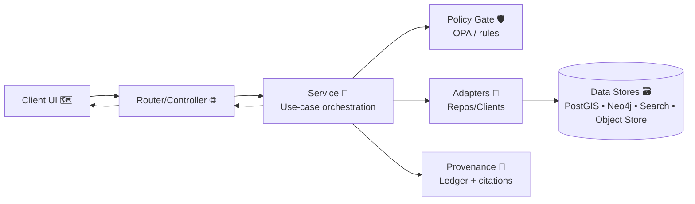
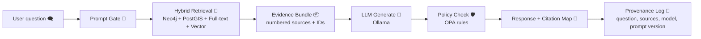

# 🧩 `api/services/` — Service Layer and Use Cases


> **Purpose:** `api/services/` contains KFM’s **application services** (use cases).  
> This is the orchestration layer that turns domain intent into **governed, evidence-backed, traceable outcomes** — the *truth-path gateway* between routers/controllers and adapters.

> **North Star ✨:** *The map behind the map.*  
> If we can’t show **where it came from**, we shouldn’t ship it.

---

## 🧭 Quick navigation

- [What belongs here](#-what-belongs-here)
- [Role in the architecture](#-role-in-the-architecture)
- [Service contracts](#-service-contracts)
- [Cross-cutting concerns](#-cross-cutting-concerns)
- [Suggested folder map](#-suggested-folder-map)
- [Service catalog](#-service-catalog)
- [Focus Mode RAG workflow](#-focus-mode-rag-workflow)
- [Error model](#-error-model)
- [Testing expectations](#-testing-expectations)
- [PR checklist](#-pr-checklist)
- [Templates](#-templates)
- [Related docs](#-related-docs)
- [References](#-references)

---

## 📌 What belongs here

### ✅ DO put in `api/services/`
- **Use-case orchestration**  
  Example: `CatalogService.search()`, `TilesService.get_tile()`, `FocusModeService.query()`
- **Workflow sequencing and decision rules**  
  Example: validate → allowlist → retrieve → policy gate → assemble evidence → log provenance
- **Evidence bundling and citation mapping** 🧾  
  The “numbered sources → citation map” workflow stays close to the logic selecting evidence
- **Governance hooks** 🛡️  
  Policy checks, role-based constraints, sensitivity filters, license gates
- **Provenance emission** 🧷  
  Immutable audit records, correlation IDs, model/prompt versions for AI flows

### ❌ DO NOT put in `api/services/`
- FastAPI routers/controllers (HTTP parsing & response formatting) → `api/routers/`
- Raw SQL / Cypher / vendor SDK calls → `api/adapters/` (repos/clients)
- Framework globals (request objects, app state) → routers or DI wiring
- Generic “helpers” without business meaning → `api/utils/`

> [!TIP]
> If a function would still make sense if HTTP, PostGIS, Neo4j, Search, and the LLM were swapped out… it probably belongs in services.

---

## 🧱 Role in the architecture

KFM follows a layered architecture with a strict **truth path**:

> **Raw → Processed → Catalog → Databases → API → UI and AI** ✅  
> **No backdoors**: UI does not talk to DBs directly; services are the controlled gateway.

### 🧠 Layer responsibilities
- **Domain layer** 🧬  
  Entities, value objects, domain rules (framework-agnostic)
- **Service layer** 🧩 *(this folder)*  
  Use cases, orchestration, decision logic, governance + provenance hooks
- **Adapters** 🔌  
  PostGIS, Neo4j, search, object store, LLM client, repositories
- **Infrastructure** 🏗️  
  FastAPI app wiring, DI, routers, startup config, deployments

**Rule of thumb:**  
> **Services depend on interfaces (ports), not implementations.**  
> This keeps use cases testable and prevents DB/LLM details from leaking into business logic.

---

## 📦 Service contracts

### ✅ Return shapes should be evidence-aware

Services should prefer return types that include:
- **Data payload**
- **Evidence bundle** (sources used)
- **Citation map** (markers → source metadata)
- **Provenance record ID** (or correlation ID)
- **Warnings** (partial data, redactions, stale caches)

> [!NOTE]
> Router/controller code should be “dumb”: map service results → HTTP responses.  
> The service should be “smart”: enforce truth path + governance + provenance.

### Recommended minimal contract

```python
from dataclasses import dataclass
from typing import Any, Generic, Mapping, TypeVar

T = TypeVar("T")

@dataclass(frozen=True)
class EvidenceItem:
    source_id: str        # stable internal ID
    title: str
    uri: str | None       # external link if applicable
    snippet: str | None   # short, high-signal excerpt
    kind: str             # dataset | document | graph_node | tile_asset | etc.

@dataclass(frozen=True)
class ServiceResult(Generic[T]):
    data: T
    evidence: list[EvidenceItem]
    citations: Mapping[str, str]     # e.g. {"[1]": "source_id:abc", "[2]": "source_id:def"}
    provenance_id: str | None
    warnings: list[str]              # user-safe, not internal stack traces
```

---

## 🛡️ Cross-cutting concerns

Services are the **one place** we can enforce the rules consistently.

### 1) Evidence-first 🧾
- Prefer returning **data + evidence metadata** by default
- Keep citation mapping close to evidence selection
- If evidence is missing: **fail safely** or return “insufficient evidence”

**Mantra:**  
> **No source, no answer.**

### 2) Governed access 🛡️
Every service that exposes data should:
- Validate inputs (bbox, time range, layer IDs, query params)
- Enforce allowlists (tables, datasets, fields, graph labels)
- Run authorization/policy checks (OPA or policy module)

### 3) Provenance and auditability 🧷
Services producing user-visible outputs should log:
- Actor context (role, org, purpose)
- Inputs (filters, bbox, timeframe, layer, dataset IDs)
- Evidence set (exact dataset/document IDs used)
- Output IDs + citation map
- For AI: model ID + prompt template version + retrieval channels used

### 4) Observability 🛰️
Services should emit:
- **Structured logs** (JSON fields; no secrets)
- **Metrics** (latency, cache hit rate, policy denies, retrieval counts)
- **Tracing** (correlation IDs propagated router → service → adapters)

### 5) Statelessness by default ♻️
- No hidden caches unless explicit and documented
- Prefer pure functions + injected dependencies
- Make operations idempotent where possible

### 6) Indigenous data governance and sensitivity 🧡
When services touch Indigenous-related data, align behavior to:
- **CARE** principles and community governance expectations  
- Sensitivity labels and redaction rules where applicable
- Avoid “open by default” assumptions for culturally sensitive content

> [!WARNING]
> Governance is not “just security.” It includes **licenses**, **sensitivity**, **community control**, and **harm prevention**.

---

## 🗂️ Suggested folder map

> (Actual filenames may vary; keep the *intent* consistent.)

```text
api/
  services/ 🧩
    README.md  ← you are here 📍

    catalog_service.py        🧭  # DCAT/STAC discovery & retrieval
    query_service.py          🔎  # constrained ad-hoc query interface (allowlisted)
    tiles_service.py          🧱  # vector/raster tile orchestration + layer gating
    graph_service.py          🕸️  # relationship use cases (GraphQL resolvers call here)
    focus_mode_service.py     🤖  # RAG orchestration (Prompt Gate → Retrieval → LLM → Policy)
    provenance_service.py     🧷  # provenance ledger + citation maps
    policy_service.py         🛡️  # OPA wrapper (authz + content/policy checks)

  adapters/ 🔌                # PostGIS/Neo4j/Search/Ollama/Object-store implementations
  domain/ 🧬                  # Pydantic/dataclass domain models (no I/O)
  routers/ 🌐                 # FastAPI routers/controllers
  utils/ 🧰                   # generic helpers without business meaning
```

---

## 🧩 Service catalog

| Service | What it owns 🧩 | Typical callers 🌐 | Notes |
|---|---|---|---|
| `CatalogService` | Dataset metadata, discovery, asset links | `/api/v1/datasets/*`, `/api/v1/catalog/search` | Returns DCAT/STAC summaries + links |
| `QueryService` | Constrained power queries | `/api/v1/query` | Must be allowlisted + logged |
| `TilesService` | Tile orchestration + layer gating | `/tiles/{layer}/{z}/{x}/{y}.*` | Keeps map clients on the same tile “well” |
| `GraphService` | Relationship-driven use cases | GraphQL resolvers | Often joins Neo4j + PostGIS |
| `FocusModeService` | RAG orchestration for Focus Mode | `/focus-mode/query` | Prompt Gate → retrieval → LLM → policy → citations |
| `PolicyService` | OPA integration + content rules | called by all services | Centralize policy logic here |
| `ProvenanceService` | Immutable audit + citation maps | called by key services | “No provenance, no publish” |

---

## 🔁 Typical request flow



---

## 🤖 Focus Mode RAG workflow

This is the canonical AI service orchestration pattern.



### Implementation notes
- Keep retrieval **compact and high-signal** (snippets, not entire documents)
- Ensure output contains required citation markers (`[1]`, `[2]`, …) **before** returning
- If policy fails (missing citations, sensitivity violation, role mismatch), return a governed fallback:
  - “Insufficient evidence”
  - “Not authorized”
  - “Please refine your question” + show what evidence is missing

---

## 🧯 Error model

Services should throw **typed, stable** exceptions that routers can map to HTTP cleanly.

### ✅ Recommended shape
- `code` (stable string)
- `message` (safe for users)
- optional `details` (internal)
- optional `hint` (actionable next step)

Examples:
- `NotFoundError(code="dataset_not_found")`
- `PolicyDeniedError(code="not_authorized")`
- `ValidationError(code="invalid_bbox")`
- `EvidenceError(code="no_source_no_answer")`

> [!IMPORTANT]
> Avoid leaking raw DB/LLM errors upward.  
> Services translate vendor failures into stable service errors + internal logs.

---

## 🧪 Testing expectations

### ✅ Unit tests
- Services tested with **fake repositories/adapters**
- Assert:
  - allowlists are enforced
  - policy hooks are called
  - provenance is emitted on successful flows
  - insufficient evidence behavior is consistent

### 🔧 Integration tests
- Adapter-level tests against PostGIS/Neo4j/search/ollama containers (compose profile)
- Golden tests for:
  - tile generation contract (headers/content-type)
  - query constraints (blocked tables/columns)
  - GraphQL resolver consistency

### 📜 Contract tests
- Ensure service return shapes remain stable for routers/controllers
- Pin service “public DTOs” so UI work doesn’t break silently

---

## ✅ PR checklist

When adding or changing a service, confirm:

- [ ] Use case name matches intent (not “utils”) 🎯
- [ ] Inputs validated (bbox/time/layer/query) ✅
- [ ] Allowlists applied (datasets/tables/fields/labels) 🧱
- [ ] Policy gate invoked (OPA/rules) 🛡️
- [ ] Evidence produced or service fails safely 🧾
- [ ] Citation map produced for user-visible claims 🧷
- [ ] Provenance emitted for publishable outputs 🧷
- [ ] Observability: logs + metrics + trace IDs 🛰️
- [ ] Unit tests added/updated 🧪
- [ ] Integration tests updated if adapter contracts changed 🔧
- [ ] README/docs updated where needed 📝

---

## 🧰 Templates

### Minimal service skeleton

```python
from dataclasses import dataclass
from typing import Protocol

class Policy(Protocol):
    async def assert_allowed(self, *, actor, action: str, resource: dict) -> None: ...

class Provenance(Protocol):
    async def log(self, *, actor, action: str, inputs: dict, outputs: dict, evidence: list[dict]) -> str: ...

class DatasetRepo(Protocol):
    async def get_dataset(self, dataset_id: str) -> dict: ...
    async def search(self, *, q: str | None, bbox=None, time=None) -> list[dict]: ...

@dataclass
class CatalogService:
    repo: DatasetRepo
    policy: Policy
    prov: Provenance

    async def get_dataset(self, *, actor, dataset_id: str) -> dict:
        ds = await self.repo.get_dataset(dataset_id)
        await self.policy.assert_allowed(actor=actor, action="datasets:read", resource=ds)

        prov_id = await self.prov.log(
            actor=actor,
            action="datasets:read",
            inputs={"dataset_id": dataset_id},
            outputs={"dataset_id": dataset_id},
            evidence=[{"source_id": ds.get("id"), "kind": "dataset"}],
        )

        ds["_provenance_id"] = prov_id
        return ds
```

### Evidence-first response template

```python
@dataclass(frozen=True)
class Citation:
    marker: str      # "[1]"
    source_id: str
    title: str
    uri: str | None

@dataclass(frozen=True)
class AnswerWithCitations:
    answer: str
    citations: list[Citation]
    provenance_id: str
    warnings: list[str]
```

---

## 🔗 Related docs

- `docs/architecture/system_overview.md` — truth path + API role
- `docs/architecture/ai/AI_SYSTEM_OVERVIEW.md` — AI boundaries
- `docs/architecture/ai/OLLAMA_INTEGRATION.md` — Focus Mode pipeline
- `pipelines/README.md` — data lifecycle + provenance artifacts

---

## 🧼 Philosophy recap

- **One truth path:** Raw → Processed → Catalog → Databases → API → UI and AI ✅  
- **No backdoors:** UIs don’t query DBs directly; services are the controlled gateway 🔒  
- **No source, no answer:** If we can’t cite it, we shouldn’t claim it 🧾  
- **No provenance, no publish:** If it can’t be audited, it can’t be trusted 🧷  

✨ Keep services clean and everything else becomes easier: testing, governance, scaling, and trust.

---

## 📚 References

These project sources inform the governance and documentation standards used in this README:

- Kansas Frontier Matrix system documentation  [oai_citation:0‡Kansas Frontier Matrix Comprehensive System Documentation.pdf](sediment://file_00000000ef40722faf17987b69730695)  
- Indigenous data sovereignty and CARE-aligned practice context  [oai_citation:1‡Indigenous Statistics.pdf](sediment://file_0000000033ec72308e1f791a79f61bfe)  
- Web documentation structure, usability, and information architecture patterns  [oai_citation:2‡professional-web-design-techniques-and-templates.pdf](sediment://file_000000000acc71f8b2e5128c030179fc)  
- Consistent semantics and readable technical writing conventions  [oai_citation:3‡learn-to-code-html-and-css-develop-and-style-websites.pdf](sediment://file_00000000ed6471fdb0ecead71e051444)  
- Module boundaries and stable error-handling conventions inspiration  [oai_citation:4‡Node.js-React-CSS-HTML.pdf](sediment://file_00000000b09c71f8b277cb19b9f597b2)  