# 🧩 `api/services/` — Service Layer (Use‑Cases & Orchestration)

<p align="left">
  
  
  
  
  
</p>

<p align="left">
  
  
  
  
</p>

> **Purpose 🎯**  
> `api/services/` holds KFM’s **application services / use‑cases** — the orchestration layer that turns *domain intent* into **governed, traceable outcomes**.  
> Services sit **between** routers/resolvers and **adapters** (DBs, search, object store, LLM), enforcing KFM’s **truth path** and **evidence-first** rules.

---

## 🧭 Quick navigation

<details>
  <summary><b>Open table of contents</b> 📚</summary>

- [What belongs here](#-what-belongs-here)
- [Architectural role](#-architectural-role-clean-architecture-fit)
- [Non-negotiables](#-non-negotiables-the-4-golden-rules)
- [Standard service flow](#-standard-service-flow-truth-path-inside-the-api)
- [Folder map](#-suggested-folder-map)
- [Return types](#-service-return-types-data--evidence--citations)
- [Service catalog](#-service-catalog)
- [Focus Mode workflow](#-focus-mode-rag-service-workflow)
- [Governance & sensitivity](#-governance--data-sensitivity-fair--care)
- [Testing expectations](#-testing-expectations)
- [Error contract](#-error-handling-contract)
- [Observability](#-observability--operability)
- [Example skeleton](#-example-service-skeleton-python)
- [Adding a new service](#-adding-a-new-service-checklist)
- [Related docs](#-related-docs-repo-pointers)

</details>

---

## 📌 What belongs here?

✅ **DO put in `api/services/`:**
- **Use-case orchestration** (`CatalogService.search()`, `TilesService.get_tile()`, `FocusModeService.query()`)
- **Business rules** & workflow sequencing (validate → authorize → retrieve → transform → package evidence)
- **Evidence bundling** + citation mapping *(“the map behind the map”)*  
- **Governance hooks**: allowlists, policy checks (OPA), provenance logging, data sensitivity handling
- **Cross-store coordination** (Neo4j + PostGIS + search + object store) behind a clean interface

❌ **DO NOT put in `api/services/`:**
- FastAPI routers/controllers / GraphQL resolvers (HTTP parsing & response formatting)
- Raw SQL/Cypher/vendor SDK calls (put those in adapters/repos)
- Framework globals (`Request`, app state, `Depends`, etc.)
- “Just a helper” utilities with no domain meaning (put in `api/utils/`)

---

## 🧱 Architectural role (Clean Architecture fit)

KFM uses a layered approach:

- **Domain layer** 🧬  
  Entities + value objects + domain rules *(framework-agnostic)*

- **Service / Use‑Case layer (this folder)** 🧩  
  Workflows + decision rules + orchestration *(policy + provenance + evidence assembly)*

- **Adapters / Integrations** 🔌  
  PostGIS/Neo4j/search/object store/LLM clients + repositories *(I/O lives here)*

- **Infrastructure / Composition** 🏗 
  FastAPI app wiring, DI container, router mounting, startup/shutdown, config

**Rule of thumb:**  
> **Services depend on ports (interfaces), not implementations.**  
> This keeps use‑cases testable and prevents DB/LLM details from leaking into business logic.

---

## 🥇 Non-negotiables: the 4 golden rules

### 1) Evidence-first by default 🧾
- Prefer return types that include **data + evidence metadata**
- Keep citation mapping close to the logic that selects evidence
- If evidence is missing: **fail safely** (`EvidenceError`) or return “insufficient evidence”

### 2) Governed access (policy gates) 🛡️
Any service that exposes data or narratives must:
- Validate inputs (bbox, time range, IDs, query params)
- Enforce **allowlists** (layers, tables, fields, datasets, resolver ops)
- Run authorization/policy checks (**OPA**) before returning outputs

### 3) Traceability (provenance logging) 🧷
Services that produce user-visible outputs must log:
- Actor context (role, tenant/org, session, UI map context)
- Exact sources used (dataset IDs, document IDs, graph node IDs)
- Transform steps + versions (pipeline ID, prompt version, model ID)
- Output IDs + **citation map**

### 4) Stateless by design ♻️
- No hidden caches unless explicit and documented
- Prefer pure orchestration + injected dependencies
- Make operations idempotent when possible (especially write flows)

---

## 🛤 Standard service flow (truth path inside the API)

Services are the “truth-path gatekeepers” inside the API. A strong default flow looks like:

1. **Normalize** inputs (types, defaults, canonical IDs)
2. **Validate** constraints (schema, bbox sanity, time bounds, allowlists)
3. **Authorize** actor & action (OPA / policy module)
4. **Retrieve** from approved stores (ports only)
5. **Transform** using domain rules (no I/O)
6. **Assemble evidence** (snippets, IDs, titles, bounding boxes, timestamps)
7. **Policy-check outputs** (citations present, sensitivity honored)
8. **Log provenance** (inputs + outputs + evidence map)
9. **Return** stable service DTOs

```mermaid
sequenceDiagram
  autonumber
  participant R as Router/Resolver 🌐
  participant S as Service 🧩
  participant P as PolicyService 🛡️ (OPA)
  participant A as Adapters/Repos 🔌
  participant V as Provenance 🧷

  R->>S: call use_case(actor, input, context)
  S->>S: normalize + validate + allowlist
  S->>P: assert_allowed(actor, action, resource)
  S->>A: fetch/compute (ports only)
  A-->>S: data + evidence IDs/snippets
  S->>P: assert_output_allowed(result + citations)
  S->>V: log(action, inputs, outputs, citations)
  S-->>R: ServiceResult (data + evidence + citation_map)
```



---

## 🗂 Suggested folder map

> Filenames may vary; keep the **intent** consistent.

```text
api/
  services/ 🧩
    README.md  ← you are here 📍

    catalog_service.py          # DCAT/STAC dataset discovery & retrieval
    query_service.py            # constrained ad-hoc query interface (allowlisted)
    tiles_service.py            # vector/raster tile orchestration + gating
    graph_service.py            # relationship-driven use-cases (GraphQL resolvers call here)
    focus_mode_service.py       # RAG orchestration (Prompt Gate → Retrieval → LLM → Policy)
    provenance_service.py       # provenance ledger logging + citation maps
    policy_service.py           # OPA wrapper (authorization + content/safety rules)
    sensitivity_service.py      # optional: FAIR+CARE labels → masking/aggregation rules

  adapters/ 🔌                  # PostGIS/Neo4j/Search/Ollama/Object-store implementations
  domain/ 🧬                    # domain models (no I/O)
  routers/ 🌐                   # FastAPI routers/controllers
  graphql/ 🧠                   # schema + resolvers (resolvers should call services)
```

---

## 📦 Service return types (data + evidence + citations)

To make the “no source, no answer” rule easy to follow, prefer **structured envelopes**:

### ✅ Recommended DTO shape

```python
@dataclass(frozen=True)
class EvidenceItem:
    id: str                 # stable source ID (dataset/doc/graph node)
    kind: str               # "dataset" | "document" | "graph" | "tile" | ...
    title: str
    snippet: str | None     # short excerpt (never dump whole docs)
    uri: str | None         # internal link / catalog URI
    bbox: tuple[float, float, float, float] | None
    time_range: tuple[str, str] | None
    sensitivity: str = "public"  # public | internal | sensitive | restricted

@dataclass(frozen=True)
class CitationMap:
    # e.g. "[1]" -> EvidenceItem.id
    citations: dict[str, str]

@dataclass(frozen=True)
class ServiceResult[T]:
    data: T
    evidence: list[EvidenceItem]
    citation_map: CitationMap
    provenance_id: str | None
```

> **Why this matters 💡**  
> Routers should never “invent” citations. If the service can’t return citations, it should **not** return claims.

---

## 📚 Service catalog

| Service | What it owns 🧩 | Typical callers 🌐 | Notes |
|---|---|---|---|
| `CatalogService` | Dataset metadata, discovery, asset links | `/api/v1/datasets/*`, `/api/v1/catalog/search` | Returns DCAT/STAC summaries + links |
| `QueryService` | Constrained “power user” querying | `/api/v1/query` | Must be allowlisted + audited |
| `TilesService` | Tile orchestration + layer gating | `/tiles/{layer}/{z}/{x}/{y}.*` | Keeps map clients on the same tile “well” |
| `GraphService` | Relationship-driven use-cases | `/graphql` resolvers | Often joins Neo4j + PostGIS |
| `FocusModeService` | RAG orchestration for Focus Mode | `/focus-mode/query` | Prompt Gate → retrieval → LLM → policy → citations |
| `PolicyService` | OPA integration + content rules | called by all services | Centralize policy logic here |
| `ProvenanceService` | Immutable audit + citation maps | called by key services | “No provenance, no publish” |

---

## 🔍 Focus Mode (RAG) service workflow

This is the **canonical AI orchestration pattern**.

```mermaid
flowchart LR
  A[User question 🗨️] --> B[Prompt Gate 🧼]
  B --> C[Hybrid Retrieval 🔎\nNeo4j + PostGIS + Full-text + Vector]
  C --> D[Evidence Bundle 📦\nnumbered sources + IDs]
  D --> E[LLM Generate 🤖\n(Ollama)]
  E --> F[Policy Check 🛡️\n(OPA rules)]
  F --> G[Response + Citation Map 🧾]
  G --> H[Provenance Log 🧷\n(question, sources, model, prompt ver)]
```

### Service-level requirements ✅
- Retrieval must be **compact and high-signal** (snippets, not whole documents).
- Output must include required citation markers (e.g., `[1]`, `[2]`) **before** returning.
- If policy fails (missing citations, sensitivity violation, role mismatch): return a **governed fallback**.

### Retrieval channels (expected)
- **Neo4j**: related entities/events/relationships
- **PostGIS**: spatial joins, aggregates, counts, bbox filtering
- **Full‑text search**: keyword matches for documents/stories
- **Vector search**: semantic similarity over chunked text

---

## 🧠 Governance & data sensitivity (FAIR + CARE)

KFM aims for “open + explorable” while respecting data sovereignty and sensitive contexts.

### Sensitivity labels 🏷️
Services should treat sensitivity as **data**, not a comment:
- `public` → safe to show as-is
- `internal` → authenticated users only
- `sensitive` → may require masking/aggregation/content warnings
- `restricted` → role/group-based access (may be fully hidden)

### Common service-level mitigations 🧯
- **Generalize locations** for sensitive sites (e.g., rounding/aggregation; county-level output)
- **Suppress small counts** to reduce re-identification risk (k-anonymity style thresholds)
- **Query auditing & limits** to prevent “needle-in-haystack” inference attacks
- **Role-aware output shaping** (same use-case, different detail level)

> **Ethics reminder 🌾**  
> Data is never “just data.” Services should resist accidental harm: avoid amplifying deficit-only narratives, add context, and attach provenance so users can verify and interpret responsibly.

---

## 🧪 Testing expectations

### ✅ Unit tests (fast)
- Services tested with **fake repositories/adapters**
- Assert:
  - allowlists enforce correctly
  - policy hooks are called
  - provenance is emitted on successful flows
  - “insufficient evidence” is consistent and safe

### 🔧 Integration tests (real deps)
- Adapter-level tests against PostGIS/Neo4j/search/ollama containers (compose profile)
- Golden tests for:
  - tile generation contract (headers/content-type)
  - query constraints (blocked tables/columns)
  - GraphQL resolver consistency

### 📜 Contract tests
- Ensure service return envelopes remain stable for routers/controllers
- Treat `ServiceResult` as a public contract inside the backend

---

## 🧯 Error handling contract

Keep a consistent pattern so controllers can map to HTTP cleanly.

**Recommended:**
- Define service exceptions with:
  - `code` (stable string)
  - `message` (safe for users)
  - optional `details` (internal)
  - optional `http_status` (default mapping)

Example patterns:
- `NotFoundError("dataset_not_found")`
- `PolicyDeniedError("not_authorized")`
- `ValidationError("invalid_bbox")`
- `EvidenceError("no_source_no_answer")`
- `ConflictError("version_conflict")`

> Avoid leaking raw DB/LLM errors upward. Convert them at adapter/service boundaries.

---

## 📈 Observability & operability

Services should be “debuggable in production” without guessing.

### Minimum instrumentation 📍
- Structured logs: `service`, `action`, `actor`, `request_id`, `provenance_id`
- Metrics: latency, error counts by `code`, policy denies, cache hit rate
- Tracing: span per service method + downstream adapter calls (OpenTelemetry friendly)

### Performance notes ⚡
- Keep services stateless so API pods can scale horizontally.
- Cache expensive operations **only if governed**:
  - cache keys must include policy context (actor/role/tenant)
  - never cache restricted data into a public keyspace
- Prefer caching **retrieval context** (snippets/evidence IDs) rather than entire model outputs.

---

## 🧰 Example service skeleton (Python)

```python
from __future__ import annotations

from dataclasses import dataclass
from typing import Protocol, Generic, TypeVar

T = TypeVar("T")

class DatasetRepo(Protocol):
    async def get_dataset(self, dataset_id: str) -> dict: ...
    async def search(self, *, q: str | None, bbox=None, time=None) -> list[dict]: ...

class Policy(Protocol):
    async def assert_allowed(self, *, actor, action: str, resource: dict) -> None: ...
    async def assert_output_allowed(self, *, actor, action: str, output: dict) -> None: ...

class Provenance(Protocol):
    async def log(self, *, actor, action: str, inputs: dict, outputs: dict, citations: dict) -> str: ...

@dataclass(frozen=True)
class EvidenceItem:
    id: str
    kind: str
    title: str
    snippet: str | None = None

@dataclass(frozen=True)
class ServiceResult(Generic[T]):
    data: T
    evidence: list[EvidenceItem]
    citation_map: dict[str, str]   # "[1]" -> EvidenceItem.id
    provenance_id: str | None

@dataclass
class CatalogService:
    repo: DatasetRepo
    policy: Policy
    prov: Provenance

    async def get_dataset(self, *, actor, dataset_id: str) -> ServiceResult[dict]:
        ds = await self.repo.get_dataset(dataset_id)

        # 1) policy gate
        await self.policy.assert_allowed(actor=actor, action="datasets:read", resource=ds)

        # 2) evidence bundle (example: dataset itself is evidence)
        ev = EvidenceItem(id=ds["id"], kind="dataset", title=ds.get("title", ds["id"]))
        citations = {"[1]": ev.id}

        # 3) output gate (e.g., ensure restricted fields removed)
        await self.policy.assert_output_allowed(
            actor=actor,
            action="datasets:read",
            output={"dataset_id": ds["id"], "citations": citations},
        )

        # 4) provenance log
        prov_id = await self.prov.log(
            actor=actor,
            action="datasets:read",
            inputs={"dataset_id": dataset_id},
            outputs={"dataset_id": ds["id"]},
            citations=citations,
        )

        return ServiceResult(data=ds, evidence=[ev], citation_map=citations, provenance_id=prov_id)
```

---

## ➕ Adding a new service (checklist)

1. **Name the use-case** 🎯 
   Example: `WaterWellsAnalysisService` ✅ vs `utils_wells.py` ❌

2. **Define inputs/outputs** 🧬  
   Prefer domain models or small typed DTOs.

3. **Create ports (interfaces)** 🔌  
   Repos/clients needed (PostGIS, Neo4j, search, object store, LLM).

4. **Implement orchestration** 🧩  
   Keep DB/SDK details out; keep validation + policy + evidence close.

5. **Wire dependencies** 🧷  
   Add DI bindings so routers/resolvers can construct the service.

6. **Enforce governance** 🛡️  
   Policy checks + allowlists + sensitivity handling + provenance logging.

7. **Test** ✅  
   Unit tests first; then integration/contract tests as needed.

8. **Document** 📝 
   Update this README and any related architecture docs.

---

## 🔗 Related docs (repo pointers)

- `docs/architecture/system_overview.md` (truth path + layering)
- `docs/architecture/ai/AI_SYSTEM_OVERVIEW.md` (AI boundaries)
- `docs/architecture/ai/OLLAMA_INTEGRATION.md` (Focus Mode RAG pipeline)
- `pipelines/README.md` (data lifecycle + provenance artifacts)

---

## 🧼 Philosophy recap

- **One truth path:** Raw → Processed → Catalog → Databases → API → UI/AI  
- **No backdoors:** UIs don’t query DBs directly; services are the controlled gateway.  
- **No source, no answer:** If we can’t cite it, we shouldn’t claim it.

✨ Keep services clean and everything else gets easier: testing, governance, scaling, and trust.