# 🧩 `api/services/` — Service / Use‑Case Layer


Welcome to **KFM’s “business logic brain”** 🧠  
This folder is where **use-cases** live: the orchestration, rules, and computations that power the API.

---

## 🎯 What belongs in `api/services/`

Services should:

- 🧠 Implement **application workflows** (use-cases), not HTTP endpoints  
- 🧱 Orchestrate **domain models** (entities/DTOs) into meaningful results  
- 🧩 Combine data from **repositories/adapters** (SQL, graph, search, files)  
- 🧪 Stay **easy to unit test** (mock repositories, deterministic inputs)  
- 🧾 Optionally attach/return **traceable evidence** (citations/provenance pointers) when appropriate

> Think: **“What is the user trying to do?”** (use-case)  
> Not: **“How do we serve HTTP?”** (router) or **“How do we query PostGIS?”** (repository)

---

## 🚫 What does *not* belong here

Keep these OUT of `api/services/`:

- 🌐 FastAPI route logic (`APIRouter`, `Request`, `Response`, `Depends`)  
- 🗄️ Direct DB drivers/sessions (SQLAlchemy sessions, psycopg2 connections, Neo4j sessions)  
- 🔐 Authentication/authorization policy enforcement *as a boundary concern*  
  - (Services may accept an `actor/context` and *request* a decision, but don’t become the policy engine.)
- 🧱 ETL / ingestion / long-running pipelines (belongs in `pipelines/`)

---

## 🧭 How this folder fits the “truth path”

```mermaid
flowchart LR
  UI["🗺 UI / Focus Mode AI"] -->|HTTP| ROUTES["api/routes/*\n(thin controllers)"]
  ROUTES --> SERVICES["api/services/*\n(use-cases)"]
  SERVICES --> REPOS["api/repositories/* or api/adapters/*\n(data access)"]
  REPOS --> STORES["🗄️ PostGIS / Neo4j / Search / Files"]
  SERVICES --> TRACE["🧾 Provenance / Citations (optional)"]
```



✅ **Routes** are thin: validate inputs, call a service, translate errors to HTTP  
✅ **Services** hold the real logic and remain storage-agnostic  
✅ **Repositories/Adapters** handle external systems (SQL/graph/search/etc.)

---

## 🗂️ Suggested layout & naming

You’ll typically end up with services grouped by domain/use-case:

```text
api/
  services/ 🧩
    README.md
    __init__.py
    story_service.py          # story workflows, story graph expansions, etc.
    analysis_service.py       # analytic queries, reports, scoring, etc.
    search_service.py         # cross-index search orchestration (if used)
    export_service.py         # packaging outputs (GeoJSON, CSV, tiles links, etc.)
    ai_tools_service.py       # tool wrappers for AI endpoints (if used)
```

### Naming conventions 🧼

- Prefer `snake_case` filenames: `story_service.py`
- Prefer explicit service names in code:
  - `StoryService`, `DroughtAnalysisService`, `SearchService`
- Keep the public surface small:
  - Use `__init__.py` to export stable entrypoints if helpful

---

## 🧱 Service design rules (the “KFM Service Laws”) ⚖️

- ✅ **Accept dependencies via injection** (constructor args / function params)  
  - Repos should be passed in, not created inside the service.
- ✅ **Return domain objects** (or DTOs), not HTTP responses  
- ✅ **Prefer deterministic functions** (same inputs → same outputs)
- ✅ **Batch work** to avoid N+1 query patterns
- ✅ **Document the use-case contract** (inputs, outputs, errors)

**Avoid:**
- ❌ `from fastapi import APIRouter, Depends`
- ❌ `session = SessionLocal()` inside service code
- ❌ “magic globals” pulled from env vars mid-function
- ❌ hidden side-effects (writing files, mutating DB) without an explicit use-case name

---

## 🔌 Dependency injection pattern (recommended)

Services should be framework-agnostic, but the API boundary can wire them up.

<details>
<summary><strong>🧷 Example: service + repo interface + router wiring</strong></summary>

```python
# api/services/story_service.py
from dataclasses import dataclass
from typing import Protocol, Sequence

class StoryRepository(Protocol):
    def get_story(self, story_id: str): ...
    def list_stories(self, limit: int = 50) -> Sequence: ...

@dataclass(frozen=True)
class StoryService:
    repo: StoryRepository

    def get_story_detail(self, story_id: str):
        story = self.repo.get_story(story_id)
        if story is None:
            raise StoryNotFound(story_id)
        return story

class StoryNotFound(Exception):
    def __init__(self, story_id: str):
        super().__init__(f"Story not found: {story_id}")
        self.story_id = story_id
```

```python
# api/routes/stories.py (edge layer)
from fastapi import APIRouter, Depends, HTTPException
from api.services.story_service import StoryService, StoryNotFound

router = APIRouter()

def get_story_service() -> StoryService:
    # Build adapters/repos here via DI (DB session, clients, etc.)
    # return StoryService(repo=RealStoryRepository(...))
    raise NotImplementedError

@router.get("/stories/{story_id}")
def get_story(story_id: str, svc: StoryService = Depends(get_story_service)):
    try:
        return svc.get_story_detail(story_id)
    except StoryNotFound as e:
        raise HTTPException(status_code=404, detail=str(e))
```
</details>

---

## 🧪 Testing services (fast, isolated, boring = perfect)

Write unit tests that mock repositories and validate behavior.

<details>
<summary><strong>🧫 Example pytest-style unit test</strong></summary>

```python
# api/services/tests/test_story_service.py
from api.services.story_service import StoryService, StoryNotFound

class FakeRepo:
    def __init__(self, stories):
        self._stories = stories

    def get_story(self, story_id: str):
        return self._stories.get(story_id)

    def list_stories(self, limit: int = 50):
        return list(self._stories.values())[:limit]

def test_get_story_detail_success():
    svc = StoryService(repo=FakeRepo({"s1": {"id": "s1", "title": "Hello"}}))
    assert svc.get_story_detail("s1")["title"] == "Hello"

def test_get_story_detail_missing():
    svc = StoryService(repo=FakeRepo({}))
    try:
        svc.get_story_detail("nope")
        assert False, "expected StoryNotFound"
    except StoryNotFound:
        assert True
```
</details>

---

## 🧾 Provenance & evidence (optional, but very “KFM”)

If a service produces an analytic result or a narrative claim:

- Return (or attach) **evidence pointers**:
  - dataset IDs, feature IDs, source documents, provenance record IDs
- Keep the service output “audit-friendly”:
  - avoid “trust me” strings; prefer traceable references

> A good rule: if the UI can display it as a “fact,” the API should be able to tell you **where it came from** 🧭

---

## ✅ Checklist for adding a new service

- [ ] Create `api/services/<new_service>.py`
- [ ] Define small repo interfaces (`Protocol`) needed by the service
- [ ] Implement the use-case (pure logic, injected deps)
- [ ] Add unit tests with fake repos
- [ ] Wire into `api/routes/*` via a provider function (DI)
- [ ] Ensure outputs are traceable (IDs, citations, provenance pointers) when needed
- [ ] Keep routes thin (no “business logic creep”) 🧹

---

## 🔗 Related places in the repo

```text
api/routes/         🌐 HTTP boundary (FastAPI routers)
api/models/         🧬 Domain models / DTOs
api/domain/         🧠 Core entities (if separated)
api/repositories/   🗄️ Storage-facing contracts + implementations
api/adapters/       🔌 External system adapters (search, geocoding, etc.)
pipelines/          🏗️ ETL + batch processing (offline)
data/provenance/    🧾 Lineage / PROV records
policy/             🛡️ Governance rules (OPA / Rego)
```

---

## 🧠 Final mental model

**Routes** ask: *“How do we expose this over HTTP?”* 🌐 
**Services** ask: *“What does the system do?”* 🧩  
**Repositories** ask: *“Where does the data come from?”* 🗄️  

Keep that separation clean and KFM stays scalable, testable, and trustworthy ✅
