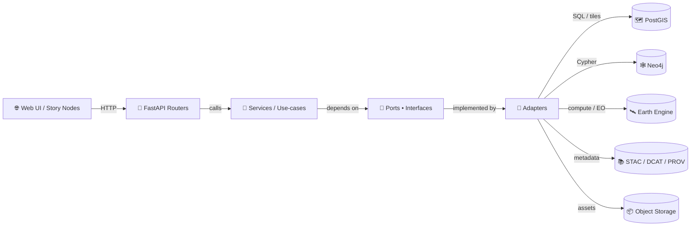

# 🧩 Adapters (`api/src/adapters`)

Adapters are the “edge” of the KFM API: they talk to the outside world (databases, catalogs, remote-sensing platforms, files, message queues, third‑party APIs) and translate **external IO** into **clean domain/service calls** (and back).

> [!TIP]
> Think **hexagonal / ports-and-adapters**: core logic stays stable ✅, adapters evolve freely 🔁.

---

## 🔎 What belongs here?

✅ **Good fits**
- DB connectors & repositories (🗺️ PostGIS, 🕸️ Neo4j)
- Remote data/platform clients (🛰️ Earth Engine, NASA/USGS endpoints, etc.)
- Catalog/metadata IO (📚 STAC, 🏷️ DCAT, 🧾 PROV)
- Tile and asset serving helpers (🧱 XYZ/TMS tiles, 3D Tiles, COG/GeoTIFF access)
- Auth providers / token verifiers (🔐 if implemented as an external boundary)
- File/object storage clients (📦 S3/MinIO/local)

🚫 **Anti-patterns**
- Business rules or policy decisions
- Cross-entity orchestration (belongs in services/use-cases)
- “Random utilities” that don’t touch IO
- Framework glue that should live in routers/controllers (unless this repo treats routers as inbound adapters)

---

## 🧠 Key concepts (quick glossary)

- **Port (🔌)**: an interface the core depends on (e.g., `DatasetCatalogPort`, `GraphPort`, `FeatureStorePort`).
- **Adapter (🧩)**: a concrete implementation of a port (e.g., `PostGISFeatureStore`, `Neo4jGraphAdapter`).
- **DTO / Schema (📦)**: request/response shapes used at boundaries (API / external services).
- **Mapping (🔁)**: translation between DTOs and domain models.

---

## 🗺️ Where adapters sit in the KFM pipeline



> [!IMPORTANT]
> UI and other clients should **never** bypass the API to talk directly to datastores (especially Neo4j). Keep the boundary clean.

---

## 📁 Suggested folder layout

> This repository may not match this exact tree yet—use it as the **north star** for organizing adapters consistently.

```text
📁 api/
  📁 src/
    📁 adapters/
      📂 inbound/                      🛬 Inbound adapters (optional): HTTP controllers, job runners
      📂 outbound/                     🛫 Outbound adapters: DBs, external APIs, storage
        📂 postgis/                    🗺️ PostGIS repos + SQL helpers
        📂 neo4j/                      🕸️ Graph adapter + Cypher helpers
        📂 gee/                        🛰️ Earth Engine + remote sensing IO
        📂 catalogs/                   📚 STAC/DCAT/PROV read/write/validate
        📂 tiles/                      🧱 Tile utilities (XYZ/TMS), caching
        📂 storage/                    📦 S3/MinIO/local file storage
      📂 mappers/                      🔁 DTO ↔ domain transforms
      📄 errors.py                     🧯 Adapter error types (translate external failures)
      📄 __init__.py                   🧬 Package init
```

---

## 🧱 Adapter “contract” checklist

Every adapter should clearly define:

### 1) Inputs & outputs 📦
- Accept **domain-friendly** inputs (IDs, value objects, filters), not framework request objects.
- Return **domain models** or **well-scoped DTOs** (avoid leaking driver objects like raw DB cursors).

### 2) Determinism & provenance 🧾
- Treat IO as a *reproducible step*:
  - log what was fetched/produced (dataset IDs, query params, time range, bounding boxes)
  - record the transformation configuration (versions, CRS transforms, filters)
  - attach provenance references for downstream catalogs/graph/story usage

### 3) Errors & resilience 🛡️
- Translate low-level exceptions into **typed adapter errors**.
- Enforce:
  - timeouts ⏱️
  - retries with backoff 🔁 (where safe)
  - idempotency ✅ for “upserts”
  - circuit-breaking 🚧 for fragile external services

### 4) Observability 🔭
- Structured logs (include trace/request IDs)
- Metrics-friendly events (counts, durations, failures)
- Avoid logging secrets 🔒

### 5) Security 🧯
- Input validation before constructing queries
- Parameterized SQL / safe query-building
- Least privilege credentials (read-only where possible)

---

## 🗺️ Common adapter families in KFM

### 🗺️ PostGIS adapters (vector/raster + tiles)
Typical responsibilities:
- Spatial queries (bbox, polygon, intersects, within)
- CRS handling (normalize to web-friendly CRS where needed)
- Output formats:
  - GeoJSON for web interchange
  - Tile endpoints (XYZ/TMS), cached rasters/MBTiles
  - COG/GeoTIFF metadata + ranges

**Implementation notes**
- Favor connection pooling.
- Favor *query helpers* that keep SQL readable and testable.
- Keep geometry ops explicit and well-documented (buffer units, projections, etc.).

---

### 🕸️ Neo4j graph adapters (entities, events, relationships)
Typical responsibilities:
- Upserting nodes/edges using deterministic IDs
- Maintaining references to catalog items (don’t store “bulky” assets in graph)
- Supporting semantic queries and graph traversals

**Implementation notes**
- Prefer idempotent merges/upserts to avoid duplicates.
- Store references (STAC Item IDs, dataset IDs, DOIs) rather than the full payload.

---

### 🛰️ Remote sensing / Earth observation adapters
Typical responsibilities:
- Offloading heavy computations to external EO platforms
- Pulling results back into KFM as assets + metadata
- Ensuring outputs land in governed formats (e.g., COG + STAC, uncertainty fields)

**Implementation notes**
- Cache expensive calls (where allowed by licensing and freshness needs).
- Consider async job execution for long-running EO tasks.

---

### 📚 Catalog & standards adapters (STAC / DCAT / PROV)
Typical responsibilities:
- Creating/validating STAC collections/items for assets
- Emitting DCAT dataset entries for discovery
- Capturing PROV activities for lineage (inputs → steps → outputs)

**Implementation notes**
- Enforce schema validation in CI (treat metadata as a first-class artifact).
- Cross-link catalog entries (STAC ↔ DCAT ↔ PROV ↔ graph references).

---

## 🧪 Testing strategy (recommended)

### Unit tests ✅
- Mapping correctness (DTO ↔ domain)
- Query-builder logic (SQL/Cypher generation)
- Error translation paths

### Contract tests 📜
- “Given this input, adapter returns this normalized domain output”
- Stable against refactors

### Integration tests 🧰
- Run against containerized PostGIS/Neo4j
- Seed minimal fixtures
- Validate:
  - CRS normalization
  - bbox / intersects correctness
  - merge/upsert idempotency
  - catalog record creation

> [!TIP]
> If you can’t run a real dependency in CI, add a **local docker compose** profile for developers and keep mocks very thin.

---

## ➕ Adding a new adapter (recipe)

1. **Define the port (🔌)**  
   Add an interface/Protocol in the core (services/use-cases layer).

2. **Implement the adapter (🧩)**  
   Create a new module in `api/src/adapters/outbound/<name>/...`.

3. **Add config + DI (⚙️)**  
   - Environment-driven configuration (URLs, creds, timeouts)
   - Wire into dependency injection (FastAPI dependencies or your DI container)

4. **Add mapping + validation (🔁)**  
   - DTO/domain mapping
   - Schema validation for external IO formats

5. **Add tests (🧪)**  
   - Unit + integration tests
   - Add fixtures and golden files if relevant (GeoJSON, STAC Items)

6. **Update docs (📝)**  
   - Add the adapter to this README’s “families” section if it’s a new category

---

## ✅ PR checklist (paste into your PR)

- [ ] Adapter implements a port (no direct calls from core to external libs)
- [ ] Config uses env vars / settings (no hardcoded secrets)
- [ ] Uses timeouts + safe retries (where appropriate)
- [ ] Translates external errors to typed adapter errors
- [ ] Logs are structured + do not leak secrets
- [ ] Integration tests cover happy path + failure path
- [ ] Metadata/provenance updated if producing assets (STAC/DCAT/PROV)

---

## 📚 Project knowledge library (how these files inform adapters)

> Keep this as a “living bookshelf” 📖. When you touch an adapter category, skim the relevant references.

### 🧭 Architecture, governance, and standards
- Kansas Frontier Matrix (KFM) – Comprehensive Technical Documentation.docx
- 🌟 Kansas Frontier Matrix – Latest Ideas & Future Proposals.docx
- MARKDOWN_GUIDE_v13.md.gdoc
- Comprehensive Markdown Guide_ Syntax, Extensions, and Best Practices.docx
- Data Spaces.pdf
- Introduction to Digital Humanism.pdf
- On the path to AI Law’s prophecies and the conceptual foundations of the machine learning age.pdf
- Principles of Biological Autonomy - book_9780262381833.pdf

### 🗺️ Geospatial & mapping (PostGIS + tiles + cartography)
- python-geospatial-analysis-cookbook.pdf
- KFM- python-geospatial-analysis-cookbook-over-60-recipes-to-work-with-topology-overlays-indoor-routing-and-web-application-analysis-with-python.pdf
- making-maps-a-visual-guide-to-map-design-for-gis.pdf
- Mobile Mapping_ Space, Cartography and the Digital - 9789048535217.pdf
- PostgreSQL Notes for Professionals - PostgreSQLNotesForProfessionals.pdf
- compressed-image-file-formats-jpeg-png-gif-xbm-bmp.pdf
- Cloud-Based Remote Sensing with Google Earth Engine-Fundamentals and Applications.pdf

### 📈 Analytics, modeling, and evidence discipline
- Scientific Modeling and Simulation_ A Comprehensive NASA-Grade Guide.pdf
- regression-analysis-with-python.pdf
- Regression analysis using Python - slides-linear-regression.pdf
- Understanding Statistics & Experimental Design.pdf
- graphical-data-analysis-with-r.pdf
- think-bayes-bayesian-statistics-in-python.pdf
- Deep Learning for Coders with fastai and PyTorch - Deep.Learning.for.Coders.with.fastai.and.PyTorch.pdf

### ⚙️ Performance, concurrency, and systems
- Scalable Data Management for Future Hardware.pdf
- concurrent-real-time-and-distributed-programming-in-java-threads-rtsj-and-rmi.pdf
- responsive-web-design-with-html5-and-css3.pdf
- webgl-programming-guide-interactive-3d-graphics-programming-with-webgl.pdf

### 🧠 Graph & optimization
- Spectral Geometry of Graphs.pdf
- Generalized Topology Optimization for Structural Design.pdf

### 🔒 Security & hardening
- ethical-hacking-and-countermeasures-secure-network-infrastructures.pdf
- Gray Hat Python - Python Programming for Hackers and Reverse Engineers (2009).pdf

### 🧰 “Grab bag” programming references (useful for adapter implementations)
- A programming Books.pdf
- B-C programming Books.pdf
- D-E programming Books.pdf
- F-H programming Books.pdf
- I-L programming Books.pdf
- M-N programming Books.pdf
- O-R programming Books.pdf
- S-T programming Books.pdf
- U-X programming Books.pdf

