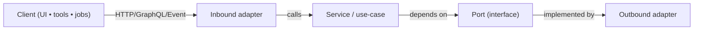

# 🛬 Inbound Adapters (aka “the edge of the system”)


Inbound adapters are where **the outside world touches KFM**: HTTP requests, GraphQL queries, webhooks/events, and scheduled/CLI jobs.  
They translate external protocols → internal service/use-case calls, while enforcing **contracts, governance, and safety rails** 🔒🧭.

> [!TIP]
> Keep inbound adapters **thin**: validate → authorize → map DTO → call service → map response → emit audit/telemetry.

---

## 🔗 Quick links

- 📚 Parent: `api/src/adapters/README.md`
- 🛫 Outbound adapters (DBs/APIs/storage): `api/src/adapters/outbound/`
- 🔁 DTO ↔ domain transforms: `api/src/adapters/mappers/`
- 🧯 Adapter error types: `api/src/adapters/errors.py`

---

## 🧭 Table of contents

- [📘 Overview](#-overview)
- [🗺️ Where inbound sits in the KFM pipeline](#️-where-inbound-sits-in-the-kfm-pipeline)
- [🧩 What belongs in inbound](#-what-belongs-in-inbound)
- [🧱 Directory map](#-directory-map)
- [🧰 Patterns](#-patterns)
  - [🌐 HTTP controllers](#-http-controllers)
  - [🧬 GraphQL boundary](#-graphql-boundary)
  - [⏱️ Jobs & runners](#️-jobs--runners)
  - [📨 Events & webhooks](#-events--webhooks)
- [✅ Contract-first workflow](#-contract-first-workflow)
- [🔐 Security, governance, and “do no harm” rules](#-security-governance-and-do-no-harm-rules)
- [🧯 Errors & problem details](#-errors--problem-details)
- [📡 Observability](#-observability)
- [🗺️ Geospatial API conventions](#️-geospatial-api-conventions)
- [🧪 Testing](#-testing)
- [🧑‍💻 Templates](#-templates)
- [✅ Definition of done](#-definition-of-done)
- [📚 Reference shelf](#-reference-shelf)

---

## 📘 Overview

### Purpose
Provide a **governed API boundary** that serves KFM evidence and operations through **well-defined contracts** (REST/GraphQL/jobs), without bypassing the pipeline.

### Scope
| ✅ In scope (inbound) | ❌ Out of scope (not inbound) |
|---|---|
| Request parsing & validation | Business rules / domain logic |
| AuthN/AuthZ, roles, policy gates | Direct DB/Cypher/SQL calls |
| DTO ↔ domain mapping (via `mappers/`) | ETL, catalog building, graph building |
| Rate limiting, idempotency, correlation IDs | Rendering UI or authoring stories |
| Translating errors into stable API responses | Heavy compute without job orchestration |

### Audience
- **Primary:** API + backend developers
- **Secondary:** Data stewards reviewing governance gates; UI devs consuming endpoints

### Terms
- **Inbound adapter:** Protocol handler (HTTP controller, GraphQL resolver, job runner, webhook consumer)
- **Port:** Interface the service layer depends on (implemented by outbound adapters)
- **DTO:** Data Transfer Object (wire format / API schema)
- **Evidence-first:** No unsourced narrative output; return provenance links/IDs whenever applicable 🧾

---

## 🗺️ Where inbound sits in the KFM pipeline

> [!IMPORTANT]
> **Pipeline ordering is non-negotiable:**  
> `ETL → Catalogs (STAC/DCAT/PROV) → Graph → API → UI → Story Nodes → Focus Mode`

Inbound adapters implement the **API** step—meaning they must **not** “reach around” governance outputs.

> [!IMPORTANT]
> **API boundary rule:** UI clients must never talk directly to Neo4j/PostGIS/object storage.  
> All access is mediated through governed APIs (this layer) 🔒



> [!NOTE]
> If the Mermaid diagram doesn’t render in your viewer, open this file on GitHub (Mermaid-enabled) or in a Mermaid viewer.

---

## 🧩 What belongs in inbound

Inbound adapters are **protocol-specific**. Typical “shapes”:

- 🌐 **HTTP controllers** (FastAPI routers/controllers)
- 🧬 **GraphQL resolvers** (query/mutation boundary)
- ⏱️ **Jobs/runners** (scheduled tasks, CLI tooling that calls services)
- 📨 **Events/webhooks** (ingest messages from external systems)
- 🧱 **Middleware** (CORS, correlation IDs, auth, rate limiting)

---

## 🧱 Directory map

### Current module neighborhood 🧭

```text
📁 api/src/adapters/
  📁 inbound/                      # 🛬 Inbound adapters (HTTP controllers, job runners, event consumers)
    📄 README.md                   # 👈 you are here
  📁 outbound/                     # 🛫 Outbound adapters: DBs, external APIs, storage
    📁 postgis/                    # 🗺️ PostGIS repos + SQL helpers
    📁 neo4j/                      # 🕸️ Graph adapter + Cypher helpers
    📁 gee/                        # 🛰️ Earth Engine + remote sensing IO
    📁 catalogs/                   # 📚 STAC/DCAT/PROV read/write/validate
    📁 tiles/                      # 🧱 Tile utilities (XYZ/TMS), caching
    📁 storage/                    # 📦 S3/MinIO/local file storage
  📁 mappers/                      # 🔁 DTO <-> domain transforms
  📄 errors.py                     # 🧯 Adapter error types (translate external failures)
  📄 __init__.py                   # 🧩 package init
```

### Suggested inbound structure (add as needed) 🧱✨

```text
📁 inbound/
  📁 http/                         # 🌐 FastAPI routers/controllers (thin)
  📁 graphql/                      # 🧬 GraphQL schema + resolvers (thin)
  📁 jobs/                         # ⏱️ APScheduler/Celery runners + CLI entrypoints
  📁 events/                       # 📨 consumers/webhooks + message DTOs
  📁 middleware/                   # 🧱 CORS, auth, rate limit, correlation IDs
  📁 schemas/                      # 🧾 request/response DTOs (Pydantic) (optional)
  📄 README.md                     # 📘 module rules + patterns
  📄 __init__.py                   # 🧩 package init
```

> [!TIP]
> If your FastAPI routers currently live in `api/src/routers/`, treat them as inbound adapters conceptually.  
> Over time you can re-export routers from `inbound/http/` (or keep this folder as “standards + shared utilities”).

---

## 🧰 Patterns

### 🌐 HTTP controllers

**Responsibilities:**
- ✅ Parse path/query/body, validate types/ranges
- ✅ Authenticate & authorize (role + policy checks)
- ✅ Enforce pagination/limits/timeouts
- ✅ Attach correlation IDs + idempotency keys when relevant
- ✅ Map DTO → domain (via `mappers/`)
- ✅ Call service/use-case
- ✅ Map domain → response DTO
- ✅ Emit telemetry/audit events (without leaking sensitive data)

**Anti-patterns:**
- ❌ Direct SQL/Cypher in controllers
- ❌ Business logic branching in controllers
- ❌ Returning raw DB errors to clients
- ❌ “Convenience” endpoints that bypass catalogs/provenance

> [!NOTE]
> KFM endpoints commonly include:
> - 🗺️ Geospatial layer retrieval (GeoJSON / tiles)
> - 🧠 Analysis/simulation triggers
> - 🎬 Story node management (list/get/publish/draft flows)

#### Minimal FastAPI route skeleton 🧩

```python
# 📄 api/src/adapters/inbound/http/layers.py

from fastapi import APIRouter, Depends, HTTPException
from pydantic import BaseModel, Field

router = APIRouter(prefix="/layers", tags=["layers"])

class LayerResponse(BaseModel):
    id: str
    name: str
    format: str = Field(description="GeoJSON | MVT | COG | ...")
    provenance_ref: str | None = Field(default=None, description="PROV/STAC/DCAT reference")

@router.get("/{layer_id}", response_model=LayerResponse)
async def get_layer(layer_id: str):
    # 1) validate inputs (pydantic / explicit checks)
    # 2) authz gate (role/policy)
    # 3) call service/use-case
    # 4) map to DTO and return
    raise HTTPException(status_code=501, detail="Not implemented")
```

---

### 🧬 GraphQL boundary

Use GraphQL when you need **client-shaped responses** for graph-like navigation (Person ↔ Event ↔ Place, etc.), but keep it governed:

- ✅ Require pagination for list fields
- ✅ Rate-limit expensive resolvers
- ✅ Enforce policy gates per field/type where needed
- ✅ Prefer **catalog-backed identifiers** in responses (STAC item ids, dataset ids, prov ids)
- ✅ Do not allow ad-hoc Cypher passthrough

> [!CAUTION]
> Avoid “raw Cypher” endpoints or resolvers. GraphQL should not become an escape hatch around governance.

---

### ⏱️ Jobs & runners

Jobs are inbound adapters too (they are “clients” of the service layer). Use them for:

- 🧱 Tile cache warmups / rebuilds
- 🗂️ Catalog validation tasks
- 🧾 Provenance compaction or export
- 🛰️ Remote sensing batch pulls (via outbound GEE adapter)
- 📦 Packaging “offline packs” / snapshots

**Rules:**
- ✅ Jobs call services/use-cases; they don’t talk to DBs directly
- ✅ Job inputs are validated the same way as HTTP inputs
- ✅ Job outputs write artifacts with IDs and provenance metadata

---

### 📨 Events & webhooks

Common patterns:
- **External → internal**: receive webhook/event, validate signature + schema, enqueue a job/use-case
- **Internal → external**: inbound should never push directly; emit domain events and let an outbound adapter deliver

**Rules:**
- ✅ Verify authenticity (HMAC / token / mTLS) where applicable
- ✅ Enforce replay protection (timestamps, nonce, idempotency keys)
- ✅ Store minimal payload; reference canonical artifacts in storage/catalogs

---

## ✅ Contract-first workflow

> [!IMPORTANT]
> Add/modify the contract **before** implementing behavior.

Checklist:
- [ ] Update OpenAPI/Swagger (REST) or GraphQL schema (GraphQL)
- [ ] Define request/response DTOs (+ examples)
- [ ] Define error responses (stable error codes)
- [ ] Define redaction/sensitivity rules for outputs
- [ ] Add contract tests + at least one integration test
- [ ] Add telemetry schema updates if new events/fields are introduced
- [ ] Add/refresh documentation (this README + API docs)

---

## 🔐 Security, governance, and “do no harm” rules

### Roles & permissions 🔑
Expect role-based access (e.g., public viewer / contributor / admin). Inbound is where:
- the request identity is established,
- the role is computed,
- and policy gates are enforced **consistently**.

### Sensitivity propagation 🧷
- Any output must be **at least as restricted** as its most restricted input.
- Redact/aggregate sensitive geometry when needed (e.g., avoid precise coordinates for sensitive sites).
- Prefer returning **references** (catalog/prov ids) over dumping raw sensitive payloads.

### Focus Mode constraints 🎯
Focus Mode is allowed to be helpful, but not reckless:
- AI suggestions must be **opt-in** and clearly labeled 🤖
- Never output sensitive locations or personal data
- Maintain “evidence-first” behavior: link claims to sources/provenance

---

## 🧯 Errors & problem details

Inbound should translate internal exceptions into stable, client-safe responses.

Suggested approach:
- Raise/propagate domain-safe errors from the service layer
- Convert `AdapterError` (see `api/src/adapters/errors.py`) into:
  - HTTP status code
  - machine-readable error code
  - human-readable message (non-sensitive)
  - optional `trace_id` / `request_id`

Example “problem details” shape:
```json
{
  "type": "https://kfm.dev/problems/authorization_failed",
  "title": "Authorization failed",
  "status": 403,
  "detail": "You do not have access to this resource.",
  "instance": "req_01HXYZ..."
}
```

---

## 📡 Observability

Inbound adapters should standardize:
- 🧾 **Correlation IDs** (generate if missing, propagate downstream)
- 📊 **Metrics** (request count, latency, error rates, cache hits)
- 🧠 **Tracing** (span per request + per outbound call)
- 🧷 **Audit events** (especially for “publish”, “approve”, “redact”, “AI accepted”)

> [!TIP]
> If you’re logging payloads, log **shapes + counts**, not raw sensitive content.

---

## 🗺️ Geospatial API conventions

Common inbound expectations for geospatial endpoints:

- **BBox filters**: validate ordering and clamp max area
- **CRS clarity**: document the CRS expected for inputs and returned geometries
- **Pagination**: required for feature lists
- **Tiles**: prefer `/{z}/{x}/{y}` style with clear XYZ/TMS semantics
- **Formats**: explicit content negotiation (`GeoJSON`, `MVT`, `COG`, etc.)
- **Caching**: cache safe, public artifacts (tiles, catalog JSON) aggressively 📦

---

## 🧪 Testing

Recommended test layers:
- ✅ Unit tests for DTO validation and mapping
- ✅ Contract tests (OpenAPI/GraphQL)
- ✅ Integration tests for:
  - auth/roles
  - bbox queries
  - story node publish flows
  - tile endpoints (basic smoke + cache headers)

> [!NOTE]
> For geospatial results, consider “golden files” with tolerant geometry comparisons (area/length within epsilon).

---

## 🧑‍💻 Templates

### New endpoint template 🧱

1) **Contract**
- add OpenAPI path / GraphQL field
- add request/response examples

2) **DTO**
- `RequestModel` / `ResponseModel`
- strict validation for bbox/time/ids

3) **Route**
- thin controller that calls a service

4) **Tests**
- contract test
- integration test (happy + unauthorized + invalid input)

5) **Docs**
- update endpoint docs + this module README if a new pattern is introduced

---

## ✅ Definition of done

- [ ] Contracts updated first (OpenAPI/GraphQL)
- [ ] DTOs validate inputs (no “stringly typed” params)
- [ ] Controller is thin (no business rules, no direct DB calls)
- [ ] AuthN/AuthZ + policy gates included (where applicable)
- [ ] Stable error codes + safe messages
- [ ] Telemetry/audit events wired (where it matters)
- [ ] Tests added (unit + contract + integration)
- [ ] Docs updated (including examples)

---

## 📚 Reference shelf

<details>
<summary>📚 Project library used to inform inbound boundary conventions (click to expand)</summary>

### 🗺️ Geospatial / mapping / tiles
- 📄 `python-geospatial-analysis-cookbook.pdf`
- 📄 `KFM- python-geospatial-analysis-cookbook-over-60-recipes-to-work-with-topology-overlays-indoor-routing-and-web-application-analysis-with-python.pdf`
- 📄 `making-maps-a-visual-guide-to-map-design-for-gis.pdf`
- 📄 `Mobile Mapping_ Space, Cartography and the Digital - 9789048535217.pdf`
- 📄 `compressed-image-file-formats-jpeg-png-gif-xbm-bmp.pdf`
- 📄 `webgl-programming-guide-interactive-3d-graphics-programming-with-webgl.pdf`

### 🛰️ Remote sensing / Earth observation
- 📄 `Cloud-Based Remote Sensing with Google Earth Engine-Fundamentals and Applications.pdf`

### 🗄️ Databases / scaling / federation
- 📄 `PostgreSQL Notes for Professionals - PostgreSQLNotesForProfessionals.pdf`
- 📄 `Scalable Data Management for Future Hardware.pdf`
- 📄 `Data Spaces.pdf`

### 🕸️ Graph / algorithms / optimization
- 📄 `Spectral Geometry of Graphs.pdf`
- 📄 `Generalized Topology Optimization for Structural Design.pdf`

### 📈 Statistics / modeling / simulation
- 📄 `Scientific Modeling and Simulation_ A Comprehensive NASA-Grade Guide.pdf`
- 📄 `Regression analysis using Python - slides-linear-regression.pdf`
- 📄 `regression-analysis-with-python.pdf`
- 📄 `think-bayes-bayesian-statistics-in-python.pdf`
- 📄 `Understanding Statistics & Experimental Design.pdf`
- 📄 `graphical-data-analysis-with-r.pdf`

### 🌐 Web UX conventions
- 📄 `responsive-web-design-with-html5-and-css3.pdf`

### 🧠 Systems / autonomy / philosophy
- 📄 `Principles of Biological Autonomy - book_9780262381833.pdf`
- 📄 `Introduction to Digital Humanism.pdf`

### ⚖️ Governance / AI law foundations
- 📄 `On the path to AI Law’s prophecies and the conceptual foundations of the machine learning age.pdf`

### 🛡️ Security mindset (defensive)
- 📄 `ethical-hacking-and-countermeasures-secure-network-infrastructures.pdf`
- 📄 `Gray Hat Python - Python Programming for Hackers and Reverse Engineers (2009).pdf`

### 🧵 Concurrency / distributed systems background
- 📄 `concurrent-real-time-and-distributed-programming-in-java-threads-rtsj-and-rmi.pdf`

### 🧰 Programming compendiums (quick reference shelf)
- 📄 `A programming Books.pdf`
- 📄 `B-C programming Books.pdf`
- 📄 `D-E programming Books.pdf`
- 📄 `F-H programming Books.pdf`
- 📄 `I-L programming Books.pdf`
- 📄 `M-N programming Books.pdf`
- 📄 `O-R programming Books.pdf`
- 📄 `S-T programming Books.pdf`
- 📄 `U-X programming Books.pdf`

### 🧾 Project-specific docs
- 📄 `Kansas Frontier Matrix (KFM) – Comprehensive Technical Documentation.docx`
- 📄 `🌟 Kansas Frontier Matrix – Latest Ideas & Future Proposals.docx`
- 📄 `MARKDOWN_GUIDE_v13.md.gdoc`
- 📄 `Kansas-Frontier-Matrix_ Open-Source Geospatial Historical Mapping Hub Design.pdf`
- 📄 `Comprehensive Markdown Guide_ Syntax, Extensions, and Best Practices.docx`

</details>

