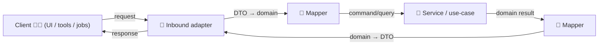

# 🔁 Mappers (DTO ↔ Domain)


Mappers are the **translation layer** that keeps KFM clean, governed, and evolvable 🧭✨.

They convert:
- 🌐 **Inbound DTOs** (HTTP/GraphQL/Event payloads) → 🧠 **Domain Commands/Queries**
- 🧠 **Domain Results** → 🌐 **Outbound DTOs** (API responses, UI bundles)
- 🗺️ **Geo & time shapes** (bbox, CRS, intervals) → stable domain representations
- 📚 **Catalog & lineage refs** (STAC/DCAT/PROV IDs) → stable references embedded in responses

> [!IMPORTANT]
> A mapper must be **pure** (no I/O), **deterministic**, and **auditable**.
>
> ✅ map + validate + normalize + annotate provenance  
> ❌ query DB, call Neo4j, hit S3, call GEE, read env vars, fetch time, “helpfully” guess

---

## 🔗 Quick links

- 📚 Parent: `api/src/adapters/README.md`
- 🛬 Inbound adapters: `api/src/adapters/inbound/`
- 🛫 Outbound adapters: `api/src/adapters/outbound/`
- 🧯 Adapter error types: `api/src/adapters/errors.py`

---

## 🧭 Why this folder exists

Clean Architecture + KFM governance creates a simple rule:

> **Services/use-cases** should not “speak HTTP”, “speak SQL”, “speak GeoJSON”, or “speak Cypher”.

Mappers act as the **anti-corruption layer** so:
- domain logic stays stable when contracts evolve 📜➡️📜
- governance fields (classification/redaction/provenance) can be enforced consistently 🔒🧾
- UI gets predictable formats (GeoJSON/MVT/time-series bundles) without leaking internals 🗺️

---

## 🧱 Directory map (with emojis)

```text
📁 api/
  📁 src/
    📁 adapters/
      📁 mappers/                  🔁 DTO ↔ domain transforms (pure mapping, no I/O)
        📄 README.md               👈 you are here
```

### Suggested mapper sub-structure (grow as needed 🌱)

```text
📁 mappers/
  📁 http/                         🌐 REST DTOs ↔ domain
  📁 graphql/                      🧬 GraphQL types ↔ domain
  📁 events/                       📨 Webhook/event DTOs ↔ domain
  📁 geo/                          🗺️ Geo helpers (bbox, CRS, GeoJSON/MVT, simplification)
  📁 catalog/                      📚 STAC/DCAT/PROV DTOs ↔ domain references
  📁 graph/                        🕸️ Neo4j record ↔ domain entity (no Cypher!)
  📁 modeling/                     🧪 Simulation/analysis results ↔ domain evidence artifact
  📁 common/                       🧰 shared mapping primitives (time parsing, units, enums)
  📄 README.md
  📄 __init__.py
```

> [!TIP]
> Keep geo/catelog/prov mapping **centralized**. If every endpoint “does its own GeoJSON”, drift happens fast.

---

## ✅ Golden rules (non‑negotiables)

### 1) Mappers are pure functions 🧼
- ✅ `input -> output`
- ✅ no DB clients, no HTTP clients, no filesystem reads/writes
- ✅ no “current time” calls inside mapping (inject timestamps via service layer if needed)
- ✅ safe to run in unit tests without fixtures

### 2) Mappers do *not* implement business rules 🧠🚫
- ✅ translate + normalize + validate + annotate
- ❌ decide “what is allowed”, “what is true”, “what should happen next”

### 3) Never bypass provenance / classification 🧾🔐
- If input contains **classification**, output must preserve or increase restriction.
- If data is redacted/generalized upstream, do not “restore precision” downstream. Ever.

### 4) Stable contracts beat clever shortcuts 📜
- Prefer explicit fields over implicit inference.
- Prefer versioned DTOs over silent breaking changes.
- Prefer returning **references** (STAC/DCAT/PROV IDs) over dumping raw payloads.

---

## 🧭 How mappers fit into the pipeline



> [!NOTE]
> The **mapper boundary** is where we harden contracts: types, ranges, normalization rules, and provenance embedding.

---

## 🧩 What belongs in `mappers/`

### ✅ In scope
- DTO ↔ domain transforms (HTTP/GraphQL/events)
- Geo conversions (bbox parsing, CRS normalization, geometry serialization)
- Catalog references (STAC/DCAT/PROV IDs embedded in response DTOs)
- Error translation helpers (turn “we can’t map this” into stable error codes)
- Versioned schema conversions (v1 DTO → domain → v2 DTO)

### ❌ Out of scope
- SQL/Cypher generation
- DB row fetching
- Access control decisions
- caching, retries, circuit breakers
- file reads/writes (including “load a template JSON file”)

---

## 🧰 Naming conventions (practical + searchable 🔍)

Use names that answer two questions:
1) **From what → to what**
2) **For what contract**

Recommended:
- `to_domain_<thing>()` ✅
- `to_dto_<thing>()` ✅
- `to_geojson_feature()` ✅
- `to_mvt_layer()` ✅
- `to_stac_item()` ✅
- `to_dcat_dataset()` ✅
- `to_prov_bundle()` ✅

Avoid:
- `convert()` / `transform()` / `map()` (too vague) ❌
- `serialize()` when it’s also validating and reshaping ❌

---

## 🗺️ Geospatial mapping conventions

### CRS + coordinate order 🧭
- **Wire formats:** prefer WGS84 (EPSG:4326) for GeoJSON
- **Always document coordinate order:** GeoJSON is `[lon, lat]`
- **Input bbox:** validate ordering and maximum area (to prevent accidental “planet queries”) 🌍

### Geometry output formats 🧱
Common outputs per endpoint:
- 🧩 **GeoJSON** for features and light geometry
- 🧱 **MVT** for map tiles / fast UI rendering
- 🗂️ **WKT/WKB** as internal transport (never for UI unless explicitly requested)
- 🧊 **COG / raster** served as URLs + STAC metadata (not dumped inline)

### Geometry simplification 🎛️
If the UI needs low-zoom shapes:
- simplify geometry at the **service/outbound** stage (where you know zoom or resolution),
- but keep the mapping rules consistent and tested here.

> [!CAUTION]
> Simplification is a “lossy” transform. If you do it, you must:
> - mark it in metadata (e.g., `generalized=true`, tolerance value),
> - preserve provenance IDs,
> - never simplify sensitive geometries into **more revealing** shapes.

---

## ⏳ Time & timeline mapping conventions

KFM is timeline-heavy. Keep time mapping explicit:
- Use ISO-8601 strings on the wire (with timezone rules documented)
- Normalize domain time to a single representation (e.g., UTC instants + optional “fuzzy/uncertain” ranges)
- If historical dates are uncertain, do **not** fabricate precision—support:
  - `start`, `end`
  - `certainty`
  - `source_ref` (provenance)

---

## 📚 Catalog & provenance mapping (STAC/DCAT/PROV)

Mappers are the best place to enforce the “evidence-first” ergonomics for the UI:

### In responses, prefer `refs` over raw blobs 🧾
Return:
- `stac_item_id` / `stac_collection_id`
- `dcat_dataset_id`
- `prov_bundle_id` (or `prov_activity_id`)
- `license`, `attribution`, `lineage_summary` (small, safe)
- `asset_links` (URLs/paths), **not** file bodies

### For evidence artifacts (analysis/simulation/AI outputs) 🧪
Treat them like first-class datasets:
- same mapping rules as “normal” datasets
- include:
  - model/version identifier
  - parameter hashes (or param summaries)
  - uncertainty fields (CI/credible intervals, confidence)
  - provenance refs

---

## 🔐 Classification + redaction propagation

If a DTO includes sensitivity/classification fields:
- mappers must **carry them forward**
- and must not allow “downgrades” (no output less restricted than input)

Practical mapping pattern:
- Domain has `Classification` type (e.g., `public`, `restricted`, `confidential`)
- DTO carries `classification` + `redaction_notes[]`
- Mappers **merge** classification (max restriction wins)

> [!TIP]
> Keep a single `merge_classification(a, b)` helper in `mappers/common/` so every endpoint behaves the same.

---

## 🧯 Mapping errors (stable and boring is good)

Mapping failures should be:
- predictable,
- typed,
- safe to show to clients (no internal stack traces),
- and actionable (what field is wrong).

Suggested structure:
- `MapperError(code="INVALID_BBOX", field="bbox", detail="...")`
- `MapperError(code="UNSUPPORTED_FORMAT", field="format", detail="...")`

Then inbound adapters can translate these into API “problem details” responses.

---

## 🧪 Testing strategy (mappers are easy to test — do it 🧪✅)

### Recommended tests
- ✅ **Unit tests** for every mapper function (happy path + edge cases)
- ✅ **Property tests** (optional but powerful):
  - round-trip mapping doesn’t lose required fields
  - “classification never downgrades”
  - bbox normalization always yields `minx<=maxx`, `miny<=maxy`
- ✅ **Golden files** for GeoJSON outputs (with tolerant comparisons)

### Special geospatial tests 🗺️
- invalid geometry handling (self-intersections, empty geometries)
- CRS conversion correctness for known sample points
- “too large bbox” rejection

---

## ⚡ Performance notes (don’t melt the API 🔥)

Mappers should be lightweight:
- avoid repeated deep copies
- avoid parsing/serializing JSON multiple times
- batch-map lists with vectorized loops where practical
- cache “static” enum maps / lookup tables in module scope (safe)

> [!NOTE]
> Any caching of *data* belongs in services/outbound adapters, not in mappers.

---

## 🧑‍💻 Examples

### Example 1: Request DTO → Domain Query 🧩

```python
# 📄 api/src/adapters/mappers/http/layers.py

from dataclasses import dataclass
from typing import Literal, Optional

# --- DTOs (wire) ---
@dataclass(frozen=True)
class LayerQueryDTO:
    dataset_id: str
    bbox: Optional[tuple[float, float, float, float]]  # (minx, miny, maxx, maxy)
    format: Literal["geojson", "mvt"] = "geojson"
    limit: int = 500

# --- Domain (internal) ---
@dataclass(frozen=True)
class LayerQuery:
    dataset_id: str
    bbox: Optional[tuple[float, float, float, float]]
    output_format: str
    limit: int

def to_domain_layer_query(dto: LayerQueryDTO) -> LayerQuery:
    # validate + normalize
    if dto.limit <= 0 or dto.limit > 10_000:
        raise ValueError("limit out of range")
    if dto.bbox is not None:
        minx, miny, maxx, maxy = dto.bbox
        if minx > maxx or miny > maxy:
            raise ValueError("invalid bbox ordering")

    return LayerQuery(
        dataset_id=dto.dataset_id.strip(),
        bbox=dto.bbox,
        output_format=dto.format,
        limit=dto.limit,
    )
```

### Example 2: Domain Feature → GeoJSON Feature DTO 🗺️

```python
# 📄 api/src/adapters/mappers/geo/geojson.py

from dataclasses import dataclass
from typing import Any, Dict, Optional

@dataclass(frozen=True)
class GeoJSONFeatureDTO:
    type: str
    geometry: Dict[str, Any] | None
    properties: Dict[str, Any]
    id: Optional[str] = None

def to_geojson_feature(
    *,
    feature_id: str | None,
    geometry_geojson: Dict[str, Any] | None,
    properties: Dict[str, Any],
    provenance_ref: str | None,
) -> GeoJSONFeatureDTO:
    props = dict(properties)
    if provenance_ref:
        # keep provenance visible, not buried
        props["provenance_ref"] = provenance_ref

    return GeoJSONFeatureDTO(
        type="Feature",
        geometry=geometry_geojson,
        properties=props,
        id=feature_id,
    )
```

### Example 3: Domain Dataset Summary → “Catalog refs first” DTO 📚🧾

```python
# 📄 api/src/adapters/mappers/catalog/summary.py

from dataclasses import dataclass
from typing import Optional

@dataclass(frozen=True)
class DatasetSummaryDTO:
    dataset_id: str
    title: str
    description: str
    stac_item_id: Optional[str]
    dcat_dataset_id: Optional[str]
    prov_bundle_id: Optional[str]
    license: Optional[str]

def to_dataset_summary_dto(domain_obj) -> DatasetSummaryDTO:
    return DatasetSummaryDTO(
        dataset_id=domain_obj.dataset_id,
        title=domain_obj.title,
        description=domain_obj.description,
        stac_item_id=domain_obj.catalog_refs.stac_item_id,
        dcat_dataset_id=domain_obj.catalog_refs.dcat_dataset_id,
        prov_bundle_id=domain_obj.catalog_refs.prov_bundle_id,
        license=domain_obj.license,
    )
```

---

## ✅ Definition of done (for new/changed mappers)

- [ ] Pure mapping (no I/O)
- [ ] Validation is explicit (no silent coercions)
- [ ] Classification & redaction propagate (never downgrade)
- [ ] Provenance refs are preserved or enriched (never dropped)
- [ ] Unit tests cover edge cases (bbox/time/geometry)
- [ ] API contract examples updated (if mapper change affects wire format)
- [ ] No duplicate mapping logic scattered across endpoints

---

## 📚 Reference shelf (project library)

<details>
<summary>📚 All project files influencing mapper standards & guardrails (click to expand)</summary>

### 🧭 KFM architecture, governance, and authoring
- 📄 `MARKDOWN_GUIDE_v13.md.gdoc`
- 📄 `Kansas Frontier Matrix (KFM) – Comprehensive Technical Documentation.docx`
- 📄 `🌟 Kansas Frontier Matrix – Latest Ideas & Future Proposals.docx`
- 📄 `Kansas-Frontier-Matrix_ Open-Source Geospatial Historical Mapping Hub Design.pdf`
- 📄 `Comprehensive Markdown Guide_ Syntax, Extensions, and Best Practices.docx` *(doc style + structure)*

### 🗺️ Geospatial, GIS, mapping, and tiles
- 📄 `python-geospatial-analysis-cookbook.pdf`
- 📄 `KFM- python-geospatial-analysis-cookbook-over-60-recipes-to-work-with-topology-overlays-indoor-routing-and-web-application-analysis-with-python.pdf`
- 📄 `making-maps-a-visual-guide-to-map-design-for-gis.pdf`
- 📄 `Mobile Mapping_ Space, Cartography and the Digital - 9789048535217.pdf`
- 📄 `compressed-image-file-formats-jpeg-png-gif-xbm-bmp.pdf`

### 🛰️ Remote sensing / Earth observation
- 📄 `Cloud-Based Remote Sensing with Google Earth Engine-Fundamentals and Applications.pdf`

### 🗄️ Databases, scaling, federation
- 📄 `PostgreSQL Notes for Professionals - PostgreSQLNotesForProfessionals.pdf`
- 📄 `Scalable Data Management for Future Hardware.pdf`
- 📄 `Data Spaces.pdf`

### 🕸️ Graphs, topology, optimization
- 📄 `Spectral Geometry of Graphs.pdf`
- 📄 `Generalized Topology Optimization for Structural Design.pdf`

### 🧪 Modeling, statistics, uncertainty (evidence artifacts)
- 📄 `Scientific Modeling and Simulation_ A Comprehensive NASA-Grade Guide.pdf`
- 📄 `Understanding Statistics & Experimental Design.pdf`
- 📄 `graphical-data-analysis-with-r.pdf`
- 📄 `regression-analysis-with-python.pdf`
- 📄 `Regression analysis using Python - slides-linear-regression.pdf`
- 📄 `think-bayes-bayesian-statistics-in-python.pdf`
- 📄 `Deep Learning for Coders with fastai and PyTorch - Deep.Learning.for.Coders.with.fastai.and.PyTorchpdf` *(not indexed here, but part of the library)*

### 🌐 Web/UI delivery (contract surfaces)
- 📄 `responsive-web-design-with-html5-and-css3.pdf`
- 📄 `webgl-programming-guide-interactive-3d-graphics-programming-with-webgl.pdf`

### 🧠 Humanism, policy, and safety
- 📄 `Introduction to Digital Humanism.pdf`
- 📄 `On the path to AI Law’s prophecies and the conceptual foundations of the machine learning age.pdf`

### 🛡️ Security mindset (defensive)
- 📄 `ethical-hacking-and-countermeasures-secure-network-infrastructures.pdf`
- 📄 `Gray Hat Python - Python Programming for Hackers and Reverse Engineers (2009).pdf`

### 🧵 Concurrency / distributed systems background
- 📄 `concurrent-real-time-and-distributed-programming-in-java-threads-rtsj-and-rmi.pdf`

### 📚 Programming compendium shelf (quick reference)
- 📄 `A programming Books.pdf`
- 📄 `B-C programming Books.pdf`
- 📄 `D-E programming Books.pdf`
- 📄 `F-H programming Books.pdf`
- 📄 `I-L programming Books.pdf`
- 📄 `M-N programming Books.pdf`
- 📄 `O-R programming Books.pdf`
- 📄 `S-T programming Books.pdf`
- 📄 `U-X programming Books.pdf`

</details>

