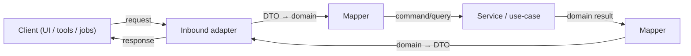
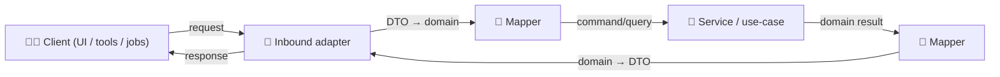

# 🔁 Mappers (DTO ↔ Domain)


Mappers are the **translation layer** that keeps KFM clean, governed, and evolvable 🧭✨

They convert:
- 🌐 **Inbound DTOs** (HTTP/GraphQL/Event payloads) → 🧠 **Domain Commands/Queries**
- 🧠 **Domain Results** → 🌐 **Outbound DTOs** (API responses, UI bundles, emitted events)
- 🗺️ **Geo & time shapes** (bbox, CRS, ROI, intervals) → stable domain representations
- 📚 **Catalog & lineage refs** (STAC/DCAT/PROV IDs) → stable references embedded in responses
- 🧪 **Evidence artifacts** (modeling/simulation outputs) → reproducible, provenance-first summaries + links

> [!IMPORTANT]
> A mapper must be **pure** (no I/O), **deterministic**, and **auditable**.
>
> ✅ map + validate + normalize + annotate provenance  
> ❌ query DB, call Neo4j, hit S3, call GEE, read env vars, fetch time, “helpfully” guess

---

## 🧭 Jump table (read the right README fast)

- 🌐 `http/` → `./http/README.md`
- 🧬 `graphql/` → `./graphql/README.md`
- 📨 `events/` → `./events/README.md`
- 🗺️ `geo/` → `./geo/README.md`
- 🕸️ `graph/` → `./graph/README.md`
- 📚 `catalog/` → `./catalog/README.md`
- 🧪 `modeling/` → `./modeling/README.md`
- 🧰 `common/` → `./common/README.md`

---

## 🔗 Quick links

- 📚 Parent: `api/src/adapters/README.md`
- 🛬 Inbound adapters (controllers/resolvers/jobs): `api/src/adapters/inbound/`
- 🛫 Outbound adapters (PostGIS/Neo4j/GEE/catalogs/tiles/storage): `api/src/adapters/outbound/`
- 🧯 Adapter error types: `api/src/adapters/errors.py`

---

## 🧠 Why this folder exists

Clean Architecture + KFM governance creates a simple rule:

> **Services/use-cases** should not “speak HTTP”, “speak SQL”, “speak GeoJSON”, or “speak Cypher”.

Mappers act as the **anti-corruption layer** so that:
- domain logic stays stable when contracts evolve 📜➡️📜
- governance fields (classification/redaction/provenance) stay consistent 🔒🧾
- UI gets predictable formats (GeoJSON/MVT/time-series bundles) without leaking internals 🗺️
- evidence outputs keep reproducibility + uncertainty semantics (no “magic confidence”) 🧪🎲

---

## 📁 Directory map (with emojis)

```text
📁 api/
  📁 src/
    📁 adapters/
      📁 mappers/                          🔁 DTO ↔ domain transforms (pure mapping, no I/O)
        📄 README.md                       👈 you are here
        📁 http/                           🌐 REST DTOs ↔ domain
          📄 README.md
        📁 graphql/                        🧬 GraphQL types ↔ domain
          📄 README.md
        📁 events/                         📨 Event/webhook DTOs ↔ domain
          📄 README.md
        📁 geo/                            🗺️ Geo helpers (bbox, CRS, GeoJSON/MVT shaping)
          📄 README.md
        📁 graph/                          🕸️ Neo4j record ↔ domain entity (no Cypher!)
          📄 README.md
        📁 catalog/                        📚 STAC/DCAT/PROV ↔ domain references
          📄 README.md
        📁 modeling/                       🧪 Evidence artifacts ↔ domain (uncertainty + reproducibility)
          📄 README.md
        📁 common/                         🧰 shared primitives (ids, hashing, time, units, classification)
          📄 README.md
        📄 __init__.py                     🧬 package init (optional)
```

> [!TIP]
> Keep geo/catalog/provenance mapping **centralized**. If every endpoint “does its own GeoJSON” or “invented its own PROV fields”, drift happens fast 🥲

---

## 🧩 Submodules at a glance

| Folder 📁 | Purpose 🎯 | Typical inputs → outputs | “Do / Don’t” |
|---|---|---|---|
| 🌐 `http/` | REST DTOs and problem details | query/path/body → domain → response DTO | ✅ strict validation • ❌ no FastAPI objects |
| 🧬 `graphql/` | GraphQL inputs/outputs, unions, cursors | GraphQL inputs → domain; domain → GraphQL types | ✅ opaque cursors • ❌ no dataloaders |
| 📨 `events/` | Message envelopes/webhooks | event DTO/envelope → domain command; domain → outbound event DTO | ✅ idempotency fields • ❌ signature verify |
| 🗺️ `geo/` | GeoJSON shaping, bbox/CRS rules | bbox/crs/roi → domain filters; geometry → GeoJSON | ✅ “no planet query” guards • ❌ heavy ops |
| 🕸️ `graph/` | Neo4j record → domain mapping | Neo4j record/node/rel → domain views | ✅ label/rel allowlists • ❌ Cypher building |
| 📚 `catalog/` | STAC/DCAT/PROV mapping | domain → metadata refs/shapes | ✅ refs-first + stable IDs • ❌ blob dumps |
| 🧪 `modeling/` | Modeling/sim outputs as evidence | domain run → evidence summary + assets/refs | ✅ uncertainty semantics • ❌ fake precision |
| 🧰 `common/` | shared primitives | ids/time/units/hash/classification | ✅ deterministic & tested • ❌ “god utils” |

---

## ✅ Golden rules (non‑negotiables)

### 1) Mappers are pure functions 🧼
- ✅ `input -> output`
- ✅ no DB clients, no HTTP clients, no filesystem reads/writes
- ✅ no “current time” calls inside mapping (inject timestamps via services/use-cases if needed)
- ✅ safe to run in unit tests without fixtures

### 2) Mappers do *not* implement business rules 🧠🚫
- ✅ translate + normalize + validate + annotate
- ❌ decide “what is allowed”, “what is true”, “what should happen next”

### 3) Never bypass provenance / classification 🧾🔐
- If input contains **classification**, output must preserve or increase restriction.
- If data is redacted/generalized upstream, do not “restore precision” downstream. Ever.
- Prefer returning **references** (STAC/DCAT/PROV IDs + asset links) instead of raw payload dumps.

### 4) Stable contracts beat clever shortcuts 📜
- Prefer explicit fields over implicit inference.
- Prefer versioned DTOs over silent breaking changes.
- Prefer boring, typed errors over ad-hoc `ValueError("bad")`.

---

## 🧭 How mappers fit into the pipeline

> [!NOTE]
> Some Mermaid renderers choke on reserved IDs (like `graph`) or unicode labels.  
> This diagram uses **safe IDs** and plain labels for maximum compatibility ✅



<details>
<summary>🎨 Optional Mermaid (emoji labels, may not render everywhere)</summary>


</details>

---

## 🧩 What belongs in `mappers/`

### ✅ In scope
- DTO ↔ domain transforms (HTTP/GraphQL/events)
- Geo conversions (bbox parsing, CRS normalization, GeoJSON shaping)
- Catalog references (STAC/DCAT/PROV IDs embedded in DTOs)
- Cursor/pagination helpers (bounded, deterministic)
- Error translation helpers (turn “we can’t map this” into stable error codes)
- Versioned schema conversions (v1 DTO → domain → v2 DTO)
- Evidence artifact shaping (modeling/simulation outputs as publishable artifacts)

### ❌ Out of scope
- SQL/Cypher generation
- DB row fetching
- Access control decisions
- caching, retries, circuit breakers
- file reads/writes (including “load a template JSON file”)
- signature verification (webhooks) and rate limiting (inbound concerns)

---

## 🧰 Naming conventions (practical + searchable 🔍)

Use names that answer two questions:
1) **From what → to what**
2) **For what contract**

Recommended:
- `to_domain_<thing>()` ✅
- `to_dto_<thing>()` ✅
- `to_geojson_feature()` ✅
- `to_stac_item()` ✅
- `to_dcat_dataset()` ✅
- `to_prov_bundle()` ✅
- `encode_cursor()` / `decode_cursor()` ✅

Avoid:
- `convert()` / `transform()` / `map()` (too vague) ❌
- `serialize()` when it’s also validating and reshaping ❌

---

## 🗺️ Geospatial mapping conventions

### CRS + coordinate order 🧭
- **Wire formats:** prefer WGS84 (EPSG:4326) for GeoJSON.
- **Always document axis order:** GeoJSON is `[lon, lat]`.
- **BBox inputs:** validate ordering and cap max area (anti “planet queries”) 🌍🛑

### Geometry output formats 🧱
Common outputs per endpoint:
- 🧩 **GeoJSON** for inspection + light geometry
- 🧱 **MVT** for dense layers / fast map UI
- 🗂️ **WKT/WKB** as internal transport (never default UI)
- 🧊 **COG / raster** served as links + STAC metadata (not dumped inline)

### Geometry simplification 🎛️
- Simplification is a lossy transform.
- If you do it, you must:
  - mark it (`generalized=true`, tolerance value)
  - preserve provenance IDs
  - never simplify sensitive geometries into *more revealing* shapes

---

## ⏳ Time & timeline mapping conventions

KFM is timeline-heavy. Keep time mapping explicit:
- Use ISO-8601 strings on the wire (document timezone rules).
- Normalize domain time to a single representation (commonly UTC instants + optional fuzzy ranges).
- If historical dates are uncertain, do **not** fabricate precision—support:
  - `start`, `end`
  - `certainty`
  - `source_ref` (provenance)

---

## 📚 Catalog & provenance mapping (STAC/DCAT/PROV)

Mappers are the best place to enforce “evidence-first” ergonomics for the UI:

### In responses, prefer `refs` over raw blobs 🧾
Return:
- `stac_item_id` / `stac_collection_id`
- `dcat_dataset_id`
- `prov_bundle_id` (or `prov_activity_id`)
- `license`, `attribution`, `lineage_summary` (small, safe)
- `asset_links` (URLs/paths), **not** file bodies

### For evidence artifacts (analysis/simulation/AI outputs) 🧪
Treat them like first-class datasets:
- same mapping rules as “normal” datasets
- include:
  - model/method identifier + version
  - parameter hashes (or safe param summaries)
  - uncertainty semantics (CI/credible interval/error bounds) — explicit `kind`, `level`, `units`
  - provenance refs to inputs + generating activity

---

## 🔐 Classification + redaction propagation

If a DTO includes sensitivity/classification fields:
- mappers must **carry them forward**
- and must not allow downgrades (no output less restricted than input)

Practical mapping pattern:
- Domain has a `Classification` type (e.g., `public`, `restricted`, `confidential`)
- DTO carries `classification` + `redaction_notes[]`
- Mappers **merge** classification (max restriction wins)

> [!TIP]
> Put one canonical `merge_classification(a, b)` helper in `common/` so every endpoint behaves the same ✅

---

## 🧯 Mapping errors (stable and boring is good)

Mapping failures should be:
- predictable,
- typed,
- safe to show to clients (no internal stack traces),
- actionable (what field is wrong).

Suggested structure:
- `MapperError(code="INVALID_BBOX", field="bbox", detail="...")`
- `MapperError(code="UNSUPPORTED_FORMAT", field="format", detail="...")`

Inbound adapters translate these into:
- HTTP “problem details” (REST)
- GraphQL `extensions.code`
- event rejection / DLQ routing metadata (events)

> [!TIP]
> Treat error codes as contract surface. Changing codes is a breaking change 📜💥

---

## 🧪 Testing strategy (mappers are easy to test — do it 🧪✅)

### Recommended tests
- ✅ unit tests for every mapper function (happy path + edge cases)
- ✅ property tests (optional, high-value):
  - round-trip mapping doesn’t lose required fields
  - “classification never downgrades”
  - bbox normalization always yields `minx<=maxx`, `miny<=maxy`
- ✅ golden files for GeoJSON/STAC/PROV outputs (use tolerant comparisons for floats)

### Special geospatial tests 🗺️
- invalid geometry handling (self-intersections, empty geometries)
- CRS conversion correctness for known sample points
- “too large bbox” rejection (“planet query” defense)

---

## ⚡ Performance notes (don’t melt the API 🔥)

Mappers should be lightweight:
- avoid repeated deep copies
- avoid parsing/serializing JSON multiple times
- batch-map lists with vectorized loops where practical
- cache “static” enum maps / lookup tables in module scope (safe)

> [!NOTE]
> Caching *data* belongs in services/outbound adapters, not in mappers.

---

## 🧑‍💻 Examples (compact + realistic)

### Example 1: HTTP query DTO → domain query (with strict bounds) 🌐
```python
from dataclasses import dataclass
from typing import Optional, Literal

@dataclass(frozen=True)
class LayerQueryDTO:
    dataset_id: str
    bbox: Optional[str] = None                  # "minx,miny,maxx,maxy"
    crs: Literal["EPSG:4326", "EPSG:3857"] = "EPSG:4326"
    limit: int = 500

@dataclass(frozen=True)
class LayerQuery:
    dataset_id: str
    bbox: Optional[tuple[float, float, float, float]]
    crs: str
    limit: int

def to_domain_layer_query(dto: LayerQueryDTO, *, max_limit: int = 10_000) -> LayerQuery:
    if not dto.dataset_id.strip():
        raise ValueError("INVALID_BODY")
    if dto.limit <= 0 or dto.limit > max_limit:
        raise ValueError("LIMIT_TOO_LARGE")

    bbox_tuple = None
    if dto.bbox:
        parts = [p.strip() for p in dto.bbox.split(",")]
        if len(parts) != 4:
            raise ValueError("INVALID_BBOX")
        bbox_tuple = tuple(map(float, parts))
        minx, miny, maxx, maxy = bbox_tuple
        if minx > maxx or miny > maxy:
            raise ValueError("INVALID_BBOX")

    return LayerQuery(
        dataset_id=dto.dataset_id.strip(),
        bbox=bbox_tuple,
        crs=dto.crs,
        limit=dto.limit,
    )
```

### Example 2: Domain feature → GeoJSON Feature (refs-first) 🗺️
```python
from dataclasses import dataclass
from typing import Any, Dict, Optional

@dataclass(frozen=True)
class GeoJSONFeatureDTO:
    type: str
    geometry: Dict[str, Any] | None
    properties: Dict[str, Any]
    id: Optional[str] = None

def to_geojson_feature(*, feature_id: str | None, geometry: dict | None, properties: dict, provenance_ref: str | None) -> GeoJSONFeatureDTO:
    props = dict(properties)
    if provenance_ref:
        props["provenance_ref"] = provenance_ref

    return GeoJSONFeatureDTO(
        type="Feature",
        geometry=geometry,
        properties=props,
        id=feature_id,
    )
```

### Example 3: Domain dataset summary → catalog-refs DTO 📚
```python
from dataclasses import dataclass
from typing import Optional

@dataclass(frozen=True)
class DatasetSummaryDTO:
    dataset_id: str
    title: str
    stac_item_id: Optional[str]
    dcat_dataset_id: Optional[str]
    prov_activity_id: Optional[str]

def to_dataset_summary_dto(domain_obj) -> DatasetSummaryDTO:
    return DatasetSummaryDTO(
        dataset_id=domain_obj.dataset_id,
        title=domain_obj.title,
        stac_item_id=getattr(domain_obj.catalog_refs, "stac_item_id", None),
        dcat_dataset_id=getattr(domain_obj.catalog_refs, "dcat_dataset_id", None),
        prov_activity_id=getattr(domain_obj.catalog_refs, "prov_activity_id", None),
    )
```

---

## ✅ Definition of done (for new/changed mappers)

- [ ] Pure mapping (no I/O)
- [ ] Validation is explicit (no silent coercions)
- [ ] Classification & redaction propagate (never downgrade)
- [ ] Provenance refs preserved or enriched (never dropped)
- [ ] Uncertainty semantics explicit for evidence artifacts (kind/level/units)
- [ ] Unit tests cover edge cases (bbox/time/geometry)
- [ ] Contract examples updated (if mapper change affects wire format)
- [ ] No duplicate mapping logic scattered across endpoints

---

## 📚 Reference shelf (project library)

<details>
<summary>📚 All project files influencing mapper standards & guardrails (click to expand)</summary>

### 🧭 Project architecture & direction
- 📄 `Kansas Frontier Matrix (KFM) – Comprehensive Technical Documentation.docx`
- 📄 `🌟 Kansas Frontier Matrix – Latest Ideas & Future Proposals.docx`

### 🛰️ Remote sensing / Earth observation
- 📄 `Cloud-Based Remote Sensing with Google Earth Engine-Fundamentals and Applications.pdf`

### 🧪 Modeling, simulation, statistics, uncertainty
- 📄 `Scientific Modeling and Simulation_ A Comprehensive NASA-Grade Guide.pdf`
- 📄 `Understanding Statistics & Experimental Design.pdf`
- 📄 `regression-analysis-with-python.pdf`
- 📄 `Regression analysis using Python - slides-linear-regression.pdf`
- 📄 `think-bayes-bayesian-statistics-in-python.pdf`
- 📄 `graphical-data-analysis-with-r.pdf`
- 📄 `Deep Learning for Coders with fastai and PyTorch - Deep.Learning.for.Coders.with.fastai.and.PyTorchpdf` *(library item; filename as stored)*

### 🗺️ Geospatial, GIS, mapping, tiles, and media formats
- 📄 `python-geospatial-analysis-cookbook.pdf`
- 📄 `making-maps-a-visual-guide-to-map-design-for-gis.pdf`
- 📄 `Mobile Mapping_ Space, Cartography and the Digital - 9789048535217.pdf`
- 📄 `compressed-image-file-formats-jpeg-png-gif-xbm-bmp.pdf`
- 📄 `webgl-programming-guide-interactive-3d-graphics-programming-with-webgl.pdf`
- 📄 `responsive-web-design-with-html5-and-css3.pdf`

### 🗄️ Data systems, scaling, federation
- 📄 `PostgreSQL Notes for Professionals - PostgreSQLNotesForProfessionals.pdf`
- 📄 `Scalable Data Management for Future Hardware.pdf`
- 📄 `Data Spaces.pdf`

### 🕸️ Graphs & optimization (derived artifacts should still be traceable)
- 📄 `Spectral Geometry of Graphs.pdf`
- 📄 `Generalized Topology Optimization for Structural Design.pdf`

### 🧠 Humanism, governance, accountability framing
- 📄 `Introduction to Digital Humanism.pdf`
- 📄 `On the path to AI Law’s prophecies and the conceptual foundations of the machine learning age.pdf`
- 📄 `Principles of Biological Autonomy - book_9780262381833.pdf`

### 🛡️ Security mindset (defensive)
- 📄 `ethical-hacking-and-countermeasures-secure-network-infrastructures.pdf`
- 📄 `Gray Hat Python - Python Programming for Hackers and Reverse Engineers (2009).pdf`

### 🧵 Concurrency / distributed systems background
- 📄 `concurrent-real-time-and-distributed-programming-in-java-threads-rtsj-and-rmi.pdf`

### 📚 Programming compendium shelf (quick reference)
- 📄 `A programming Books.pdf`
- 📄 `B-C programming Books.pdf`
- 📄 `D-E programming Books.pdf`
- 📄 `F-H programming Books.pdf`
- 📄 `I-L programming Books.pdf`
- 📄 `M-N programming Books.pdf`
- 📄 `O-R programming Books.pdf`
- 📄 `S-T programming Books.pdf`
- 📄 `U-X programming Books.pdf`

</details>
