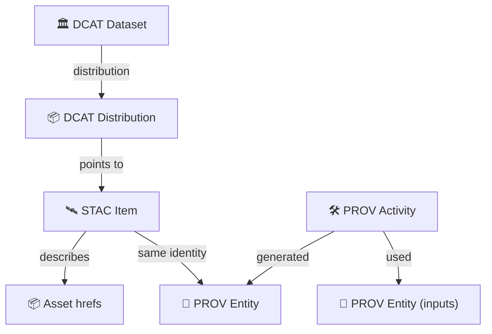

# 📚 Catalog Mappers (`api/src/adapters/mappers/catalog/`)

This folder contains **pure mappers** that translate KFM domain objects into **metadata artifacts** (and back) for:

- 🛰️ **STAC**: spatiotemporal assets (collections/items/assets)
- 🏛️ **DCAT**: discovery-oriented catalog entries (datasets/distributions)
- 🧾 **PROV**: provenance/lineage (entities/activities/agents)

> [!IMPORTANT]
> Catalog mappers are the metadata “truth layer” at the boundary:
> - ✅ deterministic, pure mapping (no network / DB / filesystem)
> - ✅ consistent IDs + versioning
> - ✅ classification + redaction propagation
> - ✅ evidence + uncertainty fields for analytical products
>
> If you can’t reproduce the same JSON from the same inputs, the mapper is too “smart” 🧠🚫

---

## 🔗 Neighbor links

- 📦 Parent: `📁 api/src/adapters/mappers/README.md`
- 🛬 Inbound: `📁 api/src/adapters/inbound/README.md`
- 🛫 Outbound: `📁 api/src/adapters/outbound/README.md`
- 🧯 Errors: `📄 api/src/adapters/errors.py`

---

## 🧱 Where this fits in the KFM pipeline

```mermaid
flowchart LR
  etl["🔧 ETL / Pipelines"] --> cat["📚 Catalogs"]
  cat --> graph["🕸️ Graph"]
  graph --> api["🚀 API"]
  api --> ui["🗺️ UI"]
  ui --> story["🎬 Story Nodes"]
  story --> focus["🎯 Focus Mode"]
```

> [!NOTE]
> “Catalogs” here means **publishable, standards-aligned metadata** that lets KFM remain interoperable and auditable.

---

## 📁 Folder map (emoji layout)

```text
📁 api/
  📁 src/
    📁 adapters/
      📁 mappers/
        📁 catalog/                      📚 STAC/DCAT/PROV mapping (pure)
          📄 README.md                   👈 you are here
          📄 __init__.py                 🧬 package init (optional)
          📄 stac.py                     🛰️ domain ↔ STAC (Collections/Items/Assets)
          📄 dcat.py                     🏛️ domain ↔ DCAT (Dataset/Distribution)
          📄 prov.py                     🧾 domain ↔ PROV (Entities/Activities/Agents)
          📄 ids.py                      🆔 stable ID + version helpers (pure)
          📄 validate.py                 ✅ schema checks (pure, optional)
          📄 normalize.py                🧼 normalization utilities (times, bbox, roles)
```

> [!TIP]
> If your repo uses different filenames, keep the **separation by standard** anyway (`stac.py`, `dcat.py`, `prov.py`). It prevents “metadata soup” 🥣.

---

## ✅ Golden rules for catalog mappers

### 1) No I/O, ever 🧼
- ❌ no PostGIS/Neo4j calls
- ❌ no S3 reads
- ❌ no Earth Engine calls
- ❌ no “download metadata from a URL”
- ✅ take domain objects + injected refs → return JSON-serializable dict/models

### 2) Deterministic output 🔁
Same input → same output:
- stable ID generation
- stable ordering for assets/links
- stable time normalization
- stable string formatting (no locale surprises)

### 3) Evidence-first defaults 🧾
Metadata must always prefer:
- explicit **sources** and **lineage refs**
- explicit **license/attribution**
- explicit **uncertainty** for modeled outputs
- explicit **processing parameters** (or hashes) for derived products

### 4) Don’t leak sensitive info 🔐
- never emit secrets in hrefs (tokens, credentials)
- avoid precise coordinates if redaction says “generalize”
- if access requires signed URLs → emit a reference, not the signature

---

## 🧩 What mappers produce

### 🛰️ STAC (Collections/Items/Assets)
Use STAC as the *asset index*:
- 📦 **Collection**: logical grouping (e.g., “Kansas 1850–1900 Maps”, “Landcover Model Runs”)
- 📄 **Item**: a single spatiotemporal record (a scan, a tile set, a model output for a run)
- 🧱 **Asset**: actual file(s) or API endpoints (COG, GeoJSON, MVT, PDF, PNG, etc.)

**KFM bias:** assets are real artifacts → treat STAC as the canonical “what exists” index.

---

### 🏛️ DCAT (Dataset/Distribution)
Use DCAT as the *discovery layer*:
- 📚 **Dataset**: what humans search for + cite
- 📦 **Distribution**: how it’s accessed (STAC endpoint, download URL, API route, tile service)

**KFM bias:** DCAT points to distributions; one distribution can be a STAC Collection endpoint.

---

### 🧾 PROV (Entities/Activities/Agents)
Use PROV as the *lineage layer*:
- 🧱 **Entity**: data or artifact (inputs + outputs)
- 🛠️ **Activity**: processing step (ETL run, georeference, model training, tiling)
- 🧑‍🔬 **Agent**: who/what performed it (pipeline, service, user, org)

**KFM bias:** PROV is how we keep **trust** in long pipelines and AI outputs.

---

## 🧠 Cross-standard linking (the “metadata triangle” 🔺)

When possible, each published artifact should link across standards:

- STAC Item ↔ PROV Entity (same artifact identity)
- PROV Activity ↔ input/output Entities
- DCAT Dataset ↔ Distributions ↔ STAC Collection/Item endpoints



> [!TIP]
> If you can only implement one cross-link at first, do:
> **STAC Item → PROV Activity/Entity ref**. It’s the highest trust-per-byte 🧾💪

---

## 🆔 IDs, versioning, and reproducibility

### Stable IDs
Catalog mappers should not invent “random UUIDs” unless they’re supplied by domain.
Preferred strategies:

- **Source-derived**: from authoritative IDs (archive ID, DOI, dataset slug)
- **Content-derived**: hash of immutable inputs (file checksum, normalized params)
- **Run-derived**: deterministic from (pipeline_id + run_timestamp + inputs_hash)

### Versioning
If an artifact changes, your metadata should show it clearly:

- `version`: semantic or integer version
- `created_at` / `updated_at`
- `input_hash` / `params_hash` for derived outputs
- `software_versions`: pipeline/service version, library versions (when available)

> [!CAUTION]
> If you overwrite assets in-place but keep the same STAC Item ID, you’ve broken provenance.  
> Prefer **write-once paths + new IDs** (or explicit version suffix).

---

## 🗺️ Geospatial conventions (catalog-safe)

Catalog mapping should be strict about:
- bbox ordering and CRS assumptions
- geometry coordinate order for GeoJSON (`[lon, lat]`)
- temporal extent clarity (instant vs interval)
- resolution/scale fields for rasters/tiles when known

### Asset types (examples)
- 🧊 `image/tiff; application=geotiff; profile=cloud-optimized` (COG)
- 🧱 `application/vnd.mapbox-vector-tile` (MVT)
- 🗺️ `application/geo+json` (GeoJSON)
- 🖼️ `image/png` / `image/jpeg` (thumbnails)
- 📄 `application/pdf` (scanned maps, reports)

> [!TIP]
> Include **thumbnails** and **overview assets** in STAC. The UI gets faster and users trust what they can see 👀

---

## 🧪 “Evidence artifacts” (models, stats, simulations) are first-class datasets

KFM produces not only maps, but *claims* (classifications, regressions, simulations).  
Catalog mappers must support “evidence artifacts” that carry:

- 📌 method / model name + version
- 🎛️ parameters (or param hash + a safe summary)
- 📈 uncertainty / accuracy (CI/credible interval, confusion matrix summaries, error bounds)
- 🧾 provenance (inputs → activity → outputs)

This aligns with:
- 🧪 simulation reproducibility thinking
- 📊 statistical reporting discipline
- 🛰️ remote sensing accuracy expectations
- ⚖️ transparent accountability for AI-derived layers

---

## ✅ Validation strategy (pure + CI-friendly)

Even if validation runs in pipelines/CI, keep mapper-friendly helpers:

- schema conformance checks (STAC/JSON-schema, DCAT/JSON-LD shape, PROV JSON)
- cross-link checks:
  - STAC assets referenced exist in expected storage namespace
  - DCAT distributions point to resolvable endpoints
  - PROV references resolve to known IDs (or are at least syntactically valid)

> [!NOTE]
> “Validate” here means *validate the structure you produced*, not the existence of remote resources (that’s I/O).

---

## 🧯 Error handling (mapper-level)

Catalog mappers should raise **boring, stable** errors:

- `INVALID_TIME_RANGE`
- `INVALID_BBOX`
- `MISSING_LICENSE`
- `MISSING_ATTRIBUTION`
- `UNSAFE_HREF`
- `CLASSIFICATION_DOWNGRADE_ATTEMPT`

Then inbound/outbound layers can translate into API errors or pipeline failures.

---

## 🧩 Minimal examples (short, safe, practical)

### 🛰️ STAC Item (ultra-minimal example)
```json
{
  "type": "Feature",
  "stac_version": "1.0.0",
  "id": "kfm-item-123",
  "bbox": [-99.0, 37.0, -94.0, 40.0],
  "geometry": null,
  "properties": {
    "datetime": "1870-01-01T00:00:00Z",
    "title": "Historical map scan (example)",
    "license": "CC-BY-4.0"
  },
  "assets": {
    "cog": {
      "href": "s3://kfm-assets/maps/example.tif",
      "type": "image/tiff",
      "roles": ["data"]
    }
  }
}
```

### 🏛️ DCAT Dataset (conceptual JSON-ish shape)
```json
{
  "id": "kfm-dcat-123",
  "title": "Historical Maps Collection (example)",
  "license": "CC-BY-4.0",
  "distribution": [
    {
      "accessURL": "https://api.kfm.local/stac/collections/historical-maps",
      "format": "STAC"
    }
  ]
}
```

### 🧾 PROV (conceptual minimal JSON-ish shape)
```json
{
  "entity": { "kfm-entity-raw": {}, "kfm-entity-out": {} },
  "activity": { "kfm-activity-georef": { "used": ["kfm-entity-raw"], "generated": ["kfm-entity-out"] } },
  "agent": { "kfm-agent-pipeline": {} }
}
```

> [!TIP]
> Keep examples short in the repo; keep full “golden files” under tests/fixtures. 🧪📦

---

## 🧪 Testing (high value, low pain)

Recommended test layers:
- ✅ unit tests for pure mapping
- ✅ golden-file tests for STAC/DCAT/PROV outputs
- ✅ property tests (optional):
  - “same inputs → same IDs”
  - “classification never downgrades”
  - “asset hrefs never include secrets”

Suggested fixture folders:
```text
📁 tests/
  📁 fixtures/
    📁 catalog/
      📄 stac_item_min.json
      📄 stac_collection_min.json
      📄 dcat_dataset_min.json
      📄 prov_bundle_min.json
```

---

## ✅ Definition of done (for catalog mapping work)

- [ ] Pure mapping (no I/O)
- [ ] Stable IDs and stable ordering
- [ ] Links across standards where possible (STAC ↔ PROV ↔ DCAT)
- [ ] License + attribution always present (or explicit “unknown” policy documented)
- [ ] Uncertainty/accuracy fields supported for modeled outputs
- [ ] Redaction/classification propagation enforced
- [ ] Golden fixtures + tests added
- [ ] Docs/examples updated

---

## 📚 Project bookshelf (all project files, mapped to catalog needs)

<details>
<summary>📚 Click to expand — how every project file informs catalog mapping</summary>

### 🧭 KFM architecture & governance (what “publishable” means)
- 📄 **Kansas Frontier Matrix (KFM) – Comprehensive Technical Documentation.docx** → pipeline stages, repo structure, “catalog outputs” concept
- 📄 **🌟 Kansas Frontier Matrix – Latest Ideas & Future Proposals.docx** → forward-looking interoperability + reproducible pipelines + performance goals

### 🛰️ Remote sensing + accuracy discipline (catalog must carry uncertainty)
- 📄 **Cloud-Based Remote Sensing with Google Earth Engine-Fundamentals and Applications.pdf** → EO outputs, accuracy expectations, dataset lineage

### 🧪 Modeling, simulation, and reproducibility (PROV-first mindset)
- 📄 **Scientific Modeling and Simulation_ A Comprehensive NASA-Grade Guide.pdf** → deterministic runs, declared inputs/outputs, reproducibility norms
- 📄 **Understanding Statistics & Experimental Design.pdf** → experimental validity, reporting discipline for derived layers
- 📄 **regression-analysis-with-python.pdf** → model metadata, parameters, diagnostics as evidence artifacts
- 📄 **Regression analysis using Python - slides-linear-regression.pdf** → compact reporting patterns for regression artifacts
- 📄 **think-bayes-bayesian-statistics-in-python.pdf** → uncertainty/credible interval framing for evidence outputs
- 📄 **graphical-data-analysis-with-r.pdf** → exploratory artifacts & plots as publishable evidence (with lineage)
- 📄 **Deep Learning for Coders with fastai and PyTorch - Deep.Learning.for.Coders.with.fastai.and.PyTorchpdf** → model versioning, dataset splits, reproducible training metadata

### 🗺️ GIS, cartography, and representation (STAC assets should be UI-ready)
- 📄 **python-geospatial-analysis-cookbook.pdf** → geometry formats, CRS hygiene, practical GIS IO patterns
- 📄 **making-maps-a-visual-guide-to-map-design-for-gis.pdf** → map communication, clarity, legends/thumbnails/overviews
- 📄 **Mobile Mapping_ Space, Cartography and the Digital - 9789048535217.pdf** → mobile-first constraints, context and scale
- 📄 **compressed-image-file-formats-jpeg-png-gif-xbm-bmp.pdf** → correct media types, thumbnails, compression tradeoffs
- 📄 **webgl-programming-guide-interactive-3d-graphics-programming-with-webgl.pdf** → 3D/interactive assets → catalog as discoverable resources
- 📄 **responsive-web-design-with-html5-and-css3.pdf** → contract surfaces that are predictable for web clients

### 🗄️ Databases, scalability, and interoperability framing
- 📄 **PostgreSQL Notes for Professionals - PostgreSQLNotesForProfessionals.pdf** → practical data typing, extensions, and metadata hygiene
- 📄 **Scalable Data Management for Future Hardware.pdf** → caching and pipelines; metadata must support efficient retrieval
- 📄 **Data Spaces.pdf** → interoperability, federation mindset, “metadata as glue”
- 📄 **Spectral Geometry of Graphs.pdf** → graph-derived artifacts should be cataloged as reproducible evidence
- 📄 **Generalized Topology Optimization for Structural Design.pdf** → optimization runs produce artifacts/parameters → provenance + publishable outputs

### 🧠 Human-centered accountability + policy context (why PROV matters)
- 📄 **Introduction to Digital Humanism.pdf** → transparency, human-facing interpretation, governance framing
- 📄 **On the path to AI Law’s prophecies and the conceptual foundations of the machine learning age.pdf** → accountability expectations for ML outputs (lineage + disclosures)
- 📄 **Principles of Biological Autonomy - book_9780262381833.pdf** → systems thinking; keep “why/how” metadata for behavior and adaptation

### 🛡️ Security mindset (catalog shouldn’t leak secrets)
- 📄 **ethical-hacking-and-countermeasures-secure-network-infrastructures.pdf** → threat modeling for URLs, credentials, and metadata exposure
- 📄 **Gray Hat Python - Python Programming for Hackers and Reverse Engineers (2009).pdf** → “assume hostile inputs”; validate hrefs and sanitize metadata

### 🧵 Concurrency and distributed execution (runs, jobs, and stable IDs)
- 📄 **concurrent-real-time-and-distributed-programming-in-java-threads-rtsj-and-rmi.pdf** → distributed runs: stable IDs + deterministic outputs matter

### 🧰 Programming compendiums (implementation reference shelf)
- 📄 **A programming Books.pdf**
- 📄 **B-C programming Books.pdf**
- 📄 **D-E programming Books.pdf**
- 📄 **F-H programming Books.pdf**
- 📄 **I-L programming Books.pdf**
- 📄 **M-N programming Books.pdf**
- 📄 **O-R programming Books.pdf**
- 📄 **S-T programming Books.pdf**
- 📄 **U-X programming Books.pdf**

</details>

