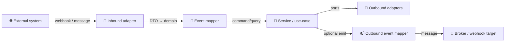
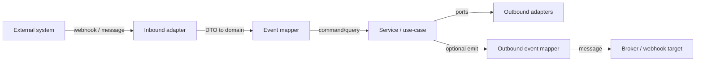

# 📨 Event Mappers (`api/src/adapters/mappers/events/`)

This folder contains **pure mapping code** for event-driven boundaries:

- 📨 Webhooks (HTTP → event payload)
- 📬 Message queues / brokers (event envelopes)
- 🧾 Internal domain events exported outward (optional)

Event mappers translate:
- 🌐 **Event DTOs** (wire format) → 🧠 **Domain commands/queries**
- 🧠 **Domain results** → 🌐 **Outbound events** (if KFM emits events)

> [!IMPORTANT]
> **Event mappers are pure and deterministic**:
> - ✅ validate, normalize, canonicalize
> - ✅ attach correlation/provenance refs (if provided)
> - ✅ enforce stable enums and versions
> - ❌ verify signatures (inbound responsibility)
> - ❌ call DB/Neo4j/S3/GEE (outbound responsibility)
> - ❌ decide policy/business logic (service/use-case responsibility)

---

## 🔗 Neighbor links

- 📦 Parent: `📁 api/src/adapters/mappers/README.md`
- 🧰 Shared primitives: `📁 api/src/adapters/mappers/common/README.md`
- 🛬 Inbound adapters: `📁 api/src/adapters/inbound/README.md`
- 🛫 Outbound adapters: `📁 api/src/adapters/outbound/README.md`
- 🧯 Errors: `📄 api/src/adapters/errors.py`

---

## 📁 Folder map (emoji layout)

```text
📁 api/
  📁 src/
    📁 adapters/
      📁 mappers/
        📁 events/                         📨 event DTO ↔ domain mapping (pure)
          📄 README.md                     👈 you are here
          📄 __init__.py                   🧬 package init (optional)
          📄 envelope.py                   📦 canonical event envelope types + normalization
          📄 types.py                      🏷️ event type registry + versioning helpers
          📄 inbound.py                    🛬 webhook/queue payload DTO → domain commands
          📄 outbound.py                   🛫 domain → emitted event DTOs (optional)
          📄 validate.py                   ✅ pure schema + field validation helpers
          📄 sanitize.py                   🧼 redaction-safe logging views (no secrets)
```

> [!TIP]
> Keep event naming/versioning logic centralized. Distributed “stringly typed event names” become chaos fast 🌀

---

## 🧭 How events fit the KFM pipeline

Events can trigger or announce pipeline stages, but **must not bypass** the canonical ordering:

`ETL → Catalogs → Graph → API → UI → Story Nodes → Focus Mode`

Here’s the safe mental model:



> [!NOTE]
> If your Mermaid renderer is strict, replace emojis in labels or use the “fallback” diagram below.

<details>
<summary>🧯 Mermaid fallback (no emoji)</summary>


</details>

---

## ✅ Core principles (events edition)

### 1) Contract-first, versioned events 📜
- Events are **public contracts** once emitted or accepted.
- Treat event schemas like API schemas:
  - version them
  - document them
  - test them with golden fixtures

### 2) Envelope + payload separation 📦
Most event systems need:
- **Envelope** (metadata): `event_id`, `type`, `version`, `timestamp`, `correlation_id`, `producer`, `classification`, etc.
- **Payload**: event-specific data

Mappers should normalize both.

### 3) Idempotency is mandatory 🔁
Events get duplicated. Systems retry. Networks fail.

Mappers should:
- validate `event_id`
- normalize `idempotency_key` (if present)
- ensure timestamps are parseable (but do not “invent” time)

### 4) Safety-first sanitization 🔐
Events are an exfiltration vector.
- never allow credentials/tokens to “accidentally” live in payload fields
- provide safe logging views (redacted)

---

## 🏷️ Event naming conventions (recommended)

Use dot-delimited names:
- `dataset.ingested`
- `catalog.item.published`
- `catalog.collection.updated`
- `graph.entity.upserted`
- `tiles.cache.warmed`
- `storynode.published`
- `model.run.completed`
- `focus.summary.generated` *(if you ever externalize Focus Mode actions)*

Naming rules:
- lowercase
- nouns and verbs, in that order
- no spaces
- stable across refactors

> [!TIP]
> Keep an explicit registry of event types and versions in `types.py` so you can reject unknown/unsupported events consistently.

---

## 📦 Canonical envelope fields (KFM-friendly)

Recommended envelope schema (minimal and useful):

| Field | Type | Why it matters |
|---|---|---|
| `event_id` | string | idempotency + traceability |
| `type` | string | routing + schema lookup |
| `version` | int or semver string | evolution without breaking consumers |
| `timestamp` | ISO-8601 string | ordering / debugging (not “truth”) |
| `correlation_id` | string | trace a request across systems |
| `producer` | string | provenance / audit |
| `subject` | string/object | “what” the event is about (dataset_id, item_id, etc.) |
| `classification` | string | propagate sensitivity |
| `provenance_ref` | string | PROV/STAC/DCAT ref if applicable |
| `signature` | string | (optional) included but verified in inbound adapter |

> [!IMPORTANT]
> Signature verification is **not** a mapper responsibility.  
> Mappers may only validate that a signature field is shaped correctly.

---

## 🧼 Normalization rules (what event mappers should do)

### Strings
- trim whitespace
- forbid control characters in IDs
- canonicalize enums (e.g., `GeoJSON` → `geojson`)

### Timestamps
- parse ISO-8601 (strict)
- normalize to UTC representation internally (if your domain uses UTC)
- reject “floating” times unless explicitly allowed

### IDs
- ensure `event_id` is stable (UUID or stable hash; depends on contract)
- ensure `subject` identifiers are present and normalized (`dataset_id`, `stac_item_id`, etc.)

### Classification & redaction
- enforce **no downgrade** (output cannot be less restricted than input)
- keep redaction notes append-only (never silently drop)

---

## 🧯 Error handling (stable mapper errors)

Event mapping failures should be boring and searchable:
- `INVALID_EVENT_ID`
- `UNKNOWN_EVENT_TYPE`
- `UNSUPPORTED_EVENT_VERSION`
- `INVALID_TIMESTAMP`
- `MISSING_SUBJECT`
- `INVALID_ENUM`
- `CLASSIFICATION_DOWNGRADE_ATTEMPT`
- `UNSAFE_PAYLOAD` *(token-like content detected)*

> [!TIP]
> Treat these codes like public API surface. Changing them is a breaking change 📜💥

---

## 🛡️ Security guardrails (events are hostile inputs)

### Threat model mindset 🕵️‍♂️
Assume:
- payloads are malicious
- payloads are huge
- payloads repeat (replays)
- payloads contain secrets or attempt injection

### Mapper-level defenses ✅
- strict schema validation (types, ranges, max lengths)
- safe string normalization (strip controls)
- detect secret-like patterns in fields meant for hrefs/metadata
- provide redacted views for logs (`sanitize.py`)

### Not mapper responsibilities 🚫
- verifying HMAC/mTLS signatures
- rate limiting and replay windows
- storing raw payloads
- “quarantine” workflows

Those belong in inbound adapters / services.

---

## 🧾 Provenance-first events (KFM bias)

Whenever an event relates to a publishable artifact, include references:
- `stac_item_id`
- `dcat_dataset_id`
- `prov_activity_id` / `prov_bundle_id`
- `asset_href` (safe, non-secret)

> [!TIP]
> For derived/model outputs, include:
> - `model_id` / `model_version`
> - `params_hash`
> - `input_refs[]` (IDs, not full payloads)
> - `uncertainty_summary` (small + safe)

---

## 🧪 Testing strategy (events)

### ✅ Unit tests
- envelope parsing
- enum canonicalization
- classification merge rules
- timestamp parsing edge cases
- unsafe payload detection

### ✅ Golden fixtures
Store representative events:
```text
🧪 tests/
  📁 fixtures/
    📁 events/
      📄 dataset_ingested_v1.json
      📄 catalog_item_published_v1.json
      📄 graph_entity_upserted_v1.json
      📄 model_run_completed_v1.json
      📄 storynode_published_v1.json
```

### ✅ Compatibility tests
- v1 payload accepted and mapped to domain correctly
- v2 payload accepted with new optional fields
- unknown versions rejected with stable error code

---

## 🧑‍💻 Minimal templates (safe + copy/paste)

### 1) Event envelope DTO (illustrative)

```python
# 📄 api/src/adapters/mappers/events/envelope.py

from dataclasses import dataclass
from typing import Any, Optional

@dataclass(frozen=True)
class EventEnvelopeDTO:
    event_id: str
    type: str
    version: int
    timestamp: str  # ISO-8601 on the wire
    correlation_id: Optional[str] = None
    producer: Optional[str] = None
    subject: Optional[Any] = None
    classification: Optional[str] = None
    provenance_ref: Optional[str] = None
    payload: Any = None
```

### 2) Mapping an inbound event to a domain command

```python
# 📄 api/src/adapters/mappers/events/inbound.py

from dataclasses import dataclass
from .envelope import EventEnvelopeDTO

@dataclass(frozen=True)
class IngestDatasetCommand:
    dataset_id: str
    source_ref: str | None
    correlation_id: str | None

def to_domain_command(envelope: EventEnvelopeDTO) -> IngestDatasetCommand:
    # 1) validate envelope.type/version (strict)
    # 2) validate subject/payload fields
    # 3) normalize strings, ids
    # 4) return a domain command for the service layer
    dataset_id = (envelope.subject or {}).get("dataset_id") if isinstance(envelope.subject, dict) else None
    if not dataset_id:
        raise ValueError("MISSING_SUBJECT")

    return IngestDatasetCommand(
        dataset_id=str(dataset_id).strip(),
        source_ref=envelope.provenance_ref,
        correlation_id=envelope.correlation_id,
    )
```

### 3) Emitting an outbound event (optional)

```python
# 📄 api/src/adapters/mappers/events/outbound.py

from dataclasses import dataclass
from typing import Any

@dataclass(frozen=True)
class OutboundEventDTO:
    event_id: str
    type: str
    version: int
    timestamp: str
    correlation_id: str | None
    subject: dict[str, Any]
    payload: dict[str, Any]

def to_outbound_event(*, domain_result, now_iso: str, correlation_id: str | None) -> OutboundEventDTO:
    # now_iso is injected (no hidden time in mappers)
    return OutboundEventDTO(
        event_id=domain_result.event_id,
        type="catalog.item.published",
        version=1,
        timestamp=now_iso,
        correlation_id=correlation_id,
        subject={"stac_item_id": domain_result.stac_item_id},
        payload={"prov_activity_id": domain_result.prov_activity_id},
    )
```

---

## ✅ Definition of done (events mapper work)

- [ ] Pure mapping (no I/O)
- [ ] Strict schema + version handling
- [ ] Stable error codes
- [ ] Idempotency fields supported (`event_id`, optional `idempotency_key`)
- [ ] Classification/redaction propagation enforced
- [ ] Provenance refs preserved (STAC/DCAT/PROV)
- [ ] Safe logging/sanitization utilities available
- [ ] Golden fixtures + unit tests added
- [ ] Docs updated when contracts change

---

## 📚 Project bookshelf (all project files, mapped to event-mapper needs)

<details>
<summary>📚 Click to expand — how the full project library informs event mapping</summary>

### 🧭 KFM architecture, governance, and contract discipline
- 📄 **Kansas Frontier Matrix (KFM) – Comprehensive Technical Documentation.docx** → boundaries, services vs adapters, governed API concepts
- 📄 **🌟 Kansas Frontier Matrix – Latest Ideas & Future Proposals.docx** → future integrations, interoperability, scale direction
- 📄 **MARKDOWN_GUIDE_v13.md.gdoc** → pipeline ordering language, contract-first documentation style
- 📄 **Comprehensive Markdown Guide_ Syntax, Extensions, and Best Practices.docx** → consistent doc structure, checklists, conventions

### 🗄️ Data systems & federation mindset (events as glue)
- 📄 **Data Spaces.pdf** → interoperability/federation framing; metadata + messaging as connective tissue
- 📄 **Scalable Data Management for Future Hardware.pdf** → throughput/caching/latency constraints that motivate async events
- 📄 **PostgreSQL Notes for Professionals - PostgreSQLNotesForProfessionals.pdf** → transaction/idempotency thinking; stable typing

### 🧵 Concurrency / distributed execution (why idempotency + explicit time matter)
- 📄 **concurrent-real-time-and-distributed-programming-in-java-threads-rtsj-and-rmi.pdf** → distributed systems fundamentals (ordering, retries, determinism)

### 🛡️ Security mindset (events are hostile inputs)
- 📄 **ethical-hacking-and-countermeasures-secure-network-infrastructures.pdf** → threat modeling, validation, replay/abuse considerations
- 📄 **Gray Hat Python - Python Programming for Hackers and Reverse Engineers (2009).pdf** → adversarial thinking; don’t trust payloads; sanitize logs

### 🧾 Provenance & accountability (why events should carry refs)
- 📄 **On the path to AI Law’s prophecies and the conceptual foundations of the machine learning age.pdf** → accountability expectations for ML outputs
- 📄 **Introduction to Digital Humanism.pdf** → human-centered transparency norms
- 📄 **Principles of Biological Autonomy - book_9780262381833.pdf** → systems thinking; track interactions and adaptation

### 🛰️ Remote sensing + modeling outputs (events for long-running jobs)
- 📄 **Cloud-Based Remote Sensing with Google Earth Engine-Fundamentals and Applications.pdf** → batch EO compute patterns; asynchronous workflows
- 📄 **Scientific Modeling and Simulation_ A Comprehensive NASA-Grade Guide.pdf** → reproducibility and run metadata (inputs/outputs/params)

### 📈 Stats/ML evidence artifacts (why payloads should include uncertainty summaries)
- 📄 **Understanding Statistics & Experimental Design.pdf**
- 📄 **regression-analysis-with-python.pdf**
- 📄 **Regression analysis using Python - slides-linear-regression.pdf**
- 📄 **think-bayes-bayesian-statistics-in-python.pdf**
- 📄 **graphical-data-analysis-with-r.pdf**
- 📄 **Deep Learning for Coders with fastai and PyTorch - Deep.Learning.for.Coders.with.fastai.and.PyTorchpdf**

### 🗺️ Geospatial/UI delivery (events can reference map assets, tiles, and story updates)
- 📄 **python-geospatial-analysis-cookbook.pdf**
- 📄 **making-maps-a-visual-guide-to-map-design-for-gis.pdf**
- 📄 **Mobile Mapping_ Space, Cartography and the Digital - 9789048535217.pdf**
- 📄 **compressed-image-file-formats-jpeg-png-gif-xbm-bmp.pdf**
- 📄 **responsive-web-design-with-html5-and-css3.pdf**
- 📄 **webgl-programming-guide-interactive-3d-graphics-programming-with-webgl.pdf**

### 🕸️ Graph & optimization shelf (events can announce graph rebuilds / optimization runs)
- 📄 **Spectral Geometry of Graphs.pdf**
- 📄 **Generalized Topology Optimization for Structural Design.pdf**

### 🧰 Programming compendium shelf (implementation reference)
- 📄 **A programming Books.pdf**
- 📄 **B-C programming Books.pdf**
- 📄 **D-E programming Books.pdf**
- 📄 **F-H programming Books.pdf**
- 📄 **I-L programming Books.pdf**
- 📄 **M-N programming Books.pdf**
- 📄 **O-R programming Books.pdf**
- 📄 **S-T programming Books.pdf**
- 📄 **U-X programming Books.pdf**

</details>

