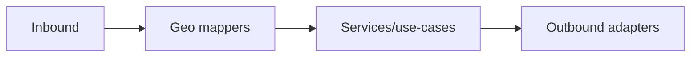

# 🗺️ Geo Mappers (`api/src/adapters/mappers/geo/`)

This folder contains **pure, deterministic** mapping utilities for geospatial data at the API boundary:

- 🧭 CRS + axis-order normalization
- 📦 BBox parsing + guardrails (anti “planet query”)
- 🧩 GeoJSON Feature/FeatureCollection shaping
- 🧱 MVT contract shaping (parameters + metadata; not tile generation)
- 🔎 Geometry validation & safe normalization
- 🧊 Asset/link typing (COG/GeoTIFF/PNG/JPEG/GeoJSON/MVT) in DTO-friendly ways

> [!IMPORTANT]
> Geo mappers are an **anti-corruption layer**:
> - ✅ convert *wire shapes* → *domain-friendly* filters/queries
> - ✅ normalize *domain geometry* → *stable, client-safe* wire formats
> - ✅ enforce *precision, scale, and privacy* rules consistently
> - ❌ no DB calls (PostGIS), no graph calls (Neo4j), no storage calls (S3), no EO calls (GEE)

---

## 🔗 Neighbor links

- 📦 Parent: `📁 api/src/adapters/mappers/README.md`
- 🧰 Shared primitives: `📁 api/src/adapters/mappers/common/README.md`
- 📚 Catalog mappers: `📁 api/src/adapters/mappers/catalog/README.md`
- 🛬 Inbound adapters: `📁 api/src/adapters/inbound/README.md`
- 🛫 Outbound adapters: `📁 api/src/adapters/outbound/README.md`

---

## 📁 Folder map (emoji layout)

```text
📁 api/
  📁 src/
    📁 adapters/
      📁 mappers/
        📁 geo/                          🗺️ geospatial mapping utilities (pure)
          📄 README.md                   👈 you are here
          📄 __init__.py                 🧬 package init (optional)

          📄 bbox.py                     📦 bbox parsing + guardrails
          📄 crs.py                      🧭 CRS parsing + axis-order rules
          📄 geojson.py                  🧩 GeoJSON Feature/Collection shaping
          📄 wkt_wkb.py                  🧱 WKT/WKB parsing/formatting helpers (optional)
          📄 tilespec.py                 🧱 tile parameter parsing (z/x/y), XYZ vs TMS notes
          📄 simplify.py                 ✂️ safe simplification hooks (pure; decisions live elsewhere)
          📄 validate.py                 ✅ geometry + bbox validation (pure)
          📄 precision.py                🎯 rounding/precision policies (wire-safe)
          📄 errors.py                   🧯 geo-specific MapperError codes (optional)
```

> [!TIP]
> Keep heavy geometry transforms where they’re cheapest:
> - **PostGIS** for massive geometry ops (outbound)
> - mappers for **validation + shaping + consistency**

---

## 🎯 What this folder is for (and what it isn’t)

### ✅ In scope
- Parsing request shapes: `bbox`, `geometry`, `crs`, `zoom`, `format`
- Normalizing axis order and CRS semantics
- Creating correct GeoJSON envelopes (Feature/FeatureCollection)
- Enforcing size limits / precision limits / safe defaults
- Producing deterministic, stable wire outputs

### ❌ Out of scope
- Executing spatial queries
- Generating tiles (MVT) or rasters
- Doing heavy CRS transformation pipelines
- “Guessing” projections or cleaning invalid data with heuristics that change meaning

---

## 🧭 Geo boundary principles (KFM-style)

### 1) Clarity beats cleverness 🧠
Geospatial errors are often *silent* but catastrophic (wrong CRS, swapped axes, wrong units).  
Mappers must be strict, explicit, and boring.

### 2) Scale & context matter 🗺️
A geometry that’s fine for a county map can be misleading at a state/nation zoom.  
Mappers enforce **precision policies** and support **generalization flags**.

### 3) Don’t leak precision 🔐
High-resolution location data can become sensitive over time.  
If the system says “generalize/redact”, mappers must **never** re‑introduce precision.

### 4) Contracts are public 📜
Once a GeoJSON or tile contract is shipped, consumers build against it.  
Changes must be versioned or backward compatible.

---

## 🧩 Canonical formats (what the API should “speak”)

### GeoJSON (primary interchange) 🧩
Use GeoJSON for:
- feature inspection
- story-driven map layers (low/medium density)
- API responses for entities with geometry

Wire rules:
- coordinate order is always **[lon, lat]** for EPSG:4326
- geometry must be a valid GeoJSON geometry object or `null`
- FeatureCollection must contain `type="FeatureCollection"` and a `features[]` array

### MVT (vector tiles) 🧱
Use MVT for:
- dense layers
- fast map rendering

Wire rules:
- request uses `/{z}/{x}/{y}` addressing
- zoom ranges are bounded
- the “contract” (layer names, attribute keys) is stable

> [!NOTE]
> This folder shapes **tile request/response metadata**, not tile generation. Generating MVT is outbound (PostGIS/tiler).

### WKT/WKB (internal or advanced clients) 🧱
Use WKT/WKB sparingly:
- internal normalization
- exporting to power-user tooling
- never as the default UI response

---

## 🧭 CRS rules (non-negotiable)

### Output defaults
- **GeoJSON:** EPSG:4326 (WGS84) unless contract says otherwise
- **MVT tiles:** EPSG:3857 (Web Mercator) semantics for map tiling

### Axis order
- On the wire, GeoJSON coordinates are `[lon, lat]`
- Internally, always keep this explicit (`x=lon`, `y=lat`)
- Do **not** rely on library defaults that might swap axis order

### CRS input policy
Recommended:
- accept `crs` only from an allowlist (e.g., `EPSG:4326`, `EPSG:3857`)
- reject unknown CRS values rather than guessing

> [!TIP]
> If you must support more CRSs, require an explicit `crs` field and validate it strictly. “Guessing CRS” creates subtle wrong maps.

---

## 📦 BBox parsing & guardrails (anti “planet query”)

### Canonical bbox shape
- `bbox = (minx, miny, maxx, maxy)`
- where `minx <= maxx` and `miny <= maxy`

### Recommended validation
- clamp longitude to `[-180, 180]`, latitude to `[-90, 90]` for EPSG:4326
- reject NaN/inf
- enforce max bbox area (configurable)
- enforce max aspect ratio (optional; catches swapped units)
- reject “wraparound” bboxes unless explicitly supported (dateline handling is not trivial)

### Dateline/antimeridian note 🌍
If you need antimeridian-aware bboxes, prefer:
- explicit polygon ROI (MultiPolygon split)
- or a request field like `wrap=antimeridian` with clear semantics

> [!CAUTION]
> Silent antimeridian “fixups” can invert meaning (what users see vs what was queried). Be explicit or reject.

---

## 🎯 Precision policy (wire-safe geometry)

### Why precision matters
- Too much precision:
  - leaks sensitive details
  - bloats payloads
  - introduces false certainty
- Too little precision:
  - breaks topology
  - shifts boundaries

### Recommended defaults (pragmatic)
- GeoJSON in EPSG:4326: round coordinates to **~6 decimal places** (≈ 0.11 m at equator) *only if allowed*
- For public layers / generalized views: round more aggressively (e.g., 4–5 decimals)
- For restricted layers: enforce redaction/generalization policies upstream, then **do not increase precision** downstream

> [!TIP]
> Put rounding logic behind a single helper (e.g., `apply_precision_policy(geometry, profile)`), so every endpoint behaves consistently.

---

## ✅ Geometry validation rules

Validation should be **predictable** and **fast**:

- reject empty/invalid geometry when the endpoint requires geometry
- allow `geometry=null` for “attribute-only” representations
- enforce max vertex count / max payload size (DoS protection)
- reject absurd coordinates (outside CRS bounds)
- optionally enforce:
  - polygon ring closure
  - non-self-intersection (depends on contract)
  - minimum area thresholds for certain operations (optional)

> [!NOTE]
> “Fixing” geometry (like `buffer(0)`-style healing) is often **meaning-changing**. If you do it, you must:
> - mark it (e.g., `geometry_repaired=true`)
> - log it (safe logs)
> - keep provenance refs intact

---

## ✂️ Simplification & generalization (do not mislead)

Simplification is allowed only when:
- requested explicitly, or
- required by a redaction/profile rule, or
- tied to a known UI zoom/resolution

**Mapper responsibilities:**
- shape the request parameters (`simplify=true`, `tolerance=...`, `profile=...`)
- ensure tolerance is in the correct unit system (document it!)
- ensure outputs include flags/metadata:
  - `generalized=true`
  - `tolerance=<value>`
  - `method=<name>`
  - `profile=<public|restricted|story|tile>`

**Not mapper responsibilities:**
- choosing business “truth” tolerance
- doing expensive simplification on huge geometries (outbound/service decision)

---

## 🧱 Tile contract shaping (XYZ/TMS)

If your API serves tiles:
- define whether `y` is XYZ (common web) or TMS (flipped y)
- document zoom range and max tile size
- enforce integer parsing with strict bounds

Recommended parsing rules:
- `z`, `x`, `y` must be integers
- `0 <= z <= MAX_ZOOM`
- `0 <= x < 2^z`, `0 <= y < 2^z` (XYZ)

> [!TIP]
> Keep a helper like `validate_xyz_tile(z, x, y)` and reuse it everywhere.

---

## 🔐 Privacy + sensitive locations

Geo endpoints can reveal more than intended:
- precise point locations
- pattern-of-life in event data
- sensitive sites

Mapper-level guardrails:
- precision policy enforcement
- redaction/classification propagation
- ban “exact geometry” output on restricted datasets unless explicitly permitted

---

## 🧯 Geo mapper error codes (stable + boring)

Suggested codes:
- `INVALID_BBOX`
- `INVALID_CRS`
- `UNSUPPORTED_FORMAT`
- `INVALID_TILE_COORDS`
- `INVALID_ZOOM`
- `INVALID_GEOMETRY`
- `GEOMETRY_TOO_LARGE`
- `COORD_OUT_OF_RANGE`
- `CLASSIFICATION_DOWNGRADE_ATTEMPT`

> [!IMPORTANT]
> Treat error codes like public API. Changing them is a breaking change.

---

## 🧪 Testing strategy (geo mappers)

### ✅ Unit tests (must-have)
- bbox parsing and bounds checks
- CRS parsing and allowlist behavior
- tile coord validation
- GeoJSON output shaping correctness
- precision rounding policies

### ✅ Golden fixtures (high value)
```text
🧪 tests/
  📁 fixtures/
    📁 geo/
      📄 bbox_valid.json
      📄 bbox_invalid.json
      📄 geojson_feature_min.json
      📄 geojson_featurecollection_min.json
      📄 tile_params_valid.json
      📄 tile_params_invalid.json
```

### ✅ Property tests (optional but powerful)
- bbox normalization always yields `minx<=maxx` and `miny<=maxy`
- rounding never increases coordinate precision beyond profile
- “classification never downgrades” holds for geo DTOs too

> [!NOTE]
> For geometry comparisons, prefer tolerant comparisons (epsilon) rather than exact string matches when floating points are involved.

---

## 🧑‍💻 Minimal templates (safe + copy/paste)

### 1) BBox parsing (pure) 📦
```python
# 📄 api/src/adapters/mappers/geo/bbox.py

from dataclasses import dataclass
from typing import Optional, Tuple

@dataclass(frozen=True)
class BBox:
    minx: float
    miny: float
    maxx: float
    maxy: float
    crs: str = "EPSG:4326"

def parse_bbox(value: str, *, crs: str = "EPSG:4326") -> BBox:
    # Accept "minx,miny,maxx,maxy"
    parts = [p.strip() for p in value.split(",")]
    if len(parts) != 4:
        raise ValueError("INVALID_BBOX")

    minx, miny, maxx, maxy = map(float, parts)

    if minx > maxx or miny > maxy:
        raise ValueError("INVALID_BBOX")

    # Basic CRS bounds for EPSG:4326
    if crs == "EPSG:4326":
        if not (-180.0 <= minx <= 180.0 and -180.0 <= maxx <= 180.0):
            raise ValueError("COORD_OUT_OF_RANGE")
        if not (-90.0 <= miny <= 90.0 and -90.0 <= maxy <= 90.0):
            raise ValueError("COORD_OUT_OF_RANGE")

    return BBox(minx=minx, miny=miny, maxx=maxx, maxy=maxy, crs=crs)
```

### 2) GeoJSON Feature shaping (pure) 🧩
```python
# 📄 api/src/adapters/mappers/geo/geojson.py

from dataclasses import dataclass
from typing import Any, Dict, Optional

@dataclass(frozen=True)
class GeoJSONFeature:
    type: str
    geometry: Optional[Dict[str, Any]]
    properties: Dict[str, Any]
    id: Optional[str] = None

def to_feature(*, feature_id: str | None, geometry: dict | None, properties: dict, provenance_ref: str | None = None) -> GeoJSONFeature:
    props = dict(properties)
    if provenance_ref:
        props["provenance_ref"] = provenance_ref

    return GeoJSONFeature(
        type="Feature",
        geometry=geometry,
        properties=props,
        id=feature_id,
    )
```

### 3) XYZ tile validation (pure) 🧱
```python
# 📄 api/src/adapters/mappers/geo/tilespec.py

def validate_xyz_tile(z: int, x: int, y: int, *, max_zoom: int = 22) -> None:
    if not (0 <= z <= max_zoom):
        raise ValueError("INVALID_ZOOM")
    limit = 1 << z  # 2^z
    if not (0 <= x < limit and 0 <= y < limit):
        raise ValueError("INVALID_TILE_COORDS")
```

---

## 🧯 Mermaid-safe pipeline snippet (optional)

If you want a diagram in this README, use **safe node IDs** and keep labels simple:



---

## ✅ Definition of done (geo mapper work)

- [ ] Pure mapping (no I/O)
- [ ] CRS behavior documented and validated (allowlist)
- [ ] BBox parsing is strict and safe (bounds + max area/limits)
- [ ] Tile params validated (XYZ/TMS semantics documented)
- [ ] GeoJSON outputs are spec-correct (Feature/FeatureCollection)
- [ ] Precision policy is explicit and tested
- [ ] Classification/redaction rules enforced (no precision re-introduction)
- [ ] Stable error codes + tests
- [ ] Golden fixtures added for key wire shapes

---

## 📚 Project bookshelf (all project files, mapped to geo-mapper needs)

<details>
<summary>📚 Click to expand — how the full project library informs geo mapping</summary>

### 🧭 KFM architecture & governance (why geo mapping must be strict)
- 📄 **Kansas Frontier Matrix (KFM) – Comprehensive Technical Documentation.docx** → layered boundaries, governed API concepts, geospatial system context
- 📄 **🌟 Kansas Frontier Matrix – Latest Ideas & Future Proposals.docx** → interoperability direction, scale/performance goals
- 📄 **MARKDOWN_GUIDE_v13.md.gdoc** → pipeline ordering language + contract-first documentation norms
- 📄 **Comprehensive Markdown Guide_ Syntax, Extensions, and Best Practices.docx** → stable docs + checklists to prevent drift

### 🗺️ GIS + mapping design (why representation, scale, and precision matter)
- 📄 **python-geospatial-analysis-cookbook.pdf** → practical GIS formats, CRS hygiene, bbox/overlay patterns
- 📄 **making-maps-a-visual-guide-to-map-design-for-gis.pdf** → cartographic clarity, avoiding misleading precision, UI-ready assets (thumbnails/overviews)
- 📄 **Mobile Mapping_ Space, Cartography and the Digital - 9789048535217.pdf** → scale/context sensitivity + mobile constraints
- 📄 **compressed-image-file-formats-jpeg-png-gif-xbm-bmp.pdf** → image typing/compression tradeoffs for thumbnails and previews
- 📄 **webgl-programming-guide-interactive-3d-graphics-programming-with-webgl.pdf** → interactive clients, performance-minded geometry delivery
- 📄 **responsive-web-design-with-html5-and-css3.pdf** → contract surfaces that are predictable for web clients

### 🛰️ Remote sensing (why derived layers must disclose uncertainty)
- 📄 **Cloud-Based Remote Sensing with Google Earth Engine-Fundamentals and Applications.pdf** → EO products, accuracy/uncertainty expectations, lineage mindset

### 🧪 Modeling/statistics (why “don’t fake precision” is a core rule)
- 📄 **Scientific Modeling and Simulation_ A Comprehensive NASA-Grade Guide.pdf** → reproducibility and declared inputs/outputs
- 📄 **Understanding Statistics & Experimental Design.pdf** → validity + explicit uncertainty
- 📄 **regression-analysis-with-python.pdf**
- 📄 **Regression analysis using Python - slides-linear-regression.pdf**
- 📄 **think-bayes-bayesian-statistics-in-python.pdf**
- 📄 **graphical-data-analysis-with-r.pdf**
- 📄 **Deep Learning for Coders with fastai and PyTorch - Deep.Learning.for.Coders.with.fastai.and.PyTorchpdf**

### 🗄️ Systems & interoperability (why stable contracts + deterministic output matter)
- 📄 **PostgreSQL Notes for Professionals - PostgreSQLNotesForProfessionals.pdf** → geo-adjacent data typing and careful conversions
- 📄 **Scalable Data Management for Future Hardware.pdf** → performance constraints; stable payload shaping reduces churn
- 📄 **Data Spaces.pdf** → federation/interoperability; strict metadata + shapes enable safe exchange

### 🕸️ Graph/optimization shelf (geo artifacts can be derived + must remain traceable)
- 📄 **Spectral Geometry of Graphs.pdf**
- 📄 **Generalized Topology Optimization for Structural Design.pdf**

### 🧠 Human-centered accountability + policy (why privacy/traceability matter)
- 📄 **Introduction to Digital Humanism.pdf**
- 📄 **On the path to AI Law’s prophecies and the conceptual foundations of the machine learning age.pdf**
- 📄 **Principles of Biological Autonomy - book_9780262381833.pdf**

### 🛡️ Security mindset (geo endpoints can leak sensitive info)
- 📄 **ethical-hacking-and-countermeasures-secure-network-infrastructures.pdf**
- 📄 **Gray Hat Python - Python Programming for Hackers and Reverse Engineers (2009).pdf**

### 🧵 Concurrency/distributed background (why explicit inputs/time are required)
- 📄 **concurrent-real-time-and-distributed-programming-in-java-threads-rtsj-and-rmi.pdf**

### 🧰 Programming compendium shelf (implementation reference)
- 📄 **A programming Books.pdf**
- 📄 **B-C programming Books.pdf**
- 📄 **D-E programming Books.pdf**
- 📄 **F-H programming Books.pdf**
- 📄 **I-L programming Books.pdf**
- 📄 **M-N programming Books.pdf**
- 📄 **O-R programming Books.pdf**
- 📄 **S-T programming Books.pdf**
- 📄 **U-X programming Books.pdf**

</details>

