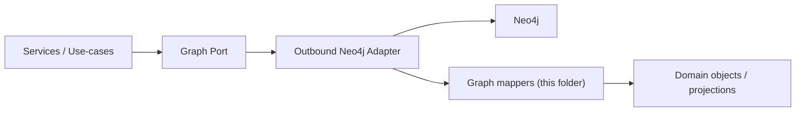

# 🕸️ Graph Mappers (`api/src/adapters/mappers/graph/`)

This folder contains **pure mapping utilities** that translate between:

- 🕸️ **Neo4j result shapes** (records/nodes/relationships/properties)
- 🧠 **KFM domain models** (entities, references, evidence artifacts)
- 📚 **Catalog/provenance references** (STAC/DCAT/PROV IDs)
- 🔐 **Classification/redaction metadata** (never downgrade)

> [!IMPORTANT]
> Graph mappers are **not** where we write Cypher or touch the driver.
>
> ✅ map + validate + normalize + enforce invariants  
> ❌ connect/query Neo4j • build Cypher strings • call PostGIS • fetch S3 • call GEE

---

## 🔗 Neighbor links

- 📦 Parent: `📁 api/src/adapters/mappers/README.md`
- 🧰 Shared primitives: `📁 api/src/adapters/mappers/common/README.md`
- 🛬 Inbound adapters: `📁 api/src/adapters/inbound/README.md`
- 🛫 Outbound adapters: `📁 api/src/adapters/outbound/README.md`
- 🧯 Adapter error types: `📄 api/src/adapters/errors.py`

---

## 📁 Folder map (emoji layout)

```text
📁 api/
  📁 src/
    📁 adapters/
      📁 mappers/
        📁 graph/                        🕸️ graph record ↔ domain mapping (pure)
          📄 README.md                   👈 you are here
          📄 __init__.py                 🧬 package init (optional)

          📄 schema.py                   🏷️ node labels, rel types, property keys (constants)
          📄 ids.py                      🆔 graph-safe IDs (delegates to common/ids where possible)
          📄 props.py                    🧾 property normalization (types, null handling, lists)
          📄 record.py                   📦 record extraction helpers (safe get, required fields)
          📄 nodes.py                    🧩 node ↔ domain entity mapping
          📄 relationships.py            🔗 relationship ↔ domain edge mapping
          📄 projections.py              🧠 read-model projections (domain “views” assembled from records)
          📄 validate.py                 ✅ pure validation (required keys, safe sizes, allowed enums)
          📄 sanitize.py                 🧼 safe logging view (no secrets, size-limited)
          📄 errors.py                   🧯 graph-mapper error codes (optional)
```

> [!TIP]
> If the folder already exists but looks different, keep the **separation by concern** anyway:
> `schema + ids + props + nodes + relationships + projections`.

---

## 🎯 What graph mappers do (and do NOT do)

### ✅ In scope
- Convert Neo4j record/node/rel into stable domain objects
- Normalize types (dates, numbers, lists, missing values)
- Validate schema expectations (label/type/required keys)
- Attach catalog/provenance references (IDs, not blobs)
- Provide read-model projections for API views (still pure)
- Enforce classification/redaction propagation (no downgrade)

### ❌ Out of scope
- Cypher generation / query building
- Transactions / retries / connection pooling
- Authorization decisions (“can user see this?”)
- Graph migrations / constraint creation *(those are outbound / ops)*
- Graph analytics execution *(GDS calls, etc.)*

---

## 🧭 Where graph mappers fit (Mermaid-safe snippet)



> [!NOTE]
> Node IDs are prefixed (`N_`) to avoid Mermaid keyword collisions.

---

## 🏷️ Graph schema conventions (recommended)

Graph schema stability is a *contract*. Keep these consistent:

### Node labels 🧩
- Use **PascalCase** labels: `Dataset`, `Place`, `Event`, `Person`, `Artifact`, `StoryNode`, `CatalogItem`
- Avoid label sprawl. Prefer a smaller label set + typed properties.

### Relationship types 🔗
- Use **UPPER_SNAKE_CASE** rel types: `REFERENCES`, `LOCATED_IN`, `DERIVED_FROM`, `GENERATED_BY`, `MENTIONS`, `HAS_ASSET`

### Property keys 🧾
- Use **snake_case** keys: `kfm_id`, `source_ref`, `valid_from`, `valid_to`, `stac_item_id`, `prov_activity_id`
- Keep property names stable once published.

> [!TIP]
> Put these canonical strings in `schema.py` and reference them everywhere.

---

## 🆔 Identity rules (stable IDs, no duplicates)

A “good” graph identity strategy makes upserts and merges predictable.

### Recommended ID fields
- `kfm_id` — primary stable ID used across systems (domain-level)
- `source_id` — original external identifier (archive ID, DOI, etc.)
- `catalog_ref` — STAC/DCAT/PROV IDs when applicable

### Mapper responsibilities
- Normalize IDs (trim, casefold where appropriate, remove control chars)
- Reject empty or unsafe IDs
- Never “randomly generate” IDs inside mapping

> [!CAUTION]
> If you can’t reproduce the same ID from the same inputs, merges will create duplicates.

---

## 🧾 Neo4j property type hygiene

Neo4j properties *should be boring*:

| Domain intent | Recommended Neo4j property type | Notes |
|---|---|---|
| IDs / labels | `string` | enforce max length |
| small counters | `integer` | reject NaN/inf |
| numeric metrics | `float` | reject NaN/inf |
| flags | `boolean` | |
| tags/roles | `list[string]` | enforce max list size |
| times | `string` ISO-8601 | or Neo4j temporal types if your adapter standardizes them |
| geometry summary | `string` WKT / GeoJSON OR bbox list | keep it lightweight |

> [!TIP]
> Avoid deeply nested maps for “everything”. Prefer:
> - small typed properties in graph
> - heavy payloads in storage
> - the canonical reference in STAC/DCAT/PROV

---

## 🧩 Mapping patterns (practical)

### 1) Record extraction helpers (`record.py`) 📦
Make Neo4j access safe and predictable:
- `get_str(record, "kfm_id")`
- `get_int(record, "degree")`
- `require_key(record, "labels")`

**Rule:** no `KeyError` surprises, no hidden coercions.

---

### 2) Node mapping (`nodes.py`) 🧩
Node mapping should:
- validate label allowlist
- normalize property keys
- enforce required fields
- attach provenance refs (if present)

> [!IMPORTANT]
> Domain models should not depend on Neo4j driver types.  
> Always map to simple Python structures / dataclasses / pydantic models.

---

### 3) Relationship mapping (`relationships.py`) 🔗
Relationship mapping should:
- validate rel type allowlist
- enforce direction semantics (if your domain cares)
- normalize properties
- map endpoints by stable IDs (not internal Neo4j IDs)

---

### 4) Read-model projections (`projections.py`) 🧠
Sometimes one API view needs multiple records (node + related nodes + relationship properties).  
Projections assemble these into domain “views” **without I/O** (still pure):

- `EntityWithNeighbors`
- `TimelineSlice`
- `StoryContextGraph`

---

## 📚 Provenance-first graph mapping (KFM bias)

Graph is not the metadata canonical store. It’s the **relationship accelerator**.

Recommended pattern:
- Graph nodes store **references**:
  - `stac_item_id`
  - `dcat_dataset_id`
  - `prov_entity_id`
  - `prov_activity_id`
- Graph queries return IDs + minimal fields
- API/services resolve full details via catalog/outbound adapters when needed

> [!TIP]
> This keeps the graph lean, avoids data drift, and makes lineage auditable.

---

## 🔐 Classification & redaction propagation

Graph can unintentionally leak sensitive info:
- precise geometry summaries
- inferred relationships
- “hidden” attributes via neighbor queries

Mapper-level rules:
- never downgrade classification
- if a field is redacted upstream, do not “reconstruct” it from alternative props
- enforce max neighbor counts / bounded depth in projections (even if outbound adapter also enforces it)

---

## 🧯 Graph mapper error codes (stable + boring)

Suggested codes (keep consistent with `common/` patterns):
- `UNKNOWN_NODE_LABEL`
- `UNKNOWN_REL_TYPE`
- `MISSING_REQUIRED_FIELD`
- `INVALID_ID`
- `INVALID_TIME`
- `INVALID_ENUM`
- `PROPERTY_TOO_LARGE`
- `TOO_MANY_NEIGHBORS`
- `CLASSIFICATION_DOWNGRADE_ATTEMPT`

> [!IMPORTANT]
> Treat error codes like API surface. Changing them is a breaking change 📜💥

---

## 🧪 Testing strategy (easy wins)

### ✅ Unit tests (must-have)
- node mapping for each supported label
- relationship mapping for each supported type
- projections assemble correctly from sample records
- classification merge rules never downgrade

### ✅ Golden fixtures (recommended)
```text
🧪 tests/
  📁 fixtures/
    📁 graph/
      📄 node_dataset.json
      📄 node_place.json
      📄 node_event.json
      📄 rel_references.json
      📄 rel_located_in.json
      📄 projection_entity_with_neighbors.json
```

### ✅ Property tests (optional)
- mapping is deterministic (same input → same output)
- IDs are stable under normalization
- unsafe strings are rejected or sanitized for logs

---

## 🧑‍💻 Minimal templates (safe + copy/paste)

### 1) Pure node mapping (illustrative) 🧩
```python
# 📄 api/src/adapters/mappers/graph/nodes.py

from dataclasses import dataclass
from typing import Any, Mapping, Optional

@dataclass(frozen=True)
class DomainNode:
    kfm_id: str
    kind: str
    title: Optional[str] = None
    stac_item_id: Optional[str] = None
    prov_entity_id: Optional[str] = None
    classification: Optional[str] = None

_ALLOWED_LABELS = {"Dataset", "Place", "Event", "Person", "Artifact", "StoryNode"}

def to_domain_node(node: Mapping[str, Any]) -> DomainNode:
    # node is a dict-like view of a Neo4j node (already extracted by outbound adapter)
    labels = set(node.get("labels") or [])
    kind = next(iter(labels & _ALLOWED_LABELS), None)
    if not kind:
        raise ValueError("UNKNOWN_NODE_LABEL")

    props = node.get("properties") or {}
    kfm_id = str(props.get("kfm_id", "")).strip()
    if not kfm_id:
        raise ValueError("INVALID_ID")

    return DomainNode(
        kfm_id=kfm_id,
        kind=kind,
        title=(props.get("title") or None),
        stac_item_id=(props.get("stac_item_id") or None),
        prov_entity_id=(props.get("prov_entity_id") or None),
        classification=(props.get("classification") or None),
    )
```

### 2) Relationship mapping (illustrative) 🔗
```python
# 📄 api/src/adapters/mappers/graph/relationships.py

from dataclasses import dataclass
from typing import Any, Mapping, Optional

@dataclass(frozen=True)
class DomainEdge:
    rel_type: str
    from_id: str
    to_id: str
    weight: Optional[float] = None

_ALLOWED_RELS = {"REFERENCES", "LOCATED_IN", "DERIVED_FROM", "GENERATED_BY", "MENTIONS", "HAS_ASSET"}

def to_domain_edge(rel: Mapping[str, Any]) -> DomainEdge:
    rel_type = str(rel.get("type", "")).strip()
    if rel_type not in _ALLOWED_RELS:
        raise ValueError("UNKNOWN_REL_TYPE")

    from_id = str(rel.get("from_kfm_id", "")).strip()
    to_id = str(rel.get("to_kfm_id", "")).strip()
    if not from_id or not to_id:
        raise ValueError("MISSING_REQUIRED_FIELD")

    weight = rel.get("weight")
    if weight is not None:
        weight = float(weight)

    return DomainEdge(rel_type=rel_type, from_id=from_id, to_id=to_id, weight=weight)
```

### 3) Safe logging view (illustrative) 🧼
```python
# 📄 api/src/adapters/mappers/graph/sanitize.py

from typing import Any, Mapping

def sanitize_for_log(obj: Mapping[str, Any], *, max_len: int = 500) -> dict[str, Any]:
    # Keep logs small and avoid dumping huge payloads
    out: dict[str, Any] = {}
    for k, v in obj.items():
        if isinstance(v, str) and len(v) > max_len:
            out[k] = v[:max_len] + "…"
        else:
            out[k] = v
    return out
```

---

## ✅ Definition of done (graph mapper work)

- [ ] Pure mapping (no driver calls, no network, no filesystem)
- [ ] Label/rel allowlists enforced (schema drift doesn’t silently pass)
- [ ] Stable IDs (no random generation inside mapping)
- [ ] Neo4j types normalized to boring Python primitives
- [ ] Provenance refs supported (STAC/DCAT/PROV IDs are preserved)
- [ ] Classification/redaction propagation enforced (no downgrade)
- [ ] Stable error codes + docs
- [ ] Unit tests + golden fixtures added
- [ ] Projections are bounded (no accidental “return the whole graph”)

---

## 📚 Project bookshelf (all project files, mapped to graph-mapper needs)

<details>
<summary>📚 Click to expand — how the full library informs graph mapping</summary>

### 🧭 KFM architecture, governance, and pipelines
- 📄 **Kansas Frontier Matrix (KFM) – Comprehensive Technical Documentation.docx** → layer boundaries; Neo4j usage as the knowledge graph; governed pipeline expectations
- 📄 **🌟 Kansas Frontier Matrix – Latest Ideas & Future Proposals.docx** → future-facing graph + interoperability direction

### 🕸️ Graph theory & structure (why schema + projections must be disciplined)
- 📄 **Spectral Geometry of Graphs.pdf** → graph structure intuition; motivates stable schemas and bounded traversals

### 🗄️ Data systems & interoperability (why refs + metadata-first matters)
- 📄 **Data Spaces.pdf** → interoperability/federation mindset; graphs as connectors, not canonical stores
- 📄 **Scalable Data Management for Future Hardware.pdf** → performance constraints; mapping must be lean + deterministic
- 📄 **PostgreSQL Notes for Professionals - PostgreSQLNotesForProfessionals.pdf** → complements graph with relational/spatial persistence patterns

### 🗺️ Geospatial & representation (graph should store refs, not bulky geometries)
- 📄 **python-geospatial-analysis-cookbook.pdf**
- 📄 **making-maps-a-visual-guide-to-map-design-for-gis.pdf**
- 📄 **Mobile Mapping_ Space, Cartography and the Digital - 9789048535217.pdf**
- 📄 **compressed-image-file-formats-jpeg-png-gif-xbm-bmp.pdf**
- 📄 **webgl-programming-guide-interactive-3d-graphics-programming-with-webgl.pdf**
- 📄 **responsive-web-design-with-html5-and-css3.pdf**

### 🛰️ Remote sensing & derived layers (graph nodes should reference catalog/prov)
- 📄 **Cloud-Based Remote Sensing with Google Earth Engine-Fundamentals and Applications.pdf**

### 🧪 Modeling/statistics/uncertainty (graph-derived analytics must be traceable)
- 📄 **Scientific Modeling and Simulation_ A Comprehensive NASA-Grade Guide.pdf**
- 📄 **Understanding Statistics & Experimental Design.pdf**
- 📄 **graphical-data-analysis-with-r.pdf**
- 📄 **regression-analysis-with-python.pdf**
- 📄 **Regression analysis using Python - slides-linear-regression.pdf**
- 📄 **think-bayes-bayesian-statistics-in-python.pdf**
- 📄 **Deep Learning for Coders with fastai and PyTorch - Deep.Learning.for.Coders.with.fastai.and.PyTorchpdf** *(library item; not indexed here)*

### 🧠 Human-centered accountability + policy (why provenance + redaction matter)
- 📄 **Introduction to Digital Humanism.pdf**
- 📄 **On the path to AI Law’s prophecies and the conceptual foundations of the machine learning age.pdf**
- 📄 **Principles of Biological Autonomy - book_9780262381833.pdf**

### 🛡️ Security mindset (why logs + payloads must be sanitized)
- 📄 **ethical-hacking-and-countermeasures-secure-network-infrastructures.pdf**
- 📄 **Gray Hat Python - Python Programming for Hackers and Reverse Engineers (2009).pdf**

### 🧵 Concurrency/distributed background (why determinism + idempotency matter)
- 📄 **concurrent-real-time-and-distributed-programming-in-java-threads-rtsj-and-rmi.pdf**

### 🧰 Programming compendium shelf (implementation reference)
- 📄 **A programming Books.pdf**
- 📄 **B-C programming Books.pdf**
- 📄 **D-E programming Books.pdf**
- 📄 **F-H programming Books.pdf**
- 📄 **I-L programming Books.pdf**
- 📄 **M-N programming Books.pdf**
- 📄 **O-R programming Books.pdf**
- 📄 **S-T programming Books.pdf**
- 📄 **U-X programming Books.pdf**

</details>

