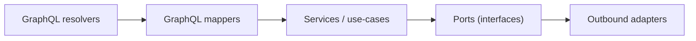

# 🧬 GraphQL Mappers (`api/src/adapters/mappers/graphql/`)

This folder contains **pure mapping utilities** that translate between:

- 🧬 **GraphQL contract shapes** (inputs, enums, unions, connections)
- 🧠 **Domain commands/queries/results** (service/use-case layer)
- 📚 **Catalog & provenance references** (STAC/DCAT/PROV IDs embedded in outputs)
- 🔐 **Classification/redaction metadata** (never downgrade; never “restore precision”)

> [!IMPORTANT]
> GraphQL mappers are the **contract firewall**:
> - ✅ validate + normalize + canonicalize + map (pure)
> - ✅ stable error codes & predictable transformations
> - ❌ no DB/Neo4j/PostGIS calls
> - ❌ no “dataloader” fetching
> - ❌ no auth decisions (resolvers/services decide); mappers only propagate classification

---

## 🔗 Neighbor links

- 📦 Parent: `📁 api/src/adapters/mappers/README.md`
- 🧰 Shared primitives: `📁 api/src/adapters/mappers/common/README.md`
- 📚 Catalog mappers: `📁 api/src/adapters/mappers/catalog/README.md`
- 🛬 Inbound adapters: `📁 api/src/adapters/inbound/README.md`
- 🛫 Outbound adapters: `📁 api/src/adapters/outbound/README.md`
- 🧯 Adapter errors: `📄 api/src/adapters/errors.py`

---

## 📁 Folder map (emoji layout)

```text
📁 api/
  📁 src/
    📁 adapters/
      📁 mappers/
        📁 graphql/                       🧬 GraphQL inputs/outputs ↔ domain (pure)
          📄 README.md                    👈 you are here
          📄 __init__.py                  🧬 package init (optional)

          📄 inputs.py                    🧾 GraphQL InputTypes → domain commands/queries
          📄 outputs.py                   📤 domain results → GraphQL Types
          📄 enums.py                     🏷️ enum canonicalization + deprecations (pure)
          📄 unions.py                    🧩 union/interface mapping (discriminated)
          📄 pagination.py                🔁 connection/edge/cursor mapping helpers
          📄 selection.py                 🎯 selection-set helpers (pure, optional)
          📄 sanitize.py                  🧼 safe logging view (size-limited, no secrets)
          📄 validate.py                  ✅ reusable validation primitives (delegates to common/)
          📄 errors.py                    🧯 GraphQL mapper error codes (optional)
```

> [!TIP]
> If your repo keeps GraphQL schema/resolvers elsewhere (common), that’s fine.
> These mappers should remain **framework-agnostic** and pure.

---

## 🧭 Where GraphQL mappers sit (Mermaid-safe)



> [!NOTE]
> Node IDs are prefixed (`N_`) to avoid Mermaid keyword collisions and strict parsers.

---

## 🎯 What belongs here (and what does not)

### ✅ In scope
- GraphQL `Input` → domain command/query mapping
- GraphQL `Enum` → canonical domain enums (including deprecated aliases)
- Domain → GraphQL output shaping (Types / Connections / Unions)
- Cursor encoding/decoding helpers (opaque, stable)
- Stable errors with GraphQL `extensions.code`
- Pure selection shaping helpers *(optional; see below)*

### ❌ Out of scope
- Resolver orchestration & dataloaders
- Authorization decisions (field-level or object-level)
- Database/Neo4j/PostGIS queries
- Any network calls
- Heavy computation or materialization

---

## 🧬 GraphQL-specific “contract truths” (practical rules)

### 1) GraphQL is one endpoint, many contracts 📜
GraphQL contracts evolve via:
- field additions (non-breaking)
- deprecations (warn before removal)
- new types/unions

**Mappers** are where we preserve backward compatibility:
- accept deprecated enum values and map them to canonical ones
- emit both legacy and new fields (when safe) during transitions
- keep stable cursor semantics

### 2) The selection set is not a license to bypass governance 🔐
Even if a query asks for a field, it might be restricted by:
- classification
- redaction policy
- role permissions

Resolvers/services enforce visibility.  
Mappers ensure:
- redaction metadata is preserved
- “precision never increases” (e.g., don’t output exact geometry when generalized)

### 3) GraphQL error UX should be boring (and searchable) 🧯
Prefer structured `extensions` codes:
- stable `extensions.code`
- `field` or `path` references when possible
- short, non-sensitive messages

---

## 🧾 Inputs mapping (GraphQL Input → domain)

### Common mapping flow
1. Normalize strings (trim, strip control chars)
2. Canonicalize enums
3. Validate ranges & shapes (bbox, time, pagination)
4. Map to domain command/query
5. Attach correlation/provenance refs (if provided)

> [!IMPORTANT]
> Never silently “guess” missing meaning (CRS, units, coordinate order, timezones).
> Reject or require explicit fields.

---

## 📤 Outputs mapping (domain → GraphQL Types)

### Output mapping goals
- return stable “view models” that are predictable for UI clients
- embed provenance references (STAC/DCAT/PROV IDs) when available
- propagate classification and redaction notes
- minimize payload bloat (don’t dump entire graphs by default)

### “Refs-first” output bias 🧾
GraphQL outputs should prefer:
- `stacItemId`, `dcatDatasetId`, `provActivityId`
- `assetLinks` (safe hrefs, not signed tokens)
- `lineageSummary` (small and safe)

Over:
- raw assets embedded inline
- huge nested blobs that become drift-prone

---

## 🔁 Pagination patterns (Connections)

GraphQL pagination should be:
- **bounded**
- **stable**
- **opaque**

Recommended approach:
- `Connection { edges { cursor node } pageInfo { ... } }`
- cursor is opaque (e.g., base64 JSON) and stable
- enforce limits in inputs mapping:
  - `first <= MAX_FIRST`
  - `after` must be valid cursor

> [!TIP]
> Cursor payload should never include secrets or DB internal IDs.
> Prefer stable domain IDs + ordering keys.

---

## 🧩 Unions / Interfaces mapping

GraphQL unions are powerful, but can become messy.

Recommended:
- use a discriminated domain union with explicit `kind`
- mapper selects the correct GraphQL type based on that kind
- enforce allowlists (unknown kinds → mapper error)

Example kinds:
- `Dataset | Place | Event | Person | Artifact | StoryNode`

> [!CAUTION]
> Don’t leak Neo4j labels or driver-specific structures through the union type. Keep it domain-first.

---

## 🎯 Selection-set helpers (optional)

Sometimes you want to avoid building fields a client didn’t ask for.  
You may optionally provide a **pure** helper that interprets a selection set into a “field mask”.

Rules:
- keep it framework-agnostic (pass in a simple structure, not GraphQL AST objects)
- treat it as a hint, not a policy decision
- never use it to skip security checks

> [!NOTE]
> If selection handling depends on the GraphQL library internals, keep it in resolvers, not in mappers.

---

## 🔐 Classification + redaction propagation

GraphQL is prone to **accidental over-sharing** because it’s easy to request nested fields.

Mapper rules:
- never downgrade classification
- preserve redaction notes and flags
- enforce precision policy on geo-ish fields if mappers shape them (or delegate to geo mappers)

Recommended fields in outputs:
- `classification`
- `redactionNotes[]`
- `provenanceRef` or catalog IDs
- `generalized: Boolean` *(when relevant)*

---

## 🧯 Error handling (GraphQL-friendly)

### Suggested stable error codes
- `INVALID_INPUT`
- `INVALID_ENUM`
- `INVALID_CURSOR`
- `UNSUPPORTED_VERSION`
- `MISSING_REQUIRED_FIELD`
- `UNSAFE_HREF`
- `CLASSIFICATION_DOWNGRADE_ATTEMPT`

### GraphQL error shape (recommended)
Attach machine-readable codes in `extensions`:

```json
{
  "message": "Invalid cursor",
  "path": ["datasetSearch", "edges", 0, "cursor"],
  "extensions": {
    "code": "INVALID_CURSOR",
    "field": "after"
  }
}
```

> [!TIP]
> Keep error messages short and non-sensitive; logs can hold deeper context (sanitized).

---

## 🧪 Testing strategy (GraphQL mappers)

### ✅ Unit tests
- input mapping validation & normalization
- output mapping stability (no driver types leaked)
- enum alias compatibility
- cursor encoding/decoding
- classification merge rules (never downgrade)

### ✅ Golden fixtures (high value)
```text
🧪 tests/
  📁 fixtures/
    📁 graphql/
      📄 input_dataset_search_v1.json
      📄 output_dataset_summary_v1.json
      📄 output_connection_page_1.json
      📄 output_union_dataset.json
      📄 cursor_example.json
```

### ✅ Contract tests
- schema snapshots (SDL) are stable
- deprecated fields remain available until removal policy says otherwise

---

## 🧑‍💻 Minimal templates (copy/paste, framework-agnostic)

### 1) Input mapping: GraphQL input → domain query 🧾

```python
# 📄 api/src/adapters/mappers/graphql/inputs.py

from dataclasses import dataclass
from typing import Optional

@dataclass(frozen=True)
class DatasetSearchInputDTO:
    q: Optional[str] = None
    first: int = 20
    after: Optional[str] = None
    classification: Optional[str] = None

@dataclass(frozen=True)
class DatasetSearchQuery:
    q: Optional[str]
    limit: int
    cursor: Optional[str]
    classification: Optional[str]

def to_domain_dataset_search(dto: DatasetSearchInputDTO, *, max_first: int = 100) -> DatasetSearchQuery:
    q = dto.q.strip() if dto.q else None

    if dto.first <= 0 or dto.first > max_first:
        raise ValueError("INVALID_INPUT")

    # cursor validation happens in pagination helpers
    return DatasetSearchQuery(
        q=q,
        limit=dto.first,
        cursor=dto.after,
        classification=dto.classification,
    )
```

### 2) Output mapping: domain → GraphQL type 📤

```python
# 📄 api/src/adapters/mappers/graphql/outputs.py

from dataclasses import dataclass
from typing import Optional

@dataclass(frozen=True)
class DatasetSummaryGQL:
    id: str
    title: str
    stacItemId: Optional[str] = None
    dcatDatasetId: Optional[str] = None
    provActivityId: Optional[str] = None
    classification: Optional[str] = None

def to_dataset_summary_gql(domain_obj) -> DatasetSummaryGQL:
    return DatasetSummaryGQL(
        id=domain_obj.dataset_id,
        title=domain_obj.title,
        stacItemId=getattr(domain_obj.catalog_refs, "stac_item_id", None),
        dcatDatasetId=getattr(domain_obj.catalog_refs, "dcat_dataset_id", None),
        provActivityId=getattr(domain_obj.catalog_refs, "prov_activity_id", None),
        classification=getattr(domain_obj, "classification", None),
    )
```

### 3) Cursor helpers: opaque pagination 🔁

```python
# 📄 api/src/adapters/mappers/graphql/pagination.py

import base64
import json
from typing import Any, Dict

def encode_cursor(payload: Dict[str, Any]) -> str:
    raw = json.dumps(payload, sort_keys=True, separators=(",", ":"), ensure_ascii=False)
    return base64.urlsafe_b64encode(raw.encode("utf-8")).decode("ascii")

def decode_cursor(cursor: str) -> Dict[str, Any]:
    try:
        raw = base64.urlsafe_b64decode(cursor.encode("ascii")).decode("utf-8")
        return json.loads(raw)
    except Exception as _:
        raise ValueError("INVALID_CURSOR")
```

> [!NOTE]
> Cursor payloads should only include stable ordering keys and IDs—never DB internal IDs or secrets.

---

## ✅ Definition of done (GraphQL mapper work)

- [ ] Pure mapping (no I/O, no driver objects)
- [ ] Strict validation (no silent coercions)
- [ ] Enum compatibility handled (deprecated aliases map cleanly)
- [ ] Cursor logic is opaque + stable + bounded
- [ ] Union/interface mapping uses allowlists
- [ ] Classification/redaction propagation enforced (no downgrade)
- [ ] Stable error codes emitted (GraphQL extensions-friendly)
- [ ] Unit tests + golden fixtures added
- [ ] Docs updated when schema contracts change

---

## 📚 Project bookshelf (all project files, mapped to GraphQL-mapper needs)

<details>
<summary>📚 Click to expand — how the full library informs GraphQL mapping conventions</summary>

### 🧭 KFM architecture, governance, and contract discipline
- 📄 **Kansas Frontier Matrix (KFM) – Comprehensive Technical Documentation.docx** → layered boundaries; API as governed surface; GraphQL as a boundary
- 📄 **🌟 Kansas Frontier Matrix – Latest Ideas & Future Proposals.docx** → future integrations; interoperability; performance/scale direction
- 📄 **MARKDOWN_GUIDE_v13.md.gdoc** → pipeline ordering and contract-first documentation norms
- 📄 **Comprehensive Markdown Guide_ Syntax, Extensions, and Best Practices.docx** → stable doc structure, checklists, and conventions

### 🗺️ Geospatial & UI delivery (GraphQL outputs must be predictable and map-friendly)
- 📄 **python-geospatial-analysis-cookbook.pdf** → GIS shapes; CRS hygiene; format conventions
- 📄 **making-maps-a-visual-guide-to-map-design-for-gis.pdf** → representation, clarity, and avoiding misleading precision
- 📄 **Mobile Mapping_ Space, Cartography and the Digital - 9789048535217.pdf** → scale/context sensitivity; mobile constraints; privacy implications
- 📄 **compressed-image-file-formats-jpeg-png-gif-xbm-bmp.pdf** → asset typing/compression tradeoffs (thumbnails/previews)
- 📄 **webgl-programming-guide-interactive-3d-graphics-programming-with-webgl.pdf** → interactive clients; payload/perf constraints
- 📄 **responsive-web-design-with-html5-and-css3.pdf** → contract surfaces for web clients; predictable shapes

### 🕸️ Graph/knowledge context (GraphQL often queries graph-shaped views)
- 📄 **Spectral Geometry of Graphs.pdf** → structure intuition; bounded traversals; avoiding “return the whole graph”

### 🛰️ Remote sensing + long-running workflows (GraphQL triggers/results should be provenance-first)
- 📄 **Cloud-Based Remote Sensing with Google Earth Engine-Fundamentals and Applications.pdf** → EO outputs, accuracy discipline, batch-style operations

### 🧪 Modeling/statistics/uncertainty (GraphQL “evidence artifacts” must carry metadata)
- 📄 **Scientific Modeling and Simulation_ A Comprehensive NASA-Grade Guide.pdf** → reproducibility; declared inputs/outputs; deterministic runs
- 📄 **Understanding Statistics & Experimental Design.pdf** → validity, explicit uncertainty and reporting discipline
- 📄 **regression-analysis-with-python.pdf**
- 📄 **Regression analysis using Python - slides-linear-regression.pdf**
- 📄 **think-bayes-bayesian-statistics-in-python.pdf**
- 📄 **graphical-data-analysis-with-r.pdf**
- 📄 **Deep Learning for Coders with fastai and PyTorch - Deep.Learning.for.Coders.with.fastai.and.PyTorchpdf** → versioning, dataset splits, params as metadata

### 🗄️ Data systems & interoperability (why stable IDs/cursors and deterministic mapping matter)
- 📄 **PostgreSQL Notes for Professionals - PostgreSQLNotesForProfessionals.pdf**
- 📄 **Scalable Data Management for Future Hardware.pdf**
- 📄 **Data Spaces.pdf** → federation/interoperability mindset; metadata as glue

### 🧠 Human-centered accountability + policy context (why GraphQL must be safe and explainable)
- 📄 **Introduction to Digital Humanism.pdf**
- 📄 **On the path to AI Law’s prophecies and the conceptual foundations of the machine learning age.pdf**
- 📄 **Principles of Biological Autonomy - book_9780262381833.pdf**

### 🛡️ Security mindset (GraphQL inputs are hostile; output can exfiltrate)
- 📄 **ethical-hacking-and-countermeasures-secure-network-infrastructures.pdf**
- 📄 **Gray Hat Python - Python Programming for Hackers and Reverse Engineers (2009).pdf**

### 🧵 Concurrency / distributed background (why idempotency + explicit time matters)
- 📄 **concurrent-real-time-and-distributed-programming-in-java-threads-rtsj-and-rmi.pdf**

### 🧰 Programming compendium shelf (implementation reference)
- 📄 **A programming Books.pdf**
- 📄 **B-C programming Books.pdf**
- 📄 **D-E programming Books.pdf**
- 📄 **F-H programming Books.pdf**
- 📄 **I-L programming Books.pdf**
- 📄 **M-N programming Books.pdf**
- 📄 **O-R programming Books.pdf**
- 📄 **S-T programming Books.pdf**
- 📄 **U-X programming Books.pdf**

</details>

