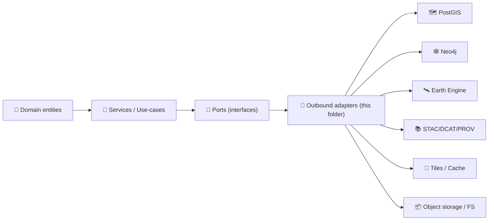
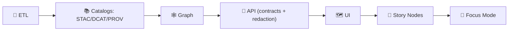

# 🛫 Outbound Adapters (external systems & IO)


Outbound adapters are the **infrastructure perimeter** of KFM’s API: they implement the **ports** (interfaces) used by the service/use‑case layer to talk to:

- 🗺️ PostGIS (spatial SQL)
- 🕸️ Neo4j (knowledge graph)
- 🛰️ Google Earth Engine (EO compute + catalog access)
- 📚 STAC/DCAT/PROV (catalog read/write/validate)
- 🧱 Tiles (XYZ/TMS/MVT utilities + caching)
- 📦 Storage (S3/MinIO/local filesystem)

> [!IMPORTANT]
> Outbound adapters do **IO**. They are allowed to know “how to talk to PostGIS/Neo4j/S3/GEE”.
>
> ✅ connect • query • stream • retry • cache • translate errors • enforce timeouts  
> ❌ make business decisions • shape HTTP responses • invent provenance • downgrade classification

---

## 🔗 Quick links

- 📚 Parent module: `api/src/adapters/README.md`
- 🛬 Inbound adapters: `api/src/adapters/inbound/`
- 🔁 Mappers (DTO ↔ domain): `api/src/adapters/mappers/`
- 🧯 Adapter errors: `api/src/adapters/errors.py`

---

## 🧭 Table of contents

- [📁 Folder map](#-folder-map)
- [🧱 Architecture contract](#-architecture-contract)
- [🔒 KFM invariants that outbound must respect](#-kfm-invariants-that-outbound-must-respect)
- [✅ What belongs in outbound vs elsewhere](#-what-belongs-in-outbound-vs-elsewhere)
- [🧩 Adapter families](#-adapter-families)
  - [🗺️ PostGIS](#️-postgis)
  - [🕸️ Neo4j](#️-neo4j)
  - [🛰️ Earth Engine](#️-earth-engine)
  - [📚 Catalogs](#-catalogs)
  - [🧱 Tiles](#-tiles)
  - [📦 Storage](#-storage)
- [🧷 Determinism, idempotency, stable IDs](#-determinism-idempotency-stable-ids)
- [🧯 Error translation rules](#-error-translation-rules)
- [🧪 Testing strategy](#-testing-strategy)
- [📈 Observability](#-observability)
- [🛡️ Security, privacy, licensing](#️-security-privacy-licensing)
- [➕ How to add a new outbound adapter](#-how-to-add-a-new-outbound-adapter)
- [✅ Definition of done](#-definition-of-done)
- [📚 Reference shelf](#-reference-shelf)

---

## 📁 Folder map

You asked for emoji folder/file layouts — here’s the canonical outbound view:

```text
📁 api/
  📁 src/
    📁 adapters/
      📁 outbound/                    🛫 Outbound adapters: DBs, external APIs, storage
        📁 postgis/                   🗺️ PostGIS repos + SQL helpers
        📁 neo4j/                     🕸️ Graph adapter + Cypher helpers
        📁 gee/                       🛰️ Earth Engine + remote sensing IO
        📁 catalogs/                  📚 STAC/DCAT/PROV read/write/validate
        📁 tiles/                     🧱 Tile utilities (XYZ/TMS), caching
        📁 storage/                   📦 S3/MinIO/local file storage
        📄 README.md                  👈 you are here
```

> [!TIP]
> Outbound adapters are the right place for “drivers” and “clients” (SQLAlchemy/psycopg, neo4j driver, boto3/minio client, GEE auth, etc.) — but **keep the domain clean**.

---

## 🧱 Architecture contract

Outbound exists because KFM follows a layered architecture with explicit interfaces:



### Dependency rules ✅
- Services/use-cases may depend on **ports**.
- Outbound adapters **implement** ports.
- Inbound adapters and mappers must **not** import outbound adapters directly.

> [!WARNING]
> If your FastAPI router imports `adapters/outbound/postgis/...` directly, the architecture is leaking.
> Route → Mapper → Service → Port → Outbound adapter (only).

---

## 🔒 KFM invariants that outbound must respect

KFM’s contract-first, provenance-first pipeline creates hard constraints for outbound:



### Non‑negotiables 🚧
1) **Pipeline ordering is absolute** (no stage consumes data that hasn’t passed prior gates).  
2) **API boundary rule**: the UI never talks directly to Neo4j; everything is governed via API.  
3) **Provenance-first**: any dataset/evidence artifact must have STAC/DCAT/PROV records before use.  
4) **Sovereignty & classification propagation**: no derived output can be *less restricted* than its inputs.

Outbound adapters are where it’s easiest to accidentally violate these. So we enforce them by design:

- 📚 Catalog adapters validate/require metadata presence before publishing.
- 🕸️ Neo4j adapter stores **references to catalog entries**, not bulky data blobs.
- 📦 Storage adapter stores assets in stable locations and returns immutable references.
- 🧱 Tile adapter ensures caching/generalization doesn’t “reveal more than allowed”.

---

## ✅ What belongs in outbound vs elsewhere

| Concern | ✅ Outbound adapters | ❌ Not outbound (put elsewhere) |
|---|---:|---|
| DB queries (SQL/Cypher), transactions, connection pools | ✅ | ❌ |
| Object storage reads/writes, streaming | ✅ | ❌ |
| External API calls (GEE, NASA endpoints later) | ✅ | ❌ |
| DTO ↔ domain mapping | ❌ | ✅ `adapters/mappers/` |
| Request parsing, auth, HTTP response shaping | ❌ | ✅ `adapters/inbound/` |
| Business decisions (what to compute, what to publish) | ❌ | ✅ services/use-cases |
| Governance policy decisions | ❌ *(enforce mechanics only)* | ✅ service/policy layer |

---

# 🧩 Adapter families

## 🗺️ PostGIS

**Role:** primary spatial persistence for vector layers and query-time slicing (bbox, intersects, time filters).

### Design goals 🧠
- fast bbox queries via spatial indices
- predictable pagination and ordering
- minimal geometry payloads by default (UI-friendly)
- output formats: GeoJSON, MVT, WKB/WKT (internal)

### Patterns to use ✅
- **Parameterize** all queries (avoid string concatenation)
- **Limit + cursor-based pagination** for large layers
- Prefer returning **only data needed for the map view**
- Keep raster/huge binaries out of PostGIS — store as files/COGs and catalog them

### GeoJSON gotcha 🧩
PostGIS commonly returns **GeoJSON geometry**, not full Feature/FeatureCollection — mappers (or a small helper) must wrap it into a proper GeoJSON response.

#### Example SQL snippet (bbox + GeoJSON geometry)
```sql
SELECT
  id,
  properties,
  ST_AsGeoJSON(ST_Transform(geom, 4326)) AS geom_geojson
FROM public.layers
WHERE geom && ST_Transform(ST_MakeEnvelope(:minx, :miny, :maxx, :maxy, 4326), ST_SRID(geom))
ORDER BY id
LIMIT :limit OFFSET :offset;
```

> [!TIP]
> For UI map rendering, consider a tile-first approach:
> - vector tiles (MVT) for dense layers
> - GeoJSON for sparse/interactive features
> - raster as COG + tiles (never inline)

---

## 🕸️ Neo4j

**Role:** knowledge graph traversal for relationships among people/places/events/datasets/documents; semantic context for Focus Mode.

### Design goals 🧠
- graph contains *relationships* + *references*, not giant payloads
- schema changes are controlled (migrations + versioning)
- queries are bounded (limits, depth caps, pagination)
- timeline-aware graph usage (valid time vs transaction time where relevant)

### Patterns to use ✅
- Use **transaction functions** and typed parameters
- Enforce **max depth** and **max results** from the adapter boundary
- Prefer **read models** that return IDs/refs; let services decide what to fetch next
- Store **catalog references** (STAC Item IDs, DCAT IDs, PROV activity IDs) rather than duplicating data

### Guardrails 🚧
- Block “unbounded” traversals by default (e.g., variable-length patterns without caps)
- Provide a “safe query library” of pre-reviewed Cypher fragments if needed
- Apply schema migrations via CI/CD gates (staging graph checks before production)

---

## 🛰️ Earth Engine

**Role:** access EO datasets and run heavy remote-sensing computations on-demand or via background jobs, then publish results as governed artifacts.

### Design goals 🧠
- treat EO outputs as **models with errors**
- export results into stable assets (COG, vectors) + metadata
- integrate with jobs/workers for long-running tasks (avoid blocking requests)
- enforce quotas/timeouts and predictable failure modes

### What to capture with each EO product 📌
- model/method name + version
- parameters and ROI definition
- uncertainty/accuracy artifacts (confusion matrix, accuracy metrics where applicable)
- provenance links to source imagery and processing activity (PROV)

> [!NOTE]
> Remote-sensing products are generalizations. For policy/science usage, publish quantitative accuracy/uncertainty evidence along with the layer (not just a pretty map). 🌍📊

---

## 📚 Catalogs

**Role:** read/write/validate **STAC/DCAT/PROV** records and enforce cross-references.

### Canonical behavior ✅
- STAC Items must point to the actual assets (files or API endpoints)
- DCAT provides discovery and links to distributions (STAC or direct download)
- PROV links the full chain: raw inputs → work → processed outputs

### Evidence artifact rule 🧪
Any analysis output (AI or otherwise) is treated as a **first-class dataset**:
- stored as processed output
- cataloged in STAC/DCAT
- traced in PROV
- exposed only through governed API (no UI hard-coding)

> [!WARNING]
> If an outbound adapter writes a file but does not also produce/validate catalog + provenance, the artifact is **not publishable**.

---

## 🧱 Tiles

**Role:** tile generation helpers + caching strategies for fast map UI.

### Design goals 🧠
- support XYZ/TMS semantics consistently
- cache keys include dataset version + style + redaction profile
- avoid leaking sensitive precision through zoom levels

### Patterns to use ✅
- deterministic tile addressing
- content-addressed caching (hash of params → tile)
- store tiles in object storage/CDN-friendly layout
- implement “redaction-aware tiling” (e.g., generalized tiles for restricted datasets)

---

## 📦 Storage

**Role:** asset persistence for large artifacts (rasters, PDFs, model outputs) and stable URL/path generation.

### Design goals 🧠
- stream big files (don’t load into memory)
- write with checksums/hashes
- return stable references (hrefs) used by STAC/DCAT
- support local dev (filesystem) + prod (S3/MinIO) with the same port

### Patterns to use ✅
- “content address” or “versioned path” conventions
- immutable artifacts (write-once, new version = new path)
- optional presigned URLs (if access control requires it)
- enforce content-type and size limits

---

## 🧷 Determinism, idempotency, stable IDs

Outbound adapters must be safe to run more than once:

- **Idempotent writes** (upsert/merge patterns)
- **Stable IDs** for datasets/entities/artifacts
- **Deterministic ordering** for paginated reads
- **Versioned outputs** (new dataset version → new catalog IDs or a tracked version field)

Practical playbook:
- Use hashes for derived artifacts (inputs + params → deterministic artifact ID)
- For graph updates, avoid duplicate nodes/edges (merge semantics)
- For tiles, cache by *all* meaningful inputs (dataset version, zoom, style, redaction policy)

---

## 🧯 Error translation rules

Outbound failures must be translated into stable adapter errors (see `api/src/adapters/errors.py`):

- classify retryability: **transient** (timeouts) vs **permanent** (validation)
- include system tag: `postgis | neo4j | storage | gee | catalogs | tiles`
- include an opaque `trace_id` for logs

Example pattern (illustrative):
```python
try:
    rows = repo.query(...)
except TimeoutError as e:
    raise AdapterError.system_timeout(system="postgis", detail=str(e))
except Exception as e:
    raise AdapterError.system_failure(system="postgis", detail="query failed")
```

---

## 🧪 Testing strategy

### Unit tests ✅
- mock clients (pg/neo4j/s3/gee)
- test query builders (parameter safety, deterministic ordering)
- test error translation mapping

### Integration tests ✅
- PostGIS + Neo4j in Docker for CI
- seed datasets with small fixtures
- validate:
  - bbox queries return expected counts
  - graph traversal returns expected references
  - storage writes + reads preserve checksums
  - catalogs validate against schemas

### CI gates 🧱
- staging graph checks before production graph changes
- metadata validation (STAC/DCAT/PROV) required for publish

> [!TIP]
> Treat “graph rebuild / ingest” like a deployment artifact:
> build → validate in staging → promote to production.

---

## 📈 Observability

Outbound adapters should emit:
- structured logs (system, op, duration_ms, success/failure, trace_id)
- metrics (latency histograms, error counters, retries, cache hit rate)
- optional tracing spans (db.query, s3.get, gee.export)

---

## 🛡️ Security, privacy, licensing

### Security basics ✅
- secrets only via environment / secret manager (never committed)
- parameterized SQL/Cypher
- explicit timeouts on all network calls
- least-privileged credentials per adapter/system

### Privacy & sovereignty ✅
- respect classification and redaction policy end-to-end
- do not “increase precision” when producing derived outputs (no re-identification by aggregation leaks)
- be mindful that digital location data reduces privacy; document redaction/generalization behaviors

### Licensing & metadata ✅
- preserve attribution/license fields in catalogs
- do not distribute copyrighted representations without proper rights
- ensure DCAT/STAC include distribution + citation info

---

## ➕ How to add a new outbound adapter

1) 🔌 Add/update the **port** interface (in the integration/interface layer).
2) 🧩 Implement the port in `adapters/outbound/<system>/`.
3) 🧯 Translate external exceptions into `AdapterError`.
4) 🧪 Add unit tests (and integration tests if it hits real services).
5) 📚 Ensure catalog/provenance behavior (STAC/DCAT/PROV) if it produces publishable artifacts.
6) 🧾 Update docs + examples + “definition of done” checklist.

---

## ✅ Definition of done

For any new/changed outbound adapter:

- [ ] Implements a port (no service directly depends on a client library)
- [ ] Explicit timeouts + retries (where safe) + bounded resource usage
- [ ] Parameterized queries (SQL/Cypher) and safe input handling
- [ ] Deterministic ordering + pagination strategy documented
- [ ] Idempotent writes (or documented non-idempotency)
- [ ] Classification/redaction policy respected (no leakage via tiles, caches, exports)
- [ ] Structured logs + trace_id emitted
- [ ] Unit tests + integration tests (as appropriate)
- [ ] If it publishes assets: STAC/DCAT/PROV validated and cross-linked

---

## 📚 Reference shelf

<details>
<summary>📚 Project library that informs outbound adapter standards (click to expand)</summary>

### 🧭 KFM architecture, governance, contracts
- 📄 `MARKDOWN_GUIDE_v13.md.gdoc`
- 📄 `Kansas Frontier Matrix (KFM) – Comprehensive Technical Documentation.docx`
- 📄 `🌟 Kansas Frontier Matrix – Latest Ideas & Future Proposals.docx`
- 📄 `Kansas-Frontier-Matrix_ Open-Source Geospatial Historical Mapping Hub Design.pdf`
- 📄 `Comprehensive Markdown Guide_ Syntax, Extensions, and Best Practices.docx`

### 🗺️ GIS, tiles, map design, cartography
- 📄 `python-geospatial-analysis-cookbook.pdf`
- 📄 `KFM- python-geospatial-analysis-cookbook-over-60-recipes-to-work-with-topology-overlays-indoor-routing-and-web-application-analysis-with-python.pdf`
- 📄 `making-maps-a-visual-guide-to-map-design-for-gis.pdf`
- 📄 `Mobile Mapping_ Space, Cartography and the Digital - 9789048535217.pdf`
- 📄 `compressed-image-file-formats-jpeg-png-gif-xbm-bmp.pdf`

### 🛰️ Earth observation / Earth Engine
- 📄 `Cloud-Based Remote Sensing with Google Earth Engine-Fundamentals and Applications.pdf`

### 🗄️ Data systems & scaling
- 📄 `PostgreSQL Notes for Professionals - PostgreSQLNotesForProfessionals.pdf`
- 📄 `Scalable Data Management for Future Hardware.pdf`
- 📄 `Data Spaces.pdf`

### 🕸️ Graphs & network reasoning
- 📄 `Spectral Geometry of Graphs.pdf`
- 📄 `Generalized Topology Optimization for Structural Design.pdf`

### 🧪 Modeling, statistics, uncertainty (evidence artifacts)
- 📄 `Scientific Modeling and Simulation_ A Comprehensive NASA-Grade Guide.pdf`
- 📄 `Understanding Statistics & Experimental Design.pdf`
- 📄 `graphical-data-analysis-with-r.pdf`
- 📄 `regression-analysis-with-python.pdf`
- 📄 `Regression analysis using Python - slides-linear-regression.pdf`
- 📄 `think-bayes-bayesian-statistics-in-python.pdf`
- 📄 `Deep Learning for Coders with fastai and PyTorch - Deep.Learning.for.Coders.with.fastai.and.PyTorchpdf`

### 🌐 Web delivery (formats & performance)
- 📄 `responsive-web-design-with-html5-and-css3.pdf`
- 📄 `webgl-programming-guide-interactive-3d-graphics-programming-with-webgl.pdf`

### 🧠 Humanism, policy, governance
- 📄 `Introduction to Digital Humanism.pdf`
- 📄 `On the path to AI Law’s prophecies and the conceptual foundations of the machine learning age.pdf`
- 📄 `Principles of Biological Autonomy - book_9780262381833.pdf`

### 🛡️ Security mindset (defensive use only)
- 📄 `ethical-hacking-and-countermeasures-secure-network-infrastructures.pdf`
- 📄 `Gray Hat Python - Python Programming for Hackers and Reverse Engineers (2009).pdf`

### 🧵 Concurrency / distributed systems background
- 📄 `concurrent-real-time-and-distributed-programming-in-java-threads-rtsj-and-rmi.pdf`

### 📚 Programming compendium shelf (quick reference)
- 📄 `A programming Books.pdf`
- 📄 `B-C programming Books.pdf`
- 📄 `D-E programming Books.pdf`
- 📄 `F-H programming Books.pdf`
- 📄 `I-L programming Books.pdf`
- 📄 `M-N programming Books.pdf`
- 📄 `O-R programming Books.pdf`
- 📄 `S-T programming Books.pdf`
- 📄 `U-X programming Books.pdf`

</details>

