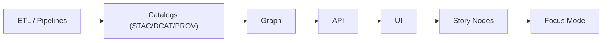

# 📚 Outbound Catalogs (`api/src/adapters/outbound/catalogs/`)

This folder implements **outbound adapters** that perform **real I/O** for KFM catalogs:

- 🛰️ **STAC** (Collections/Items/Assets): “what exists” + how to fetch it  
- 🏛️ **DCAT** (Datasets/Distributions): “how to discover & cite it”  
- 🧾 **PROV** (Entities/Activities/Agents): “how it was produced” (lineage)

Outbound catalog adapters are the **metadata gate** between pipelines and everything downstream.  
If it isn’t cataloged + validated, it isn’t publishable 🚧✅

> [!IMPORTANT]
> Catalog outbound adapters **do I/O** (read/write/validate/publish metadata).  
> They are allowed to talk to storage, schema registries, and catalog backends.
>
> ✅ validate schemas • write items/collections • upsert datasets • link PROV chains • emit catalog refs  
> ❌ implement business rules • reshape HTTP responses • “guess” metadata • downgrade classification

---

## 🔗 Quick links

- 📦 Outbound root: `api/src/adapters/outbound/README.md`
- 📚 Catalog mappers (pure): `api/src/adapters/mappers/catalog/README.md`
- 🧯 Adapter errors: `api/src/adapters/errors.py`
- 📦 Storage adapter: `api/src/adapters/outbound/storage/`
- 🧱 Tiles adapter: `api/src/adapters/outbound/tiles/`
- 🛰️ GEE adapter: `api/src/adapters/outbound/gee/`
- 🗺️ PostGIS adapter: `api/src/adapters/outbound/postgis/`
- 🕸️ Neo4j adapter: `api/src/adapters/outbound/neo4j/`

---

## 🧭 Where this fits in the KFM pipeline



> [!NOTE]
> Some Mermaid renderers are strict. If this fails in your viewer, remove the diagram or switch labels to plain text only.

---

## 📁 Folder map (emoji layout)

```text
📁 api/
  📁 src/
    📁 adapters/
      📁 outbound/
        📁 catalogs/                         📚 STAC/DCAT/PROV IO + validation + publishing
          📄 README.md                       👈 you are here
          📄 __init__.py                     🧬 package init (optional)

          📁 stac/                           🛰️ STAC read/write/validate + link helpers
            📄 client.py                     🔌 STAC backend client (HTTP/FS/object-store)
            📄 writer.py                     ✍️ create/upsert Collections & Items
            📄 reader.py                     📖 fetch/resolve Collections & Items
            📄 validate.py                   ✅ STAC JSON-schema validation
            📄 links.py                      🔗 link building (self, root, parent, assets)
            📄 errors.py                     🧯 STAC-specific adapter errors

          📁 dcat/                           🏛️ DCAT dataset/distribution publishing
            📄 client.py                     🔌 DCAT backend client (triplestore/registry/files)
            📄 writer.py                     ✍️ create/upsert Dataset/Distribution
            📄 reader.py                     📖 fetch/resolve DCAT records
            📄 validate.py                   ✅ shape/constraint validation (JSON-LD/SHACL if used)
            📄 errors.py                     🧯 DCAT-specific adapter errors

          📁 prov/                           🧾 PROV bundles, activities, agents
            📄 writer.py                     ✍️ build/persist PROV Entities/Activities/Agents
            📄 reader.py                     📖 fetch/resolve PROV bundles
            📄 validate.py                   ✅ PROV shape validation (pure checks + schema)
            📄 errors.py                     🧯 PROV-specific adapter errors

          📁 schemas/                        📐 vendored schemas / profiles (if repo chooses)
            📄 README.md                     🧾 schema provenance + versions
            📄 stac_item.schema.json         ✅ pinned schema
            📄 stac_collection.schema.json   ✅ pinned schema
            📄 dcat_profile.json             ✅ pinned profile
            📄 prov_profile.json             ✅ pinned profile

          📄 publish.py                      🚀 high-level publish orchestration (thin wrapper)
          📄 crosslink.py                    🔺 enforce STAC↔DCAT↔PROV link rules
          📄 hrefs.py                        🔒 safe href rules (no secrets, allowlist schemes)
          📄 versioning.py                   🆔 stable IDs + version policy helpers
          📄 tests.md                        🧪 local integration test notes (optional)
```

> [!TIP]
> The names above are a recommended shape. If your repo already has files, keep the **separation by standard**:
> `stac/`, `dcat/`, `prov/`, plus `crosslink` + `href` safety.

---

## 🎯 What outbound catalogs are responsible for

### ✅ Core responsibilities
- 🧾 **Publish metadata** (create/upsert STAC/DCAT/PROV records)
- ✅ **Validate** conformance to pinned schemas/profiles (CI-friendly and deterministic)
- 🔺 **Cross-link** records:
  - STAC assets ↔ real artifact hrefs (storage)
  - DCAT distributions ↔ API endpoints / STAC endpoints
  - PROV activities ↔ inputs/outputs and responsible agents
- 🆔 **Enforce stable identity + versioning** semantics
- 🔐 **Propagate classification/redaction** metadata (never downgrade)
- 🧯 **Translate backend failures** into stable adapter errors (retryable vs permanent)
- 📈 **Emit observability signals** (metrics/logs/traces) without leaking payloads

### ❌ Not responsible for
- making decisions about what to compute or what to publish (services do this)
- mapping DTOs ↔ domain (mappers do this)
- executing geospatial queries or building tiles (PostGIS/tiles outbound do this)
- building the knowledge graph (graph pipeline/outbound adapter does this)

---

## 🧱 The “metadata triangle” 🔺 (how records should link)

This adapter should enforce consistent linking so downstream never guesses:

- 🛰️ STAC: assets + spatial/temporal envelopes  
- 🏛️ DCAT: discovery + distributions  
- 🧾 PROV: lineage + accountability  

**Golden linking rules:**
1) **Every publishable artifact has a STAC identity** (Item or Collection)  
2) **Every discoverable dataset has a DCAT identity** (Dataset)  
3) **Every derived artifact has PROV** (Activity + input/output Entities)  
4) Graph stores references, not bulky payloads (Graph nodes link to STAC/DCAT/PROV IDs)

---

## 🚀 Canonical publish flows

### Flow A: Publish a new “raw” dataset 📦
1) 📦 storage outbound writes artifact(s) (COG, GeoJSON, PDF, etc.)
2) 🛰️ STAC adapter publishes:
   - Collection (if new)
   - Item + Asset links (href + type + roles)
3) 🏛️ DCAT adapter publishes:
   - Dataset (human-facing discovery)
   - Distribution(s) pointing to STAC endpoints or downloads
4) 🧾 PROV publishes:
   - Entity for the artifact(s)
   - Activity describing ingest
   - Agent = pipeline/service/org
5) 🔺 Crosslink step validates the triangle is consistent ✅

### Flow B: Publish a derived/modeling output 🧪
Same as Flow A, plus:
- include `params_hash`, `input_refs`, and uncertainty summaries in metadata (small + explicit)
- PROV activity *must* reference inputs used and outputs generated
- never overwrite prior versions in-place (immutability + provenance)

> [!IMPORTANT]
> Modeling outputs are **first-class datasets**.  
> They must be cataloged with the same discipline as “regular” data.

---

## ✅ Validation strategy (fast, pinned, deterministic)

Outbound catalogs should validate in two phases:

### 1) Pure validation (preflight) 🧼
- required keys exist
- hrefs are safe (no secrets)
- IDs and versions are valid
- link structure is coherent (self/root/parent)
- classification does not downgrade

### 2) Schema/profile validation (pinned) ✅
- STAC JSON Schema (Item/Collection) pinned per repo policy
- DCAT profile validation (JSON-LD/SHACL if used, or strict structural rules)
- PROV profile validation (PROV-JSON shape rules or schema)

> [!TIP]
> Vendor schema/profile versions under `schemas/` to prevent “internet drift” and keep builds reproducible.

---

## 🆔 Identity & versioning policy (don’t break provenance)

**Write-once, version-forward** is the default:

- ✅ “new version” → new STAC Item ID (or explicit version field + immutability)
- ✅ assets get versioned paths or content-addressed hrefs (hash-based)
- ✅ DCAT distributions update to point to new versions (or add new distributions)
- ✅ PROV links outputs to exactly the inputs + activity that produced them

Avoid:
- ❌ overwriting the same href with different bytes
- ❌ reusing the same Item ID for different content without explicit versioning

---

## 🔗 HREF safety rules (catalogs are an exfiltration surface 🔒)

Outbound catalogs must enforce:
- no embedded credentials (`user:pass@host`)
- no token-like query params by default (`token=`, `sig=`, `X-Amz-Signature=`, etc.)
- scheme allowlist (typical: `https`, `s3`, and optionally `file` in dev)
- max href length, max number of links/assets per record

> [!TIP]
> If access requires short-lived signed URLs, catalog should store:
> - stable object reference (bucket/key) OR an API endpoint
> - not the signature itself

---

## 🧯 Error translation rules (stable + boring)

Outbound catalogs should classify failures:

### Retryable (transient) 🔁
- timeouts
- rate limits
- temporary backend unavailability
- transient network issues

### Non-retryable (permanent) 🧱
- schema validation failures
- missing required links/refs
- unsafe href
- classification downgrade attempt
- invalid IDs/versions

**Adapter errors should include:**
- `system`: `stac | dcat | prov | catalogs`
- `code`: stable error code (contract surface)
- `retryable`: boolean
- `trace_id`: for logs

---

## 🧪 Testing strategy (catalog outbound)

### ✅ Unit tests
- href safety checker
- crosslink rules (STAC↔DCAT↔PROV)
- versioning rules
- validation errors are stable codes

### ✅ Golden fixtures
```text
🧪 tests/
  📁 fixtures/
    📁 catalogs/
      📁 stac/
        📄 collection_min.json
        📄 item_min.json
        📄 item_with_assets.json
      📁 dcat/
        📄 dataset_min.json
        📄 distribution_min.json
      📁 prov/
        📄 bundle_min.json
        📄 activity_generated_by.json
```

### ✅ Integration tests
- spin up the chosen catalog backend(s) (filesystem, registry, triplestore) in CI
- publish then read-back
- validate “round-trip stability” (what you publish is what you can resolve)

---

## 📈 Observability (don’t fly blind 🛰️)

Emit:
- metrics:
  - publish latency per standard
  - validation failures by code
  - backend errors by retryability
- logs:
  - trace_id + operation name
  - never dump full payloads (sanitize)
- tracing spans:
  - `catalogs.stac.publish`, `catalogs.dcat.publish`, `catalogs.prov.publish`

---

## ✅ Definition of done (catalog outbound work)

- [ ] Implements a port (services depend on interfaces, not concrete clients)
- [ ] Pinned schema/profile versions (or explicit policy documented)
- [ ] Preflight validation (href safety, IDs, link structure)
- [ ] Crosslink rules enforced (STAC↔DCAT↔PROV)
- [ ] Versioning policy enforced (no silent overwrites)
- [ ] Classification/redaction propagation enforced (no downgrade)
- [ ] Errors translated to stable codes (retryable vs permanent)
- [ ] Unit tests + golden fixtures added
- [ ] Integration tests configured for the chosen backend
- [ ] Observability: metrics/logging/tracing added (sanitized)

---

## 📚 Project bookshelf (all project files)

<details>
<summary>📚 Click to expand — the complete project library that informs this module</summary>

### 🧭 KFM architecture & direction
- 📄 `Kansas Frontier Matrix (KFM) – Comprehensive Technical Documentation.docx`
- 📄 `🌟 Kansas Frontier Matrix – Latest Ideas & Future Proposals.docx`

### 🛰️ Remote sensing / Earth observation
- 📄 `Cloud-Based Remote Sensing with Google Earth Engine-Fundamentals and Applications.pdf`

### 🧪 Modeling, simulation, statistics, uncertainty
- 📄 `Scientific Modeling and Simulation_ A Comprehensive NASA-Grade Guide.pdf`
- 📄 `Understanding Statistics & Experimental Design.pdf`
- 📄 `regression-analysis-with-python.pdf`
- 📄 `Regression analysis using Python - slides-linear-regression.pdf`
- 📄 `think-bayes-bayesian-statistics-in-python.pdf`
- 📄 `graphical-data-analysis-with-r.pdf`
- 📄 `Deep Learning for Coders with fastai and PyTorch - Deep.Learning.for.Coders.with.fastai.and.PyTorchpdf` *(library item; not indexed in tools)*

### 🗺️ GIS, map design, and media formats
- 📄 `python-geospatial-analysis-cookbook.pdf`
- 📄 `making-maps-a-visual-guide-to-map-design-for-gis.pdf`
- 📄 `Mobile Mapping_ Space, Cartography and the Digital - 9789048535217.pdf`
- 📄 `compressed-image-file-formats-jpeg-png-gif-xbm-bmp.pdf`
- 📄 `webgl-programming-guide-interactive-3d-graphics-programming-with-webgl.pdf`
- 📄 `responsive-web-design-with-html5-and-css3.pdf`

### 🗄️ Data systems, scaling, federation
- 📄 `PostgreSQL Notes for Professionals - PostgreSQLNotesForProfessionals.pdf`
- 📄 `Scalable Data Management for Future Hardware.pdf`
- 📄 `Data Spaces.pdf`

### 🕸️ Graphs & optimization
- 📄 `Spectral Geometry of Graphs.pdf`
- 📄 `Generalized Topology Optimization for Structural Design.pdf`

### 🧠 Humanism, governance, accountability framing
- 📄 `Introduction to Digital Humanism.pdf`
- 📄 `On the path to AI Law’s prophecies and the conceptual foundations of the machine learning age.pdf`
- 📄 `Principles of Biological Autonomy - book_9780262381833.pdf`

### 🛡️ Security mindset (defensive)
- 📄 `ethical-hacking-and-countermeasures-secure-network-infrastructures.pdf`
- 📄 `Gray Hat Python - Python Programming for Hackers and Reverse Engineers (2009).pdf`

### 🧵 Concurrency / distributed systems background
- 📄 `concurrent-real-time-and-distributed-programming-in-java-threads-rtsj-and-rmi.pdf`

### 📚 Programming compendium shelf (quick reference)
- 📄 `A programming Books.pdf`
- 📄 `B-C programming Books.pdf`
- 📄 `D-E programming Books.pdf`
- 📄 `F-H programming Books.pdf`
- 📄 `I-L programming Books.pdf`
- 📄 `M-N programming Books.pdf`
- 📄 `O-R programming Books.pdf`
- 📄 `S-T programming Books.pdf`
- 📄 `U-X programming Books.pdf`

</details>

