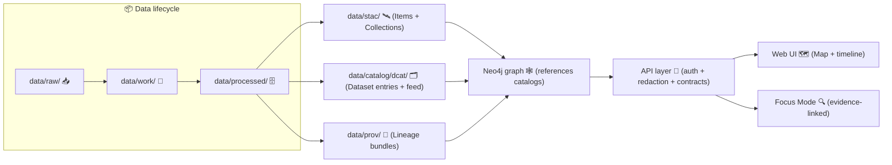

# DCAT Outbound Catalog Adapter 🗂️➡️🌐  
`api/src/adapters/outbound/catalogs/dcat/`


-informational)


> [!IMPORTANT]
> **KFM is catalog‑driven + evidence‑first** ✅  
> This adapter exists to ensure every published dataset has a **DCAT Dataset entry** (discovery metadata) that stays linked to **STAC** (asset metadata) and **PROV** (lineage). 🧾🧭

---

## 📌 What this adapter is
This outbound adapter is the **DCAT publisher** for KFM. It takes **domain dataset metadata** (contracts/entities) and produces a **DCAT-compliant JSON‑LD** representation:

- 📚 **DCAT Dataset entries** (per dataset, version-aware)
- 🗃️ An optional **DCAT Catalog** view (aggregated feed for harvesting)
- 🔗 **Distribution links** pointing to STAC, API endpoints, and/or downloadable artifacts
- 🧯 Output that is **policy-gated** (fail‑closed) and **deterministic** (stable diffs)

---

## 🧠 Why DCAT in KFM?
DCAT is KFM’s **high-level discovery layer**:
- It’s what external portals/harvesters can index to know “what datasets exist.” 🌍
- It’s what KFM’s own UI and Focus Mode can cite for **source, license, publisher, coverage**, etc. 🧾
- It ties into the **evidence triplet**: **STAC + DCAT + PROV**. 🧬

---

## 🧭 Where it sits in the pipeline


> [!NOTE]
> Some docs reference legacy catalog folders like `data/catalog/` + `data/provenance/`.  
> **This adapter should treat the output paths as configuration**, with sensible defaults aligned to the current repo conventions. ✅

---

## ✅ Responsibilities
This adapter **must**:

### 1) 🧾 Produce KFM-profiled DCAT JSON‑LD
- Generate a **DCAT Dataset** record for each published dataset.
- Ensure records include **required discovery fields** and **distribution links** (see below).

### 2) 🔗 Maintain cross‑layer linkage (DCAT ↔ STAC ↔ PROV)
- DCAT records should point to:
  - STAC Collection / Item(s) (geospatial asset detail)
  - PROV lineage bundle (how it was produced)
  - API endpoints / download URLs (how to access)

### 3) 🧱 Enforce determinism + auditability
- Stable ordering of keys and arrays where practical
- Stable identifiers + version linkage
- Atomic writes (no partial files)
- Clear diffs for PR review 🧑‍⚖️

### 4) 🛡️ Respect governance + sensitivity rules
- Never publish metadata that violates classification / sovereignty / ethics constraints
- Fail closed under policy gates (OPA/Rego via Conftest) 🚫✅

---

## 🚫 Non‑goals
This adapter is **not** responsible for:

- ❌ Crawling/harvesting inbound datasets (that’s intake/ETL)
- ❌ Building Neo4j graph nodes/edges (that’s graph ingestion)
- ❌ Authentication/authorization (that’s API boundary enforcement)
- ❌ UI rendering (that’s `web/`)

---

## 📦 Output conventions
### Canonical outputs (recommended)
```text
data/
├── 🛰️ stac/                           # STAC metadata layer (Collections + Items that point to assets/artifacts)
│   ├── 🗂️ collections/                # Dataset-level STAC Collections (extent/license/providers/links)
│   └── 🧷 items/                      # Snapshot STAC Items (time/run slices; assets + roles + hrefs)
│
├── 🗂️ catalog/                        # Discovery layer (DCAT + optional rollups for fast lookup)
│   └── 🗂️ dcat/
│       ├── 🧾📚 catalog.jsonld         # (optional, recommended) Aggregated DCAT feed/index across datasets
│       └── 📚 datasets/               # Per-dataset (or per-version) DCAT records (preferred canonical units)
│           ├── 🧾 <dataset_id>.jsonld  # One-per dataset/version: license, access, distributions, provenance pointers
│           └── ➕ …                    # Additional dataset records
│
└── 🧬 prov/                           # Lineage bundles (PROV-O JSON-LD) linking raw→work→processed→catalog
    ├── 🧬🧾 <dataset_id>.prov.jsonld   # Dataset-level provenance (or run-bundled lineage) for reproducibility/audit
    └── ➕ …                            # Additional PROV bundles (per-run, per-release, per-activity as needed)
```

> [!TIP]
> Prefer **one file per dataset version** under `datasets/` + a small `catalog.jsonld` index.  
> This keeps diffs readable and makes deprecations/revisions explicit. 🧩

---

## 🧾 Required fields (KFM DCAT profile baseline)
At minimum, each DCAT Dataset entry should include:

| Concern | DCAT / DCTerms field (typical) | Why it matters 🧠 |
|---|---|---|
| Identifier | `dct:identifier` / `@id` | Stable IDs for graph + citations |
| Title | `dct:title` | UI display + search |
| Description | `dct:description` | Discovery + context |
| Publisher | `dct:publisher` | Accountability + credit |
| Contact | `dcat:contactPoint` | Stewardship + support |
| License | `dct:license` | Legal compliance + reuse |
| Keywords/Themes | `dcat:keyword`, `dcat:theme` | Findability + concept linking |
| Temporal coverage | `dct:temporal` | Timeline filtering |
| Spatial coverage | `dct:spatial` | Map filtering |
| Distributions | `dcat:distribution` | “How do I access it?” |
| Provenance link | `dct:provenance` and/or `prov:*` link | Traceability + reproducibility |
| Versioning | `dct:hasVersion` / `dct:isVersionOf` / `prov:wasRevisionOf` | Dataset evolution |

### 🧩 KFM extensions (typical)
KFM commonly extends base standards with project-specific fields. Examples (names may vary by profile):
- `kfm:dataset_id` (canonical dataset ID)
- `kfm:classification` (public/internal/restricted)
- `kfm:sovereignty` / `kfm:sensitivity` (Indigenous data governance, sensitive areas, etc.)
- `kfm:uncertainty` / `kfm:quality` indicators

> [!IMPORTANT]
> **Do not invent ad-hoc fields.**  
> If a domain needs new metadata, extend **KFM_DCAT_PROFILE.md** (and update validators) via PR. 🧑‍⚖️

---

## 🔗 Distribution linking rules (DCAT → STAC / Data / API)
A DCAT Dataset should include one or more `dcat:distribution` entries. Typical distributions:

- 🛰️ **STAC Collection URL** (preferred for geospatial datasets)
- 🧾 **PROV bundle URL** (lineage)
- 🧷 **API query endpoint** (e.g., a parameterized dataset query)
- 📥 **Direct download URL** (GeoJSON, Parquet, COG, etc.)
- 📦 **OCI artifact reference** (future/optional supply-chain hardened distribution)

Each `dcat:Distribution` should include as applicable:
- `dcat:accessURL` (landing/query)
- `dcat:downloadURL` (direct file)
- `dct:format` / `dcat:mediaType`
- optional: byte size, checksum, compression, etc.

---

## 🛡️ Governance & policy gates
KFM uses **policy-as-code** and runs checks in CI. This adapter must be compatible with:

- ✅ **Fail-closed** validation (missing required fields => CI fails)
- ✅ License allowlists (SPDX strings, approved licenses)
- ✅ Classification propagation: **outputs must not be less restricted than inputs**
- ✅ “No bypassing catalogs”: nothing should be used by graph/UI without boundary artifacts
- ✅ “No secrets in git”: ensure catalogs never embed credentials/tokens/keys

> [!CAUTION]
> **Redaction belongs at the API boundary**, but **metadata can still leak** (names, exact coordinates, locations).  
> For restricted datasets, publish only what is allowed (e.g., generalized spatial extent; distribution links requiring auth). 🔒

---

## ⚙️ Configuration
Recommended configuration surface (names are suggestions — align with your repo conventions):

| Variable | Example | Purpose |
|---|---|---|
| `KFM_PUBLIC_BASE_URL` | `https://kfm.example.org` | Base for public IRIs/URLs |
| `KFM_DCAT_OUTPUT_DIR` | `data/catalog/dcat` | Where JSON‑LD is written |
| `KFM_DCAT_DATASETS_DIR` | `data/catalog/dcat/datasets` | Per-dataset outputs |
| `KFM_DCAT_CATALOG_FILE` | `data/catalog/dcat/catalog.jsonld` | Aggregated feed |
| `KFM_DCAT_CONTEXT_FILE` | `docs/standards/dcat/context.json` | JSON‑LD context |
| `KFM_PROFILE_DCAT` | `docs/standards/KFM_DCAT_PROFILE.md` | Profile reference |
| `KFM_POLICY_PACK_DIR` | `tools/validation/policy` | OPA/Rego policies |

---

## 🧱 Implementation sketch (suggested structure)
> This is a **suggested** layout — match what actually exists in the repo.

```text
📦 api/src/adapters/outbound/catalogs/dcat/
  ├── 📄 README.md
  ├── 🧩 mapper.py              # domain → DCAT model mapping
  ├── 🧾 models.py              # typed DCAT DTOs (pydantic/dataclasses)
  ├── 🧰 serializer.py          # JSON-LD serialization + deterministic ordering
  ├── ✅ validator.py           # profile/schema hooks (optional)
  ├── 💾 storage.py             # filesystem (atomic) writes
  └── 🔌 adapter.py             # implements the outbound port
```

### 🧷 Suggested outbound port
Your application layer typically defines a port such as:

```python
from typing import Protocol
from pathlib import Path

class DcatCatalogPort(Protocol):
    def upsert_dataset(self, dataset_id: str, metadata: dict) -> Path: ...
    def remove_dataset(self, dataset_id: str) -> None: ...
    def rebuild_catalog_index(self) -> Path: ...
```

---

## 🧪 Testing strategy
### Unit tests (fast)
- ✅ Mapping tests: domain metadata → expected DCAT fields
- ✅ Determinism tests: same input → byte-for-byte stable output
- ✅ Version linkage tests: v2 includes revision/isVersionOf links to v1

### Golden file tests (high value)
- 📸 Snapshot known dataset outputs and diff on PRs
- 🔍 Validate JSON‑LD compaction/expansion as needed (optional)

### CI validation (required)
- ✅ Schema validation (JSON Schema / SHACL) on DCAT outputs
- ✅ Policy pack (OPA/Rego via Conftest) over catalog files

---

## 🧾 Example output (minimal DCAT Dataset JSON‑LD)
<details>
<summary>👀 Click to expand (example)</summary>

```json
{
  "@context": {
    "dcat": "http://www.w3.org/ns/dcat#",
    "dct": "http://purl.org/dc/terms/",
    "prov": "http://www.w3.org/ns/prov#",
    "skos": "http://www.w3.org/2004/02/skos/core#",
    "xsd": "http://www.w3.org/2001/XMLSchema#",
    "kfm": "https://kfm.example.org/ns#"
  },
  "@id": "https://kfm.example.org/dataset/kfm.ks.hydrology.usgs_nwis.v1",
  "@type": "dcat:Dataset",
  "dct:identifier": "kfm.ks.hydrology.usgs_nwis.v1",
  "dct:title": "USGS NWIS Real-time Water Data (Kansas)",
  "dct:description": "Real-time river gauge measurements for Kansas stations sourced from USGS NWIS.",
  "dct:license": "https://spdx.org/licenses/CC-BY-4.0.html",
  "dcat:keyword": ["hydrology", "river gauge", "real-time"],
  "dct:publisher": {
    "@type": "foaf:Organization",
    "foaf:name": "USGS"
  },
  "dcat:distribution": [
    {
      "@type": "dcat:Distribution",
      "dcat:accessURL": "https://kfm.example.org/api/v1/query?table=river_gauge_latest",
      "dct:format": "application/json"
    },
    {
      "@type": "dcat:Distribution",
      "dcat:accessURL": "https://kfm.example.org/data/stac/collections/usgs_nwis.json",
      "dct:format": "application/json"
    },
    {
      "@type": "dcat:Distribution",
      "dcat:accessURL": "https://kfm.example.org/data/prov/kfm.ks.hydrology.usgs_nwis.v1.prov.jsonld",
      "dct:format": "application/ld+json"
    }
  ],
  "kfm:classification": "public",
  "prov:wasRevisionOf": "https://kfm.example.org/dataset/kfm.ks.hydrology.usgs_nwis.v0"
}
```
</details>

---

## 🧯 Troubleshooting
- **CI fails: “missing license”** 🧾  
  Add `dct:license` and ensure it matches approved license policy.
- **Catalog diffs are noisy** 🧹  
  Ensure deterministic ordering of arrays (keywords, distributions) and stable serialization.
- **A dataset is restricted but metadata is public** 🔒  
  Confirm classification rules: redact or generalize sensitive fields and require auth on distributions.
- **Graph shows “mystery dataset”** 👻  
  Ensure DCAT entry exists *and* is linked to STAC/PROV; graph ingestion should reference catalog IDs only.

---

## 🛣️ Roadmap ideas (optional but aligned with KFM direction)
- 📦 **OCI-backed distributions** (signed + attestations) for supply-chain hardened dataset artifacts
- 🛰️ **DCAT federation** (cross-state “Frontier Matrices” catalog aggregation)
- 🧊 **3D / AR distributions** (e.g., 3D Tiles / digital twins) for immersive layers
- 🎓 **DOI/ARK integration** for persistent citation of dataset versions
- 🌐 **DCAT-AP / DCAT-US compatibility mode** for easier harvesting by national portals

---

## 🔗 Related components
- 🛰️ `api/src/adapters/outbound/catalogs/stac/` (STAC publisher)
- 🧾 `api/src/adapters/outbound/catalogs/prov/` (PROV publisher)
- 🕸️ Graph ingestion tools (catalogs → Neo4j)
- 🧷 API contracts (dataset search, catalog endpoints)
- 🗺️ UI dataset panel + Focus Mode citations (consumers of DCAT metadata)

---

## ✅ Definition of done (for changes here)
- [ ] Output matches **KFM_DCAT_PROFILE** (required fields present)
- [ ] DCAT entries include **distribution links** to STAC and PROV where applicable
- [ ] Policy pack passes (fail-closed) ✅
- [ ] Output is deterministic (stable diffs) 🧊
- [ ] No sensitive leakage (classification respected) 🔐

