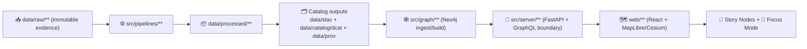

# 🧬 PROV Catalog Adapter (Outbound)  
_📍 Path: `api/src/adapters/outbound/catalogs/prov/`_


-informational)


> ✅ **Purpose:** Generate, validate, and publish **W3C PROV** **JSON-LD** bundles that explain _exactly_ how KFM datasets & evidence artifacts were produced (inputs → processing steps → outputs + agents).  
> 🧠 **Why it matters:** PROV is a **hard gate** for publishing, graph ingestion, UI provenance panels, and Focus Mode citations.

---

## 🧭 Quick Navigation
- [What this adapter does](#-what-this-adapter-does)
- [Where PROV lives](#-where-prov-lives)
- [Data model](#-data-model)
- [Cross-catalog linking](#-cross-catalog-linking)
- [Validation & policy gates](#-validation--policy-gates)
- [Integration points](#-integration-points)
- [Testing](#-testing)
- [Roadmap](#-roadmap)
- [Project docs this adapter aligns with](#-project-docs-this-adapter-aligns-with)

---

## 🧩 What this adapter does

### ✅ Responsibilities
This adapter is the **outbound** implementation for KFM’s **provenance catalog** boundary:

- 🧾 **Build a PROV bundle** (JSON-LD) from:
  - 🧱 **Entities**: raw inputs, intermediate artifacts, processed outputs
  - ⚙️ **Activities**: pipeline runs, transformations, validations, model runs
  - 🧑‍🤝‍🧑 **Agents**: humans, CI, software pipelines, AI systems (where applicable)
- 🗂️ **Write bundles** to the canonical PROV output location (see below)
- 🧪 **Validate** output against the **KFM-PROV profile** and schema checks
- 🔗 **Enable cross-references** from STAC/DCAT → PROV and PROV → artifacts

### 🚫 Non-goals
- ❌ Does **not** run ETL itself (that’s `src/pipelines/`)
- ❌ Does **not** load into Neo4j directly (that’s `src/graph/`)
- ❌ Does **not** “fix” data (PROV must *describe* changes, not silently correct them)
- ❌ Does **not** bypass API governance for restricted artifacts

---

## 🧬 Where PROV lives

KFM treats STAC/DCAT/PROV as **boundary artifacts** (publishable interfaces to downstream stages).

### 📦 Canonical output directory
- 📁 `data/prov/` — PROV bundles (per dataset and/or per run)

> Tip: If you see `data/provenance/` referenced in older notes, treat `data/prov/` as canonical unless repo policy says otherwise.

### 🏷️ Recommended naming conventions (adapter contract)
Pick **one** strategy and keep it consistent across domains:

#### Option A — dataset-stable (simple)
- `data/prov/{dataset_id}.jsonld`

Pros: clean, Git history provides evolution  
Cons: harder to represent multiple parallel runs

#### Option B — dataset + run (preferred for auditability)
- `data/prov/{dataset_id}/{run_id}.jsonld`

Pros: append-only friendly, supports multiple runs  
Cons: more files

✅ **This adapter should support both** via configuration (see [Configuration](#-configuration)).

---

## 🗺️ Pipeline placement (why this sits in outbound)



---

## 🧾 Data model

KFM uses PROV to answer: **“How did we get here?”**

### 🧱 Entities (`prov:Entity`)
Represent “things”:
- 📄 Raw files (e.g., source CSVs, imagery, scanned documents)
- 🧪 Intermediate products (work outputs)
- 📦 Processed artifacts (final outputs users download/use)
- 🔧 Code/config snapshots (recommended)
- 🧠 Model artifacts (if AI produced output)

### ⚙️ Activities (`prov:Activity`)
Represent “work performed”:
- 🧰 Ingest job runs
- 🗺️ Geospatial transforms (reproject, clip, dissolve, rasterize, etc.)
- 📊 Analytic workflows (aggregation, classification, inference)
- 🤖 AI model runs (prompt → output, or training → model)

### 🧑‍🤝‍🧑 Agents (`prov:Agent`)
Represent “who/what did it”:
- 👩‍💻 Human contributor(s)
- 🤖 CI bot / automation actor
- 🧩 Pipeline software agent (versioned)
- 🧠 AI system agent (model/version identified)

### 🔗 Core relations you should expect
- `prov:used` — activity consumed entity
- `prov:wasGeneratedBy` — entity generated by activity
- `prov:wasDerivedFrom` — entity derived from another entity
- `prov:wasAssociatedWith` — activity associated with agent

---

## 🧪 Minimal PROV JSON-LD example

> This is intentionally small; real KFM bundles should include IDs/URIs, checksums, config + commit hash, and cross-links.

```json
{
  "@context": [
    "https://www.w3.org/ns/prov.jsonld",
    { "kfm": "https://kansas-frontier-matrix.org/ns#" }
  ],
  "@type": "prov:Bundle",

  "entity": {
    "kfm:raw/usgs_nlcd_2020.tif": {
      "prov:type": "prov:Entity",
      "prov:label": "USGS NLCD 2020 (raw)",
      "kfm:sha256": "…"
    },
    "kfm:processed/landcover/ks_landcover_2020.tif": {
      "prov:type": "prov:Entity",
      "prov:label": "Kansas Landcover 2020 (processed)",
      "kfm:dataset_id": "kfm.ks.landcover.2020",
      "kfm:sha256": "…"
    }
  },

  "activity": {
    "kfm:run/4b7b0d6d-2f5e-4c05-9b9a-2b0e5b9b5b2a": {
      "prov:type": "prov:Activity",
      "prov:label": "Landcover pipeline run",
      "prov:startedAtTime": "2025-01-01T10:00:00Z",
      "prov:endedAtTime": "2025-01-01T10:05:00Z",
      "kfm:pipeline": "src/pipelines/landcover",
      "kfm:commit": "…"
    }
  },

  "agent": {
    "kfm:agent/ci": {
      "prov:type": "prov:SoftwareAgent",
      "prov:label": "KFM CI"
    }
  },

  "used": {
    "_:u1": {
      "prov:activity": "kfm:run/4b7b0d6d-2f5e-4c05-9b9a-2b0e5b9b5b2a",
      "prov:entity": "kfm:raw/usgs_nlcd_2020.tif",
      "prov:role": "input"
    }
  },

  "wasGeneratedBy": {
    "_:g1": {
      "prov:entity": "kfm:processed/landcover/ks_landcover_2020.tif",
      "prov:activity": "kfm:run/4b7b0d6d-2f5e-4c05-9b9a-2b0e5b9b5b2a"
    }
  },

  "wasAssociatedWith": {
    "_:a1": {
      "prov:activity": "kfm:run/4b7b0d6d-2f5e-4c05-9b9a-2b0e5b9b5b2a",
      "prov:agent": "kfm:agent/ci"
    }
  }
}
```

---

## 🔗 Cross-catalog linking

KFM does **not** treat STAC, DCAT, and PROV as separate worlds. They must reference each other.

### STAC → PROV
Recommended patterns:
- Add a property that identifies:
  - the **PROV Activity ID** that produced an asset, **or**
  - the **run_id / bundle_id** used to locate the PROV bundle

### DCAT → STAC + PROV
Recommended patterns:
- Include `dcat:distribution` (or equivalent) links that point to:
  - STAC Collection URL (discovery/geo asset detail)
  - PROV bundle URL (lineage/audit trail)

### PROV → data/processed/**
PROV should include:
- Stable references to output artifacts (paths and/or URLs)
- Checksums for **raw inputs** and **processed outputs** (at minimum)

---

## 🛡️ Validation & policy gates

KFM treats metadata like code: it is validated and enforced.

### ✅ Schema validation
- PROV bundles must conform to:
  - `docs/standards/KFM_PROV_PROFILE.md` (profile expectations)
  - `schemas/` validation rules (JSON Schema and/or SHACL depending on implementation)

### ✅ Policy Pack (OPA/Conftest) expectations
Typical rules enforced by CI include:
- 🧬 **Provenance-first publishing:** new/changed processed artifacts must have PROV
- 🧾 **No orphan data:** processed files must also have STAC + DCAT + PROV
- 🧱 **Pipeline ordering:** catalogs must exist before graph ingestion + UI exposure

#### Common failure mode to document in PR reviews
- `KFM-PROV-001` — processed artifact changed without corresponding provenance update

---

## 🔌 Integration points

### 🕸️ Graph ingestion (Neo4j)
PROV is ingested to create:
- activity/run nodes
- lineage edges between datasets/assets
- queryable “how produced” paths

This is what makes questions like “what stories used this dataset?” or “which pipeline run created this map layer?” actually answerable.

### 🗺️ UI (Provenance panels)
The UI expects that layers/nodes can surface:
- source attribution
- license + usage constraints
- lineage chain (where it came from + how it was transformed)

### 🎯 Focus Mode (citations + traceability)
Focus Mode outputs are expected to be **evidence-backed**:
- every claim should map to a dataset/document/entity
- provenance can drive “View Evidence” experiences and machine-checkable audit trails

---

## ⚙️ Configuration

> These are **recommended adapter configuration keys**. If your repo already has a config system, map these to it.

| Key | Example | Notes |
|---|---:|---|
| `KFM_DATA_ROOT` | `./data` | Root for data tree |
| `KFM_PROV_DIR` | `data/prov` | Default PROV output |
| `KFM_BASE_URI` | `https://kansas-frontier-matrix.org/id/` | Used to mint stable IDs |
| `KFM_PROV_NAMING` | `dataset` \| `dataset_run` | Select naming strategy |
| `KFM_PROFILE_PROV_VERSION` | `11.0.0` | Profile version used for validation |

---

## 🧪 Testing

### Unit tests (recommended)
- ✅ bundle is valid JSON-LD
- ✅ required relationships exist (`used`, `wasGeneratedBy`, `wasAssociatedWith`)
- ✅ stable IDs are deterministic for the same inputs (no random ordering)
- ✅ checksums are present for raw + processed entities

### Suggested commands
```bash
pytest -k prov
```

---

## 🧯 Troubleshooting

### “Policy Pack failed: missing PROV for processed output”
Checklist:
- [ ] A PROV bundle exists for the dataset/run
- [ ] PROV bundle references the processed artifact path/URI
- [ ] Checksums updated (if file bytes changed)
- [ ] STAC/DCAT cross-links updated (if you renamed IDs or paths)

### “Graph ingest missing activity nodes”
Checklist:
- [ ] PROV uses expected keys (`entity`, `activity`, relations)
- [ ] IDs are resolvable/stable (avoid ephemeral local-only IDs)
- [ ] Bundle path matches what graph importer expects

---

## 🧠 Roadmap (near + future)

> These are **aligned extensions** from KFM’s broader direction—capture more provenance, not more complexity.

- 🔁 **PR → PROV graph integration:** model PRs/commits/reviewers as PROV Activities/Entities/Agents  
- 🧾 **Rollback + provenance repair runbooks:** record retractions/repairs without erasing lineage  
- 🔏 **Supply-chain signing:** sign artifacts + attach PROV as attestations/referrers (OCI + cosign/oras patterns)  
- 🧩 **Story Node evidence manifests:** store structured citations and connect them to PROV edges  
- 🧠 **AI evidence artifacts:** treat AI outputs as first-class datasets with PROV (model/version/params + confidence)  
- 🗺️ **Geospatial transform tracing:** include CRS changes, projection steps, and spatial QC as explicit activities  
- 🧑‍⚖️ **CARE + sovereignty controls:** encode restrictions/ethics signals so downstream UI/API can enforce them

---

## 📚 Project docs this adapter aligns with

> 🧷 Keep these as the “north star” when adjusting fields, validation rules, or output layout.

### Core KFM docs
- 📚 **Data Intake – Technical & Design Guide** (STAC/DCAT/PROV triplet, evidence-first intake)
- 🧭 **AI System Overview** (provenance-backed AI + citations)
- 🗺️ **UI System Overview** (provenance surfaced in UI layers/panels)
- 🏛️ **Comprehensive Architecture / Technical Docs** (contract-first, policy gates, governance)
- 💡 **Innovative Concepts / Future Proposals** (PR→PROV, policy pack, rollback + provenance repair)
- 🧪 **Additional Project Ideas** (story evidence manifests, OCI artifacts + provenance attachments)

### 📦 Reference libraries (PDF portfolios in this project)
- 🤖 **AI Concepts & more** (ML foundations + model practices)
- 🌍 **Maps / WebGL / GIS** (3D/4D geospatial rendering + projection literacy)
- 🧰 **Programming resources** (implementation patterns across stacks)
- 🗃️ **Data management portfolio** (data architecture, lineage, reproducibility)

---

## ✅ Definition of Done (PR checklist)
- [ ] PROV bundle added/updated in `data/prov/`
- [ ] STAC + DCAT updated to reference PROV (and vice versa if required)
- [ ] Checksums updated for inputs/outputs
- [ ] Schema/profile validation passes
- [ ] Policy Pack passes (no orphan processed artifacts)
- [ ] (If applicable) graph ingest validates lineage paths
- [ ] (If applicable) UI provenance panel renders expected lineage

---

### 🔗 External standards (for implementers)
- W3C PROV-O: `https://www.w3.org/TR/prov-o/`
- PROV-JSON / PROV-JSON-LD context: `https://www.w3.org/ns/prov.jsonld`

