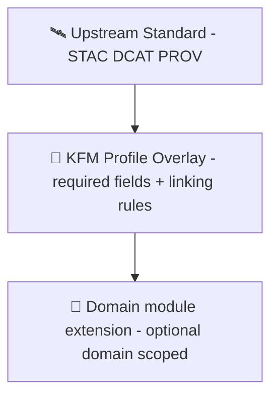

# 🗂️ Catalog Schemas (Outbound) — STAC / DCAT / PROV


> [!IMPORTANT]
> **“No mystery layers.”** If something shows up in KFM’s UI (or is used by Focus Mode), it must be traceable to cataloged sources and provable processing. ✅

---

## 🧭 Why this folder exists

This directory holds the **schema contracts** used by the outbound **Catalogs adapter** to **emit and validate** KFM catalog artifacts.

These schemas protect the platform’s core promises:

- **Contract-first**: schemas are first-class artifacts (changes trigger compatibility expectations). 📜  
- **Provenance-first**: nothing enters the “official” world (graph/UI/story/focus) without registered metadata + lineage. ⛓️  
- **Evidence-first narrative**: anything the UI shows—or AI answers—must be backed by cataloged evidence & citations. 🧾  
- **Governance-aware**: classification/sensitivity rules are enforced at the API boundary to prevent leaks. 🛡️

---

## 🔥 Where schemas sit in the KFM pipeline



### ✅ Non-negotiable invariants (do not regress)
- **Pipeline ordering is absolute**: downstream stages must not consume data that skipped upstream outputs/checks.  
- **API boundary rule**: UI must never query the graph directly—**all access is governed through the API**.  
- **Provenance required before use**: published outputs must have STAC/DCAT + PROV before graph/UI/story use.  
- **Deterministic, idempotent ETL**: repeatable transforms + stable outputs; logs/hashes support reproducibility.  
- **Evidence-first narrative**: no unsourced story/focus claims; AI-generated text must be labeled + cited.

---

## 🧱 What we mean by “Catalog artifacts” in KFM

KFM treats **metadata as a data contract**. Every dataset/evidence artifact is described by an **evidence triplet**:

| Artifact | What it answers | Typical consumer(s) |
|---|---|---|
| 🛰️ **STAC (Collection + Item[s])** | “What spatial/temporal asset is this, where is it, and what files/tiles are available?” | UI layers, map popups, tiling/export, spatial search |
| 🏷️ **DCAT (Dataset entry)** | “What is this dataset, who published it, what license/terms apply, how do I access it?” | dataset discovery/search, attributions/credits, external harvesters |
| ⛓️ **PROV (bundle / activity graph)** | “How was this produced? what inputs + steps + agents created it?” | governance/audit, reproducibility, Focus Mode citations, lineage queries |

> [!NOTE]
> Even “non-spatial” datasets may still get STAC for consistency and cross-layer linking.

---

## 📦 Suggested folder layout

Your repo may vary, but keep the organization **clear and composable**:

```text
📁 schemas/
├─ 🛰️ stac/              # STAC JSON Schemas (Collection/Item/Asset) + KFM overlay
├─ 🏷️ dcat/              # DCAT JSON(-LD) schemas/shapes + KFM overlay
├─ ⛓️ prov/              # PROV JSON-LD schemas/shapes + KFM overlay
├─ 🧩 kfm/               # Shared KFM extensions (dataset_id, classification, sensitivity, etc.)
├─ 🧠 ai/                # (Optional) schemas for AI artifacts & citation payloads
├─ 🔐 policy/            # (Optional) schema fragments used by policy-as-code checks
└─ 📚 README.md          # you are here ✅
```

---

## 🧩 KFM profiles & how schemas should be layered

KFM defines governed “profiles” that extend base standards.

📌 Start here:
- `docs/standards/KFM_STAC_PROFILE.md`
- `docs/standards/KFM_DCAT_PROFILE.md`
- `docs/standards/KFM_PROV_PROFILE.md`

### 🧬 Layering model (recommended)

```mermaid
flowchart TB
  S1[Upstream Standard\n(STAC/DCAT/PROV)] --> S2[KFM Profile Overlay\n(required fields + linking rules)]
  S2 --> S3[Domain/Module Extension\n(optional, domain-scoped)]
```

**Rules of thumb:**
- Keep upstream schema alignment clean (don’t fork specs unless unavoidable).
- Add KFM requirements via `allOf` overlays (or equivalent composition).
- Centralize shared KFM fields in `kfm/` so they don’t drift across standards.

---

## 🔗 Cross-layer linkage expectations (KFM “evidence graph”)

KFM doesn’t use STAC/DCAT/PROV in isolation — they must **link together**.

Minimum expectations:

- **STAC ➜ DCAT**
  - STAC records include a canonical dataset identifier (e.g., `kfm:dataset_id`) that corresponds to a DCAT dataset identity.
- **STAC ➜ PROV**
  - STAC records must be traceable to the provenance activity/run that produced them (direct link or resolvable via dataset/version).
- **DCAT ➜ STAC & PROV**
  - DCAT `distribution` should link to the STAC Collection/Item URL(s) and the PROV bundle URL (or stable identifier).
- **Graph mirrors catalogs**
  - Graph nodes should reference catalog IDs/URIs (no parallel “mystery” identifiers).
- **Stories + Focus Mode trace to catalogs**
  - Story Nodes cite datasets via stable IDs; Focus Mode answers cite cataloged sources and refuse to answer without citations.

---

## 🛡️ Governance: classification, sensitivity, sovereignty (schema-level support)

KFM profiles may require fields such as:
- `kfm:classification` (e.g., public/internal/restricted)
- sensitivity/sovereignty markers (e.g., Indigenous knowledge protections)
- flags enabling **coordinate generalization/omission** to prevent sensitive location leaks

Design requirements:
- Schemas must **support** these fields consistently across STAC/DCAT/PROV.
- API must be able to **enforce** them (schemas alone won’t stop a leak—API policy gates must).

> [!CAUTION]
> Focus Mode + map context can become a side-channel. If a dataset is restricted, schemas should enable redaction/generalization and the API must enforce it.

---

## 🧪 Validation & CI gates this folder enables

These schemas should power both **local developer validation** and **CI policy gates**:

### ✅ Schema validation
- STAC Collection/Item JSON validity
- DCAT dataset record validity (JSON or JSON-LD constraints, depending on representation)
- PROV bundle validity (JSON-LD structure + required KFM fields)

### ✅ Cross-reference validation
- dataset IDs resolve consistently across STAC/DCAT/PROV
- URLs/URIs are present and stable where required
- “published” artifacts are complete (no partial promotion)

### ✅ Policy-as-code checks (OPA/Conftest style)
- license fields required where expected
- classification cannot be downgraded (“no less restricted outputs than inputs”)
- AI text outputs must be labeled + include citations
- sensitive location rules (omit/fuzz where required)

> [!TIP]
> Treat schemas like “lint rules” for the entire ecosystem — they keep UI, story, and AI honest.

---

## 🧬 Versioning & compatibility (how to keep the ecosystem stable)

KFM is versioned:
- **at the dataset level** (dataset/version lifecycle), and
- **at the system/profile level** (metadata profile baseline).

### 📌 Compatibility rules (pragmatic)
- **PATCH**: tighten docs, add examples, fix typos, clarify descriptions (no contract break).
- **MINOR**: add optional fields; extend allowed enums without breaking old payloads.
- **MAJOR**: rename/remove required fields, change meanings, break validation expectations.

> [!IMPORTANT]
> If the schema changes break older artifacts, you need **migration steps** and a **compatibility strategy** (e.g., accept N-1 versions for a while, or provide a translation layer in outbound adapters).

---

## 🛠️ How to add or update a schema (checklist)

### ✅ Schema change checklist
- [ ] Identify the artifact type (STAC/DCAT/PROV) and the producer (pipeline vs API generation).
- [ ] Confirm the change aligns with the governed profile docs under `docs/standards/`.
- [ ] Implement as an overlay (preferred) instead of forking upstream.
- [ ] Add explicit `$id` and version markers (so consumers can pin).
- [ ] Add/extend examples (golden samples) for regression testing.
- [ ] Add cross-link tests (STAC↔DCAT↔PROV integrity).
- [ ] Run policy checks (license, classification, AI citation rules).
- [ ] Verify UI usage still works (layer info dialogs, attributions, exports).
- [ ] Update any schema registry / outbound adapter mapping that references this schema.

---

## 🧾 Examples (simplified patterns)

<details>
<summary><strong>🛰️ STAC Item (pattern)</strong></summary>

```json
{
  "type": "Feature",
  "stac_version": "1.0.0",
  "id": "kfm:stac:item:example",
  "bbox": [-97.0, 38.0, -96.0, 39.0],
  "geometry": { "type": "Polygon", "coordinates": [] },
  "properties": {
    "datetime": "1935-06-01T00:00:00Z",
    "kfm:dataset_id": "kfm:dataset:landcover:1990-2020",
    "kfm:classification": "public"
  },
  "assets": {
    "pmtiles": {
      "href": "https://example/kfm/tiles/landcover.pmtiles",
      "type": "application/vnd.pmtiles",
      "roles": ["data"]
    }
  },
  "links": [
    { "rel": "via", "href": "https://example/catalogs/dcat/landcover.json" },
    { "rel": "derived_from", "href": "https://example/prov/landcover.prov.jsonld" }
  ]
}
```
</details>

<details>
<summary><strong>🏷️ DCAT Dataset (pattern)</strong></summary>

```json
{
  "@type": "dcat:Dataset",
  "dct:title": "Kansas Landcover 1990–2020",
  "dct:license": "CC-BY-4.0",
  "dcat:keyword": ["landcover", "kansas"],
  "dcat:distribution": [
    {
      "@type": "dcat:Distribution",
      "dcat:accessURL": "https://example/stac/collections/landcover"
    },
    {
      "@type": "dcat:Distribution",
      "dcat:accessURL": "https://example/prov/landcover.prov.jsonld"
    }
  ],
  "kfm:classification": "public"
}
```
</details>

<details>
<summary><strong>⛓️ PROV Bundle (pattern)</strong></summary>

```json
{
  "@context": "https://www.w3.org/ns/prov.jsonld",
  "entity": {
    "kfm:dataset:landcover:1990-2020": { "prov:type": "prov:Entity" }
  },
  "activity": {
    "kfm:activity:merge_nlcd:2025-01-02": {
      "prov:type": "prov:Activity",
      "prov:startTime": "2025-01-02T10:00:00Z",
      "prov:endTime": "2025-01-02T10:05:00Z"
    }
  },
  "wasGeneratedBy": {
    "_:gen1": {
      "prov:entity": "kfm:dataset:landcover:1990-2020",
      "prov:activity": "kfm:activity:merge_nlcd:2025-01-02"
    }
  }
}
```
</details>

---

## 🔍 Practical UI/AI implications (why schema rigor matters)

- UI must surface “the map behind the map”: source, license, and processing summary per layer. 🗺️🧾  
- Focus Mode answers must include citations or refuse to answer. 🤖📌  
- Exports/shared views should carry attribution automatically. 📤✅  
- Real-time/streaming sources still require at least stub provenance + catalog metadata. ⏱️🛰️  

Schemas are what make these features reliable — they prevent “pretty but unverifiable” outputs.

---

## 📚 References (internal docs you should keep aligned with)

- 🧭 Master & repository invariants  
  - `../../../../../../docs/MASTER_GUIDE_v13.md`
- 📏 Governed standard profiles  
  - `../../../../../../docs/standards/KFM_STAC_PROFILE.md`  
  - `../../../../../../docs/standards/KFM_DCAT_PROFILE.md`  
  - `../../../../../../docs/standards/KFM_PROV_PROFILE.md`
- 🧩 API change process  
  - `../../../../../../docs/templates/TEMPLATE__API_CONTRACT_EXTENSION.md`
- 📖 Story & Focus governance  
  - `../../../../../../docs/templates/TEMPLATE__STORY_NODE_V3.md` (and Story Node rules)

---

## 🧠 Design mantra

> **Schemas are not paperwork.**  
> They are the **trust boundary** between raw data and user-visible truth. ✨

