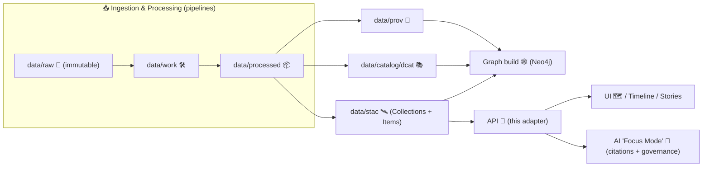

# STAC Outbound Adapter 🛰️🗂️


> **TL;DR**: This adapter is the **single governed path** for the API to **read/search/publish** STAC Collections & Items in KFM — enforcing the **KFM-STAC profile**, **policy gates**, and **cross-links** to DCAT + PROV.

---

## 📌 Why this exists (KFM context)

KFM is **evidence-first** and **catalog-driven**:
- **No “mystery layers.”** Everything served by the API must be traceable to a catalog record.
- The **STAC/DCAT/PROV triplet** is a **trust boundary**: if it’s not cataloged, it’s not real (to the system).
- UI + AI experiences (e.g., map layers, timeline, Focus Mode) depend on **clean, validated STAC** for spatial/temporal discovery and for linking to provenance.

This folder lives at:

```
📦 api/src/adapters/outbound/catalogs/stac/
```

…and provides the **outbound adapter** that implements the **catalog port** used by the application core.

---

## 🎯 Responsibilities

### ✅ This adapter **does**
- 🗺️ **Load** STAC Catalog / Collections / Items (from filesystem, object storage, OCI, or a STAC API backend)
- 🔎 **Search** Items by bbox / intersects / datetime / collections (and optional KFM “query” filters)
- 🧾 **Validate**:
  - STAC schema basics (STAC 1.0+)
  - KFM-STAC profile rules (required fields, naming, extensions)
  - Policy gates (classification/sensitivity, license, provenance links, etc.)
- 🔗 **Enforce cross-linking**:
  - STAC ↔ DCAT dataset records
  - STAC ↔ PROV bundles (lineage)
- 📦 **Normalize & hydrate HREFs** (absolute/relative handling; stable public URLs)
- 🧠 **Support evidence-first AI/UI** by ensuring Items have enough metadata to safely cite and render

### 🚫 This adapter **does NOT**
- Run ETL / transformations (that’s pipeline territory)
- Store raw/processed bytes (assets are **referenced**, not embedded)
- Bypass policy (it must **fail closed**)
- Own the knowledge graph ingestion (graph is downstream of catalogs)

---

## 🧭 Where it fits in the architecture



---

## 📁 Expected catalog layout (repo-backed default)

> The adapter should be backend-agnostic, but **defaults** to repo-managed catalogs.

Typical layout:

```
📂 data/
  📂 stac/
    📂 collections/
      🧾 <collection_id>.collection.json
    📂 items/
      📂 <collection_id>/
        🧾 <item_id>.item.json

  📂 catalog/
    📂 dcat/
      🧾 <dataset_id>.dcat.json

  📂 prov/
    🧾 <run_id>.prov.jsonld
```

⚠️ If your repo uses a different path (e.g., `data/catalog/stac/`), wire it via config (see **⚙️ Configuration**).

---

## 🧩 Public interface (port → adapter)

> Names below are illustrative. Match your actual `ports/` definitions, but keep the **shape** consistent.

### Read/search port

```python
from typing import Protocol, Any, Optional

class StacCatalogReadPort(Protocol):
    def get_collection(self, collection_id: str) -> dict: ...
    def list_collections(self) -> dict: ...
    def get_item(self, collection_id: str, item_id: str) -> dict: ...

    def search_items(
        self,
        *,
        bbox: Optional[list[float]] = None,
        datetime: Optional[str] = None,     # RFC3339 / interval
        intersects: Optional[dict] = None,  # GeoJSON geometry
        collections: Optional[list[str]] = None,
        query: Optional[dict] = None,       # KFM profile query extensions
        limit: int = 10,
        token: Optional[str] = None,
    ) -> dict: ...
```

### Publish port (optional, but supported)

KFM prefers **pipeline-driven publishing**, but the API may still need controlled writes for:
- ✅ admin-only publishing workflows
- ✅ W-P-E agent maintenance tasks (rebuild / rehydrate / migrate)
- ✅ deterministic “re-packaging” of catalogs

```python
class StacCatalogPublishPort(Protocol):
    def publish_collection(self, collection: dict) -> None: ...
    def publish_item(self, item: dict) -> None: ...
```

📌 **Rule**: publishing must be **deterministic** and **idempotent**. No “manual patching” without traceability.

---

## ⚙️ Configuration (backend selection)

Support at least these backends:

- 🗃️ **filesystem** (default): read from `data/stac/...`
- ☁️ **object_store** (S3/R2/etc): HREFs point to buckets; metadata may still be repo-tracked
- 🌐 **stac_api**: query a remote STAC API
- 📦 **oci**: assets/catalogs stored as OCI artifacts (optional, forward-looking)

Suggested environment variables:

```bash
# Which backend to use for STAC catalog access
KFM_STAC_BACKEND=filesystem

# Root path (filesystem backend)
KFM_STAC_ROOT=./data/stac

# Base URL used to resolve relative HREFs when serving API responses
KFM_PUBLIC_BASE_URL=https://example.org

# Optional: object store / STAC API settings
KFM_STAC_BUCKET=
KFM_STAC_PREFIX=stac/
KFM_STAC_API_URL=
```

---

## 🧾 KFM-STAC profile expectations (high-level)

> The **profile doc is the source of truth**. This README describes the **adapter’s enforcement posture**.

### Minimum must-haves (Items & Collections)
- `stac_version`
- `id` (stable, deterministic)
- `links` (including self/root/parent as appropriate)
- Spatial:
  - `bbox`
  - `geometry` (for Items)
- Temporal:
  - either `properties.datetime` **or** `properties.start_datetime` / `properties.end_datetime`
- `assets` with:
  - `href`
  - `type` (media type)
  - `roles` (see asset role conventions below)

### KFM-required custom semantics (typical)
The adapter should enforce that KFM items/collections include KFM “control plane” metadata such as:

- 🆔 `kfm:dataset_id` (stable ID that links to DCAT)
- 🏷️ `kfm:classification` / `kfm:sensitivity` (used for access control + UI warnings)
- 🔁 `kfm:version` (semantic or run-based)
- 🧬 provenance pointers (link(s) to PROV bundle)
- ✅ deterministic hashes for artifacts and/or JSON canonical digest (see below)

⚠️ Exact key names come from the profile (`docs/standards/KFM_STAC_PROFILE.md`).

---

## 🔗 Cross-links: STAC ↔ DCAT ↔ PROV (evidence triplet)

KFM treats catalogs as **mutually reinforcing**:

### STAC ➜ DCAT
STAC Items/Collections should link to the dataset’s DCAT record (examples of acceptable strategies):
- `links[].rel = "describedby"` → DCAT JSON
- `links[].rel = "via"` → DCAT landing page
- `kfm:dcat_ref` → canonical dataset id or URL

### STAC ➜ PROV
STAC should link to provenance describing how the assets were produced:
- `links[].rel = "via"` → PROV bundle (JSON-LD)
- `kfm:prov_run_id` or `kfm:prov_ref` → stable run identifier

### Why the adapter cares
The API uses these links to:
- render “where did this come from?” in the UI 🧭
- enforce “no-citation, no-claim” behavior in Focus Mode 🤖
- support reproducibility & audits 🔍

---

## 📦 Asset conventions (GeoParquet, PMTiles, COG, 3D, offline packs)

KFM commonly ships **two complementary artifacts** for a dataset:
- 🧮 **Analysis-friendly**: `GeoParquet` (fast, columnar)
- 🗺️ **Visualization-friendly**: `PMTiles` (fast tiles, offline-ready)

Recommended asset roles:

| Role 🎭 | Typical formats | Used by |
|---|---|---|
| `data` | GeoParquet, GeoJSON, CSV | analytics, downloads |
| `tiles` | PMTiles, vector/raster tile archives | MapLibre/Cesium |
| `raster` | COG GeoTIFF | map overlays |
| `thumbnail` | PNG/JPG | dataset cards |
| `metadata` | JSON/HTML/PDF | “about” + docs |
| `model-3d` | glTF, 3D Tiles | AR/3D storytelling |
| `offline-pack` | ZIP (pmtiles + app) | field use / kiosks |

### Offline packs 🧳
If you publish offline packs, the adapter should:
- keep the pack discoverable as an `asset` (with `roles: ["offline-pack"]`)
- ensure provenance/classification applies to the pack the same as the source dataset
- optionally expose pack checksums for integrity verification

---

## 🔐 Policy gates (fail closed)

This adapter should be **paranoid by design**. If something is missing or inconsistent, it should:
- refuse to serve it publicly
- return a clear error (and ideally: a remediation hint)

### Non-negotiable checks ✅
- 🏷️ **Classification/sensitivity present**
  - used to hide/blur geometry, restrict downloads, and scope what UI/AI can show
- 🧾 **License & usage constraints present**
- 🧬 **Provenance link present** (or explicit exemption rule in policy)
- 🔗 **DCAT link present** (or explicit exemption)
- 🧱 **No missing asset href/type/roles**
- 🧪 **Schema validation passes** (STAC + KFM profile)

### Sensitive geometry handling 🫥
For sensitive Items, the adapter should support a policy mode to:
- return generalized geometry (bbox only / coarse hex / rounded coords)
- strip exact coordinates for public access
- require elevated roles to see full precision

> Implementation tip: treat “redaction” as a view layer step, not as mutation of the stored STAC JSON.

---

## 🔁 Deterministic publishing & content integrity

KFM leans hard into **“data treated like code”**:
- stable IDs
- deterministic output
- content addressing and signatures (where available)

### What the adapter should support
- 🔒 **hash visibility**: surface asset checksums/digests in `assets[].extra_fields` or `kfm:*` fields
- 🧾 **canonical JSON digest** (optional): compute canonicalized JSON hash to detect drift
- 📦 **OCI artifacts** (optional): allow `href` values like `oci://registry/repo@sha256:...`

---

## 🧪 Testing & validation

Recommended test layers:

1. ✅ **Unit tests** for:
   - href normalization
   - backend readers
   - redaction logic (sensitivity)
2. ✅ **Contract tests** for:
   - “this STAC Item must also link to DCAT + PROV”
   - “this Item’s bbox must contain geometry”
3. ✅ **Schema tests**:
   - STAC schema validation
   - KFM-STAC profile validation
4. ✅ **Policy tests**:
   - conftest/OPA rules (fail closed)

Example commands (adapt to your tooling):

```bash
pytest -q
python -m api.scripts.policy.validate_stac  # if present in repo
```

---

## 🧰 Troubleshooting

### “Item loads but doesn’t show up in UI”
Common causes:
- missing `bbox` or invalid `geometry`
- missing temporal fields
- classification policy hides it
- asset roles/types don’t match UI expectations (`tiles`, `thumbnail`, etc.)

### “Search is slow”
If using filesystem backend:
- add a derived index (SQLite/PostGIS) **as a cache**
- but keep STAC JSON as the **source of truth**

### “Broken asset links”
- ensure the adapter rewrites relative HREFs using `KFM_PUBLIC_BASE_URL`
- ensure object-store presigned URLs are generated only when allowed by classification policy

---

## 🗺️ Roadmap ideas (aligned to KFM direction)

- 🧭 Federated catalogs (multi-region, multi-instance)
- 🧠 AI-friendly “evidence bundles” (tight STAC↔PROV linking for Focus Mode)
- 🧳 First-class offline pack manifests (deterministic pack generation + verification)
- 🏛️ Cultural protocol tags & access rules (CARE-aligned governance)
- 🧊 4D / time-state cataloging (simulation snapshots as Items; 3D/AR assets)

---

## 🔗 Related docs (repo paths)

- `docs/MASTER_GUIDE_v13.md` 📘
- `docs/standards/KFM_STAC_PROFILE.md` 🛰️
- `docs/standards/KFM_DCAT_PROFILE.md` 📚
- `docs/standards/KFM_PROV_PROFILE.md` 🧬
- `api/scripts/policy/README.md` 🔐
- `docs/architecture/` 🏗️

> If you can’t point to it in catalogs, you can’t safely serve it. ✅

