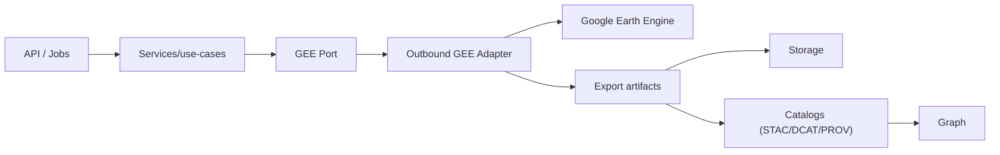
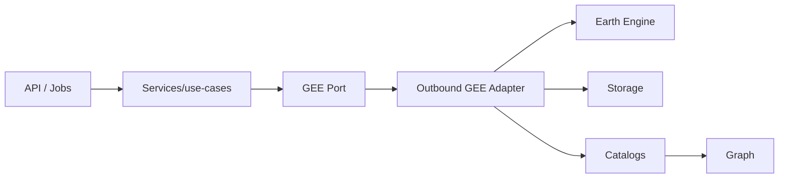

# 🛰️ Outbound GEE (`api/src/adapters/outbound/gee/`)

This folder implements the **Google Earth Engine outbound adapter** — the infrastructure boundary that lets KFM:

- 🛰️ access EO datasets (Image/ImageCollection/FeatureCollection)
- 🧪 run remote-sensing computations (reducers, composites, classifications)
- 📤 export results (rasters/vectors/tables) as **publishable artifacts**
- 🧾 emit the metadata glue: **STAC/DCAT/PROV references** for everything we produce
- 🧵 manage asynchronous tasks (create → poll → finalize)

> [!IMPORTANT]
> Outbound adapters do **I/O**.
>
> ✅ call Earth Engine • enforce quotas/timeouts • manage tasks • export artifacts • translate failures  
> ❌ implement business logic • shape HTTP responses • “guess” parameters • downgrade classification

---

## 🔗 Quick links

- 🛫 Outbound root: `api/src/adapters/outbound/README.md`
- 📚 Catalog outbound (publish metadata): `api/src/adapters/outbound/catalogs/README.md`
- 📦 Storage outbound (store artifacts): `api/src/adapters/outbound/storage/`
- 🗺️ PostGIS outbound (vector persistence/query): `api/src/adapters/outbound/postgis/`
- 🕸️ Neo4j outbound (knowledge graph): `api/src/adapters/outbound/neo4j/`
- 🔁 Modeling mappers (pure “evidence shaping”): `api/src/adapters/mappers/modeling/README.md`
- 🧯 Adapter errors: `api/src/adapters/errors.py`

---

## 🧭 Where this fits in the KFM pipeline

> 🧠 KFM rule: **EO compute outputs are evidence artifacts** → they must be **exported + cataloged** before they are “real” for downstream use.



<details>
<summary>🧯 Mermaid fallback (plain text)</summary>


</details>

---

## 📁 Folder map (emoji layout)

```text
📁 api/
  📁 src/
    📁 adapters/
      📁 outbound/
        📁 gee/                                  🛰️ Google Earth Engine IO adapter
          📄 README.md                            👈 you are here
          📄 __init__.py                          🧬 package init (optional)

          📄 config.py                            ⚙️ config (project, quotas, timeout defaults)
          📄 auth.py                              🔐 auth + initialization (service account / dev auth)
          📄 client.py                            🔌 thin client wrapper (ee init + shared ops)

          📁 datasets/                            🗂️ dataset access “facades” (no business logic)
            📄 landsat.py                         🌎 example dataset module
            📄 sentinel.py                        🛰️ example dataset module
            📄 dem.py                             🏔️ example dataset module
            📄 catalog_refs.py                    🧾 mapping EE dataset IDs → internal dataset refs

          📁 ops/                                 🧪 reusable computation building blocks (still EE-level)
            📄 filters.py                         🎛️ date/roi/cloud filters (parameterized)
            📄 composites.py                      🧩 mosaics/median composites
            📄 indices.py                         📈 NDVI/NDWI/etc. (explicit formula + units)
            📄 reducers.py                        🧮 zonal stats & reducers (safe defaults)
            📄 classifiers.py                     🤖 classification pipelines (train/apply scaffolding)
            📄 masking.py                         🫥 masks (cloud/shadow/water) (explicit)
            📄 validate.py                        ✅ EE input validation (bounds, types, sizes)

          📁 exports/                              📤 export orchestration
            📄 raster.py                           🧊 Export.image (COG/GeoTIFF patterns)
            📄 vector.py                           🗺️ Export.table / FeatureCollection exports
            📄 tables.py                           📄 CSV/GeoJSON/parquet table exports (if supported)
            📄 naming.py                           🆔 deterministic naming/versioning helpers
            📄 manifest.py                         🗃️ export manifests (params_hash, input_refs, versions)

          📁 tasks/                                🧵 async task management
            📄 submit.py                           🚀 submit + capture task ids
            📄 status.py                           📡 poll status, normalize EE states
            📄 finalize.py                         ✅ finalize → storage ingest → catalog publish
            📄 retry.py                            🔁 bounded retry/backoff policy helpers

          📄 errors.py                             🧯 error translation (retryable vs permanent)
          📄 observability.py                      📈 metrics/logging/tracing helpers (sanitized)
```

> [!TIP]
> Keep **mappers** out of here. All DTO ↔ domain shaping lives in `api/src/adapters/mappers/`.  
> This folder should stay focused on “how to talk to Earth Engine”.

---

## 🎯 What this adapter is responsible for

### ✅ Core responsibilities
- 🔐 Initialize and authenticate with Earth Engine (dev + prod flows)
- 🎛️ Apply strict input constraints at the infrastructure boundary:
  - max ROI area
  - max pixel count / scale constraints
  - max export sizes
  - bounded reducers and sampling
- 🧪 Build EE compute graphs deterministically (no hidden time or random)
- 📤 Export outputs to approved destinations
- 🧵 Track task lifecycle (submit → status → finalize)
- 🧾 Produce publish-friendly metadata:
  - run manifest (params_hash, input_refs)
  - export manifest (asset types, bands, scale, CRS)
  - provenance hooks (PROV activity refs)
- 🧯 Translate failures into stable adapter errors

### ❌ Not responsible for
- choosing which scientific method to run (service/use-case)
- deciding policy (who can run what; what’s public) (services/inbound)
- building STAC/DCAT/PROV payloads (catalog mappers + catalog outbound)
- storing artifacts (storage outbound)
- exposing results over HTTP (inbound + mappers)

---

## 🔐 Auth & initialization

### Recommended environments
- 🧪 **Local dev**: explicit dev auth flow (documented in `auth.py`)
- 🏭 **Production**: service account credentials managed via secret manager

**Hard rules:**
- never commit keys
- never log tokens or credential contents
- no credentials in query params or hrefs
- enforce explicit project selection (avoid “mystery project” runs)

> [!TIP]
> Expose a single `init_gee()` entrypoint that:
> - validates config
> - initializes ee
> - returns a small client wrapper used everywhere

---

## 🎛️ Quotas, timeouts, and bounded compute (don’t DOS yourself 🔥)

Earth Engine is powerful, but easy to overload with:
- massive ROIs
- high-res exports
- unbounded reducers
- heavy joins/mosaics

### Suggested boundary limits (configurable)
- max ROI area (in degrees² or km²)
- max pixel count per export
- max bands / max tile size
- max sampling points
- max reducer complexity (e.g., limit percentiles list)

### Deterministic defaults
- always require explicit `scale` or derive from dataset resolution (document how)
- always require explicit `crs` or default to a documented value
- always require a time window for time-varying collections (no “all time”)

---

## 🧪 EO compute patterns (explicit, reproducible)

### Make every operation declare:
- dataset IDs used (EE collection IDs)
- filters applied (date/ROI/cloud)
- indices computed (formula + inputs)
- reducer choices (mean/median/percentiles)
- output CRS + scale
- any masks (cloud/shadow/water) + algorithm name

> [!IMPORTANT]
> “Masking” and “cloud filtering” are modeling choices.  
> Keep them explicit so results are auditable and repeatable.

---

## 📤 Exports: turning compute into publishable artifacts

KFM rule of thumb:
- **inline**: tiny summaries (metrics, counts)
- **export**: anything large (rasters, big vectors, tables, plots)

### Typical export targets
- 🧊 **Raster**: Cloud Optimized GeoTIFF (COG) or GeoTIFF + derived tiles
- 🗺️ **Vector**: GeoJSON/CSV (or other formats depending on pipeline)
- 📄 **Tables**: CSV/Parquet (if pipeline supports), always with schema + units

### Naming/versioning
Exports should be:
- deterministic
- versioned
- traceable

Recommended naming inputs:
- `dataset_id`
- `model_id` / `method`
- `roi_hash`
- `time_range`
- `params_hash`
- `run_id`

---

## 🧵 Task lifecycle management (submit → poll → finalize)

Earth Engine exports are asynchronous. This adapter should provide a consistent task lifecycle:

1) **Submit**
- validate inputs
- start task
- store: `task_id`, `run_id`, `params_hash`, `requested_at`

2) **Poll**
- normalize EE states into a small stable enum:
  - `QUEUED | RUNNING | COMPLETED | FAILED | CANCELED`
- provide safe, bounded polling (no tight loops)

3) **Finalize**
- verify exported outputs exist in the expected location
- ingest/mirror into KFM storage (if needed)
- publish catalogs (STAC/DCAT/PROV) + crosslinks
- return stable result refs to services

> [!TIP]
> Finalization is where you “close the loop”:
> exports → storage → catalogs → graph references.

---

## 🧾 Provenance-first integration (STAC/DCAT/PROV)

This adapter should **not** build STAC/DCAT/PROV payloads directly unless the project chooses to do so here.  
But it must provide everything needed to build them:

### Minimum provenance payload (from this adapter)
- `input_refs[]`:
  - Earth Engine dataset IDs
  - upstream STAC item IDs (if inputs are already cataloged)
- `activity` descriptors:
  - method name, params summary
  - params_hash
  - software/pipeline versions (when available)
- `output_refs[]`:
  - storage hrefs
  - file types
  - band/schema metadata
  - checksums (when feasible)

Then the **catalog outbound** publishes:
- STAC Item + assets
- DCAT dataset/distributions
- PROV activity linking inputs → outputs

---

## 🎲 Uncertainty & accuracy discipline (EO outputs are models)

Remote sensing outputs have error. If we publish them, we must publish *some* evidence about their reliability.

### Mapper + catalog expectations
- confusion matrix summary (for classification)
- accuracy metrics (overall accuracy, per-class precision/recall/F1)
- uncertainty fields (CI/credible interval/error bounds) when available
- explicit train/val/test split metadata (for ML pipelines)
- provenance to training data (refs, not raw dumps)

> [!NOTE]
> The heavy metrics tables should be exported as artifacts (CSV/JSON) and referenced as assets.

---

## 🧯 Error translation rules (stable + boring)

Convert diverse EE failures into consistent adapter errors:

### Retryable (transient) 🔁
- timeouts
- temporary quota/rate limits
- transient network failures
- temporary backend errors

### Permanent (non-retryable) 🧱
- invalid ROI/bounds
- invalid dataset id
- invalid parameter combinations
- schema/validation failures
- classification downgrade attempt
- unsafe export destination/href

**Recommended error fields**
- `system`: `"gee"`
- `code`: stable code (`GEE_QUOTA`, `GEE_TIMEOUT`, `INVALID_ROI`, `EXPORT_FAILED`, ...)
- `retryable`: bool
- `trace_id`: for logs
- `detail`: safe summary (never dump credentials or huge payloads)

---

## 🔒 Security & privacy

### Threat model highlights
- ROI + time windows can reveal sensitive patterns
- export destinations can become data exfiltration channels
- logs can leak secrets or sensitive geometry

### Hard rules
- sanitize logs (truncate big payloads, redact token-like strings)
- forbid exports to unknown buckets or unapproved locations
- enforce classification propagation:
  - restricted inputs → restricted outputs (never downgrade)
- don’t embed signed URLs in catalogs; store stable refs and generate signed access at request time (if needed)

---

## 🧪 Testing strategy

### ✅ Unit tests
- config parsing (bounds, defaults)
- ROI validation (area caps, coordinate bounds)
- deterministic naming/versioning (same inputs → same path)
- error translation mapping
- task-state normalization

### ✅ Integration tests (staging / CI where possible)
- run a tiny export with a small ROI and low resolution
- poll to completion
- verify artifact exists
- verify catalogs published and crosslinked

> [!TIP]
> Keep staging exports tiny and budgeted. Bound compute to avoid quota surprises.

---

## 📈 Observability (metrics + logs + traces)

Outbound GEE should emit:
- latency per operation (init, compute build, export submit, poll, finalize)
- counters: exports submitted/completed/failed
- error counts by stable code
- queue depth (if you track pending tasks)
- trace spans: `gee.submit_export`, `gee.poll_task`, `gee.finalize`

**Log hygiene**
- log `trace_id`, `run_id`, `task_id` (safe)
- never log credentials, tokens, or full geometry blobs

---

## ➕ How to add a new EO operation (safe workflow)

1) 🧠 Define a domain use-case (inputs, outputs, validation rules)
2) 🔌 Add/update the **GEE port** interface (service layer depends on the port)
3) 🧪 Implement EE-level op in `ops/` (parameterized, explicit)
4) 📤 Add export support in `exports/` (artifact + manifest)
5) 🧵 Wire task lifecycle in `tasks/` (submit/poll/finalize)
6) 📚 Publish catalogs via outbound/catalogs (STAC/DCAT/PROV) using mapper outputs
7) 🧪 Add tests + fixtures (especially deterministic naming + validation)
8) 📖 Document:
   - dataset IDs used
   - method semantics
   - uncertainty/accuracy outputs

---

## ✅ Definition of done (GEE outbound work)

- [ ] Implements a port (services depend on interface, not client library)
- [ ] Auth is production-safe (no keys committed, no token logs)
- [ ] Strict input bounds (ROI/time/scale/export sizes)
- [ ] Deterministic exports (stable naming + params_hash/run_id)
- [ ] Task lifecycle is handled (submit/poll/finalize)
- [ ] Errors translated to stable codes (retryable vs permanent)
- [ ] Outputs are publishable artifacts (stored + cataloged)
- [ ] Provenance hooks present (input refs, params_hash, activity metadata)
- [ ] Uncertainty/accuracy evidence supported (where relevant)
- [ ] Unit tests + at least one staging integration test
- [ ] Observability (metrics/logging/tracing) added and sanitized

---

## 📚 Project bookshelf (all project files)

<details>
<summary>📚 Click to expand — the complete project library that informs this module</summary>

### 🧭 KFM architecture & direction
- 📄 `Kansas Frontier Matrix (KFM) – Comprehensive Technical Documentation.docx`
- 📄 `🌟 Kansas Frontier Matrix – Latest Ideas & Future Proposals.docx`

### 🛰️ Remote sensing / Earth observation (core)
- 📄 `Cloud-Based Remote Sensing with Google Earth Engine-Fundamentals and Applications.pdf`

### 🧪 Modeling, simulation, stats, uncertainty (evidence discipline)
- 📄 `Scientific Modeling and Simulation_ A Comprehensive NASA-Grade Guide.pdf`
- 📄 `Understanding Statistics & Experimental Design.pdf`
- 📄 `regression-analysis-with-python.pdf`
- 📄 `Regression analysis using Python - slides-linear-regression.pdf`
- 📄 `think-bayes-bayesian-statistics-in-python.pdf`
- 📄 `graphical-data-analysis-with-r.pdf`
- 📄 `Deep Learning for Coders with fastai and PyTorch - Deep.Learning.for.Coders.with.fastai.and.PyTorchpdf` *(library item; not indexed in tools)*

### 🗺️ GIS, map design, interactive delivery, media formats
- 📄 `python-geospatial-analysis-cookbook.pdf`
- 📄 `making-maps-a-visual-guide-to-map-design-for-gis.pdf`
- 📄 `Mobile Mapping_ Space, Cartography and the Digital - 9789048535217.pdf`
- 📄 `compressed-image-file-formats-jpeg-png-gif-xbm-bmp.pdf`
- 📄 `webgl-programming-guide-interactive-3d-graphics-programming-with-webgl.pdf`
- 📄 `responsive-web-design-with-html5-and-css3.pdf`

### 🗄️ Data systems, scaling, federation (why refs-first + tasks)
- 📄 `PostgreSQL Notes for Professionals - PostgreSQLNotesForProfessionals.pdf`
- 📄 `Scalable Data Management for Future Hardware.pdf`
- 📄 `Data Spaces.pdf`

### 🕸️ Graphs & optimization (derived artifacts still need provenance)
- 📄 `Spectral Geometry of Graphs.pdf`
- 📄 `Generalized Topology Optimization for Structural Design.pdf`

### 🧠 Humanism, governance, accountability framing
- 📄 `Introduction to Digital Humanism.pdf`
- 📄 `On the path to AI Law’s prophecies and the conceptual foundations of the machine learning age.pdf`
- 📄 `Principles of Biological Autonomy - book_9780262381833.pdf`

### 🛡️ Security mindset (defensive)
- 📄 `ethical-hacking-and-countermeasures-secure-network-infrastructures.pdf`
- 📄 `Gray Hat Python - Python Programming for Hackers and Reverse Engineers (2009).pdf`

### 🧵 Concurrency / distributed systems background
- 📄 `concurrent-real-time-and-distributed-programming-in-java-threads-rtsj-and-rmi.pdf`

### 📚 Programming compendium shelf (quick reference)
- 📄 `A programming Books.pdf`
- 📄 `B-C programming Books.pdf`
- 📄 `D-E programming Books.pdf`
- 📄 `F-H programming Books.pdf`
- 📄 `I-L programming Books.pdf`
- 📄 `M-N programming Books.pdf`
- 📄 `O-R programming Books.pdf`
- 📄 `S-T programming Books.pdf`
- 📄 `U-X programming Books.pdf`

</details>

