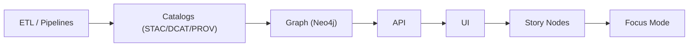

# 🕸️ Outbound Neo4j (`api/src/adapters/outbound/neo4j/`)

This folder implements the **Neo4j outbound adapter** — the infrastructure boundary that lets KFM store and query a **knowledge graph** safely and predictably.

KFM uses the graph for:
- 🧠 contextual relationships (people/places/events/datasets/artifacts)
- 🎬 Story Nodes (narrative edges + citations)
- 🎯 Focus Mode (bounded subgraphs for “why/what connects to what?”)
- 🧾 provenance-friendly references (graph accelerates traversal; catalogs remain the source of truth)

> [!IMPORTANT]
> Outbound adapters do **I/O**.
>
> ✅ connect to Neo4j • run Cypher • enforce bounds/timeouts • manage sessions/transactions • translate driver errors  
> ❌ shape HTTP responses • implement domain rules • return driver objects to services • duplicate catalog blobs

---

## 🔗 Quick links

- 🛫 Outbound root: `api/src/adapters/outbound/README.md`
- 🔁 Graph mappers (pure record → domain): `api/src/adapters/mappers/graph/README.md`
- 📚 Catalog outbound (STAC/DCAT/PROV publish): `api/src/adapters/outbound/catalogs/README.md`
- 🧯 Adapter error types: `api/src/adapters/errors.py`

---

## 🧭 Where this fits in the KFM pipeline

> KFM rule: **Catalogs before Graph**.  
> The graph should reference STAC/DCAT/PROV IDs — not become a second, drifting catalog.



<details>
<summary>🧯 If Mermaid fails in your viewer (strict parser), remove the diagram or keep labels plain</summary>

- Avoid using `graph` as a node ID.
- Prefer `N_*` IDs like in the snippet above.
</details>

---

## 📁 Folder map (emoji layout)

```text
📁 api/
  📁 src/
    📁 adapters/
      📁 outbound/
        📁 neo4j/                             🕸️ Neo4j knowledge graph adapter + Cypher helpers
          📄 README.md                        👈 you are here
          📄 __init__.py                      🧬 package init (optional)

          📄 config.py                        ⚙️ URI, auth, db name, timeout defaults
          📄 client.py                        🔌 driver init + lifecycle (connect/close)
          📄 sessions.py                      🚪 session helpers (read/write separation)
          📄 tx.py                            🧾 transaction helpers (retry policy, bookmarks)
          📄 errors.py                        🧯 driver → AdapterError translation
          📄 observability.py                 📈 metrics/logging/tracing helpers (sanitized)

          📁 cypher/                          🧾 parameterized query library (no string concat)
            📄 README.md                      🗂️ query organization rules
            📄 upsert_nodes.cypher            🧩 MERGE nodes + set properties safely
            📄 upsert_edges.cypher            🔗 MERGE relationships + set props safely
            📄 subgraph_fetch.cypher          🧠 bounded traversal queries
            📄 neighbors.cypher               🧭 paginated neighbor fetch

          📁 schema/                          🏗️ constraints + indexes + migrations (optional)
            📄 README.md                      📜 migration policy + environments
            📄 001_constraints.cypher         🧷 uniqueness constraints
            📄 002_indexes.cypher             ⚡ indexes for hot properties
            📄 003_views.cypher               👀 (optional) derived views / projections

          📄 repository.py                    🧩 port implementation (domain-facing methods)
          📄 models.py                        🧾 internal adapter models (no domain types)
```

> [!TIP]
> Keep Cypher in `cypher/` files (or a dedicated query registry) to:
> - prevent ad-hoc string-building
> - enable review for bounded traversals
> - keep queries diffable in PRs ✅

---

## 🎯 What this adapter is responsible for

### ✅ Core responsibilities
- 🔌 Connect to Neo4j safely (driver lifecycle, pool sizing)
- 🧾 Provide **parameterized Cypher** execution (no string concat)
- 🧾 Manage sessions/transactions (read vs write, bookmarks if needed)
- 🧠 Enforce bounded graph reads:
  - max traversal depth
  - max nodes/edges returned
  - pagination / cursors for neighbor lists
- 🧩 Upsert nodes/relationships deterministically (MERGE on stable IDs)
- 🧷 Create/verify constraints and indexes (migrations)
- 🔐 Respect classification/redaction rules (no downgrades; no precision leaks)
- 🧯 Translate Neo4j/driver errors into stable adapter errors (retryable vs permanent)
- 📈 Emit observability signals (metrics/logging/tracing) without leaking payloads

### ❌ Not responsible for
- business decisions about what relationships “mean” (services/use-cases)
- mapping records to domain entities (graph mappers do this)
- exposing raw Cypher errors to clients (inbound does client shaping)
- being the canonical metadata store (catalogs are canonical)

---

## 🧠 KFM graph philosophy (keep it lean 🪶)

**Graph is a relationship accelerator**, not a blob store.

### Store in Neo4j ✅
- stable IDs (`kfm_id`, `source_id`)
- lightweight labels/titles
- relationship types + small weights/confidence values
- catalog references:
  - `stac_item_id`
  - `dcat_dataset_id`
  - `prov_entity_id`
  - `prov_activity_id`
- classification and redaction notes (small)

### Avoid storing in Neo4j ❌
- large geometries (store bbox summaries at most; keep actual geometry in PostGIS/assets)
- full STAC/DCAT/PROV documents (link to them)
- large text blobs (PDF text dumps, OCR full outputs) unless explicitly needed and governed
- secrets, tokens, signed URLs

> [!TIP]
> If you’re unsure: store a **reference** and fetch details from catalogs/storage via services.

---

## 🧷 Schema conventions (labels, rels, properties)

### Labels 🧩
Recommended labels (keep small & consistent):
- `Dataset`, `Artifact`, `Place`, `Event`, `Person`, `Organization`, `StoryNode`, `CatalogItem`

### Relationship types 🔗
Recommended patterns:
- `REFERENCES`, `DERIVED_FROM`, `LOCATED_IN`, `MENTIONS`, `GENERATED_BY`, `HAS_ASSET`, `SUPPORTED_BY`

### Properties 🧾
Use `snake_case`:
- `kfm_id` (primary stable ID)
- `source_id` (external ID)
- `title`, `summary`
- `classification`, `redaction_notes`
- `stac_item_id`, `dcat_dataset_id`, `prov_activity_id`

> [!IMPORTANT]
> Do **not** use internal Neo4j node IDs as identifiers in application contracts.  
> Always use `kfm_id` (or other stable IDs) for MERGE and for return values.

---

## 🏗️ Constraints & indexes (must-have)

At minimum, enforce uniqueness where it matters.

### Example constraints (illustrative)
```cypher
// 001_constraints.cypher

CREATE CONSTRAINT dataset_kfm_id IF NOT EXISTS
FOR (n:Dataset) REQUIRE n.kfm_id IS UNIQUE;

CREATE CONSTRAINT place_kfm_id IF NOT EXISTS
FOR (n:Place) REQUIRE n.kfm_id IS UNIQUE;

CREATE CONSTRAINT artifact_kfm_id IF NOT EXISTS
FOR (n:Artifact) REQUIRE n.kfm_id IS UNIQUE;

CREATE CONSTRAINT storynode_kfm_id IF NOT EXISTS
FOR (n:StoryNode) REQUIRE n.kfm_id IS UNIQUE;
```

### Example indexes (illustrative)
```cypher
// 002_indexes.cypher

CREATE INDEX dataset_title IF NOT EXISTS
FOR (n:Dataset) ON (n.title);

CREATE INDEX any_stac_item IF NOT EXISTS
FOR (n) ON (n.stac_item_id);
```

> [!TIP]
> Constraints prevent duplicates; indexes keep hot reads fast. You want both.

---

## 🧾 Cypher rules (safe + reviewable)

### ✅ Do
- parameterize everything: `WHERE n.kfm_id = $kfm_id`
- use `MERGE` on stable keys + `SET` for properties
- cap traversals: depth limits, `LIMIT`, bounded expansions
- return only what you need (avoid returning entire nodes with giant props)
- encode “pagination” deterministically (stable order + cursor keys)

### ❌ Don’t
- string-concatenate query fragments with user input
- run variable-length traversals without a depth cap (e.g., `*..` with no bound)
- return unbounded neighbor lists
- depend on APOC/GDS unless explicitly installed and version-pinned
- expose raw Cypher errors to upper layers

---

## 🧠 Bounded traversal patterns (Focus Mode safe)

Focus Mode and Story Nodes often need “a slice of context”.  
The graph adapter must keep these reads **bounded**.

### Example: bounded neighborhood (depth + limit)
```cypher
MATCH (start {kfm_id: $kfm_id})
CALL {
  WITH start
  MATCH p=(start)-[*1..$max_depth]-(n)
  RETURN p
  LIMIT $max_paths
}
RETURN p;
```

**Guardrails to enforce in code:**
- `max_depth <= 3` (or a strict config cap)
- `max_paths <= 500` (or smaller)
- timeouts per query
- return node/rel IDs + small fields; let services decide what details to fetch next

> [!TIP]
> Always make “depth” and “limits” explicit parameters with server-side caps.

---

## 🔁 Upserts (MERGE patterns) without duplicates

### Node upsert (illustrative)
```cypher
MERGE (n:Dataset {kfm_id: $kfm_id})
SET
  n.title = $title,
  n.summary = $summary,
  n.classification = $classification,
  n.stac_item_id = $stac_item_id,
  n.updated_at = $updated_at
RETURN n.kfm_id AS kfm_id;
```

### Relationship upsert (illustrative)
```cypher
MATCH (a {kfm_id: $from_id})
MATCH (b {kfm_id: $to_id})
MERGE (a)-[r:REFERENCES]->(b)
SET
  r.weight = $weight,
  r.source_ref = $source_ref,
  r.updated_at = $updated_at
RETURN $from_id AS from_id, $to_id AS to_id;
```

> [!IMPORTANT]
> MERGE on stable IDs + constraints = predictable graphs.  
> Without constraints, MERGE patterns can still create duplicates under concurrency.

---

## 🔐 Classification & redaction (graph can leak by inference)

Graph structure itself can leak:
- sensitive relationships
- precise location hints
- “who is connected to what” patterns

Minimum adapter-level policies:
- propagate classification as a property (max restriction wins)
- never downgrade classification on writes
- keep redaction notes append-only
- bound query results so you don’t accidentally return “the whole neighborhood”
- avoid storing precise geometry; store refs to PostGIS/catalog assets instead

> [!TIP]
> If you need geo context in the graph, store:
> - `bbox` (generalized) or `place_id` references
> - not a high-resolution polygon

---

## 🧯 Error translation (stable + boring)

Convert Neo4j/driver exceptions into stable adapter errors with retryability classification.

### Retryable (transient) 🔁
- connection timeouts
- transient network failures
- cluster leader switch / transient errors
- rate limits (if configured)

### Permanent (non-retryable) 🧱
- query syntax errors (developer issue)
- constraint violations (bad upsert logic)
- invalid inputs (missing required IDs)
- unauthorized/forbidden from Neo4j auth
- classification downgrade attempts

**Recommended error fields**
- `system`: `"neo4j"`
- `code`: stable (`NEO4J_TIMEOUT`, `NEO4J_TRANSIENT`, `NEO4J_CONSTRAINT`, `NEO4J_AUTH`, `NEO4J_BAD_QUERY`, ...)
- `retryable`: boolean
- `trace_id`: for logs
- `detail`: safe summary (no raw query text with user data)

---

## ⚡ Performance notes (don’t melt the graph 🔥)

- prefer targeted matches over global scans
- use indexes + constraints (must-have)
- avoid large `SKIP` offsets; prefer keyset/cursor pagination
- keep returned payload minimal
- cap expansions and traversals
- avoid heavy computed projections in hot paths unless you’ve profiled them

> [!TIP]
> If you need heavier analytics (community detection, centrality), treat results as **derived evidence artifacts**:
> - compute offline/batch
> - store summaries in graph (or as artifacts)
> - catalog + provenance them like everything else 🧾✅

---

## 📈 Observability (metrics + logs + traces)

Outbound Neo4j should emit:
- latency histograms (query time, tx time)
- counters (queries by name, failures by code, retries)
- pool stats (in-use sessions, wait time) if available
- traces:
  - `neo4j.query.<name>`
  - `neo4j.tx.commit`

Log hygiene:
- log query **name** not full text (unless sanitized & explicitly allowed)
- log `trace_id`, `correlation_id`, and stable IDs (kfm_id) when safe
- never log secrets or raw payload dumps

---

## 🧪 Testing strategy

### ✅ Unit tests
- error translation table (driver error → AdapterError code)
- query parameter building (no string concat)
- bounded traversal guardrails (caps enforced)
- idempotent upsert behavior (MERGE semantics)

### ✅ Integration tests (recommended)
- run Neo4j in CI (Docker)
- apply constraints
- upsert nodes/edges
- run bounded traversal
- verify no duplicates and limits respected

Suggested fixtures:
```text
🧪 tests/
  📁 fixtures/
    📁 neo4j/
      📄 nodes_min.json
      📄 edges_min.json
      📄 traversal_expected.json
```

---

## ➕ How to add a new graph capability (safe workflow)

1) 🧠 Define the service/use-case need (what question are we answering?)
2) 🔌 Add/update the **Graph Port** interface (services depend on this)
3) 🧾 Add a named Cypher query (file or registry) with parameters only
4) 🧩 Add adapter method that executes it with bounds/timeouts
5) 🔁 Map results with `mappers/graph/` (no driver objects leak upward)
6) 🧪 Add unit + integration tests (especially for bounds + duplicates)
7) 📖 Document:
   - limits/depth caps
   - expected node labels and rel types
   - returned shape and contract assumptions

---

## ✅ Definition of done (Neo4j outbound work)

- [ ] Implements a port (services depend on interface, not driver)
- [ ] Uses parameterized Cypher only (no concat)
- [ ] Read/write session separation (where supported)
- [ ] Constraints + indexes are defined and applied
- [ ] Upserts are idempotent and stable (MERGE on stable IDs)
- [ ] Traversals are bounded (depth + result caps + timeouts)
- [ ] Graph stores references to catalogs (STAC/DCAT/PROV IDs), not full blobs
- [ ] Classification/redaction propagation enforced (no downgrade)
- [ ] Errors translated to stable codes (retryable vs permanent)
- [ ] Unit tests + CI integration test coverage
- [ ] Observability implemented (sanitized logs + metrics + tracing)

---

## 📚 Project bookshelf (all project files)

<details>
<summary>📚 Click to expand — the complete project library that informs this module</summary>

### 🧭 KFM architecture & direction
- 📄 `Kansas Frontier Matrix (KFM) – Comprehensive Technical Documentation.docx`
- 📄 `🌟 Kansas Frontier Matrix – Latest Ideas & Future Proposals.docx`

### 🕸️ Graphs & structure (why bounded traversals + schema discipline)
- 📄 `Spectral Geometry of Graphs.pdf`

### 🗄️ Data systems, scaling, federation (why refs-first + deterministic queries)
- 📄 `Data Spaces.pdf`
- 📄 `Scalable Data Management for Future Hardware.pdf`
- 📄 `PostgreSQL Notes for Professionals - PostgreSQLNotesForProfessionals.pdf`

### 🗺️ GIS, cartography, and interactive delivery (graph references geo assets)
- 📄 `python-geospatial-analysis-cookbook.pdf`
- 📄 `making-maps-a-visual-guide-to-map-design-for-gis.pdf`
- 📄 `Mobile Mapping_ Space, Cartography and the Digital - 9789048535217.pdf`
- 📄 `compressed-image-file-formats-jpeg-png-gif-xbm-bmp.pdf`
- 📄 `webgl-programming-guide-interactive-3d-graphics-programming-with-webgl.pdf`
- 📄 `responsive-web-design-with-html5-and-css3.pdf`

### 🛰️ Remote sensing & derived layers (graph should reference catalog/prov)
- 📄 `Cloud-Based Remote Sensing with Google Earth Engine-Fundamentals and Applications.pdf`

### 🧪 Modeling/statistics/uncertainty (graph analytics as evidence artifacts)
- 📄 `Scientific Modeling and Simulation_ A Comprehensive NASA-Grade Guide.pdf`
- 📄 `Understanding Statistics & Experimental Design.pdf`
- 📄 `regression-analysis-with-python.pdf`
- 📄 `Regression analysis using Python - slides-linear-regression.pdf`
- 📄 `think-bayes-bayesian-statistics-in-python.pdf`
- 📄 `graphical-data-analysis-with-r.pdf`
- 📄 `Deep Learning for Coders with fastai and PyTorch - Deep.Learning.for.Coders.with.fastai.and.PyTorchpdf` *(library item; not indexed in tools)*

### 🧠 Humanism, governance, accountability framing
- 📄 `Introduction to Digital Humanism.pdf`
- 📄 `On the path to AI Law’s prophecies and the conceptual foundations of the machine learning age.pdf`
- 📄 `Principles of Biological Autonomy - book_9780262381833.pdf`

### 🛡️ Security mindset (defensive)
- 📄 `ethical-hacking-and-countermeasures-secure-network-infrastructures.pdf`
- 📄 `Gray Hat Python - Python Programming for Hackers and Reverse Engineers (2009).pdf`

### 🧵 Concurrency / distributed systems background
- 📄 `concurrent-real-time-and-distributed-programming-in-java-threads-rtsj-and-rmi.pdf`

### 📚 Programming compendium shelf (quick reference)
- 📄 `A programming Books.pdf`
- 📄 `B-C programming Books.pdf`
- 📄 `D-E programming Books.pdf`
- 📄 `F-H programming Books.pdf`
- 📄 `I-L programming Books.pdf`
- 📄 `M-N programming Books.pdf`
- 📄 `O-R programming Books.pdf`
- 📄 `S-T programming Books.pdf`
- 📄 `U-X programming Books.pdf`

</details>

