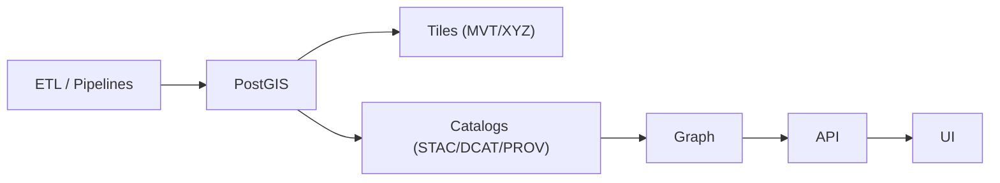
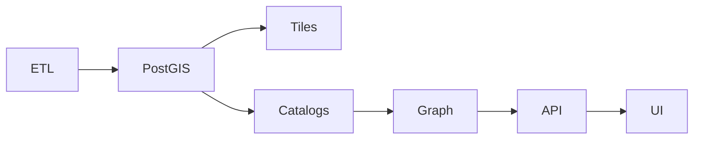

# 🗺️ Outbound PostGIS (`api/src/adapters/outbound/postgis/`)

This folder implements the **PostgreSQL + PostGIS outbound adapter** — the infrastructure boundary for:

- 🗄️ spatial persistence (tables, schemas, migrations)
- 🧮 spatial queries (bbox/ROI filters, joins, aggregation)
- 🧱 tile generation support (MVT queries, zoom-based generalization)
- 🧾 geo-safe summaries for downstream mapping and catalog references

KFM uses PostGIS for:
- authoritative vector storage and spatial indexing
- scalable filtering + aggregation (the “heavy geo lifting”)
- stable tile-backed UI layers (MVT/XYZ)
- enforcing data hygiene (types, constraints, SRIDs)

> [!IMPORTANT]
> Outbound adapters do **I/O**.
>
> ✅ run SQL • manage connections/pooling • enforce timeouts • apply migrations • translate DB errors  
> ❌ shape HTTP responses • implement business logic • perform DTO mapping • bypass governance

---

## 🔗 Quick links

- 🛫 Outbound root: `api/src/adapters/outbound/README.md`
- 🧱 Tiles outbound: `api/src/adapters/outbound/tiles/`
- 🗺️ Geo mappers (pure parsing/shaping): `api/src/adapters/mappers/geo/README.md`
- 📚 Catalog outbound (publish STAC/DCAT/PROV): `api/src/adapters/outbound/catalogs/README.md`
- 🧯 Adapter errors: `api/src/adapters/errors.py`

---

## 🧭 Where this fits in the KFM pipeline

> KFM rule: **PostGIS stores geo truth** (vectors/rasters references),  
> **Catalogs describe artifacts**, and **Graph links context**.



<details>
<summary>🧯 Mermaid fallback (plain labels)</summary>


</details>

---

## 📁 Folder map (emoji layout)

```text
📁 api/
  📁 src/
    📁 adapters/
      📁 outbound/
        📁 postgis/                           🗺️ PostGIS IO adapter + SQL helpers
          📄 README.md                        👈 you are here
          📄 __init__.py                      🧬 package init (optional)

          📄 config.py                        ⚙️ DSN, pool sizing, timeouts, max limits
          📄 client.py                        🔌 engine/connection pool lifecycle
          📄 sessions.py                      🚪 session helpers (read/write separation)
          📄 tx.py                            🧾 transaction helpers + retry policy
          📄 errors.py                        🧯 psycopg/sqlalchemy → AdapterError translation
          📄 observability.py                 📈 metrics/logging/tracing (sanitized)

          📁 sql/                             🧾 parameterized SQL (no string concat)
            📄 README.md                      🗂️ query organization rules
            📄 schema.sql                     🏗️ core schemas + extensions
            📄 migrations.sql                 🧱 migration runner notes (optional)
            📄 upserts.sql                    🧩 insert/upsert patterns
            📄 queries.sql                    🔎 common query fragments
            📄 tiles_mvt.sql                  🧱 ST_AsMVT patterns (bounded)
            📄 stats.sql                      📊 aggregates + summaries (bounded)

          📁 schema/                          🏗️ migrations (recommended split per change)
            📄 README.md                      📜 migration policy + environments
            📄 001_extensions.sql             🧩 postgis, postgis_raster (if used)
            📄 002_tables.sql                 🗃️ tables + constraints
            📄 003_indexes.sql                ⚡ GiST/SP-GiST/BRIN indexes
            📄 004_views.sql                  👀 views/materialized views (optional)

          📄 repository.py                    🧩 port implementation (domain-facing methods)
          📄 models.py                        🧾 internal adapter models (no DTO/domain types)
          📄 types.py                         🏷️ typed helpers (SRID, geometry adapters)
```

> [!TIP]
> Keep raw SQL in files (or a strict query registry). It makes review, tuning, and safety enforcement easier ✅

---

## 🎯 What this adapter is responsible for

### ✅ Core responsibilities
- 🔌 connect/pool to PostgreSQL reliably
- 🧾 run parameterized SQL (no string concatenation with user input)
- 🧾 manage transactions and retry policy (bounded)
- 🗃️ apply schema migrations (tables, constraints, indexes)
- 🗺️ execute bounded spatial queries (bbox/ROI/time filters)
- 🧱 serve tile queries (MVT) with explicit zoom bounds and size caps
- 📊 compute safe summaries and aggregates (counts, histograms, area summaries)
- 🔐 propagate classification/redaction (no downgrades; no precision re-introduction)
- 🧯 translate DB errors into stable adapter errors (retryable vs permanent)

### ❌ Not responsible for
- parsing HTTP query params (geo mappers do that)
- output DTO shaping (HTTP/GraphQL mappers do that)
- business logic (services/use-cases do that)
- catalog publishing (catalog outbound does that)
- graph building (neo4j outbound + pipeline does that)

---

## 🗄️ PostGIS philosophy (what goes where)

### Store in PostGIS ✅
- authoritative geometries (vector)
- time-indexed attributes (events, observations)
- spatial indexes for fast filtering
- optional generalized geometries (for tiles) if necessary
- references to storage artifacts (COGs, scans) where helpful

### Prefer storing as assets/catalogs instead ❌
- full raster data blobs (unless you explicitly use PostGIS raster)
- large binary artifacts (PDFs, images, zips)
- full STAC/DCAT/PROV documents (store refs)

> [!TIP]
> PostGIS is best at “ask spatial questions fast”, not “store every artifact”.

---

## 🧷 Schema, SRIDs, and geometry conventions

### SRID rules 🧭
- **Store canonical geometries in EPSG:4326** when possible
- Keep SRID explicit on geometry columns (`geometry(Geometry, 4326)`)
- If you store in 3857 for tiles, document it and keep conversion explicit

### Geometry column naming 🗺️
Recommended:
- `geom` for canonical geometry
- `geom_simplified_z<N>` for zoom-generalized geometries (optional)
- `bbox` fields only as summaries (optional; can be computed)

### Constraints ✅
- enforce `NOT NULL` on stable IDs
- check constraints on ranges where appropriate (zoom, year, etc.)
- unique constraints for stable identifiers (`kfm_id`, `source_id`, etc.)

---

## ⚡ Indexing strategy (must-have for scale)

### Common indexes
- `GiST` on geometry: `CREATE INDEX ... USING GIST (geom);`
- `BTREE` on IDs: `kfm_id`, `dataset_id`, `source_id`
- `BTREE` on time fields: `event_time`, `valid_from`, `valid_to`
- `BRIN` for huge append-only time series (optional)

> [!TIP]
> Indexes are part of the API contract. Without them, “bounded queries” still melt servers 🔥

---

## 🧾 SQL safety rules (no injection, no surprise scans)

### ✅ Do
- parameterize all inputs (`WHERE dataset_id = $1`)
- cap result sizes (`LIMIT $limit`)
- enforce server-side max limits (ignore client “limit=999999”)
- use prepared statements where possible
- validate bbox/roi in mappers before SQL

### ❌ Don’t
- build `WHERE ... IN (${user_list})` via string concatenation
- allow unbounded full-table scans from user inputs
- return raw geometry at full precision when not necessary
- expose raw SQL errors to clients

---

## 🧱 Tiles (MVT) integration notes

KFM wants fast UI layers, but safe and bounded.

### Recommended tile query patterns
- `ST_AsMVTGeom` + `ST_AsMVT`
- explicit zoom bounds
- limit features per tile
- simplify/generalize by zoom (either on the fly or via materialized views)

**Do not**:
- return huge tiles with tens of thousands of features
- allow zoom levels beyond what the data supports
- compute extremely expensive generalization per request without caching

> [!TIP]
> The tiles outbound adapter can call this adapter, but the tile SQL should live in one place to keep it reviewable.

---

## 📊 Aggregation & statistics (bounded summaries)

PostGIS is excellent for:
- counts by category
- time histograms
- area/length summaries
- bounding boxes / extents
- sampling for previews

Rules:
- all aggregates must be bounded by ROI/time/dataset filters
- never allow “aggregate entire table” by accident
- consider materialized views for expensive common summaries

---

## 🔐 Classification & redaction propagation

Spatial data can leak sensitive info:
- precise locations
- patterns over time
- sensitive site shapes

Adapter-level guardrails:
- classification never downgrades
- if a dataset is restricted, tile/service endpoints must enforce access at service/inbound
- never “increase precision” of redacted/generalized geometry
- avoid logging raw geometry; log hashes/IDs + bbox summaries only (when safe)

---

## 🧯 Error translation (stable + boring)

Convert DB exceptions into stable adapter errors.

### Retryable (transient) 🔁
- timeouts
- transient connection/pool issues
- deadlocks/serialization failures (retryable with bounded policy)

### Permanent (non-retryable) 🧱
- invalid SQL (developer issue)
- missing tables/columns (migration drift)
- constraint violations (bad upserts)
- invalid inputs (validated earlier, but still guard)
- classification downgrade attempt

**Recommended error fields**
- `system`: `"postgis"`
- `code`: stable (`PG_TIMEOUT`, `PG_TRANSIENT`, `PG_CONSTRAINT`, `PG_BAD_QUERY`, ...)
- `retryable`: boolean
- `trace_id`: for logs
- `detail`: safe summary (no SQL with embedded user content)

---

## 📈 Observability (metrics + logs + traces)

Emit:
- query latency histograms (by query name)
- rows returned counters
- slow query logs (names + duration; no raw SQL unless sanitized)
- pool utilization metrics
- tracing spans:
  - `postgis.query.<name>`
  - `postgis.tx.commit`

Log hygiene:
- log stable IDs and query names
- never log secrets, tokens, or full geometry blobs

---

## 🧪 Testing strategy

### ✅ Unit tests
- parameter binding (no concat)
- limit enforcement (server-side caps)
- error translation mapping
- zoom bounds and tile constraints
- migration ordering correctness (if you implement migration runner)

### ✅ Integration tests (recommended)
- run PostgreSQL+PostGIS in CI (Docker)
- apply migrations
- insert small fixtures
- run bbox query and tile query
- verify bounds and performance invariants (small tiles, limited rows)

Suggested fixtures:
```text
🧪 tests/
  📁 fixtures/
    📁 postgis/
      📄 schema_min.sql
      📄 data_points.sql
      📄 data_polygons.sql
      📄 expected_bbox_query.json
      📄 expected_tile_meta.json
```

---

## ➕ How to add a new spatial query (safe workflow)

1) 🧠 Define the domain need (what question are we answering?)
2) 🔌 Add/update the port interface (service layer depends on this)
3) 🧾 Add a named SQL query (file or registry) with parameters only
4) 🗺️ Ensure bbox/roi/time parsing happens in mappers (strict)
5) ⚡ Add indexes if the query touches hot columns
6) 🧪 Add unit + integration tests (bounds + correctness)
7) 📖 Document:
   - query name + filters
   - max limits and default sort
   - expected geometry precision/output type

---

## ✅ Definition of done (PostGIS outbound work)

- [ ] Implements a port (services depend on interface, not SQLAlchemy/psycopg)
- [ ] Uses parameterized SQL only (no concat)
- [ ] Read/write session separation (where supported)
- [ ] Migrations are defined and applied consistently
- [ ] Spatial indexes exist for hot queries (GiST on geom + BTREE on IDs/time)
- [ ] Queries are bounded (limits, bbox/roi required for heavy ops)
- [ ] Tile queries are bounded (zoom caps, feature caps)
- [ ] Classification/redaction propagation enforced (no downgrade)
- [ ] Errors translated to stable codes (retryable vs permanent)
- [ ] Unit tests + CI integration tests
- [ ] Observability added (sanitized logs + metrics + tracing)

---

## 📚 Project bookshelf (all project files)

<details>
<summary>📚 Click to expand — the complete project library that informs this module</summary>

### 🧭 KFM architecture & direction
- 📄 `Kansas Frontier Matrix (KFM) – Comprehensive Technical Documentation.docx`
- 📄 `🌟 Kansas Frontier Matrix – Latest Ideas & Future Proposals.docx`

### 🗄️ PostgreSQL + scalability mindset (core)
- 📄 `PostgreSQL Notes for Professionals - PostgreSQLNotesForProfessionals.pdf`
- 📄 `Scalable Data Management for Future Hardware.pdf`

### 🗺️ GIS, map design, tiles, and media formats
- 📄 `python-geospatial-analysis-cookbook.pdf`
- 📄 `making-maps-a-visual-guide-to-map-design-for-gis.pdf`
- 📄 `Mobile Mapping_ Space, Cartography and the Digital - 9789048535217.pdf`
- 📄 `compressed-image-file-formats-jpeg-png-gif-xbm-bmp.pdf`
- 📄 `webgl-programming-guide-interactive-3d-graphics-programming-with-webgl.pdf`
- 📄 `responsive-web-design-with-html5-and-css3.pdf`

### 🛰️ Remote sensing & derived layers (PostGIS stores outputs + refs)
- 📄 `Cloud-Based Remote Sensing with Google Earth Engine-Fundamentals and Applications.pdf`

### 🕸️ Graph/optimization shelf (derived artifacts still need provenance)
- 📄 `Spectral Geometry of Graphs.pdf`
- 📄 `Generalized Topology Optimization for Structural Design.pdf`

### 🧪 Modeling/statistics/uncertainty (why “evidence artifacts” matter)
- 📄 `Scientific Modeling and Simulation_ A Comprehensive NASA-Grade Guide.pdf`
- 📄 `Understanding Statistics & Experimental Design.pdf`
- 📄 `regression-analysis-with-python.pdf`
- 📄 `Regression analysis using Python - slides-linear-regression.pdf`
- 📄 `think-bayes-bayesian-statistics-in-python.pdf`
- 📄 `graphical-data-analysis-with-r.pdf`
- 📄 `Deep Learning for Coders with fastai and PyTorch - Deep.Learning.for.Coders.with.fastai.and.PyTorchpdf` *(library item; not indexed in tools)*

### 🗄️ Federation/interoperability framing
- 📄 `Data Spaces.pdf`

### 🧠 Humanism, governance, accountability framing
- 📄 `Introduction to Digital Humanism.pdf`
- 📄 `On the path to AI Law’s prophecies and the conceptual foundations of the machine learning age.pdf`
- 📄 `Principles of Biological Autonomy - book_9780262381833.pdf`

### 🛡️ Security mindset (defensive)
- 📄 `ethical-hacking-and-countermeasures-secure-network-infrastructures.pdf`
- 📄 `Gray Hat Python - Python Programming for Hackers and Reverse Engineers (2009).pdf`

### 🧵 Concurrency / distributed systems background
- 📄 `concurrent-real-time-and-distributed-programming-in-java-threads-rtsj-and-rmi.pdf`

### 📚 Programming compendium shelf (quick reference)
- 📄 `A programming Books.pdf`
- 📄 `B-C programming Books.pdf`
- 📄 `D-E programming Books.pdf`
- 📄 `F-H programming Books.pdf`
- 📄 `I-L programming Books.pdf`
- 📄 `M-N programming Books.pdf`
- 📄 `O-R programming Books.pdf`
- 📄 `S-T programming Books.pdf`
- 📄 `U-X programming Books.pdf`

</details>

