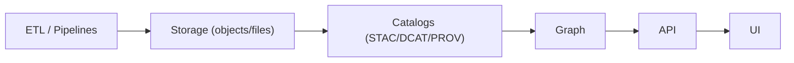
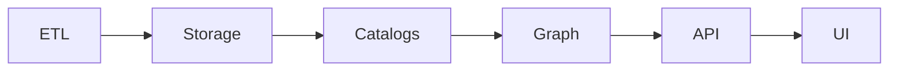

# 📦 Outbound Storage (`api/src/adapters/outbound/storage/`)

This folder implements the **storage outbound adapter** — the infrastructure boundary for reading/writing large artifacts:

- 🧊 rasters (COG/GeoTIFF), tilesets, imagery
- 🧾 metadata JSON (STAC Items/Collections, PROV bundles, manifests)
- 📄 tables (CSV/Parquet), reports (PDF), previews (PNG/JPEG)
- 🗂️ archives (zips) and other “evidence artifacts”

Storage is where we put the **bytes**.  
Catalogs (STAC/DCAT/PROV) describe the **meaning** and provide references.  
Graph links them into context 🧾🕸️

> [!IMPORTANT]
> Outbound adapters do **I/O**.
>
> ✅ read/write objects • compute checksums • enforce naming/versioning • translate errors  
> ❌ shape HTTP responses • implement business rules • store secrets in hrefs • dump raw bytes in logs

---

## 🔗 Quick links

- 🛫 Outbound root: `api/src/adapters/outbound/README.md`
- 📚 Catalog outbound (publish STAC/DCAT/PROV): `api/src/adapters/outbound/catalogs/README.md`
- 🛰️ GEE outbound (exports): `api/src/adapters/outbound/gee/README.md`
- 🗺️ PostGIS outbound: `api/src/adapters/outbound/postgis/README.md`
- 🕸️ Neo4j outbound: `api/src/adapters/outbound/neo4j/README.md`
- 🔁 Modeling mappers (evidence DTO shaping): `api/src/adapters/mappers/modeling/README.md`
- 🧯 Adapter errors: `api/src/adapters/errors.py`

---

## 🧭 Where this fits in the KFM pipeline



<details>
<summary>🧯 Mermaid fallback (plain labels)</summary>


</details>

---

## 📁 Folder map (emoji layout)

```text
📁 api/
  📁 src/
    📁 adapters/
      📁 outbound/
        📁 storage/                          📦 object/file storage IO
          📄 README.md                       👈 you are here
          📄 __init__.py                     🧬 package init (optional)

          📄 config.py                       ⚙️ buckets/paths, backend choice, max sizes
          📄 client.py                       🔌 backend client (S3/MinIO/local) wrapper
          📄 repository.py                   🧩 port implementation (domain-facing methods)
          📄 errors.py                       🧯 backend errors → AdapterError mapping
          📄 observability.py                📈 metrics/logging/tracing (sanitized)

          📁 naming/                         🆔 deterministic naming + versioning rules
            📄 policy.py                     📜 path layout rules (dataset/run/artifact)
            📄 sanitize.py                   🧼 safe path segments (no traversal)
            📄 content_address.py            #️⃣ sha256-based addressing helpers

          📁 io/                             📤 read/write utilities (streaming)
            📄 put.py                        ⬆️ upload/put (streaming, multipart if needed)
            📄 get.py                        ⬇️ download/get (range support)
            📄 head.py                       🧾 metadata/head
            📄 delete.py                     🗑️ delete (if allowed; usually admin only)

          📁 manifests/                      🗃️ run/export manifests (small JSON, stable)
            📄 build.py                      🧾 construct manifest from params + refs
            📄 validate.py                   ✅ validate manifest shape + checksums
            📄 types.py                      🏷️ manifest dataclasses/types

          📁 checksums/                      #️⃣ integrity helpers
            📄 sha256.py                     #️⃣ compute/verify sha256
            📄 etag.py                       🧾 backend ETag helpers (careful w/ multipart)
            📄 verify.py                     ✅ verify on read/write

          📁 hrefs/                          🔗 safe href generation (no secret leaks)
            📄 schemes.py                    🌐 allowed schemes (`s3`, `https`, `file` dev)
            📄 public_urls.py                🔗 stable public URL construction (if used)
            📄 signed_urls.py                🕒 ephemeral access URL generation (NOT for catalogs)
            📄 redact.py                     🧯 redact tokens in logs/outputs

          📁 media/                          🖼️ content-type helpers + previews
            📄 mime.py                       🧾 MIME inference (strict)
            📄 images.py                     🖼️ PNG/JPEG helpers (optional)
            📄 geotiff.py                    🧊 GeoTIFF/COG metadata helpers (optional)

          📄 tests.md                        🧪 local integration test notes (optional)
```

> [!TIP]
> This adapter should support multiple backends with the same port interface:
> - `S3` (AWS or compatible)
> - `MinIO` (self-hosted S3-compatible)
> - `Local FS` (dev/test)

---

## 🎯 What storage is responsible for

### ✅ Core responsibilities
- 📦 write and read objects/files (streaming, range reads where useful)
- #️⃣ compute and store integrity metadata (sha256, content-length)
- 🧾 attach safe metadata tags (content-type, created_at, classification)
- 🆔 enforce deterministic naming/versioning policy
- 🗃️ generate and validate **manifests** for exports/runs
- 🔗 provide safe hrefs (stable refs) for catalogs and API outputs
- 🕒 optionally generate ephemeral signed URLs for direct download (not stored in catalogs)
- 🧯 translate backend failures into stable adapter errors
- 📈 observability without leaking bytes or secrets

### ❌ Not responsible for
- deciding *what* to store (services decide)
- catalog publishing (catalog outbound does STAC/DCAT/PROV)
- geo queries (postgis does that)
- graph queries (neo4j does that)
- DTO mapping (mappers do that)

---

## 🆔 Naming & versioning policy (don’t create a haunted bucket 👻)

KFM needs storage paths that are:
- deterministic
- human-decodable
- safe for caching/CDNs
- compatible with provenance (content addressable where possible)

### Recommended path layout (example)
```text
s3://<bucket>/
  datasets/<dataset_id>/
    raw/<source>/<yyyy>/<mm>/...                       # ingested originals
    derived/<pipeline>/<run_id>/                       # derived outputs
      manifests/<params_hash>.json                      # small manifest (stable)
      artifacts/<artifact_id>/                          # outputs (COG, CSV, PNG)
      reports/<report_id>.pdf
```

### Content-addressed option (strongly recommended for immutability)
```text
s3://<bucket>/blobs/sha256/<first2>/<fullhash>
```

> [!IMPORTANT]
> “Overwrite the same key with new bytes” breaks provenance and caching.  
> Default to **write-once** + version-forward.

---

## 🔗 HREF strategy (stable refs vs signed URLs)

### ✅ Stable refs (safe for catalogs)
Use:
- `s3://bucket/key`
- or stable HTTPS URLs under your control (no secret params)

Catalogs should store:
- stable href
- content-type
- roles
- checksums (sha256 if possible)

### 🕒 Signed URLs (ephemeral access, never stored in catalogs)
Signed URLs are for *request-time delivery* only:
- generated by API/services
- short TTL
- not embedded in STAC/DCAT/PROV records
- never logged

> [!TIP]
> If a client needs access:
> - catalog stores stable ref
> - API returns signed URL on demand (authorized)  
> This keeps catalogs clean and non-sensitive 🔐✅

---

## #️⃣ Integrity: checksums and verification

### What to compute
- sha256 (preferred)
- content-length
- backend ETag (useful but not always equal to md5 for multipart uploads)

### When to verify
- on write (verify bytes streamed match expected size/hash)
- on read (optional: verify hash for critical artifacts)
- before publish (catalog outbound should require checksum presence for key artifacts)

> [!CAUTION]
> Don’t assume `ETag == md5` on multipart uploads. Treat ETag as backend metadata, not truth.

---

## 🗃️ Manifests (small JSON that makes big artifacts auditable)

Manifests are small, stable JSON documents that describe:
- what was produced
- from what inputs
- with what parameters
- where the artifacts live
- with what checksums

### Minimum manifest fields (recommended)
- `run_id`
- `params_hash`
- `input_refs[]` (STAC/DCAT/PROV IDs or stable dataset refs)
- `outputs[]`:
  - href
  - type
  - size
  - sha256
  - roles
- `software_versions` (pipeline version, optional)
- `created_at` (injected; no hidden time in adapter helpers)

> [!TIP]
> For modeling outputs, manifests are the anchor for reproducibility: params_hash + input_refs + artifacts.

---

## 🔐 Classification & redaction

Storage itself can leak by:
- path naming (putting PII into keys)
- metadata tags that contain secrets
- logs that dump object names or signed URLs

Rules:
- never put secrets or PII into keys
- sanitize path segments
- propagate classification in metadata tags
- never downgrade classification of derived outputs
- redact token-like strings in logs
- cap log lengths

---

## 🧯 Error translation (stable + boring)

Classify backend errors:

### Retryable (transient) 🔁
- timeouts
- transient network failures
- rate limits (S3 throttling)
- temporary backend unavailability

### Permanent (non-retryable) 🧱
- invalid bucket/key
- access denied (auth misconfig)
- checksum mismatch (data corruption)
- unsafe href/path attempt
- classification downgrade attempt

**Recommended error fields**
- `system`: `"storage"`
- `code`: stable (`STORAGE_TIMEOUT`, `STORAGE_NOT_FOUND`, `STORAGE_ACCESS_DENIED`, `CHECKSUM_MISMATCH`, ...)
- `retryable`: boolean
- `trace_id`: for logs
- `detail`: safe message (no signed URLs, no secrets)

---

## ⚡ Performance notes (streaming + range reads)

- use streaming uploads/downloads (avoid loading whole artifacts in memory)
- use multipart uploads for large files (S3/MinIO)
- support HTTP range reads for big assets (COGs, large JSON)
- store content-type and cache-control metadata for CDN paths where relevant
- keep small metadata reads cheap (`HEAD` operations)

---

## 📈 Observability (metrics + logs + traces)

Emit:
- upload/download latency
- bytes transferred counters
- failures by error code
- retries count
- traces:
  - `storage.put`
  - `storage.get`
  - `storage.head`

Log hygiene:
- never log raw bytes
- never log signed URLs
- log stable object refs and hashes when safe

---

## 🧪 Testing strategy

### ✅ Unit tests
- deterministic naming/path policy
- path sanitization (no traversal, no weird unicode controls)
- checksum compute/verify
- href generation safety (no secret params)
- error translation mapping

### ✅ Integration tests (recommended)
- local MinIO container (CI)
- put → head → get → verify sha256
- range read for a test object
- manifest write/read/validate

Suggested fixtures:
```text
🧪 tests/
  📁 fixtures/
    📁 storage/
      📄 manifest_min.json
      📄 manifest_with_assets.json
      📄 small_binary.bin
      📄 expected_sha256.txt
```

---

## ➕ How to add a new artifact type (safe workflow)

1) 🧠 Decide artifact category (raster/table/report/preview)
2) 🆔 Define naming policy inputs (dataset_id, run_id, params_hash, artifact_id)
3) 📦 Implement `put_*` / `get_*` helpers (streaming, content-type)
4) #️⃣ Ensure sha256 is computed and stored
5) 🗃️ Add manifest entry generation for the artifact
6) 📚 Ensure catalog outbound can reference it as STAC asset / DCAT distribution
7) 🧪 Add unit + integration tests
8) 📖 Document MIME type and roles (`data`, `preview`, `thumbnail`, `report`, `metadata`)

---

## ✅ Definition of done (storage outbound work)

- [ ] Implements a port (services depend on interface, not boto3/fs)
- [ ] Supports at least one backend (MinIO/S3) + local dev mode
- [ ] Deterministic naming/versioning policy (write-once default)
- [ ] Streaming read/write (no huge memory loads)
- [ ] sha256 integrity metadata supported and verified
- [ ] Safe href strategy:
  - stable refs in catalogs
  - signed URLs only at request time
- [ ] Classification propagation enforced (no downgrade)
- [ ] Errors translated to stable codes (retryable vs permanent)
- [ ] Unit tests + CI integration tests (MinIO) added
- [ ] Observability implemented (sanitized logs + metrics + tracing)

---

## 📚 Project bookshelf (all project files)

<details>
<summary>📚 Click to expand — the complete project library that informs this module</summary>

### 🧭 KFM architecture & direction
- 📄 `Kansas Frontier Matrix (KFM) – Comprehensive Technical Documentation.docx`
- 📄 `🌟 Kansas Frontier Matrix – Latest Ideas & Future Proposals.docx`

### 🗺️ GIS, map design, interactive delivery, media formats (why previews + MIME types matter)
- 📄 `python-geospatial-analysis-cookbook.pdf`
- 📄 `making-maps-a-visual-guide-to-map-design-for-gis.pdf`
- 📄 `Mobile Mapping_ Space, Cartography and the Digital - 9789048535217.pdf`
- 📄 `compressed-image-file-formats-jpeg-png-gif-xbm-bmp.pdf`
- 📄 `webgl-programming-guide-interactive-3d-graphics-programming-with-webgl.pdf`
- 📄 `responsive-web-design-with-html5-and-css3.pdf`

### 🛰️ Remote sensing & long-running exports (storage as the sink for EO artifacts)
- 📄 `Cloud-Based Remote Sensing with Google Earth Engine-Fundamentals and Applications.pdf`

### 🧪 Modeling/simulation/statistics (manifests + evidence artifacts)
- 📄 `Scientific Modeling and Simulation_ A Comprehensive NASA-Grade Guide.pdf`
- 📄 `Understanding Statistics & Experimental Design.pdf`
- 📄 `regression-analysis-with-python.pdf`
- 📄 `Regression analysis using Python - slides-linear-regression.pdf`
- 📄 `think-bayes-bayesian-statistics-in-python.pdf`
- 📄 `graphical-data-analysis-with-r.pdf`
- 📄 `Deep Learning for Coders with fastai and PyTorch - Deep.Learning.for.Coders.with.fastai.and.PyTorchpdf` *(library item; not indexed in tools)*

### 🗄️ Data systems & scaling (why streaming + deterministic keys)
- 📄 `Scalable Data Management for Future Hardware.pdf`
- 📄 `Data Spaces.pdf`
- 📄 `PostgreSQL Notes for Professionals - PostgreSQLNotesForProfessionals.pdf`

### 🕸️ Graph/optimization shelf (artifacts still need traceable refs)
- 📄 `Spectral Geometry of Graphs.pdf`
- 📄 `Generalized Topology Optimization for Structural Design.pdf`

### 🧠 Humanism, governance, accountability framing
- 📄 `Introduction to Digital Humanism.pdf`
- 📄 `On the path to AI Law’s prophecies and the conceptual foundations of the machine learning age.pdf`
- 📄 `Principles of Biological Autonomy - book_9780262381833.pdf`

### 🛡️ Security mindset (why no secrets in hrefs/logs)
- 📄 `ethical-hacking-and-countermeasures-secure-network-infrastructures.pdf`
- 📄 `Gray Hat Python - Python Programming for Hackers and Reverse Engineers (2009).pdf`

### 🧵 Concurrency / distributed systems background (why idempotency + retry)
- 📄 `concurrent-real-time-and-distributed-programming-in-java-threads-rtsj-and-rmi.pdf`

### 📚 Programming compendium shelf (quick reference)
- 📄 `A programming Books.pdf`
- 📄 `B-C programming Books.pdf`
- 📄 `D-E programming Books.pdf`
- 📄 `F-H programming Books.pdf`
- 📄 `I-L programming Books.pdf`
- 📄 `M-N programming Books.pdf`
- 📄 `O-R programming Books.pdf`
- 📄 `S-T programming Books.pdf`
- 📄 `U-X programming Books.pdf`

</details>

