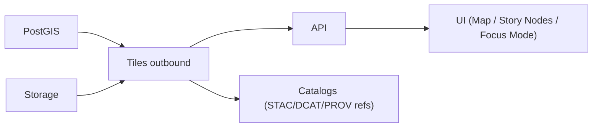
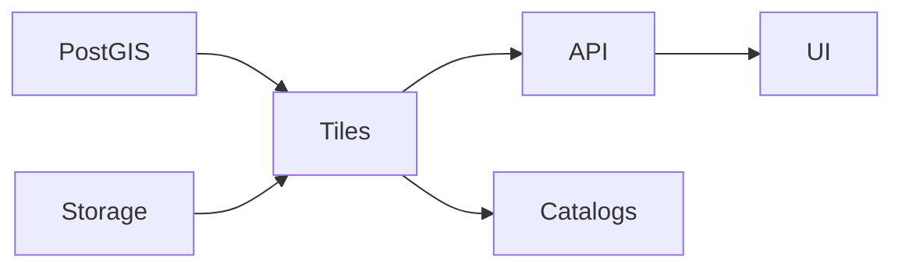

# 🧱 Outbound Tiles (`api/src/adapters/outbound/tiles/`)

This folder implements the **Tiles outbound adapter** — the infrastructure boundary for generating and serving **map tiles** (and tile metadata) in a safe, cache-friendly way.

KFM uses tiles for:
- 🗺️ fast interactive map layers in the UI
- 🎬 Story Nodes that “play” geography over time
- 🎯 Focus Mode that needs bounded context maps without dumping huge GeoJSON
- 🛰️ remote sensing outputs (as raster tiles / previews) and derived vector layers

> [!IMPORTANT]
> Outbound adapters do **I/O**.
>
> ✅ generate/serve tiles • call PostGIS/storage • enforce bounds/timeouts • cache • translate failures  
> ❌ implement business logic • shape HTTP routes/responses • bypass classification • leak signed URLs

---

## 🔗 Quick links

- 🛫 Outbound root: `api/src/adapters/outbound/README.md`
- 🗺️ PostGIS outbound (MVT queries): `api/src/adapters/outbound/postgis/README.md`
- 📦 Storage outbound (tile cache/static tiles): `api/src/adapters/outbound/storage/README.md`
- 📚 Catalog outbound (publish tile layers as assets/distributions): `api/src/adapters/outbound/catalogs/README.md`
- 🗺️ Geo mappers (tile param validation, CRS rules): `api/src/adapters/mappers/geo/README.md`
- 🌐 HTTP mappers (tile endpoints shaping): `api/src/adapters/mappers/http/README.md`
- 🧯 Adapter errors: `api/src/adapters/errors.py`

---

## 🧭 Where this fits in the KFM pipeline

> KFM bias: **tiles are delivery artifacts**.  
> They should be derived from canonical stores (PostGIS + Storage), and referenced by catalogs.



<details>
<summary>🧯 Mermaid fallback (plain labels)</summary>


</details>

---

## 📁 Folder map (emoji layout)

```text
📁 api/
  📁 src/
    📁 adapters/
      📁 outbound/
        📁 tiles/                               🧱 tile generation + caching + metadata IO
          📄 README.md                          👈 you are here
          📄 __init__.py                        🧬 package init (optional)

          📄 config.py                          ⚙️ zoom bounds, cache TTLs, size limits, formats
          📄 repository.py                      🧩 port implementation (domain-facing methods)
          📄 client.py                          🔌 thin tile client wrapper (deps: postgis/storage)
          📄 errors.py                          🧯 tile errors → AdapterError mapping
          📄 observability.py                   📈 metrics/logging/tracing (sanitized)

          📁 xyz/                               🧭 tile math + addressing helpers
            📄 scheme.py                        🧱 XYZ vs TMS rules (y-flip), bounds checks
            📄 bounds.py                        📦 z/x/y validation, max zoom, world bounds
            📄 metatile.py                      🧩 metatile helpers (optional)

          📁 vector/                            🧩 vector tiles (MVT / PBF)
            📄 mvt.py                           🧱 orchestration for MVT queries
            📄 layers.py                        🗂️ layer registry (names, limits, attributes)
            📄 limits.py                        🧯 feature caps, tile size caps, simplification policy hooks

          📁 raster/                            🖼️ raster tiles (PNG/JPEG/WebP) (optional)
            📄 render.py                        🎨 render pipeline (COG/preview) (bounded)
            📄 colormaps.py                     🌈 palettes (optional, explicit)
            📄 formats.py                       🧾 mime/types, quality settings (bounded)

          📁 cache/                             🧊 caching backends + keys
            📄 keys.py                          🆔 cache key policy (dataset/layer/z/x/y/time)
            📄 memory.py                        🧠 in-process cache (dev)
            📄 redis.py                         🟥 redis cache (optional)
            📄 storage.py                       📦 persisted cache (S3/MinIO/local)

          📁 metadata/                          🧾 tile metadata endpoints (pure shapes + I/O)
            📄 tilejson.py                      🗺️ TileJSON builder (no signed URLs)
            📄 stylejson.py                     🎨 MapLibre/Mapbox style JSON (optional)
            📄 sprites.py                       🧩 sprite sheet refs (optional)
            📄 glyphs.py                        🔤 glyph endpoints refs (optional)
```

> [!TIP]
> Keep “tile math + bounds” separate from “tile I/O”.  
> It makes correctness testing trivial and prevents cache key bugs 🧠✅

---

## 🎯 What this adapter is responsible for

### ✅ Core responsibilities
- 🧭 Validate tile coordinates and schemes (XYZ/TMS) with **server-side caps**
- 🧩 Generate **vector tiles** (MVT) from PostGIS (bounded queries)
- 🖼️ Serve **raster tiles** (when needed) from:
  - pre-rendered tiles in storage, or
  - bounded render pipeline (COG → PNG/JPEG) *(optional; depends on KFM choices)*
- 🧊 Cache tiles and metadata (hot path optimization)
- 🗺️ Provide tile metadata:
  - TileJSON
  - optional Style JSON
  - optional glyph/sprite references
- 🔐 Enforce classification propagation & prevent “precision escalation”
- 🧯 Translate failures to stable adapter error codes (retryable vs permanent)
- 📈 Emit observability signals (hit ratio, tile latency, failures by code)

### ❌ Not responsible for
- HTTP routing (inbound adapters do that)
- parsing raw query strings (mappers do that)
- “what layer should exist?” decisions (services/use-cases)
- changing domain meaning (no “magic generalization”; only explicit, bounded policies)
- being the canonical store (PostGIS/storage/catalogs remain canonical)

---

## 🧱 Supported tile types (recommended)

| Tile type | Format | When to use | Source of truth |
|---|---|---|---|
| 🧩 Vector tiles | `application/x-protobuf` (MVT/PBF, usually gzip) | dense interactive layers, fast UI rendering | PostGIS (MVT SQL) |
| 🖼️ Raster tiles | `image/png` / `image/jpeg` / `image/webp` | imagery previews, heatmaps, “looks like satellite” layers | storage (pre-render) or bounded render from COG |
| 🧾 Metadata | TileJSON / style JSON | clients discover tiles, bounds, min/max zoom | deterministic builder + config |

> [!NOTE]
> Default KFM bias: **vector tiles for layers**, raster tiles for **imagery** and **previews**.

---

## 🧭 XYZ vs TMS (don’t ship flipped maps 🙃)

### Addressing schemes
- **XYZ** (web standard): y increases downward
- **TMS**: y is flipped (y increases upward)

Rules:
- Document which scheme the API uses (default should be XYZ).
- If supporting both, require an explicit scheme flag and keep mapping deterministic.

### Validation rules (server-side caps)
- `z` must be within `[0, MAX_ZOOM]` (config)
- `x` and `y` must satisfy `0 <= x,y < 2^z` (XYZ)
- Reject non-integers and absurdly large values early

> [!TIP]
> Put validation in one place (e.g., `xyz/bounds.py`) and reuse everywhere.

---

## 🧊 Caching strategy (tiles are hot-path)

Tiles are the definition of cacheable content.

### Recommended cache layers
1) 🧠 In-process cache (dev only)
2) 🟥 Redis cache (hot tiles)
3) 📦 Storage cache (warm tiles, persistent across restarts)
4) 🌐 CDN edge cache (if deployed)

### Cache keys (must include)
- layer/dataset identifier
- z/x/y
- format (mvt/png/jpg/webp)
- style variant or parameter profile (if any)
- time slice (if tile is time-dependent)
- version/fingerprint (e.g., dataset version or tileset version)

> [!IMPORTANT]
> **Never** key caches only by z/x/y.  
> That mixes layers and produces “wrong tiles that look correct” 🧨

### Cache invalidation (keep it boring)
Prefer **versioned keys**:
- a new dataset version produces a new cache namespace  
- old tiles expire naturally (TTL) or are cleaned asynchronously

Avoid:
- “try to purge everything precisely” (hard, slow, and race-prone)

---

## 🧩 Metatiles (optional but powerful)

Metatiling renders a larger “super tile” then cuts it into child tiles:
- reduces label collisions
- improves continuity
- can reduce repeated expensive queries

If used:
- keep metatile size explicit (e.g., 2×2 or 4×4)
- cap memory usage and output size
- ensure cache keys include metatile parameters

---

## 🧩 Vector tiles (MVT) best practices

### Bound the expensive parts ✅
- cap feature count per tile
- cap tile byte size (e.g., reject/trim > N MB)
- enforce max zoom per layer
- enforce simplification/generalization policies per zoom

### Keep attribute contracts stable 📜
Vector tiles are API contracts:
- stable layer names
- stable attribute keys
- documented field types (int/float/string/bool)

> [!TIP]
> When the UI is Story-Node-driven, keep attributes tailored for narrative:
> - `kfm_id`, `title`, `time_start`, `time_end`, `kind`, `source_ref`
> - avoid dumping full text blobs into tiles

### “Refs-first” in tiles 🧾
Prefer including identifiers and letting clients fetch details via API:
- include `kfm_id` + minimal summary fields
- fetch full details by ID when clicked

---

## 🖼️ Raster tiles best practices (if enabled)

Raster tiles are useful for:
- EO imagery previews
- heatmaps
- rasterized model outputs

Rules:
- default to pre-rendered tiles when possible (cheaper and stable)
- if rendering on-demand from COG:
  - cap max resolution
  - cap ROI
  - cap timeouts
  - cache aggressively
- choose formats intentionally:
  - PNG: crisp, bigger
  - JPEG: smaller, lossy (good for imagery)
  - WebP: great compression (if clients support)

> [!NOTE]
> Remote sensing outputs should still have **catalog assets** (COG) as the source artifact. Tiles are a delivery view.

---

## 🗺️ Tile metadata: TileJSON + Style JSON

### TileJSON (recommended)
TileJSON allows clients to discover:
- tile URL template
- bounds
- minzoom/maxzoom
- attribution
- vector layers (if vector tiles)
- data format

**Hard rule:** TileJSON must never embed secrets or signed URLs.

### Style JSON (optional)
If KFM provides styles (MapLibre/Mapbox style spec):
- keep styles versioned
- keep sprite/glyph endpoints stable
- avoid remote third-party URLs unless allowlisted and governed

---

## 🔐 Classification, privacy, and “precision escalation”

Tiles can leak information by:
- too much geometric precision at low zoom
- revealing sensitive points via labels/symbols
- showing time slices that expose pattern-of-life

Adapter-level guardrails:
- never downgrade classification
- enforce per-layer zoom caps (sensitive layers might start at higher zoom)
- enforce generalization policies (especially for low zoom)
- avoid labeling sensitive features in tiles (style-level policy, but adapter can enforce field suppression)

> [!TIP]
> If a dataset is restricted, the safest model is:
> - tiles require auth (handled in inbound/services)
> - tile metadata remains governed (no public leak of endpoints)

---

## 🧯 Error translation (stable + boring)

### Retryable (transient) 🔁
- upstream PostGIS timeout/transient
- storage transient issues
- cache transient issues

### Permanent (non-retryable) 🧱
- invalid z/x/y
- unsupported format
- layer not found
- tile too large (policy violation)
- classification downgrade attempt
- unsafe metadata/href attempt

**Recommended error fields**
- `system`: `"tiles"`
- `code`: stable (`INVALID_TILE`, `UNSUPPORTED_FORMAT`, `TILE_TOO_LARGE`, `LAYER_NOT_FOUND`, `UPSTREAM_TIMEOUT`, ...)
- `retryable`: boolean
- `trace_id`: for logs
- `detail`: safe summary (no internal SQL, no secrets)

---

## 📈 Observability (tiles are UX)

Measure the things users feel:
- p50/p95/p99 tile latency
- cache hit ratio (by layer)
- tile error rate (by code)
- upstream dependency latency (postgis/storage)
- tile payload size distribution (detect “bloated tiles” early)

Tracing spans (examples):
- `tiles.get`
- `tiles.cache.get`
- `tiles.postgis.mvt`
- `tiles.storage.get`
- `tiles.cache.put`

---

## 🧪 Testing strategy

### ✅ Unit tests
- tile math (z/x/y bounds)
- XYZ↔TMS conversions (if supported)
- cache key construction (includes all discriminators)
- TileJSON builder (no signed URL leakage)
- error code stability

### ✅ Integration tests
- PostGIS: generate a small MVT for a known fixture layer
- Storage: fetch a pre-rendered raster tile
- Cache: verify read-through caching and TTL behavior

Suggested fixtures:
```text
🧪 tests/
  📁 fixtures/
    📁 tiles/
      📄 tilejson_min.json
      📄 style_min.json
      📄 expected_cache_key.txt
      📄 sample_layer_seed.sql            # for PostGIS integration
```

---

## ➕ How to add a new tile layer (safe workflow)

1) 🧠 Define the domain layer (what data, what filters, what contracts)
2) 🧩 Add a layer entry in `vector/layers.py` (or registry)
   - name, min/max zoom, caps, attributes allowlist
3) 🗺️ Implement the tile source:
   - vector: PostGIS MVT query (bounded)
   - raster: pre-rendered tiles or COG render pipeline (bounded)
4) 🧊 Define caching policy (TTL, version/fingerprint)
5) 🧾 Add TileJSON metadata + attribution
6) 📚 Ensure catalogs reference the tile service / tileset as a distribution or asset
7) 🧪 Add tests (unit + integration) for:
   - bounds enforcement
   - tile size caps
   - cache keys
8) 📖 Document any client assumptions (style layer names, fields)

---

## ✅ Definition of done (tiles outbound work)

- [ ] Implements a port (services depend on interface, not SQL/caches)
- [ ] Validates tile coords with strict server-side caps
- [ ] Supports at least one tile format (MVT recommended)
- [ ] Tiles are bounded (feature caps, size caps, timeouts)
- [ ] Cache strategy implemented and measurable (hit ratio)
- [ ] TileJSON provided (no secrets, stable endpoints)
- [ ] Classification/redaction propagation enforced (no downgrade)
- [ ] Errors translated to stable codes (retryable vs permanent)
- [ ] Unit tests + CI integration test coverage
- [ ] Observability: metrics/logging/tracing (sanitized)

---

## 📚 Project bookshelf (all project files)

<details>
<summary>📚 Click to expand — the complete project library that informs this module</summary>

### 🧭 KFM architecture & direction
- 📄 `Kansas Frontier Matrix (KFM) – Comprehensive Technical Documentation.docx`
- 📄 `🌟 Kansas Frontier Matrix – Latest Ideas & Future Proposals.docx`

### 🗺️ GIS, cartography, mobile mapping, and interactive rendering (tiles are UI delivery)
- 📄 `python-geospatial-analysis-cookbook.pdf`
- 📄 `making-maps-a-visual-guide-to-map-design-for-gis.pdf`
- 📄 `Mobile Mapping_ Space, Cartography and the Digital - 9789048535217.pdf`
- 📄 `webgl-programming-guide-interactive-3d-graphics-programming-with-webgl.pdf`
- 📄 `responsive-web-design-with-html5-and-css3.pdf`
- 📄 `compressed-image-file-formats-jpeg-png-gif-xbm-bmp.pdf`

### 🗄️ Data systems, scaling, and federation (why caching + deterministic keys)
- 📄 `Scalable Data Management for Future Hardware.pdf`
- 📄 `Data Spaces.pdf`
- 📄 `PostgreSQL Notes for Professionals - PostgreSQLNotesForProfessionals.pdf`

### 🛰️ Remote sensing / Earth observation (raster tiles + previews)
- 📄 `Cloud-Based Remote Sensing with Google Earth Engine-Fundamentals and Applications.pdf`

### 🕸️ Graphs & optimization (derived layers are still artifacts)
- 📄 `Spectral Geometry of Graphs.pdf`
- 📄 `Generalized Topology Optimization for Structural Design.pdf`

### 🧪 Modeling, simulation, statistics, uncertainty (tiles as delivery views of evidence)
- 📄 `Scientific Modeling and Simulation_ A Comprehensive NASA-Grade Guide.pdf`
- 📄 `Understanding Statistics & Experimental Design.pdf`
- 📄 `regression-analysis-with-python.pdf`
- 📄 `Regression analysis using Python - slides-linear-regression.pdf`
- 📄 `think-bayes-bayesian-statistics-in-python.pdf`
- 📄 `graphical-data-analysis-with-r.pdf`
- 📄 `Deep Learning for Coders with fastai and PyTorch - Deep.Learning.for.Coders.with.fastai.and.PyTorchpdf` *(library item; not indexed in tools)*

### 🧠 Humanism, governance, accountability framing (why tile contracts must be safe)
- 📄 `Introduction to Digital Humanism.pdf`
- 📄 `On the path to AI Law’s prophecies and the conceptual foundations of the machine learning age.pdf`
- 📄 `Principles of Biological Autonomy - book_9780262381833.pdf`

### 🛡️ Security mindset (tiles are an abuse surface)
- 📄 `ethical-hacking-and-countermeasures-secure-network-infrastructures.pdf`
- 📄 `Gray Hat Python - Python Programming for Hackers and Reverse Engineers (2009).pdf`

### 🧵 Concurrency / distributed systems background (tasking, caches, retries)
- 📄 `concurrent-real-time-and-distributed-programming-in-java-threads-rtsj-and-rmi.pdf`

### 📚 Programming compendium shelf (quick reference)
- 📄 `A programming Books.pdf`
- 📄 `B-C programming Books.pdf`
- 📄 `D-E programming Books.pdf`
- 📄 `F-H programming Books.pdf`
- 📄 `I-L programming Books.pdf`
- 📄 `M-N programming Books.pdf`
- 📄 `O-R programming Books.pdf`
- 📄 `S-T programming Books.pdf`
- 📄 `U-X programming Books.pdf`

</details>

