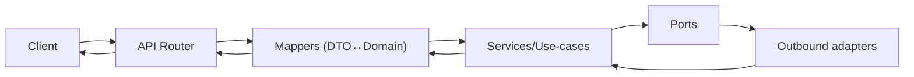

# 🚀 API (`api/src/api/`)

This folder contains the **API delivery layer** for KFM — the framework glue that exposes the platform through **HTTP** (and optionally **GraphQL**) while keeping the rest of the system clean.

The API layer is responsible for:
- 🌐 hosting the application server (FastAPI app creation)
- 🧭 routing (REST endpoints / routers; optional GraphQL endpoint)
- 🧱 middleware (auth, CORS, rate limits, request IDs, logging, timeouts)
- 📜 OpenAPI documentation and examples
- 🧯 consistent error shaping (Problem Details / stable codes)
- 🔎 observability hooks (metrics, traces, structured logs)

The API layer is **not** where business logic lives.

> [!IMPORTANT]
> In KFM, the API layer is a **thin shell**:
>
> ✅ parse/validate requests • call services/use-cases • return DTOs • enforce API governance  
> ❌ perform DB queries • build Cypher/SQL • run EO compute • implement domain rules

---

## 🧭 Jump table

- 🧩 Adapters overview: `../adapters/README.md`
- 🛬 Inbound adapters (controllers/jobs runners): `../adapters/inbound/README.md`
- 🔁 Mappers (DTO ↔ domain): `../adapters/mappers/README.md`
- 🛫 Outbound adapters (PostGIS/Neo4j/GEE/catalogs/tiles/storage): `../adapters/outbound/README.md`

---

## 🧠 One-sentence architecture

**API** (thin) → **Mappers** (pure) → **Services/Use-cases** (truth) → **Ports** → **Outbound** (I/O)

---

## 📁 Folder map (emoji layout)

> This is a recommended shape. Adjust names to match your repo, but keep responsibilities split the same way ✅

```text
📁 api/
  📁 src/
    📁 api/                                 🚀 API delivery layer (FastAPI + middleware + routing)
      📄 README.md                          👈 you are here
      📄 __init__.py                        🧬 package init (optional)

      📄 main.py                            ▶️ process entrypoint (app instance)
      📄 app.py                             🏭 create_app() + wiring (recommended)
      📄 settings.py                        ⚙️ config (env → typed settings)

      📁 routers/                           🧭 REST routers (thin, no business logic)
        📄 __init__.py
        📄 health.py                        ❤️ /healthz, /readyz
        📄 datasets.py                      🗂️ dataset discovery + refs (STAC/DCAT)
        📄 places.py                        🗺️ places, gazetteer-style endpoints
        📄 events.py                         🗓️ timeline/event endpoints
        📄 graph.py                          🕸️ graph queries (bounded traversals)
        📄 story.py                          🎬 story nodes, narrative bundles
        📄 tiles.py                          🧱 tile endpoints (MVT/XYZ)
        📄 modeling.py                       🧪 modeling/simulation jobs + evidence refs
        📄 catalogs.py                       📚 STAC/DCAT/PROV read endpoints (if exposed)
        📄 admin.py                          🛠️ migrations/ops (locked down)

      📁 deps/                              🔌 dependency wiring (ports/services, auth contexts)
        📄 __init__.py
        📄 services.py                       🧠 service container / factories
        📄 auth.py                           🔐 auth dependency (principal/context)
        📄 limits.py                         🚦 limits (max bbox/limit/page, request size)
        📄 tracing.py                        🧵 trace context injection

      📁 middleware/                        🧱 cross-cutting concerns
        📄 __init__.py
        📄 request_id.py                     🆔 correlation IDs
        📄 errors.py                         🧯 exception → Problem Details
        📄 logging.py                        📈 structured logs (sanitized)
        📄 cors.py                           🌍 CORS rules
        📄 rate_limit.py                     🚦 rate limiting (optional)
        📄 timeouts.py                       ⏱️ request timeouts (defensive)

      📁 openapi/                           📜 OpenAPI customization + examples
        📄 __init__.py
        📄 docs.py                           📘 tags, descriptions, externalDocs
        📄 examples.py                       🧪 request/response examples (golden)
        📄 security.py                       🔐 OpenAPI security schemes

      📁 graphql/                            🧬 optional GraphQL endpoint (if enabled)
        📄 __init__.py
        📄 schema.py                         🧬 schema glue (SDL or code-first)
        📄 resolvers.py                      🧩 resolvers (thin) → services
        📄 context.py                        🧾 request context (auth, trace_id)

      📁 static/                             🎨 optional static assets (docs, swagger tweaks)
        📄 README.md
```

---

## 🎯 What belongs here (and what doesn’t)

### ✅ In scope
- 🚀 FastAPI application setup (`create_app()`)
- 🧭 Router registration + route tags + OpenAPI metadata
- 🧱 Middleware (auth, CORS, request IDs, errors, rate limits)
- 🔌 Dependency wiring (service factories, port providers)
- 🧯 Error shaping (Problem Details; stable codes)
- 📈 Observability integration (metrics/tracing/logging)
- 🧾 Contract examples (OpenAPI examples, response shapes)

### ❌ Out of scope
- SQL/Cypher/GEE logic (outbound adapters)
- DTO ↔ domain mapping logic (mappers)
- business rules and orchestration (services/use-cases)
- data model definitions that belong to domain (domain layer)

> [!TIP]
> If a file starts accumulating “real logic”, move it down:
> - parsing/normalization → `adapters/mappers/*`
> - orchestration → `services/*`
> - IO integration → `adapters/outbound/*`

---

## 🧭 Request lifecycle (Mermaid-safe)



---

## 📜 Contract-first API rules

### Versioning 🧱
Prefer explicit versioning:
- `/v1/...` routes for REST
- GraphQL: schema evolution via deprecations + field additions

Rules:
- additions are okay (non-breaking)
- removals must be versioned or deprecated first
- error codes are contract surface (don’t churn them)

### DTO shaping lives in mappers 🔁
Routers should not handcraft response dicts.
- ✅ call `mappers/http/*` (REST)
- ✅ call `mappers/graphql/*` (GraphQL)

### “Refs-first” responses 🧾
Prefer IDs and stable references over dumping giant payloads:
- STAC/DCAT/PROV IDs in responses
- asset links (stable refs) instead of raw bytes
- tiles referenced via templates / TileJSON, not huge GeoJSON dumps

---

## 🧯 Error strategy (stable + boring)

KFM should be easy to debug without leaking internals.

### REST: Problem Details style
Return:
- `status`
- `title`
- `detail` (short, safe)
- `type` (stable URI)
- `instance` (request id / correlation id)
- optional `fields` map for validation errors

Example:
```json
{
  "type": "https://kfm.dev/problems/invalid_bbox",
  "title": "Invalid bbox",
  "status": 400,
  "detail": "bbox must be 'minx,miny,maxx,maxy' in EPSG:4326 unless crs is provided",
  "instance": "req_01HXYZ...",
  "fields": { "bbox": "minx must be <= maxx" }
}
```

### GraphQL: `extensions.code`
Attach:
- `extensions.code` (stable)
- `trace_id` / `request_id` when useful
- keep messages short and non-sensitive

> [!IMPORTANT]
> Never return raw stack traces or raw SQL/Cypher in client errors.

---

## 🗺️ Geospatial API patterns (map-friendly, safe by default)

### BBox / ROI rules 📦
- validate bbox ordering and bounds
- enforce max bbox area (“planet query” defense 🌍🛑)
- enforce server-side `limit` caps

### Tiles rules 🧱
- validate `z/x/y` strictly
- enforce zoom caps per layer
- never serve unbounded tiles (size caps + feature caps)

### Precision rules 🎯
- don’t ship more precision than the classification/profile allows
- never “increase precision” of generalized/redacted geometry downstream

---

## 🧪 Long-running jobs (EO exports, modeling, heavy analysis)

Some KFM operations are asynchronous (GEE exports, modeling runs, batch ETL).

Recommended API pattern:
- `POST /v1/jobs/...` → returns `job_id` + initial status
- `GET /v1/jobs/{job_id}` → poll status
- `GET /v1/jobs/{job_id}/result` → returns **refs-first** evidence summary + asset links

Job status shape (example):
```json
{
  "job_id": "job_...",
  "state": "QUEUED",
  "submitted_at": "2026-01-11T12:00:00Z",
  "started_at": null,
  "finished_at": null,
  "progress": { "pct": 0.0 },
  "trace_id": "req_..."
}
```

> [!TIP]
> Treat job outputs as datasets: publish to storage + catalogs (STAC/DCAT/PROV) and return IDs.

---

## 🔐 Security & governance (API must not leak)

### Auth & identity
Support one or more:
- API keys (service-to-service)
- JWT/OIDC (user sessions)
- mTLS (internal)

### Classification propagation
- never downgrade classification in responses
- redaction notes must remain visible in metadata (not hidden in logs)

### Rate limiting & request bounds
Defensive defaults:
- limit request body size
- limit `limit` / `page_size`
- cap traversal depth (graph queries)
- cap ROI/bbox area and max zoom

> [!CAUTION]
> Graph and tile endpoints are “hot abuse surfaces” — bounds are mandatory.

---

## 📈 Observability (make it debuggable)

### Request IDs 🆔
- accept incoming `X-Request-ID` (or generate)
- include `X-Request-ID` on responses
- propagate to outbound adapters (trace correlation)

### Logs 📜
- structured logs (json)
- sanitize payloads:
  - truncate large inputs
  - redact token-like strings
  - never log signed URLs

### Metrics & tracing 🧵
Recommended:
- `/metrics` (if Prometheus style is used)
- tracing spans per router:
  - `api.request.<route_name>`
  - `api.service.<use_case>`
  - plus outbound spans in adapters

---

## 🧑‍💻 Local development (typical)

> Adjust commands to your project runner; these are the common defaults.

### Run server
```bash
uvicorn api.src.api.main:app --reload
```

### Open docs
- Swagger UI: `/docs`
- ReDoc: `/redoc`
- OpenAPI JSON: `/openapi.json`

### Testing
```bash
pytest -q
```

---

## ✅ Definition of done (API layer changes)

- [ ] routes remain thin (no business logic)
- [ ] request parsing/validation is explicit (DTOs + mappers)
- [ ] errors shaped with stable codes (Problem Details / GraphQL extensions)
- [ ] bounds enforced (limit, bbox, zoom, traversal depth)
- [ ] provenance refs included where relevant (STAC/DCAT/PROV IDs)
- [ ] classification/redaction rules respected (no downgrade)
- [ ] OpenAPI docs updated (tags + examples)
- [ ] metrics/logs/traces still clean (no secrets, no payload dumps)

---

## 📚 Project bookshelf (all project files)

<details>
<summary>📚 Click to expand — complete library informing KFM API conventions</summary>

### 🧭 KFM architecture & direction
- 📄 `Kansas Frontier Matrix (KFM) – Comprehensive Technical Documentation.docx`
- 📄 `🌟 Kansas Frontier Matrix – Latest Ideas & Future Proposals.docx`

### 🗺️ Web/UI delivery (API contracts must be predictable)
- 📄 `responsive-web-design-with-html5-and-css3.pdf`
- 📄 `webgl-programming-guide-interactive-3d-graphics-programming-with-webgl.pdf`

### 🗺️ GIS, mapping, tiles, and media formats
- 📄 `python-geospatial-analysis-cookbook.pdf`
- 📄 `making-maps-a-visual-guide-to-map-design-for-gis.pdf`
- 📄 `Mobile Mapping_ Space, Cartography and the Digital - 9789048535217.pdf`
- 📄 `compressed-image-file-formats-jpeg-png-gif-xbm-bmp.pdf`

### 🛰️ Remote sensing / Earth observation
- 📄 `Cloud-Based Remote Sensing with Google Earth Engine-Fundamentals and Applications.pdf`

### 🧪 Modeling, simulation, stats, uncertainty (evidence discipline)
- 📄 `Scientific Modeling and Simulation_ A Comprehensive NASA-Grade Guide.pdf`
- 📄 `Understanding Statistics & Experimental Design.pdf`
- 📄 `regression-analysis-with-python.pdf`
- 📄 `Regression analysis using Python - slides-linear-regression.pdf`
- 📄 `think-bayes-bayesian-statistics-in-python.pdf`
- 📄 `graphical-data-analysis-with-r.pdf`
- 📄 `Deep Learning for Coders with fastai and PyTorch - Deep.Learning.for.Coders.with.fastai.and.PyTorchpdf` *(library item; filename as stored)*

### 🗄️ Data systems, scaling, federation
- 📄 `PostgreSQL Notes for Professionals - PostgreSQLNotesForProfessionals.pdf`
- 📄 `Scalable Data Management for Future Hardware.pdf`
- 📄 `Data Spaces.pdf`

### 🕸️ Graphs & optimization (bounded queries + derived artifacts)
- 📄 `Spectral Geometry of Graphs.pdf`
- 📄 `Generalized Topology Optimization for Structural Design.pdf`

### 🧠 Humanism, governance, accountability framing
- 📄 `Introduction to Digital Humanism.pdf`
- 📄 `On the path to AI Law’s prophecies and the conceptual foundations of the machine learning age.pdf`
- 📄 `Principles of Biological Autonomy - book_9780262381833.pdf`

### 🛡️ Security mindset (API is an abuse surface)
- 📄 `ethical-hacking-and-countermeasures-secure-network-infrastructures.pdf`
- 📄 `Gray Hat Python - Python Programming for Hackers and Reverse Engineers (2009).pdf`

### 🧵 Concurrency / distributed systems background
- 📄 `concurrent-real-time-and-distributed-programming-in-java-threads-rtsj-and-rmi.pdf`

### 📚 Programming compendium shelf (quick reference)
- 📄 `A programming Books.pdf`
- 📄 `B-C programming Books.pdf`
- 📄 `D-E programming Books.pdf`
- 📄 `F-H programming Books.pdf`
- 📄 `I-L programming Books.pdf`
- 📄 `M-N programming Books.pdf`
- 📄 `O-R programming Books.pdf`
- 📄 `S-T programming Books.pdf`
- 📄 `U-X programming Books.pdf`

</details>

