# 🧩 Application Layer (`api/src/application`)


> **TL;DR**: This folder contains KFM’s **use-cases + orchestration**: the “brainstem” between inbound HTTP/GraphQL adapters and the core domain model. It’s where we enforce **pipeline ordering, provenance, policy gates, and evidence-first output**. :contentReference[oaicite:0]{index=0} :contentReference[oaicite:1]{index=1}

---

## 🧭 Why this folder exists

KFM is intentionally layered: **Domain → Service/Application → Integration/Ports → Infrastructure/Adapters** to keep core logic tech-agnostic and swappable. :contentReference[oaicite:2]{index=2}

This `application/` layer corresponds to the “Services Layer (Use Cases)” described in the docs: it implements workflows (publish, query, narrate, answer) using domain models and enforcing rules like **pipeline ordering** and **provenance logging**. :contentReference[oaicite:3]{index=3}

---

## 🎯 Responsibilities (what belongs here)

### 1) Orchestrate use-cases (not frameworks)
- Translate “a user wants X” into a deterministic set of steps.
- Call **ports** (interfaces) for storage/graph/search/tiles/etc.
- Return DTOs/presenters for the API boundary.

> The UI and other clients should go through the governed API boundary — **no direct DB hits**. :contentReference[oaicite:4]{index=4} :contentReference[oaicite:5]{index=5}

### 2) Enforce **evidence-first** + **contract-first**
- “No mystery layers”: anything user-facing must be traceable to cataloged sources + provenance. :contentReference[oaicite:6]{index=6}
- Treat metadata contracts as first-class artifacts (schemas + validations) and refuse to publish/serve anything that violates them. :contentReference[oaicite:7]{index=7}

### 3) Apply policy gates (fail-closed)
- CI and runtime policy checks (OPA/Rego + Conftest patterns) reject changes/actions if requirements aren’t met. :contentReference[oaicite:8]{index=8} :contentReference[oaicite:9]{index=9}
- Enforce:
  - **Pipeline ordering** (no skipping stages) :contentReference[oaicite:10]{index=10}
  - **API boundary** (UI cannot bypass API) :contentReference[oaicite:11]{index=11}
  - **Provenance-first publishing** (processed/graph/content implies PROV + catalogs) :contentReference[oaicite:12]{index=12}
  - **Classification/sovereignty propagation** (“no output less restricted than inputs”) :contentReference[oaicite:13]{index=13}

### 4) Provenance + audit trail for actions
- Generate and persist run identifiers + ledger artifacts:
  - **Run Manifest** with `run_id`, `idempotency_key`, `canonical_digest`, sources, tool versions, counts, errors. :contentReference[oaicite:14]{index=14}
  - Canonicalize JSON and hash it (RFC 8785), yielding stable digests for idempotency + traceability. :contentReference[oaicite:15]{index=15}

### 5) Power downstream UX features (via stable contracts)
- UI is decoupled from backend via REST/GraphQL, and is designed to surface provenance/citations for trust. :contentReference[oaicite:16]{index=16}
- Stories are authored in **Markdown + JSON config**, with the frontend executing map/timeline steps. :contentReference[oaicite:17]{index=17}

---

## 🧱 Where we sit in the overall pipeline

### End-to-end pipeline (no skipping stages)

```mermaid
flowchart LR
  RAW["📥 Raw inputs<br/>(data/raw/)"] --> WORK["🛠️ Work/ETL<br/>(data/work/)"]
  WORK --> PROC["📦 Processed outputs<br/>(data/processed/)"]
  PROC --> CATS["🛰️ Catalogs (STAC/DCAT/PROV)<br/>(data/catalogs/)"]
  CATS --> GRAPH["🕸️ Knowledge Graph<br/>(Neo4j)"]
  GRAPH --> API["🚪 API Layer<br/>(REST + GraphQL)"]
  API --> UI["🗺️ Web UI<br/>(Map & Story)"]
  UI --> AI["🤖 Focus Mode<br/>(AI Assistant)"]
```

:contentReference[oaicite:18]{index=18}

### “Evidence triplet” requirement
Publishing requires STAC + DCAT + PROV (“evidence-first publishing”), stored in canonical locations and version-controlled. :contentReference[oaicite:19]{index=19}

---

## 🗂️ Suggested folder layout (within `application/`) 📦

> Names can vary — keep the *roles* consistent.

```text
api/src/application/
├─ ✅📄 README.md                       # you are here 🙂 📌 Application layer guide: CQRS boundaries, flow, and invariants
├─ 🧾 commands/                         # Write-side use cases (CQRS): mutate state, emit events, write receipts/PROV
├─ 🔎 queries/                          # Read-side use cases (CQRS): fetch/shape data for API responses (no side effects)
├─ 🧩 services/                         # Orchestration that doesn’t fit pure CQRS handlers (workflows, fan-out, pipelines)
├─ 🧱 dto/                              # Boundary-safe request/response models (Pydantic-friendly; validated at edges)
├─ 🔌 ports/                            # Outbound interfaces (repos, graph, search, tiles, policy, ledger) — dependency inversion
├─ 🛡️ policies/                         # Policy client + helpers (OPA/rule packs; enforcement wrappers + decision caching)
├─ 🧬 provenance/                       # Provenance builders (PROV bundles, evidence manifests, receipts) for auditability
├─ 📡 telemetry/                        # Correlation IDs, structured logs, metrics events (audit-safe; redaction-aware)
├─ 🚫 errors/                           # Application exceptions + error mapping (domain → HTTP-safe error envelopes)
└─ 🔁 mappers/                          # Mapping layer: domain ↔ dto, catalog ↔ domain, graph ↔ domain (no business logic)
```

---

## 🔌 Ports & Adapters: the “no-surprises” rule

Application code depends on **interfaces**, not concrete tech. The docs call out that swapping tech should mean “new adapter, same interface contract.” :contentReference[oaicite:20]{index=20}

Example ports you’ll commonly see:
- `CatalogPort` (STAC/DCAT/PROV read/write)
- `GraphPort` (Neo4j queries / subgraph assembly)
- `SpatialPort` (PostGIS queries, tiles, summaries)
- `SearchPort` (full-text indexing)
- `PolicyPort` (runtime policy checks)
- `LedgerPort` (audit log + manifests)
- `ArtifactsPort` (OCI registry references, digests, signatures)

---

## 🧠 Key use-cases (what we orchestrate here)

### ✅ Use-case: “Publish a dataset”
**Goal:** move from processed output → catalogs → graph → API availability.

- Catalog outputs (STAC/DCAT/PROV) are required before data is considered published. :contentReference[oaicite:21]{index=21}
- Graph ingestion reads catalog records into Neo4j, linking datasets to places/events/periods, preserving traceability and avoiding “mystery nodes.” :contentReference[oaicite:22]{index=22}
- API layer serves all access and enforces “no UI bypass.” :contentReference[oaicite:23]{index=23}

### 🗺️ Use-case: “Serve map tiles & summaries”
The API layer uses PostGIS for geodata operations and tile generation (e.g., vector tiles), called by the UI through endpoints like `/tiles/...`. :contentReference[oaicite:24]{index=24}

### 🤖 Use-case: “Answer a Focus Mode question”
Focus Mode is **advisory-only**, and must **always cite sources**. :contentReference[oaicite:25]{index=25} :contentReference[oaicite:26]{index=26}

Pipeline (simplified):

:contentReference[oaicite:27]{index=27}

Runtime expectations:
- If the system can’t produce sources, it should refuse/express uncertainty rather than fabricate. :contentReference[oaicite:28]{index=28}
- Answers are context-aware (map/time/layers) and can surface explainability signals. :contentReference[oaicite:29]{index=29}

### 📚 Use-case: “Story Node with Evidence Manifest”
Story Nodes are narratives with maps/timeline steps; the UI reads Markdown + JSON configuration. :contentReference[oaicite:30]{index=30}

A governance-forward pattern is to attach:
- A human-readable citations block
- A machine-readable evidence manifest
- A PROV snippet linking story → sources → generation activity :contentReference[oaicite:31]{index=31}

### ⚡ Use-case: “Geotagged Pulse Threads”
Pulse Threads are timely, location-specific micro-narratives, stored as graph nodes (e.g., `:PulseThread`), versioned like Story Nodes, and backed by provenance + an evidence manifest. :contentReference[oaicite:32]{index=32}

### 🧠 Use-case: “Conceptual Attention Nodes”
Concept nodes can steer retrieval/analysis (AI “attends” to a concept subgraph), and they also appear in UI as thematic filters/“attention mode.” :contentReference[oaicite:33]{index=33}

### 📦 Use-case: “Artifact publishing via OCI (ORAS + Cosign)”
KFM can distribute large artifacts (PMTiles, GeoParquet, COGs) through OCI registries using ORAS, and verify integrity via keyless Cosign signatures/referrers. :contentReference[oaicite:34]{index=34}

---

## 🧪 Patterns & conventions (how we build here)

### ✅ Command/Query split (CQRS-lite)
- **Commands**: mutate state (publish, ingest, create story/pulse)
- **Queries**: read state (search, tiles, dataset lookup, graph traversals)

### 🔁 Determinism & idempotency
Prefer stable identifiers and idempotency keys (especially for scheduled/automated workflows). Run manifests and canonical digests support repeatable runs and auditability. :contentReference[oaicite:35]{index=35}

### 🛡️ Policy-first defaults (“fail closed”)
If a check can’t be performed, **block** rather than guess.
- Missing provenance should fail CI or runtime enforcement. :contentReference[oaicite:36]{index=36}
- Policy gates should deny later-stage artifacts without prior outputs (pipeline ordering). :contentReference[oaicite:37]{index=37}

### 🧾 Provenance always
Anything user-facing should be traceable back to contracts + provenance (no “mystery layers”). :contentReference[oaicite:38]{index=38}

---

## 🧰 Example skeletons (lightweight, framework-free)

### A query handler
```python
from dataclasses import dataclass
from typing import Protocol

class CatalogPort(Protocol):
    def get_dataset(self, dataset_id: str) -> dict: ...

@dataclass(frozen=True)
class GetDatasetQuery:
    dataset_id: str

@dataclass(frozen=True)
class DatasetDTO:
    id: str
    title: str
    license: str

class GetDatasetHandler:
    def __init__(self, catalog: CatalogPort):
        self._catalog = catalog

    def __call__(self, q: GetDatasetQuery) -> DatasetDTO:
        data = self._catalog.get_dataset(q.dataset_id)
        # Validate contract-first requirements (license, temporal/spatial, etc.)
        return DatasetDTO(id=data["id"], title=data["title"], license=data["license"])
```

### A command handler (publish dataset)
```python
class PolicyPort(Protocol):
    def enforce(self, action: str, payload: dict) -> None: ...

class ProvenancePort(Protocol):
    def write_prov_bundle(self, dataset_id: str, inputs: list[dict], activity: dict) -> str: ...

class PublishDatasetHandler:
    def __init__(self, policy: PolicyPort, prov: ProvenancePort, catalog: CatalogPort):
        ...

    def __call__(self, dataset_id: str) -> None:
        # 1) enforce pipeline ordering + required boundary artifacts
        # 2) write PROV + catalogs
        # 3) trigger/queue graph ingestion
        # 4) record run manifest + audit
        ...
```

---

## 🧪 Testing guidance ✅

- Unit test use-cases by mocking ports (no DBs, no HTTP).
- Add “golden” fixtures for catalogs/PROV/evidence manifests.
- Include policy checks in CI to prevent:
  - Missing provenance
  - UI bypass of API boundary
  - Manual edits to processed outputs without pipeline evidence :contentReference[oaicite:39]{index=39}

---

## 🔗 Nearby layers (for orientation) 🧭

- `api/src/domain/` → core entities, invariants, and domain services.
- `api/src/adapters/` → PostGIS/Neo4j/search/OCI/etc implementations.
- `api/src/server/` → FastAPI + GraphQL boundary (controllers/resolvers).

FastAPI provides automatic OpenAPI docs and the platform can expose both REST and GraphQL interfaces for rich graph/data access. :contentReference[oaicite:40]{index=40}

---

## 📚 Reference shelf (project docs) 📖

These are the “design laws” this layer should obey:

- **Layered architecture overview** (Domain/Service/Integration/Infrastructure) :contentReference[oaicite:41]{index=41}  
- **End-to-end pipeline flow** + “no skipping” rule :contentReference[oaicite:42]{index=42}  
- **Evidence triplet** (STAC/DCAT/PROV) requirement :contentReference[oaicite:43]{index=43}  
- **Policy Pack patterns** (pipeline ordering, API boundary, provenance-first) :contentReference[oaicite:44]{index=44}  
- **Focus Mode** (always cites, governance check → AnswerWithCitations) :contentReference[oaicite:45]{index=45} :contentReference[oaicite:46]{index=46}  
- **Story Nodes & UI coupling via contracts** (Markdown + JSON configs, provenance surfaced) :contentReference[oaicite:47]{index=47} :contentReference[oaicite:48]{index=48}  
- **Pulse Threads** (graph-native, evidence manifest, geotagging) :contentReference[oaicite:49]{index=49}  

---

<details>
<summary>📝 Maintainer checklist: adding a new application use-case</summary>

- [ ] Defines a **clear command/query contract** (DTOs)
- [ ] Uses **ports**, not concrete adapters
- [ ] Enforces **policy gates** (fail-closed)
- [ ] Produces/links **provenance + evidence** (PROV, manifests)
- [ ] Returns **citation-ready** outputs for UI/Focus Mode
- [ ] Unit tests with mocked ports
- [ ] Adds/updates docs + schema/contracts if behavior changes

</details>

