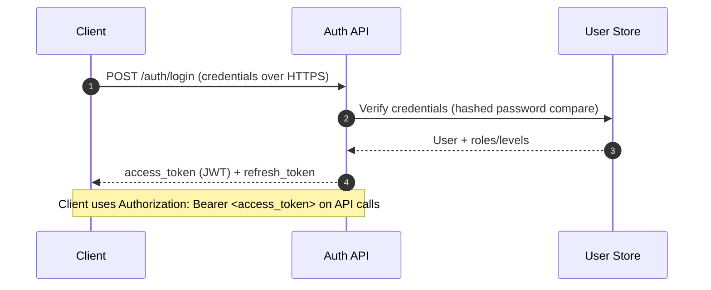
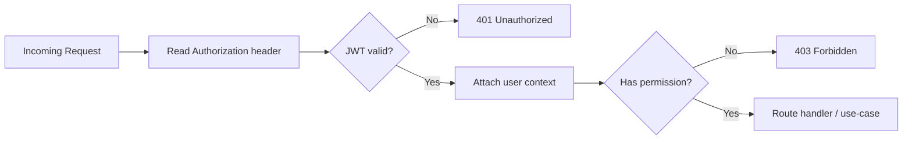
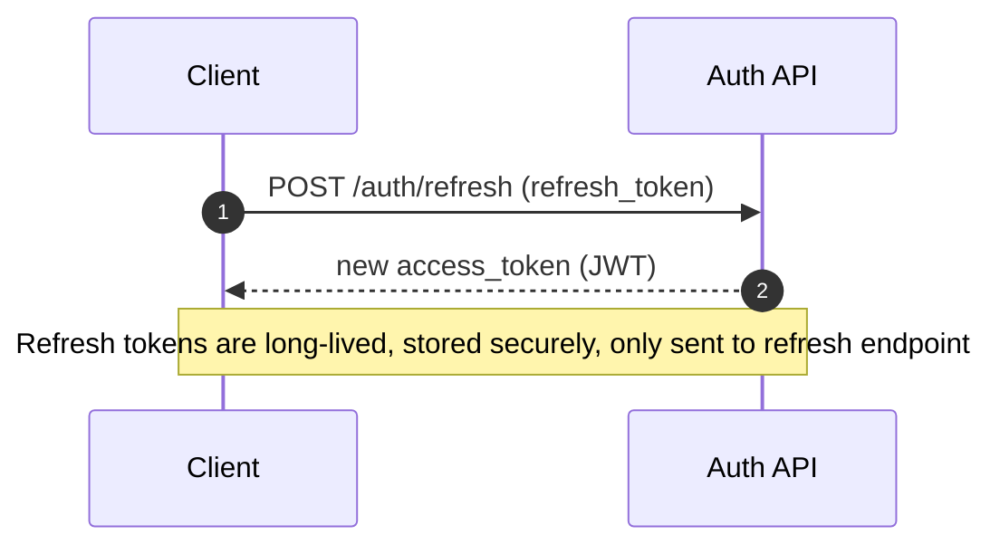

# 🔐 Auth Module (`api/src/auth`)


> ✅ **Goal:** Provide **token-based authentication** + **role/permission-based authorization** for KFM backend APIs and internal services.

---

## 🧭 Where this sits

```text
📦 api
└── 📁 src
    └── 📁 auth
        └── 📄 README.md   👈 you are here
```

In KFM’s layered approach, the **API layer** should stay thin: it routes requests, validates/serializes data, and delegates to services/use-cases (instead of embedding business rules directly in controllers).[^clean-arch]

---

## 🎯 What this module does

### ✅ Authentication
- Issues **signed access tokens** (JWT) after login and expects clients to include them on subsequent calls via:
  - `Authorization: Bearer <token>`[^auth-backend]
- Validates access tokens on *every request* (signature + expiry).[^auth-backend]
- Supports **username/password** login and optionally **SSO/OAuth** integration if/when configured.[^auth-backend]

### ✅ Session continuity (Refresh tokens)
- Access tokens are **short-lived** (example given: ~1 hour).[^security-auth]
- Uses a **refresh token mechanism** to keep sessions alive without forcing users to log in again.
  - Refresh tokens are long-lived, stored securely, and only sent to the token refresh endpoint.[^security-auth]

### ✅ Authorization (RBAC + operational access levels)
- Enforces roles (e.g., **farmer/user**, **researcher**, **admin**) and checks resource access (ownership/org assignment).[^auth-backend]
- Uses an ACL or role→permission mapping and checks permissions on each request.[^security-roles]
- Supports **Operational Access Levels** for “admin-only” or sensitive actions; token claims can include role/level data and middleware checks it.[^auth-backend]

### ✅ Security hardening
- Passwords are stored hashed (bcrypt or Argon2), login attempts are rate-limited, and lockouts can occur after repeated failures.[^auth-backend][^security-auth]
- Supports optional **MFA** (OTP via authenticator/email) for sensitive/admin accounts.[^security-auth]

### ✅ Service-to-service (internal) auth
- Internal calls can be restricted to a secure network segment and/or authenticated using service tokens.[^auth-backend]

---

## 🗂️ Suggested internal structure

> This is a *recommended* breakdown to keep auth maintainable, testable, and aligned with the project’s layered architecture approach.[^clean-arch]

```text
📁 api/src/auth
├── 📁 controllers/         # request/response mapping (thin)
├── 📁 routes/              # route wiring
├── 📁 middleware/          # verify JWT, attach user, enforce roles/levels
├── 📁 services/            # token issuing, verification, refresh, MFA hooks
├── 📁 policies/            # roles → permissions, operational access levels
├── 📁 models/              # auth-related DTOs (NOT database entities unless this service owns them)
├── 📁 utils/               # helpers (cookie parsing, header parsing, etc.)
└── 📁 tests/               # unit + integration tests
```

---

## 🔄 Auth flows

### 1) Login → JWT + Refresh Token



Notes:
- JWT should include at minimum **user id** and **roles** (and optionally operational levels) as claims.[^security-auth][^auth-backend]
- Token expiry is enforced on every request.[^auth-backend]

### 2) API request → Verify + Authorize



Resource-level check example (from KFM): if a user requests a field time series, verify they own/are assigned that field (or have a role granting access).[^auth-backend]

### 3) Refresh → New access token



[^security-auth]

---

## 🧑‍⚖️ Authorization model

### Roles (example)
| Role | Typical capabilities | Notes |
|---|---|---|
| 👩‍🌾 Farmer/User | View data for their own fields + public data | No access to other users’ private field details[^security-auth] |
| 🔬 Researcher | Broader read access for analysis | Limited/no system administration[^security-auth] |
| 🛠️ Admin | Manage users, system settings, sensitive operations | MFA recommended/optional[^security-auth] |

### Operational access levels
Use “levels” (or a dedicated claim) for high-risk actions (e.g., bulk deletes, reload base datasets, system-wide tasks). Middleware/decorators should enforce these consistently.[^auth-backend]

---

## 🔌 Integration points

### 🌐 Frontend
KFM’s frontend is organized by feature and includes:
- `src/features/auth/` → Login form + auth context
- `src/services/` → API client setup (e.g., axios client that attaches auth headers)[^frontend-auth]

**Auth expectations:**
- UI stores session state (carefully) and attaches `Authorization: Bearer <token>` for API calls.[^auth-backend]
- If using real-time updates, socket connections are typically established *after login* and should follow the same security posture as HTTP calls.[^websockets]

### 🧠 Internal services (ML, pipelines, etc.)
When the main API calls an internal service, keep that channel private and/or use a **service token** so internal endpoints aren’t implicitly “trusted forever.”[^auth-backend]

### 🌍 External API consumers (optional)
KFM also anticipates external authorized parties (e.g., research teams) accessing APIs—potentially using API keys alongside documentation and access controls.[^external-api]

---

## 🛡️ Security checklist (minimum bar)

- 🔒 Enforce HTTPS for login and token exchange.[^security-auth]
- 🔑 Hash passwords with **bcrypt or Argon2** (never store plaintext).[^security-auth]
- 🧯 Rate-limit login attempts and lock accounts/IPs after repeated failures.[^auth-backend][^security-auth]
- 🧩 Keep refresh tokens secure; only send them to refresh endpoint.[^security-auth]
- 🧷 Prefer centralized middleware/dependencies for auth (avoid ad-hoc checks per endpoint).[^auth-backend]
- 🛂 Require MFA for privileged/admin access where appropriate.[^security-auth]
- 🛰️ Use service tokens / private networking for inter-service calls.[^auth-backend]

---

## 🧪 Testing ideas

- ✅ Token verification (valid/expired/tampered signature)
- ✅ Role/permission matrix checks (RBAC)
- ✅ Operational access level enforcement
- ✅ Refresh token rotation/expiry behavior
- ✅ Login hardening (rate limits, lockout triggers)

---

## 🆘 Troubleshooting

- **401 Unauthorized**: missing/invalid/expired token (authentication failed)
- **403 Forbidden**: valid token, but role/permission/resource check failed (authorization denied)[^auth-backend]

---

## 📚 Notes & Sources

[^auth-backend]: KFM describes JWT-based auth, `Authorization: Bearer <token>`, per-request verification, role/resource checks, operational access levels, inter-service tokens, and using framework support (e.g., FastAPI dependencies) for systematic auth enforcement.:contentReference[oaicite:0]{index=0}

[^security-auth]: KFM security section describes JWT session management over HTTPS, token expiry (example ~1 hour), refresh token mechanism, password hashing (bcrypt/Argon2), password reset via one-time email token, account lockout, and optional MFA for sensitive accounts.:contentReference[oaicite:1]{index=1}

[^security-roles]: KFM notes authorization via roles/privileges using an ACL or role-permission mapping and checking permissions on each request.:contentReference[oaicite:2]{index=2}

[^clean-arch]: KFM emphasizes Clean Architecture/SOLID, dependency inversion, and a layered backend structure (API routes/controllers vs services vs models vs repositories), where outer layers shouldn’t leak into inner logic.:contentReference[oaicite:3]{index=3}

[^frontend-auth]: KFM’s frontend structure includes `features/auth/ (Login form, auth context)` and an API client service layer for making requests (e.g., axios client).:contentReference[oaicite:4]{index=4}

[^websockets]: KFM describes using WebSockets/SSE for real-time updates, typically after login, and leveraging framework support (e.g., FastAPI WebSockets / Socket.IO) with resource management considerations.:contentReference[oaicite:5]{index=5}

[^external-api]: KFM mentions external interoperability and potentially providing API documentation and API keys for authorized external parties.:contentReference[oaicite:6]{index=6}

