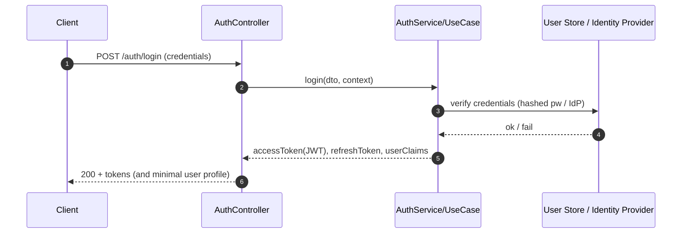
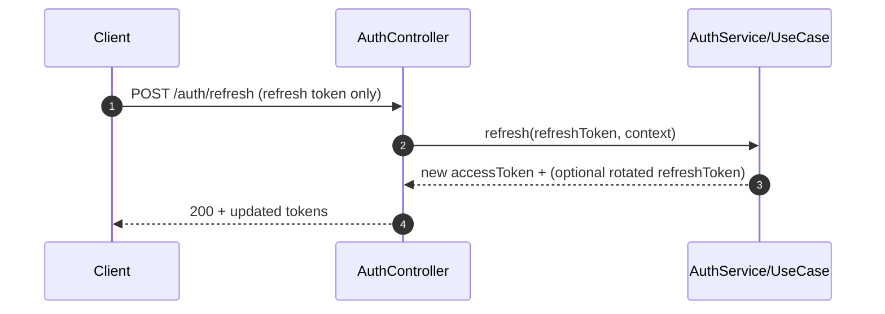

# 🔐 Auth Controllers

**✅ JWT sessions · ♻️ Refresh tokens · 🧭 Roles/ACL · 🛡️ MFA-ready · 🧱 Clean Architecture · 📜 Contract-first**

📍 **Location:** `api/src/auth/controllers/`  
🎯 **Goal:** Keep the HTTP layer *thin*, *predictable*, and *secure* — everything interesting lives in services/use-cases.

---

## 🧭 What this folder is

This folder contains the **HTTP controller layer** for authentication + authorization flows:
- Receives requests (JSON, headers, cookies)
- Validates + normalizes inputs (DTOs)
- Calls **auth services / use cases**
- Returns consistent HTTP responses (status codes + body)
- Applies framework guards/middleware for **JWT verification + role/access checks**

> [!IMPORTANT]
> Controllers are adapters — **not the place for business logic**. Keep them small and deterministic.
> Inner layers should not depend on outer layers (dependency direction stays inward).:contentReference[oaicite:0]{index=0}:contentReference[oaicite:1]{index=1}

---

## 🧱 Architectural rules (Clean Architecture alignment)

### ✅ What controllers *should* do
- ✅ Parse request payloads, headers, cookies
- ✅ Validate required fields & reject invalid shapes early
- ✅ Call a **service/use-case** (ex: `authService.login()`)
- ✅ Map domain/service results → HTTP response DTOs
- ✅ Apply auth guards (JWT verify), role checks, operational access checks

### ❌ What controllers must *not* do
- ❌ Hash/compare passwords directly (belongs in auth service)
- ❌ Talk directly to repositories/DB
- ❌ Contain permission matrices (belongs in policy/authorization layer)
- ❌ Leak sensitive details in errors or logs (passwords, tokens, MFA secrets)

These rules follow KFM’s separation principles (single responsibility, dependency inversion, and “inner layers don’t depend on outer layers”).:contentReference[oaicite:2]{index=2}:contentReference[oaicite:3]{index=3}

---

## 📁 Folder map (example layout)

> This is a **recommended shape** — keep/adjust filenames to match what exists in your repo.

```text
📦 api/
  📁 src/
    📁 auth/
      📁 controllers/
        📄 README.md                 👈 you are here
        📄 auth.controller.*         (login / refresh / logout)
        📄 password.controller.*     (forgot / reset / change)
        📄 mfa.controller.*          (enroll / verify / disable) 🧩 optional
        📄 admin-auth.controller.*   (admin-only auth ops) 🧩 optional
```

---

## 🔑 Security model (what we enforce)

KFM’s security posture expects:
- **JWT** tokens for session management (signed token contains user id + roles)
- Login occurs over **HTTPS**
- **Short-lived access tokens** (example: ~1 hour) with **refresh token mechanism**
- Refresh tokens are **long-lived**, stored securely, and sent **only** to the refresh endpoint
- Passwords are hashed with a strong algorithm (bcrypt/Argon2)
- Password reset is via **email + one-time token**
- Lockout / throttling after repeated failed login attempts
- Optional **MFA** for sensitive/admin accounts
- Authorization via **roles + ACL/role-permission mapping**
- “Operational access levels” for admin-only endpoints enforced by middleware/decorators:contentReference[oaicite:4]{index=4}:contentReference[oaicite:5]{index=5}

---

## 🧩 Controller responsibilities matrix

| Controller | Responsibilities | Typical operations |
|---|---|---|
| `AuthController` 🔐 | Identity verification + token issuing | login, refresh, logout |
| `PasswordController` 🔁 | Account recovery + password lifecycle | forgot-password, reset-password, change-password |
| `MfaController` 🛡️ | MFA enrollment & verification | enroll, verify, disable |
| `AdminAuthController` 👑 | Operational access actions (admin-only) | user unlock, session revoke, security audit hooks |

> [!NOTE]
> Your exact endpoint paths may vary. The “contract-first” rule below is how we keep everything consistent.

---

## 🔄 Core flows (reference diagrams)

### 1) Login → JWT issued (access + refresh)



**Controller must ensure:**
- Never logs raw credentials
- Returns generic errors on auth failure (avoid account enumeration)
- Uses HTTPS-only assumptions on deployment edge:contentReference[oaicite:6]{index=6}

### 2) Access token refresh (refresh token → new access token)



Refresh tokens should be **stored securely** and sent **only** to the refresh endpoint (not to every request).:contentReference[oaicite:7]{index=7}

---

## 🧭 Authorization patterns (RBAC + operational access)

### JWT verification (per request)
- Client includes token on API calls:
  - `Authorization: Bearer <token>`
- Controller layer typically relies on middleware/guard to:
  - validate signature
  - check expiry
  - attach user claims to request context:contentReference[oaicite:8]{index=8}

### 401 vs 403 (be strict)
- **401 Unauthorized:** missing/invalid/expired token
- **403 Forbidden:** valid identity, but role/ownership/ACL fails  
  Example: user requests `/api/field/10/timeseries` but lacks access rights → 403:contentReference[oaicite:9]{index=9}

### Admin-only / sensitive endpoints
Some actions must require operational access levels (“admin only”), enforced by decorators/middleware reading token claims.:contentReference[oaicite:10]{index=10}

---

## 📜 Contract-first API rule (non-negotiable)

**Schemas + API contracts are first-class artifacts.**  
Any change to the auth endpoints should be reflected in the contract first, with strict versioning + compatibility checks.:contentReference[oaicite:11]{index=11}

✅ Practical implication for controllers:
- If you add/change a request/response field:
  - update the contract/schema
  - update the controller DTO validation
  - update tests
  - ensure backward compatibility (or version bump)

---

## 🧰 Controller implementation patterns (recommended)

### ✅ Pattern: thin controller, typed DTOs, explicit service calls
```ts
// PSEUDO-CODE (framework-agnostic)
export async function login(req, res) {
  const dto = {
    username: req.body.username,
    password: req.body.password,
  };

  // validate dto shape here (or via middleware)
  const result = await authService.login(dto, {
    ip: req.ip,
    userAgent: req.headers["user-agent"],
  });

  return res.status(200).json(result);
}
```

### ✅ Pattern: normalize auth context
Ensure the service receives a consistent “request context”:
- user id (if authenticated)
- roles/claims
- correlation/request id
- ip / user-agent (useful for risk controls + auditing)

---

## 🧪 Testing strategy (controllers)

### Unit tests
- Mock the auth service/use-case and assert:
  - correct DTO passed
  - correct status code
  - correct JSON response shape
  - correct error mapping

Clean Architecture encourages isolating business logic and using dummy implementations for tests.:contentReference[oaicite:12]{index=12}  
A concrete pattern is: mock the use-case, call the endpoint, assert JSON + status code (example shown for a Flask endpoint, but the testing intent is identical for any framework).:contentReference[oaicite:13]{index=13}

### Integration tests
- Spin up the API + test:
  - login + refresh round-trip
  - role-based access rules (401/403 correctness)
  - password reset token flow
  - lockout/rate-limit behavior (where implemented)

---

## 📈 Observability & audit signals

KFM expects consistent authentication + logging across services, so the system behaves like one integrated platform.:contentReference[oaicite:14]{index=14}

Controllers should emit *safe* structured signals (no secrets), for example:
- `auth.login.success`
- `auth.login.failure` (include reason class: invalid_credentials / locked / mfa_required)
- `auth.refresh.success|failure`
- `auth.password_reset.requested`
- `auth.password_reset.completed`
- `auth.mfa.challenge|verified|failed`

> [!CAUTION]
> Never log: passwords, refresh tokens, MFA codes, raw JWTs.

---

## ✅ “Add a new auth endpoint” checklist

- [ ] Define/update contract (request/response schema) **first**:contentReference[oaicite:15]{index=15}
- [ ] Add controller method (thin adapter only)
- [ ] Implement/extend service/use-case
- [ ] Add/extend guard/middleware (auth + roles + operational access)
- [ ] Add unit tests (mock service)
- [ ] Add integration tests (happy path + auth failure + forbidden cases)
- [ ] Verify:
  - [ ] 401/403 behavior matches policy
  - [ ] no sensitive logs
  - [ ] rate limit / lockout rules are respected:contentReference[oaicite:16]{index=16}

---

## 📚 Source notes (project grounding)

- KFM security/auth model: JWT, refresh tokens, password hashing, reset via one-time email token, lockout, MFA, roles/ACL.:contentReference[oaicite:17]{index=17}
- Backend auth enforcement: `Authorization: Bearer <token>`, role checks, 403 for unauthorized access, admin-only operational levels via middleware/decorators.:contentReference[oaicite:18]{index=18}
- Clean Architecture principles & layer import direction (API → services/models, not vice-versa).:contentReference[oaicite:19]{index=19}
- Contract-first governance principle for interfaces & schemas (v13).:contentReference[oaicite:20]{index=20}
- Testing pattern example: endpoint tests can mock use-cases and assert status + JSON payload shape.:contentReference[oaicite:21]{index=21}

