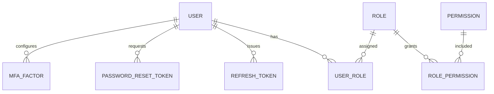

# 🔐 Auth Models (RBAC + JWT)


Welcome to `api/src/auth/models/` 👋  
This folder contains the **data models / entities** that power **authentication (who you are)** and **authorization (what you can do)** in the KFM API.

KFM’s backend security is **token-based** (JWT access tokens) with a **refresh token** mechanism, and **role/permission-based** authorization (RBAC / ACL-style mapping). Passwords are stored **hashed** (bcrypt or Argon2), and the system supports **password reset**, **account lockouts**, and optional **MFA** for high-sensitivity accounts. ✅

---

## 🧭 Folder scope

These models should remain **data-first** and **framework-light**:
- ✅ OK: schema definitions, ORM entities, dataclasses, model-level validation, serialization helpers
- ⛔ Not OK: HTTP handlers/controllers, business workflows, UI logic, “call external services” code

This matches the project’s layered approach where `models/` holds data entities, and higher layers (services/controllers) orchestrate behavior. 🧱

---

## 🗂️ Suggested contents

> Your exact filenames may differ — the goal is consistent **concept coverage**.

```text
📦 api/
└─ 📂 src/
   └─ 📂 auth/
      └─ 📂 models/
         ├─ 📄 README.md   👈 you are here
         ├─ 📄 User.* 
         ├─ 📄 Role.*
         ├─ 📄 Permission.*
         ├─ 📄 UserRole.* (if multi-role)
         ├─ 📄 RolePermission.* (RBAC mapping)
         ├─ 📄 RefreshToken.*
         ├─ 📄 PasswordResetToken.*
         ├─ 📄 MfaFactor.* (optional)
         └─ 📄 ServiceToken.* (optional, for inter-service auth)
```

---

## 🧩 Model inventory

| Model | What it represents | Why it exists |
|------|---------------------|---------------|
| **User** 👤 | A human account (farmer / researcher / admin) | Identity, ownership, personalization |
| **Role** 🏷️ | Named access bucket (e.g., `admin`) | Simpler authorization + governance |
| **Permission** 🔑 | Atomic capability (e.g., `fields:read`) | Fine-grained access control |
| **UserRole** 🔁 | Join of users↔roles (if many-to-many) | Supports multiple roles per user |
| **RolePermission** 🧷 | Join of roles↔permissions | RBAC mapping (role grants permissions) |
| **RefreshToken** ♻️ | Long-lived session continuation token | Allows JWT rotation without re-login |
| **PasswordResetToken** ✉️ | One-time reset token | Secure password recovery flow |
| **MfaFactor** 🧿 | TOTP/email OTP config + status | Hardens privileged access |
| **ServiceToken** 🤖 | Token for internal services | Optional: secure service-to-service calls |

---

## 🔗 Relationships



---

## 📌 Core field contracts (recommended)

> Keep naming consistent (camelCase in code, snake_case in DB, etc.).  
> Avoid storing secrets in plaintext. Ever. 😅

### 👤 `User`
**Purpose:** identity + authorization anchor (via roles).

Recommended fields:
- `id` (uuid or ulid)
- `email` (unique) and/or `username` (unique)
- `passwordHash` ✅ (bcrypt or Argon2 hash)
- `isActive` / `status` (`active | locked | disabled`)
- `failedLoginCount`, `lockedUntil` (for lockout)
- `mfaEnabled` (or derived from `MfaFactor`)
- `createdAt`, `updatedAt`, `lastLoginAt`

Optional but common in KFM:
- `organizationId` / `tenantId` (if org-level ownership matters)
- `displayName`
- `roles` (relation) or `roleId` (single-role variant)

### 🏷️ `Role`
**Purpose:** human-friendly group of privileges.

Recommended fields:
- `id`
- `name` (unique; e.g., `farmer`, `researcher`, `admin`)
- `description`
- `createdAt`, `updatedAt`

### 🔑 `Permission`
**Purpose:** smallest unit of capability.

Recommended fields:
- `id`
- `key` (unique; e.g., `fields:read`, `datasets:write`, `admin:ops`)
- `description`

### 🧷 `RolePermission`
**Purpose:** RBAC/ACL mapping.

Recommended fields:
- `roleId`
- `permissionId`

### ♻️ `RefreshToken`
**Purpose:** session continuity without re-login.

Recommended fields:
- `id`
- `userId`
- `tokenHash` ✅ (store hash of the refresh token, not the token itself)
- `expiresAt`
- `revokedAt` (nullable)
- `rotatedFromId` / `replacedById` (token rotation chain)
- `createdAt`
- `createdByIp`, `userAgent` (nice-to-have for auditing)

### ✉️ `PasswordResetToken`
**Purpose:** one-time reset flow.

Recommended fields:
- `id`
- `userId`
- `tokenHash` ✅
- `expiresAt`
- `usedAt` (nullable)
- `createdAt`

### 🧿 `MfaFactor` (optional)
**Purpose:** adds OTP-based second factor for privileged accounts.

Recommended fields:
- `id`
- `userId`
- `type` (`totp | email | sms` — avoid SMS if possible)
- `secretEncrypted` ✅ (never store raw TOTP secrets)
- `enabledAt`, `disabledAt`
- `lastUsedAt`

### 🤖 `ServiceToken` (optional)
**Purpose:** service-to-service authentication (internal calls).

Recommended fields:
- `id`
- `serviceName`
- `tokenHash`
- `scopes` / `permissions`
- `expiresAt`, `revokedAt`

---

## 🔐 How these models support KFM auth flows

### 1) Login ➜ JWT + Refresh Token
1. Client sends credentials over **HTTPS**.
2. Server verifies password hash.
3. Server returns:
   - **JWT access token** (short-lived, e.g., ~1 hour)
   - **refresh token** (long-lived; stored securely client-side; only sent to refresh endpoint)

✅ Access token is used on requests:
- `Authorization: Bearer <token>`

### 2) Refresh ➜ rotate refresh token
- Client calls `POST /auth/refresh` with refresh token
- Server verifies refresh token hash, checks revocation/expiry
- Server issues new JWT + new refresh token
- Server revokes old refresh token (rotation)

### 3) Authorization checks (RBAC)
- JWT contains claims like:
  - `sub` (user id)
  - `roles` (or role)
  - possibly `accessLevel` / operational level for sensitive endpoints

API endpoints/middleware check role/permissions **and** resource ownership where applicable (ex: user can access only their fields unless elevated). 🧑‍🌾🔍

### 4) Password reset
- Server issues a one-time reset token and sends via email
- Reset token must be presented to set a new password
- Token is single-use + expires quickly

### 5) Lockout & MFA
- After repeated failures: lock account/IP temporarily
- For admin/high-sensitivity accounts: optional MFA (OTP) required

---

## ✅ Security invariants (do not break)

### Passwords
- ✅ Store only `passwordHash`
- ✅ Use bcrypt or Argon2
- ✅ Enforce complexity rules (handled in service/validation layer)
- ⛔ Never log passwords or hashes

### Tokens
- ✅ Store refresh/reset/service tokens as **hashes**
- ✅ Support rotation + revocation
- ✅ Enforce expiry checks everywhere
- ⛔ Never store raw tokens in DB

### Auditability
Security-sensitive actions should produce audit records (even if audit logging lives in another module):
- login/logout
- refresh token rotation / revocation
- permission/role changes
- data modification attempts (especially denied actions)

---

## 🧪 Testing notes

Recommended model-level tests:
- ✅ uniqueness constraints (email/username/permission key)
- ✅ token expiry and revocation logic helpers
- ✅ serialization excludes secrets (`passwordHash`, `tokenHash`, `secretEncrypted`)
- ✅ role/permission mapping integrity

---

## 📚 Source references

- KFM backend auth is token-based (JWT) with roles/privileges and secure password storage + rate limiting, and supports operational access levels across endpoints.  
  <!-- :contentReference[oaicite:0]{index=0} -->
- KFM security includes refresh token sessions, password reset via one-time token, account lockout, optional MFA, and audit logging of sensitive actions.  
  <!-- :contentReference[oaicite:1]{index=1} :contentReference[oaicite:2]{index=2} -->
- KFM code organization guidance: `models/` is the home for data entities (dataclass/ORM classes).  
  <!-- :contentReference[oaicite:3]{index=3} -->
- Repo documentation governance/canonical homes (reference for where docs should live and how structure is maintained).  
  <!-- :contentReference[oaicite:4]{index=4} -->

